# 操作系统

## 内核态和用户态以及系统调用

<center class="half">
  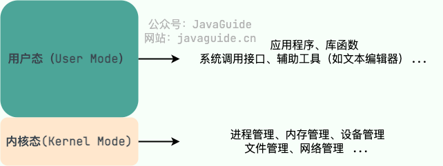
  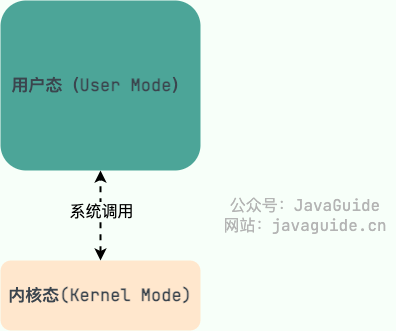
</center>

## 进程的通信方式

*   **管道**: 它可以是匿名管道 (只能在父子进程间使用) 或命名管道 (可以在无关的进程之间使用)

*   **消息队列**: 消息队列在内核中维护, 不同进程可以通过特定的标识符访问同一个消息队列
*   **共享内存**: 允许多个进程访问同一块物理内存, 不提供同步机制, 需要额外的同步措施来避免竞态条件
*   **信号量**: wait() 等待, signal() 释放来控制对临界资源的访问


## CPU 调度算法

**先来先服务** (FCFS), **最短作业优先** (SJF), **最短剩余时间优先** (SRTN, SJF的抢占式版本), **优先级调度** (PS), **轮转调度** (RR, 每个进程被分配一个小的时间片)


## 死锁的必要条件

**Mutual exculusion**: Only one process at a time can use a not sharable resource; **Hold and wait**; **No preemption**; **Circular wait**


## 死锁预防, 避免, 检测与解除

*   **预防**: 破坏死锁的必要条件... (破坏 CircularWait 可以对资源进行全局编号, 按照编号顺序申请资源)
*   **避免**: Banker‘s Algorithm, 四个参数: finish, allocation, need, available
*   **检测**: No cycle => No deadlock; Single instance (Cycle => Deadlock);  Several instance (Cycle (can =>) Deadlock)
*   **解除**: 重启系统; 撤销涉及死锁的所有进程; 逐个撤销涉及死锁的进程; 抢占资源


## 内存管理方式

*   连续内存管理 (分配给某个进程的内存地址空间是连续的):
    *   固定分区: 容易产生内部内存碎片
    *   动态分区: 容易产生外部内存碎片
*   非连续内存管理 (一个进程的内存空间可以分散在内存的不同位置):
    *   **分页**: 把物理内存分为连续等长的物理页, 应用程序的虚拟地址空间也被划分为连续等长的虚拟页; 容易产生内部碎片
    *   **分段**: 将物理内存分为不固定大小的段, 应用程序的虚拟地址空间被分为大小不等的段, 每个段代表逻辑上的一个部分, 如代码段、数据段、堆栈段等; 容易产生外部碎片
    *   **段页**: 结合分页和分段的优点, 首先将进程地址空间分为段, 每个段再分为若干页


## 虚拟地址与物理地址是如何映射的

*   分段:

    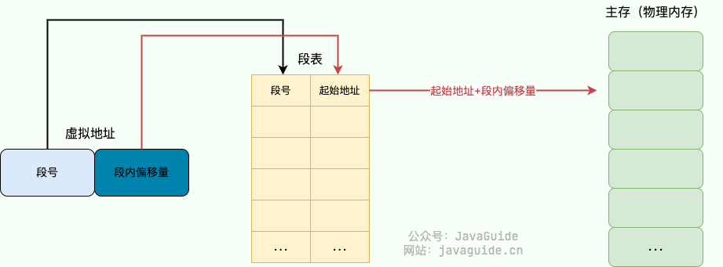

*   分页: 

    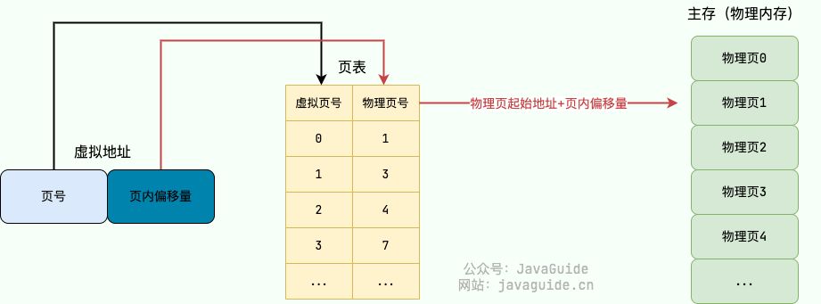

*   段页: ...


## 多级页表

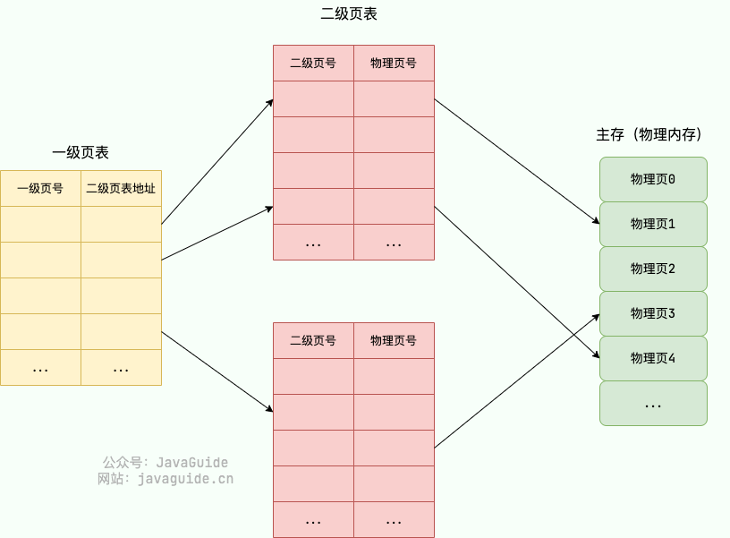


## 快表 TLB

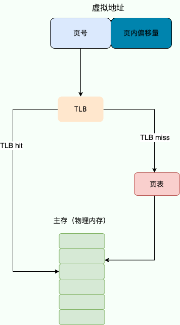


## 页缺失

-   **硬性页缺失**：物理内存中没有对应的物理页。于是，Page Fault Handler 会指示 CPU 从已经打开的磁盘文件中读取相应的内容到物理内存，而后交由 MMU 建立相应的虚拟页和物理页的映射关系。
-   **软性页缺失**：物理内存中有对应的物理页，但虚拟页还未和物理页建立映射。于是，Page Fault Handler 会指示 MMU 建立相应的虚拟页和物理页的映射关系。


## 页面置换算法

*   **最佳**: 优先选择淘汰的页面是以后永不使用的, 或者是在最长时间内不再被访问的页面; 

*   **先进先出**: FIFO 队列
*   **最近最久未使用**: 淘汰现有页面中自上次被访问以来所经历的时间最大的, 即最近最久未使用的页面
*   **最少使用**: 淘汰之前一段时间内使用最少的页面


## 局部性原理

*   **时间局部性**: 指一个数据项或指令在一段时间内被反复使用的特点; 利用这一点, 分页机制中通常采用缓存机制来提高页面的命中率, 即将最近访问过的一些页放入缓存中, 如果下一次访问的页已经在缓存中, 就不需要再次访问内存, 而是直接从缓存中读取
*   **空间局部性**: 指一个数据项或指令在一段时间内与其相邻的数据项或指令被反复使用的特点; 利用这一点, 分页机制中通常会预先将相邻的一些页读入内存缓存中, 以便在未来访问时能够直接使用, 从而提高访问速度


## 目录结构

*   **单级目录结构**: 全部文件登记在同一目录中, 实现按名存取, 所以必须确保没有重名的现象发生; 查找速度慢, 不能重名, 不便于共享

    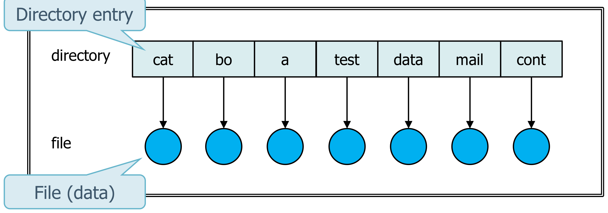

*   **二级目录结构**: 每个用户拥有自己的目录, 不同用户可以有相同的文件名, 提高了检索目录的速度; 缺点是不利于文件共享

    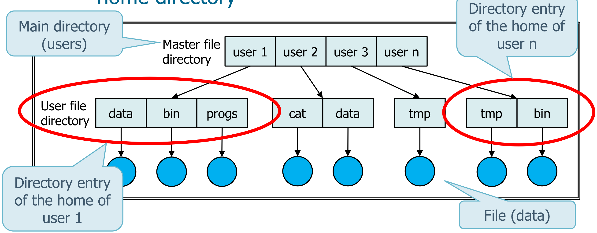

*   **树形目录结构**: 系统中的每一个文件都有唯一路径名 (绝对路径和相对路径)

    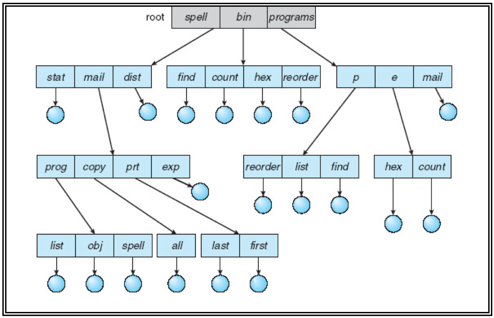

*   **非循环目录结构**: 它允许一个文件或目录在多个父目录中占有项目, 但不构成环路, 便于文件共享; 一看见软硬链接就要想到这种结构

    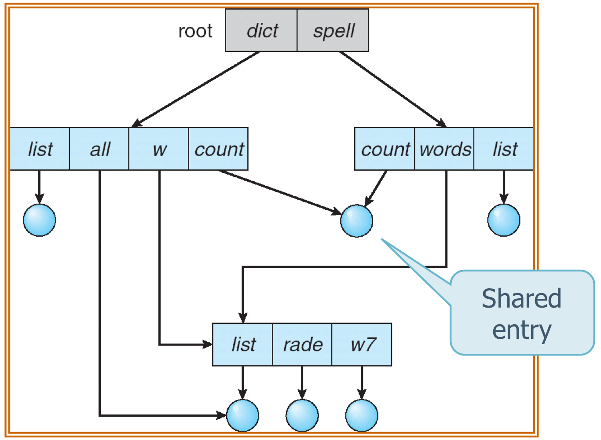


# 计算机网络

## 浏览器中输入“www.baidu.com” 之后都发生了什么

1.  浏览器通过 **DNS** 协议, 获取域名对应的 IP 地址 (本地 DNS 缓存 -> 本地 DNS 服务器 -> 根域名服务器 -> 顶级服务器 -> 二级域名服务器)
2.  浏览器根据 IP 地址和端口号, 向目标服务器发起一个 **TCP** 连接请求 (默认端口号 80)
3.  浏览器在 TCP 连接上 (三次握手), 向服务器发送一个 **HTTP 请求**报文, 请求获取网页的内容
4.  服务器收到 HTTP 请求报文后, 处理请求, 并返回 **HTTP 响应**报文给浏览器
5.  浏览器收到 HTTP 响应报文后, 解析响应体中的 HTML 代码, 渲染网页的结构和样式, 同时根据 HTML 中的其他资源的 URL（如图片、CSS、JS 等）, 再次发起 HTTP 请求, 获取这些资源的内容, 直到网页完全加载显示。
6.  浏览器在不需要和服务器通信时, 可以主动关闭 TCP 连接, 或者等待服务器的关闭请求


## HTTP 和 HTTPS 的区别

-   **端口号**：HTTP 默认是 80，HTTPS 默认是 443。
-   **URL 前缀**：HTTP 的 URL 前缀是 `http://`，HTTPS 的 URL 前缀是 `https://`。
-   **安全性和资源消耗**：HTTP 协议运行在 TCP 之上，所有传输的内容都是明文，客户端和服务器端都无法验证对方的身份。HTTPS 是运行在 SSL/TLS 之上的 HTTP 协议，SSL/TLS 运行在 TCP 之上。所有传输的内容都经过加密，加密采用对称加密，但对称加密的密钥用服务器方的证书进行了非对称加密。所以说，HTTP 安全性没有 HTTPS 高，但是 HTTPS 比 HTTP 耗费更多服务器资源。
-   **搜索引擎优化**：搜索引擎通常会更青睐使用 HTTPS 协议的网站，因为 HTTPS 能够提供更高的安全性和用户隐私保护, 从而使用 HTTPS 协议的网站在搜索结果中可能会被优先显示


## HTTPS 建立流程

1.   客户端发起连接请求, 告诉服务器客户端希望使用 HTTPS 协议与其通信
2.   服务器接收到客户端的连接请求, 会向客户端发送一个 SSL/TLS 证书
3.   客户端收到服务器发送的证书后, 会验证证书的有效性, 如果验证通过, 客户端会生成一个随机的对称密钥, 接着使用证书中包含的公钥对随机生成的密钥进行加密, 并将加密后的密钥发送给服务器
4.   服务器收到客户端发送的加密密钥后, 使用自己的私钥对其进行解密, 得到对称密钥
5.   从此客户端和服务器双方都拥有了相同的对称密钥, 他们可以使用这个密钥来加密和解密通信中传输的数据


## HTTP1.0 和 HTTP 1.1 的区别

*   **持久连接**: HTTP1.0 默认情况下是非持久连接的, 每个请求/响应都会建立一个新的 TCP 连接, 请求完成后连接会自动关闭; 而 HTTP1.1 引入了持久连接的概念, 允许在单个连接上发送和接收多个请求和响应, 从而减少了连接建立和断开的开销
*   **管道化**: HTTP1.1 支持管道化, 即在同一个持久连接上可以同时发送多个请求, 而无需等待前一个请求的响应; 而 HTTP1.0 则不支持, 每个请求必须等待前一个请求的响应才能发送
*   **Host 头部**: HTTP1.1 引入了 Host 头部, 允许一个服务器上托管多个域名, 通过 Host 头部来指示请求的目标主机; HTTP1.0 则不支持, 无法在一个服务器上托管多个域名
*   **缓存控制**: HTTP1.1 引入了更强大的缓存控制机制, 包括 Cache-Control 头部, 允许客户端和服务端更精细地控制缓存行为; HTTP1.0 的缓存控制机制相对简单, 主要通过 Expires 头部来控制缓存时间
*   **错误处理**: HTTP1.1 在错误处理方面更加严格和明确, 定义了更多的状态码和错误处理机制; HTTP1.0 的错误处理则相对简单, 状态码的定义也较少


## GET 和 POST 的区别

主要区别在于语义: GET 通常用于获取或查询资源, 而 POST 通常用于创建或修改资源


## TCP 和 UDP 的区别

*   **连接性**: TCP 是面向连接的协议, 通信前需要建立连接, 才能进行数据传输, 结束后释放连接; 而 UDP 是无连接的协议, 通信时不需要建立连接, 发送数据前不需要进行握手, 传输速度更快, 不保证可靠传输

*   **可靠性**: TCP 提供可靠的数据传输, 通过序列号, 确认应答, 重传机制等来确保数据的可靠性和完整性, 能够保证数据的顺序性和不丢失; 而 UDP 不保证数据的可靠性, 数据发送后不尽兴确认应答和重传, 因此可能会丢失数据包或者无序接受数据包
*   **流量控制和拥塞控制**: TCP 具有流量控制和拥塞控制, 通过滑动窗口, 拥塞避免算法来控制数据传输速率, 防止网络拥塞; 而 UDP 则不具备, 发送端以恒定的速率发送数据, 无法根据网络情况自动调整发送速率
*   **头部开销**: TCP 头部通常为 20 字节, UDP 头部较小通常为 8 个字节
*   **适用场景**: TCP 使用于对数据可靠性要求较高的场景, 如文件传输, 网页访问, 电子邮件等; 而 UDP 使用于对传输延迟要求较高, 数据丢失影响不大的场景, 如实时音视频传输, 在线游戏, DNS 查询等


## TCP 三次握手和四次挥手的全过程

<center class="half">
  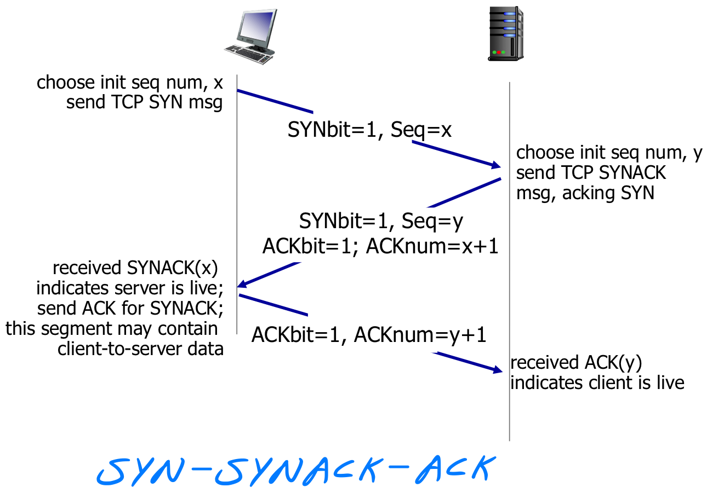
  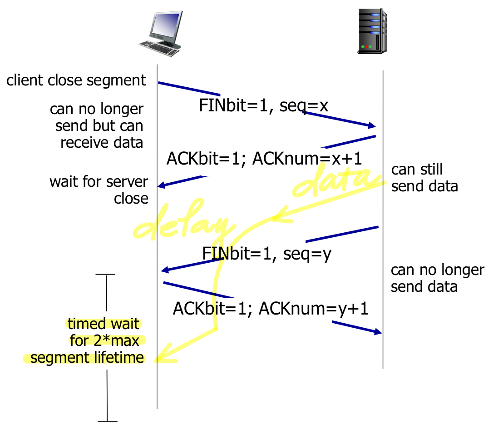
</center>


## TCP 如何保证可靠性

*   **确认和重传**: TCP 在数据传输过程中采用了确认和重传机制; 发送方发送数据后, 接收方会发送确认消息, 告知发送方数据已经成功接受; 如果发送方在一定时间内未收到确认消息, 就会认为数据丢失并重新发送数据
*   **序列号和重组**: TCP 把每个数据包都分配一个序列号, 即使数据包发送的顺序或到达接收方的顺序不同, 接收方也可以根据序列号将数据包重组成完整的消息
*   **流量控制**: TCP 使用滑动窗口机制进行流量控制, 即接收方会告知发送方自己的接受窗口大小, 发送方会根据这个大小控制发送数据的速率, 以免接收方缓冲区溢出
*   **拥塞控制**: TCP 会根据网络的拥塞程度动态调整发送速率, 以保证网络的稳定性和吞吐量, 以避免网络拥塞


## IPV4 分类

<center class="half">
  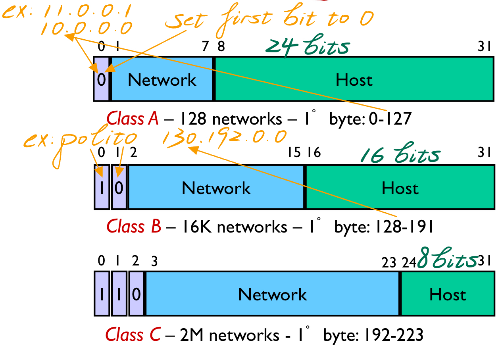
  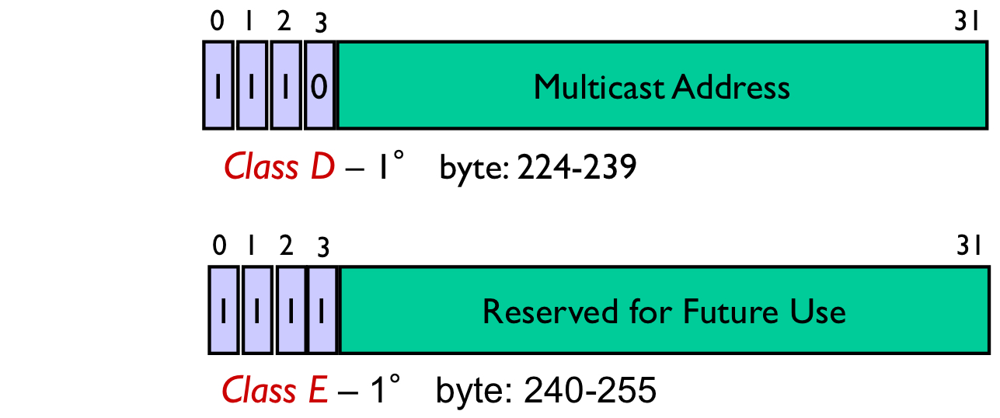
</center>


## IPV4 地址格式

IPV4 地址的格式是由四个十进制数组成, 每个数取值范围是 0 到 255, 用点号分隔开, 如: 192.168.1.1; 每个十进制数代表一个字节 (8 位), 总共 32 位


## IPV4 子网划分方法

1.   固定长度子网划分: Class A, B, C, D, E, 直接简单但是可能会造成 IP 地址的浪费

2.   可变长度子网划分 (VLSM): 

     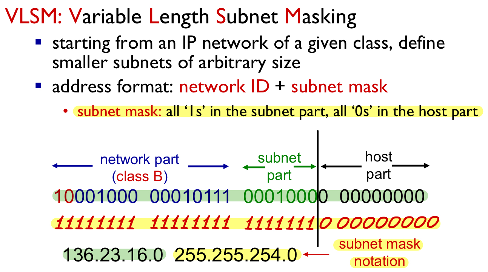

3.   无类域间路由 (CIDR): 

     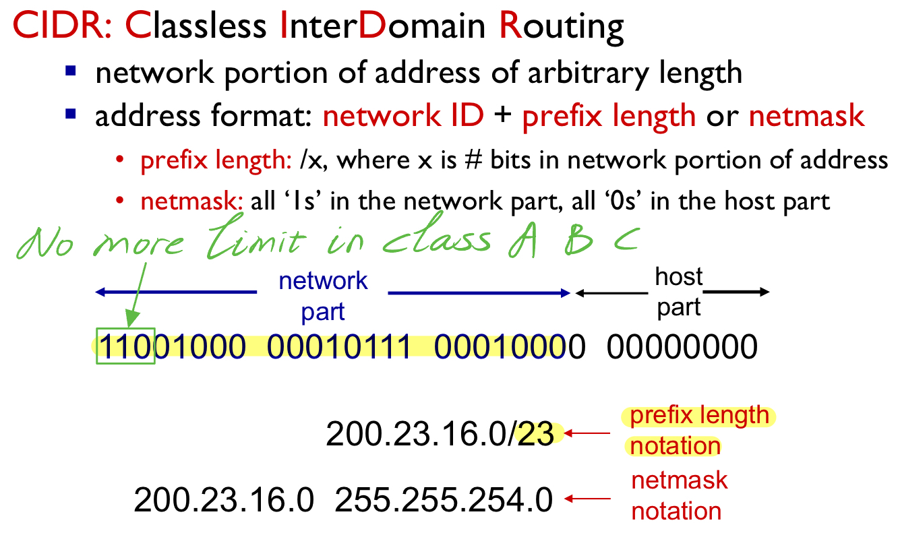


## IP 地址和 MAC 地址的区别

*   **作用层次**: IP 地址位于网络层 (第三层), 用于在网络中唯一标识和定位设备; 而 MAC 地址位于数据链路层 (第二层), 用于在本地网络中唯一标识和定位设备
*   **唯一性**: IP 地址在互联网范围内是唯一的, 但在同一个局域网中可以重复; 而 MAC 地址在全球范围内是唯一的, 由硬件制造商在生产过程中分配
*   **编码方式**: IP 地址是一个 32 位或 128 位的二进制数; 而 MAC 地址是一个 48 位的二进制数
*   **作用范围**: IP 地址用于在不同网络之间进行通信; 而 MAC 地址用于在同一个局域网中进行通信


## ARP 地址解析协议和工作原理

ARP 地址解析协议是一种用于将 IP 地址映射到 MAC 地址的协议, 通常用于在局域网中进行通信时确定目标设备的 MAC 地址, 工作原理如下:

1.   **广播发送 ARP 请求**: 当一台设备需要与另一台设备进行通信时, 它首先会检查自己的 ARP 缓存, 如果目标设备的 IP 地址已经在 ARP 缓存中, 则直接使用对应的 MAC 地址; 如果目标 IP 地址不在 ARP 缓存中,则会向本地网络广播一个 ARP 请求报文, 其中包含了它想要通信的目标设备的 IP 地址; 该 ARP 请求报文的目的 MAC 地址是广播地址 (FF:FF:FF:FF:FF:FF), 以确保所有网络中的设备都能收到
2.   **接受 ARP 请求**: 所有接收到 ARP 请求的设备都会检查请求中的目标 IP 地址是否与自己的 IP 地址匹配; 如果匹配, 则会发送 ARP 响应; 否则就忽略该请求
3.   **发送 ARP 响应**: 匹配到目标 IP 地址的设备会向 ARP 请求的发送者单播一个 ARP 响应报文, 其中包含了自己的 MAC 地址; 这样, ARP 请求的发送者就知道目标设备的 MAC 地址
4.   **更新 ARP 缓存**: 发送 ARP 响应的设备和接受 ARP 响应的设备都会更新自己的 ARP 缓存, 将目标 IP 地址和对应的 MAC 地址进行关联, 以便之后的通信


# MySQL

## 数据库三范式

每个属性都是原子性; 每个非主属性都完全依赖于主键, 而不是部分依赖; 每个非主属性都直接依赖于主键, 而不是依赖于其他非主属性


## DROP, DELETE 与 TRUNCATE 的区别

*   **DROP**: 删除整个数据库对象 (如表), 所有与之相关的权限和依赖关系也会被删除, 不可恢复
*   **DELETE**: 删除表中的特定行, 可恢复, 支持条件删除
*   **TRUNCATE**: 清空表中的所有数据, 保留表结构, 整体清空, 速度快, 通常不可恢复


## 在 MySQL 中一条查询 SQL 是如何执行的

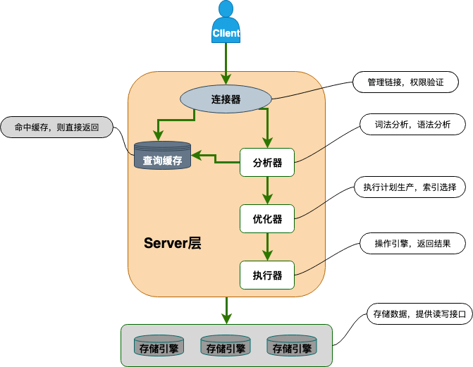

*   **分析器**: 检查语法和表结构, 一般语法错误在此阶段
*   **优化器**: 在表中有多个索引的时候, 决定使用哪个索引; 或者一个语句中存在多表关联的时候, 决定各个表的连接顺序
*   **执行器**: 根据表的引擎定义, 去使用这个引擎提供的接口来获取表的第一行, 判断 WHERE 后面的条件是否符合; 如果是, 直接返回; 如果不是, 则继续调用引擎接口去下一行进行重复的判断, 直到取到这个表的最后一行, 最后返回


## InnoDB 与 MyISAM 的区别

*   **事务支持**: InnoDB 支持事务, 即支持 ACID 特性, 具有提交 (COMMIT) 和回滚 (ROLLBACK) 事务的能力, 并且 InnoDB 默认使用的可重复读 (REPEATABLE-READ) 隔离级别是可以解决幻读问题发生的; 而 MyISAM 不支持事务, 所有操作立即生效, 无法回滚
*   **锁机制**: InnoDB 支持行级锁和 MVCC, 并发性能更好; 而 MyISAM 仅支持表级锁, 在高并发写操作时性能较差
*   **外键支持**: InnoDB 支持外键约束, 而 MySIAM 不支持外键约束
*   **备份和恢复**: InnoDB 支持崩溃恢复, 因为支持事务日志 (redo log) 和回滚日志 (undo log); 而 MyISAM 不支持崩溃恢复
*   **索引**: 他们都使用 B+ Tree作为索引结构, 但是他们的实现方式不太一样; InnoDB 索引文件和数据文件时存储在一起的; 而 MyISAM 索引文件和数据文件是分离的, 其表数据文件本身就是按 B+Tree 组织的一个索引结构, 树的叶节点 data 域保存了完整的数据记录


## 索引的优缺点

*   优点: 提高数据的检索速度, 降低数据库的 IO 成本; 降低数据排序的成本, 降低 CPU 消耗
*   缺点: 占用存储空间; 降低更新表速度


## 什么时候不要使用索引

*   经常增删改的列不要建立索引
*   表记录太少不要建立索引
*   有大量重复的列不要建立索引


## 红黑树特点

1.   每个节点非红即黑
2.   根节点总是黑色的
3.   每个叶子节点都是黑色的空节点
4.   如果节点是红色的, 则它的子节点必须是黑色的, 反之不然
5.   从任意节点到它的叶子节点的每条路径都包含相同数目的黑色节点

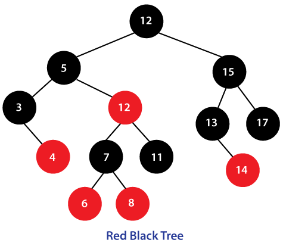

红黑树在插入和删除节点时只需要进行 O(1) 次数的旋转和变色操作, 即可保持平衡状态, 而不需要像 AVL 树一样进行 O(log n) 次数的旋转操作


## B 树和 B+ 树的区别

*   **节点存放**: B 树的所有节点既存放 Key 也存放 Data, 而 B+ 树只有叶子节点存放 Key 和 Data, 其他内节点只存放 Key
*   **叶子节点结构**: B 树的叶子节点都是独立的; B+ 树的叶子节点有一条引用链指向与它相邻的叶子节点
*   **检索效率**: B 树的检索过程就相当于做二分查找, 可能还没有到达叶子节点检索就结束了; 而 B+ 树的检索效率就很稳定, 任何查找都是从根节点到叶子节点的过程
*   **范围查询**: 在 B 树中进行范围查询时, 首先要找到查找的下限, 然后对 B 树进行中序遍历, 直到找到查找的上限; 而 B+ 树的范围查询, 只需要对链表进行遍历即可

B+ 树与 B 树相比, 具备更少的 IO 次数, 更稳定的查询效率和更适用范围查询这些优势


## 什么是事务

数据库事务是一系列数据库操作 (例如插入, 更新, 删除等), 它们被视为一个单独的逻辑单位, 并且要么全部成功执行, 要么全部回滚, 具有 ACID 特性 (Atomicity: 原子性, Consistency: 一致性, Isolation: 隔离性, Durability: 持久性)


## 事务隔离级别

*   **读未提交**: 允许一个事务读取另一个事务未提交的数据 (脏读), 可能会出现脏读, 不可重复读, 幻读的并发问题
*   **读已提交**: 事务只能读取已经提交的数据;  防止脏读, 但可能出现不可重复读和幻读
*   **可重复读**: 确保在一个事务内多次读取同一数据, 结果是一致的; 防止脏读和不可重复读, 但可能出现幻读; <u>MySQL 的默认隔离级别</u>
*   **可序列化**: 完全服从 ACID 的隔离级别; 防止脏读, 不可重复读和幻读


## 并发事务带来的问题

*   **脏读**: 一个事务读取了另一个事务尚未提交的修改数据, 如果第一个事务回滚, 这些读取的数据将变为无效
*   **不可重复读**: 在同一个事务中, 先后两次读取同一行数据, 结果不一致; 因为在两次读取之间, 另一个事务修改了该数据并提交了
*   **幻读**: 一个事务在读取某个范围的数据时, 另一个事务在该范围内插入了新数据, 导致前一个事务再次读取时, 发现多了一些 “幻影” 行
*   **更新丢失**: 两个事务都读取同一个数据并进行修改, 最后一个事务的修改覆盖了前一个事务的修改, 导致前一个事务的更新丢失


## 并发事务的控制方式

MySQL 中并发事务的控制方式无非就两种: 锁和 MVCC; 锁可以看作是悲观控制的模式, MVCC 可以看作是乐观控制的模式


## MVCC

MVCC 的核心思想是为每个数据行保留多个版本, 每个版本都有相关的时间戳或事务 ID

MVCC 可以为数据库提高并发性能, 减少锁争用, 实现快照隔离等

MVCC 实现原理:

-   隐藏列: `DB_TRX_ID` 记录最近一次修改该行数据的事务ID; `DB_ROLL_PTR` 指向回滚段 (Undo log) 用于存储数据行的旧版本

-   插入新的数据行时, 设置 `DB_TRX_ID` 为当前事务ID, `DB_ROLL_PTR` 为空

    

-   更新数据行时, 创建一个新版本, `DB_TRX_ID` 设置为当前事务ID, 新版本指向旧版本的 `DB_ROLL_PTR`, 旧版本的数据保存在回滚段中

    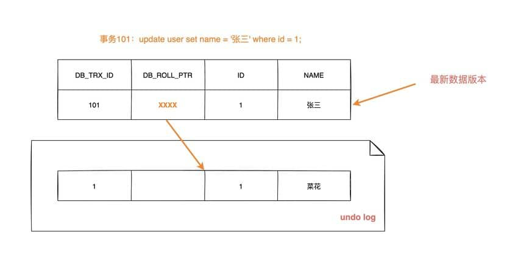

    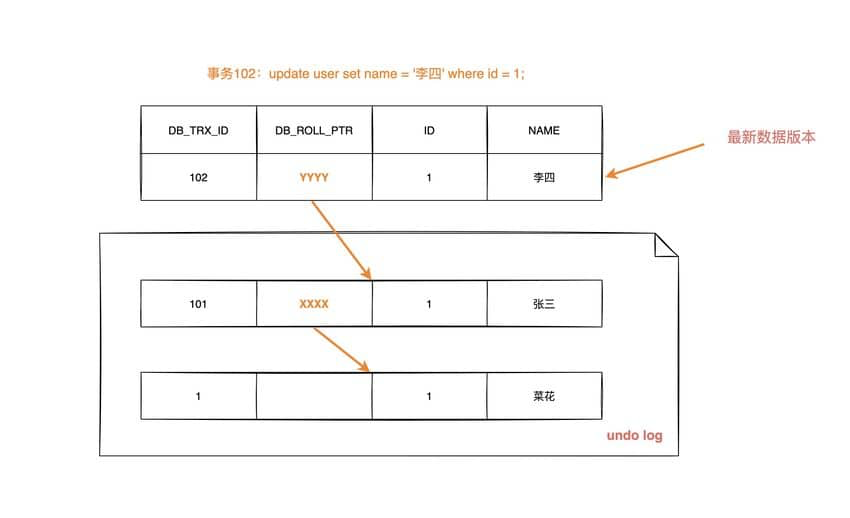

-   快照读: 读取数据, 根据事务ID决定读取哪个版本的数据; 事务会检查每行数据的 `DB_TRX_ID`, 只有在事务开始之前已经提交的事务ID对应的数据才会被读取
-   当前读: 当前读需要最新的数据版本, 会读取当前正在修改的数据, 并可能加锁以保证一致性

-   回滚段 (Undo log): 回滚段保存旧版本的数据, 当事务回滚时, 利用回滚段将数据恢复到之前的状态; 不同事务或者相同事务的对同一记录行的修改, 会使该记录行的 Undo log 成为一条链表, 链首就是最新的记录, 链尾就是最早的旧记录
-   清理: 随着时间推移, 旧版本数据可能不再需要, 数据库系统会定期清理这些旧版本以释放空间


## 锁的种类

共享锁, 排他锁, 表锁, 行锁


## 锁升级

*   **MySQL 行锁只能加在索引上**, 如果操作不走索引, 就会升级成表锁
*   当非唯一索引超过一定数量时, 行锁也会升级为表锁


## 怎么样尽量避免死锁的出现

保持事务简短, 按固定顺序访问资源, 尽量减少锁的颗粒度, 使用合适的隔离级别, 避免长时间持有锁


## SQL 优化手段

*   尽量避免使用 `SELECT *`, 最好只选择所需的列, 可以减少传输的数据量
*   尽量在查询中使用 `WHERE` 子句过滤数据, 减少返回的行数
*   尽量避免使用子查询, 可以将子查询改为 `JOIN` 操作, 减少嵌套查询的复杂度和执行时间
*   减少使用 `IN` 或者 `NOT IN`, 改用 `EXISTS`, `NOT EXISTS` 替代
*   `OR` 的查询尽量用 `UNION` 或者 `UNION ALL` 代替
*   尽量避免在 `WHERE` 子句中使用 != 或 <> 操作符, 以及对字段进行 NULL 值判断, 否则将导致引擎放弃使用索引而进行全表扫描


## 大表如何优化

*   **限定数据的范围**: 务必禁止不带任何限制数据范围条件的查询语句

*   **读写分离**: 数据库拆分方案, 主库负责读, 从库负责写

*   **垂直分区**: 可以通过垂直分割将热点数据和冷数据分离, 简化表的结构, 提高数据访问效率, 但是主键会出现冗余, 会引起 JOIN 操作

    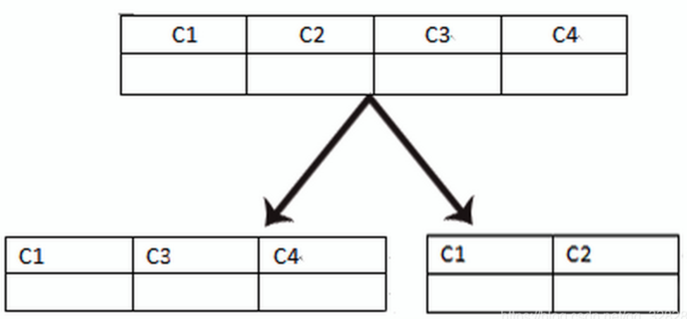 

*   **水平分区**: 可以将用户信息表拆分成多个用户信息表, 这样可以避免单一表数据量过大对性能造成影响, 但是分片事务一致性难以解决; <u>水平拆分最好分库</u>

    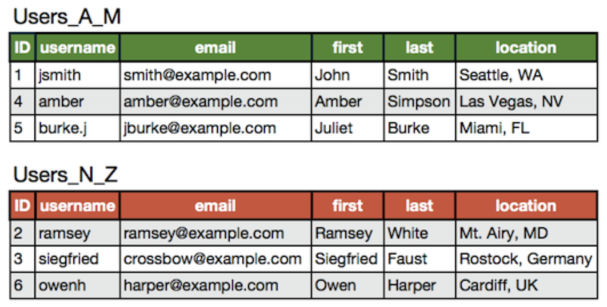


# Java 基础

## 比较 JVM, JDK 以及 JRE

JVM 是 Java 程序运行的虚拟机, JRE 是 Java 程序运行时的环境, JDK 是用于开发 Java 程序的工具包

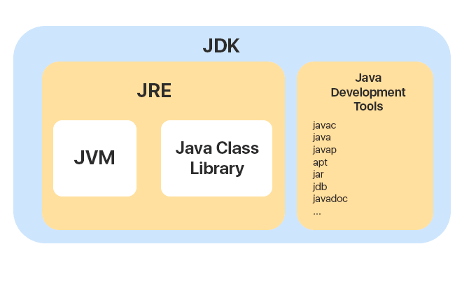


## Java 解释与编译并存

*   **编译**: 编译器 (javac) 将 Java 源代码转换成字节码 (.class 文件), 这是一种与平台无关的中间代码
*   **解释**: JVM 将 Java 字节码解释成本地机器代码, 以便在特定平台上执行


## 八种基本数据类型大小, 以及他们的封装类

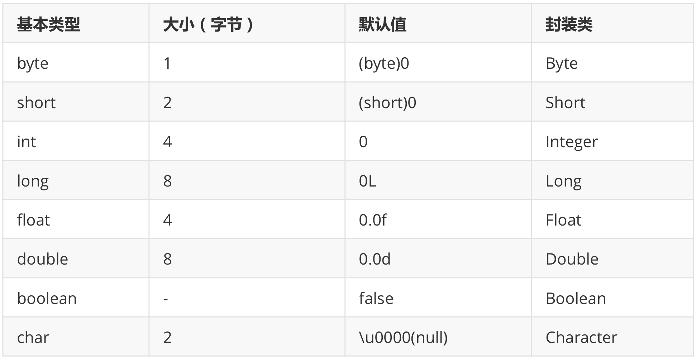


## 重载和重写的区别

*   **重载 (Overload)**: 在一个类中, 同名的方法如果有不同的参数列表, 则视为重载
*   **重写 (Override)**: 子类并不想原封不动的继承父类中的某个方法, 所以在方法名, 参数列表, 返回类型都相同的情况下, 对方法本身进行修改或者重写, 这就是重写, 注意子类函数的访问修饰权限不能少于父类 (`public > protected > default > private`)


## 静态方法为什么不能调用非静态成员

静态方法是属于类的, 在类加载的时候就会分配内存, 可以通过类名直接访问; 而非静态成员属于实例对象, 只有在对象实例化之后才存在, 需要通过类的实例对象去访问; 所以在类的非静态成员不存在的时候静态方法就已经存在了, 此时调用在内存中还不存在的非静态成员, 属于非法操作


## Java 创建对象有几种方式

1.   **使用 new 关键字**:

     ```java
     MyClass obj = new MyClass();
     ```

2.   **通过反射**: 可以通过类的完全限定名来实例化对象

     ```java
     Class<?> clazz = Class.forName("com.example.MyClass");
     MyClass obj = (MyClass) clazz.newInstance();
     ```

3.   **通过对象的 clone 方法**: 如果一个类实现了 `Cloneable` 接口, 你可以使用 `clone()` 方法来创建一个对象的副本

     ```java
     MyClass obj1 = new MyClass();
     MyClass obj2 = (MyClass) obj1.clone();
     ```

4.   **通过反序列化**: 对象的反序列化是将对象从字节流中重新构建出来

     ```java
     ObjectInputStream in = new ObjectInputStream(new FileInputStream("object.ser"));
     MyClass obj = (MyClass) in.readObject();
     ```


## 获取一个类 Class 对象有几种方式

1.   **使用 .class 语法**: 

     ```java
     Class<?> clazz = MyClass.class;
     ```

2.   **调用对象的 getClass() 方法**: 

     ```java
     MyClass obj = new MyClass();
     Class<?> clazz = obj.getClass();
     ```

3.   **使用 Class.forName() 方法**: 

     ```java
     Class<?> clazz = Class.forName("com.example.MyClass");
     ```


## 面向对象的三大特性

*   **封装**: 将数据和方法封装在一个类中, 对外部隐藏对象的内部细节, 只暴露必要的接口供外部访问
*   **继承**: 指一个类 (子类) 可以从另一个类 (父类) 继承属性和方法, 并且可以重写父亲的方法或定义自己的新方法, 从而实现代码的重用和扩展
*   **多态**: 父类类型的引用变量可以指向子类类型的对象, 并调用子类重写的方法


## 深拷贝和浅拷贝的区别

总的来说, 浅拷贝只复制对象本身, 而深拷贝则递归地复制对象的所有引用类型成员变量所指向的对象; 深拷贝生成的新对象与原对象完全独立, 不共享任何内部对象, 而浅拷贝生成的新对象可能与原对象共享一些内部对象

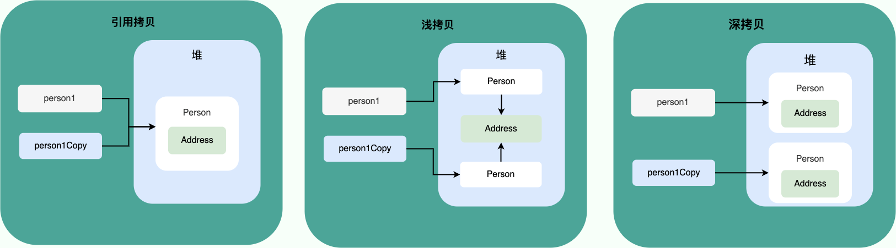


## hashCode() 和 equals()

两个相等的对象的 hashCode 值必须是相等的, 也就是说如果 equals 方法判断两个对象是相等的, 那这两个对象的 hashCode 值也要相等; 如果重写 equals 时没有重写 hashCode 方法的话就可能会导致 equals 方法判断是相等的两个对象, hashCode 值却不相等

在 HashSet 中, 如果我们不重写 hashCode 方法, 而仅仅重写了 equals 方法, 那么在使用 HashSet 等基于哈希表的集合类的时候, 可能会出现问题; 这是因为默认的 hashCode 方法是根据对象的内存地址生成的, 如果两个对象的内存地址不同, 它们的哈希码也会不同, 即使它们的内容相同, 这样就会导致相等的对象被视为不同的对象, 从而影响 HashSet 的正确行为


## Exception 和 Error 有什么区别

*   Exception 是程序本身可以处理的异常, 可以通过 catch 来进行捕捉
    *   **检查异常**: 这是一种在编译时必须处理的异常, 否则编译器就会报错, 如 IOException, ClassNotFoundException, SQLException
    *   **未检查异常**: 这些异常通常是编程错误或者环境问题引起的, 编译器不要求强制处理
*   Error 属于程序无法处理的错误, 不建议使用 catch 捕捉, 一般异常发生时, JVM 一般会选择线程终止


## 怎么处理 Java 异常

```java
// 在可能抛出异常的代码块中使用 try-catch 语句捕获异常
try {
	// 可能抛出异常的代码
  
} catch (SomeException e) {
	// 处理异常的代码
  displayErrorMessage("An error occurred")
    
  // 或者在某些情况下, 可以选择不在当前层级处理异常, 而是将异常向上层传播, 让调用者或更高级别的代码来处理异常
  throw e;
  
  // 又或者将原始异常包装在新的异常中并抛出
  throw new CustomException("An error occurred while processing data", e);
} finally {
	 // 在一些情况下, 无论是否发生异常, 都需要执行一些清理工作, 可以使用 finally 块来确保这些代码一定会被执行
}
```

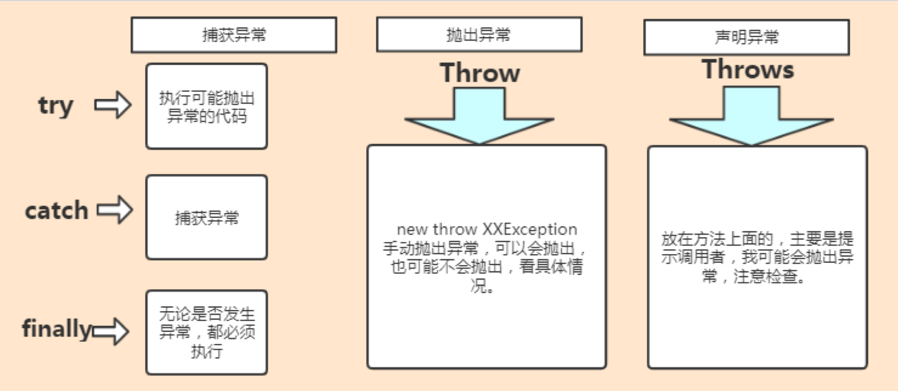


## 泛型和类型擦除

Java 的泛型是一种在编译时期进行类型检查的机制, 但在编译后会被擦除, 用实际的类型替代, 这就是类型擦除; 例如, 如果你有一个泛型类 `List<T>`, 编译后的字节码中, 所有的 `T` 都会被替换为 `Object`, 这就是为什么在运行时你无法获得泛型的具体类型信息, 因为它已经被擦除了


## ArrayList 和 LinkedList 的区别

*   ArrayList 使用数组来存储元素, 它可以动态增长和收缩数组的大小, 通过索引来访问元素的效率很高, 插入和删除操作效率较低, 因为需要移动大量元素, 更适用于需要频繁随机访问元素的场景
*   LinkedList 使用双向链表来存储元素, 每个节点包含对前后节点的引用, 插入和删除效率高, 随机访问效率较低, 因为需要遍历链表找到目标元素, 更适用于需要频繁插入和删除元素的场景


## HashMap, HashTable 和 ConcurrentHashMap 的区别

*   HashMap 是非线程安全的, 不支持并发访问, 在单线程下性能最好
*   HashTable 是线程安全的, 通常比 HashMap 性能要差
*   ConcurrentHashMap 是线程安全的, 使用锁分段技术来实现并发访问, 不同的段可以由不同的线程同时访问, 在高并发情况下, 通常比 HashTable 性能要好


## HashMap 的长度为什么是 2 的幂次方

`hash % length == hash & (length - 1)` 的前提是 length 是 2 的 n 次方, 这样可以使用位运算来替代除法运算, 从而提高计算效率


## 序列化和反序列化

*   **序列化**: 序列化是将对象转换为字节流的过程, 这些字节流可以被写入文件, 数据库或通过网络传输
*   **反序列化**: 反序列化是将字节流转换回对象的过程

在 Java 中, 可以通过实现 Serializable 接口来指示一个类是可序列化的, 并且可以使用 ObjectOutputStream 来序列化对象, 使用 ObjectInputStream 来反序列化对象

```java
List<Person> somePeople = Arrays.asList(...);
...
ObjectOutputStream serializer = new ObjectOutputStream(new FileOutputStream("people.ser"));
serializer.writeObject(somePeople);
...
ObjectInputStream deserializer = new ObjectInputStream(new FileInputStream("people.ser"));
peopleList = (List<Person>) deserializer.readObject(); // remember to down-cast
```


# Java 并发

## 线程的通信方式

*   **共享内存**: 指多个线程共享同一块内存区域, 在这个内存区域中存放着需要共享的数据, 线程可以通过读写共享内存来进行通信
*   **消息传递**: 每个线程都有自己的消息队列, 当一个线程需要与其他线程通信时, 可以向其他线程发送消息, 其他线程则可以从自己的消息队列中接收消息; 在 Java 中, 消息传递可以通过阻塞队列来实现


## 创建线程的方式

*   **继承 Thread 类**:

    ```java
    class MyThread extends Thread {
      public void run() {
        // 线程执行的代码
        System.out.println("MyThread is running");
      }
    }
    
    public class Main {
       public static void main(String[] args) {
         // 创建并启动线程
         MyThread thread = new MyThread();
         thread.start();
       }
    }
    ```

*   **实现 Runnable 接口** (推荐, 因为这样可以避免 Java 单继承的限制, 同时也可以将线程任务与线程本身分离开来, 提高代码的灵活性和维护行): 

    ```java
    class MyRunnable implements Runnable {
    	public void run() {
        // 线程执行的代码
        System.out.println("MyThread is running");
      }
    }
    
    public class Main {
       public static void main(String[] args) {
         // 创建线程对象
         MyRunnable myRunnable = new MyRunnable();
         // 创建线程
         Thread thread = new Thread(myRunnable);
         // 启动线程
         thread.start();
       }
    }
    ```


## 如何停止一个正在运行的线程

*   **使用标志位**: 在线程 `run()` 方法中使用一个标志位来控制线程的执行; 当标志位为 true 时, 线程继续执行; 标志位为 false 时, 线程退出循环, 终止执行

    ```java
    class MyThread extends Thread {
      private volatile boolean running = true;
      
      public void run() {
        while (running) {
           // 线程执行的代码
        }
      }
      
      public void stopThread() {
        running = false;
      }
    }
    ```

*   **使用 interrupt() 方法**: 通过调用线程的 `interrupt()` 方法来中断线程的执行, 被中断的线程会抛出 `InterruptedException` 异常, 可以在捕获异常后执行清理工作并退出线程

    ```java
    class MyThread extends Thread {
      public void run() {
        try {
          while (!Thread.currrentThread().isInterruputed()) {
            // 线程执行的代码
          }
        } catch(InterruptedException) {
          // 清理工作
        }
      }
      
      public void stopThread() {
        interrupt();
      }
    }
    ```


## Java 中 interrupted() 和 isInterrupted() 方法的区别

*   interrupted 是 Thread 类的静态方法, 用于检查当前线程的中断状态, 并清楚中断状态标志
*   isInterrupted 是 Thread 类的实例方法, 用于检查调用该方法的线程的中断状态, 但不清除中断状态的标志


## sleep() 和 wait() 有什么区别

*   `sleep()` 方法是 Thread 类的静态方法, 可以在任何地方调用, 用于让当前线程暂停一段时间, 不释放对象锁
*   `wait()` 方法是 Object 类的方法, 必须先获得对象的锁然后才能调用, 用于让当前线程进入等待状态, 同时释放对象的锁, 直到被其他线程调用 `notify()` 或 `notifyAll()` 方法唤醒


## notify() 和 notifyAll() 有什么区别

*   `notify()` 方法用于唤醒在当前对象上调用 `wait()` 方法而进入等待状态的单个线程, 如果有多个线程在对象上等待, 该方法只会随机选择其中一个线程唤醒
*   `notifyAll()` 方法用于唤醒在当前对象上调用 `wait()` 方法而进入等待状态的所有线程, 让它们有机会去竞争对象的锁


## 为什么 wait(), notify() 和 notifyAll() 这些方法不在 Thread 类里面

因为这些方法的作用对象并不是线程本身, 而是对象的锁, 因此它们被定义在 Object 类中


## 为什么 wait() 和 notify() 方法要在同步块中调用

*   在调用 `wait()` 和 `notify()` 方法之前, 线程必须先获得对象的锁
*   `wait()` 方法会释放对象的锁, 使得其他线程可以获取锁并执行同步代码; 同样, 确保在调用 `notify()` 方法时已经持有对象的锁, 从而可以唤醒其他等待该锁的线程;
*   如果不在同步块中调用 `wait()` 和 `notify()` 方法, 可能会导致线程在调用这些方法时没有获取对象的锁, 从而会导致线程在等待或唤醒时可能会出现死锁的情况


## Thread 类中的 start() 和 run() 方法有什么区别

`start()` 方法被用来启动新创建的线程, 而且 `start()` 内部调用了 `run()` 方法, 这和直接调用 `run()` 方法的效果不一样; 当调用 `run()` 方法的时候, 只会在原来的线程中调用, 没有新的线程启动, `start()` 方法才会启动新线程


## Thread 类中的 yield() 方法有什么作用

`yield()` 方法是 Thread 类的一个静态方法, 它的作用是让出当前线程的执行权, 使得其他具有相同优先级的线程有机会执行


## 什么是线程安全

如果你的代码在多线程下执行和在单线程下执行永远都能获得一样的结果, 那么你的代码就是线程安全的

线程安全级别:

1.   **不可变**: String, Integer, Long...
2.   **绝对线程安全**: 不管运行时环境如何, 调用者都不需要额外的同步措施, 如 CopyOnWriteArrayList, CopyOnWriteArraySet...
3.   **相对线程安全**: 如 Vextor 这种, add, remove 方法都是原子操作, 不会被打断, 但也仅限于此, 如果有个线程在遍历某个 Vector, 同时有个线程在 add 这个 Vector, 极有可能会出现 ConcurrentModificationException
4.   **线程非安全**: ArrayList, LinkedList, HashMap...


## 并发编程的三大特性

1.   **原子性**: 即一个操作或者一系列操作要么全部执行并且执行过程不会被中断, 要么不执行, 不会出现执行过程中被其他线程干扰的情况
2.   **可见性**: 即一个线程对共享变量的修改能够被其他线程及时感知到, 比如使用 volatile 或者 synchronized 关键字
3.   **有序性**: 即线程的执行顺序与代码的书写顺序一致, 保证程序的执行结果是可预期的, 比如使用同步机制或其他线程间的协调机制


## JMM 内存模型

随着 CPU 和内存的发展速度差异问题, 导致 CPU 的速度远快于内存, 所以现在的 CPU 加入了高速缓存, 高速缓存一般可以分为 L1, L2, L3 三级缓存, 这会导致缓存一致性和内存可见性的问题, 而编译器和 CPU 的重排序导致了原子性和有序性的问题, JMM 内存模型正是对多线程操作下的一系列规范约束

*   **原子性**: `read`, `load`, `assign`, `use`, `store`, `write`, `lock`, `unlock`...
*   **可见性**: `volatile`, `synchronized`, `final`
*   **有序性**: `volatile`, `synchronized`
*   **happen-before 原则**: 如果操作 A happens-before 操作 B, 那么操作 A 的执行结果将对操作 B 可见, 即操作 A 在时间上发生在操作 ..B 之前


## volatile 关键字

volatile 是 Java 中的一个关键字, 用于修饰变量; 它主要用于保证变量的可见性和禁止指令重排序, 但不能保证原子性

*   **可见性**: 当一个变量被声明为 volatile 时, 线程在修改变量的值后, 会立即将该变量的最新值写回到主内存中, 并且当其他线程需要读取该变量时, 会从主内存中重新获取最新的值, 而不是使用线程自己的缓存
*   **禁止指令重排序**: 当程序执行到 volatile 变量的读操作或者写操作时, 在其前面的操作的更改肯定全部已经进行, 且结果已经对后面的操作可见; 在其后面的操作肯定还没有进行


## 乐观锁和悲观锁

*   **悲观锁**: 假设并发访问的情况下会发生冲突, 因此在访问共享资源之前先获取锁, 确保在任何时候只有一个线程可以访问该资源, 其他线程必须等待锁的释放

    常见实现方式使用 `synchronized` 关键字或 `ReentrantLock` 类来实现

*   **乐观锁**: 假设并发访问的情况下不会发生冲突, 因此不需要在访问共享资源之前获取锁; 相反, 线程会直接尝试访问共享资源, 但在更新共享资源之前会先检查该资源是否被其他线程修改过, 如果被修改过则进行相应的处理, 例如重试或放弃更新

    常见实现方式包括**版本号控制** (每个共享资源都有一个版本号，线程在更新资源时会比较当前版本号和之前获取的版本号是否一致) 和 **CAS 算法** (线程会尝试原子地比较共享资源的当前值和期望值，如果相等则进行更新，否则重试)


## CAS 有什么缺点

ABA 问题; 自旋次数限制; 只能保证单个变量的原子性, 无法保证多个变量之间的复合操作的原子性


## synchronized 关键字

*   **对象锁和类锁**: 当 synchronized 用于修饰实例方法时, 它锁定的是当前对象实例, 称为对象锁, 如 `public synchronized void synchronizedMethod() {...}`; 当 synchronized 用于修饰静态方法时, 它锁定的是类的 Class 对象, 称为类锁, 如 `public static synchronized void synchronizedStaticMethod() {...}`; 当用于修饰代码块时, 对括号内指定的对象/类加锁, 如 `synchronized(object)`  表示进入同步代码块前要获得给定对象的锁, `synchronized(类.class)` 表示进入同步代码块前要获得给定 Class 的锁
*   **互斥性**: synchronized 保证了同一时刻只有一个线程可以获取到锁
*   **可重入性**: 同一个线程可以多次获取同一个锁
*   **内存可见性**: 当一个线程释放锁时, 它会将最新的变量值刷新到主内存中, 从而保证其他线程能够及时看到变量的最新值
*   **性能影响**: 在高并发情况下, 可以考虑使用 ReentrantLock 等高级的锁机制来替代 synchronized 以提高性能


## synchronized 和 volatile 有什么区别

他们是互补的存在, 而不是对立的存在!

*   volatile 关键字只能用于变量而 synchronized 关键字可以修饰方法以及代码块
*   volatile 关键字能保证数据的可见性, 但不能保证数据的原子性, 而 synchronized 关键字两者都能保证
*   volatile 关键字主要用于解决变量在多个线程之间的可见性, 而 synchronized 关键字解决的是多个线程之间访问资源的同步性


## ReentrantLock 是什么

可重入锁允许同一个线程多次获取同一把锁, 而不会导致死锁

*   **递归调用安全**: 可重入锁允许同一个线程在持有锁的情况下再次获得锁, 这对于递归函数非常重要, 否则递归调用会在第二次尝试获取锁时导致死锁
*   **计数机制**: 可重入锁内部维护一个计数器, 用来记录同一个线程对该锁的获取次数; 每当线程获取锁时, 计数器增加; 每当线程释放锁时, 计数器减少; 只有当计数器归零时, 锁才真正被释放
*   **避免死锁**: 由于同一个线程可以多次获取锁, 可重入锁避免了在单个线程内的死锁问题
*   **线程独占**: 虽然可重入锁允许同一线程多次获取锁, 但它仍是独占锁, 即在一个线程持有锁时, 其他线程必须等待, 直到该锁被完全释放


## synchronized 和 ReentrantLock 有什么不同

*   **性能**: 在低并发的情况下, synchronized 的性能通常会比较好; 在高并发的情况下, ReentrantLock 的性能通常会比较好
*   **可中断性**: ReentrantLock 提供了可中断的锁获取机制, 即正在等待的线程可以响应中断信号并放弃等待, 改为处理其他事情; 而 synchronized 不支持可中断性
*   **公平性**: ReentrantLock 提供了公平锁和非公平锁两种方式, 默认情况下是非公平锁; 而 synchronized 只能使用非公平锁
*   **灵活性**: ReentrantLock 提供了更多的高级功能, 使得它在一些特定的场景下更加灵活和强大


## ThreadLocal 原理

ThreadLocal 是 Java 中的一个线程封闭技术, 它允许将数据与线程关联起来, 使得每个线程都拥有自己独立的数据副本, 从而实现了线程之间的数据隔离

**原理**: 当使用 ThreadLocal 创建一个变量时, 每个线程都会拥有该变量的一个副本, 这个副本存储在线程自己的 ThreadLocalMap 中; ThreadLocalMap 用于存储线程本地变量, 是一个以 ThreadLocal 对象为键, 变量副本为值的哈希表; 每个线程都可以通过 ThreadLocal 对象获取自己的变量副本, 而不会收到其他线程的影响

**内存泄漏问题**: 但是这样还是会存在内存泄漏的问题, 假如 key 和 ThreadLocal 对象被回收后, entry 中就存在 key 为 null, 但是 value 有值的 Entry 对象, 但是永远没办法被访问到, 除非线程结束运行; 但是只要调用 `remove()` 方法删除 Entry 对象, 实际上是不会出现这个问题的


## ThreadLocal 和 synchronized 区别

synchronized 用于线程间的数据共享, 而 ThreadLocal 则用于线程间的数据隔离


## 线程池

线程池就是管理一系列线程的资源池, 当有任务要处理时, 直接从线程池中获取线程来处理. 处理完之后线程并不会立即被销毁, 而是等待下一个任务

**好处**: 降低资源消耗, 提高响应速度, 提高线程的可管理性


## 常用的线程池

*   **newSingleThreadExecutor**: 单线程的线程池, 保持所有任务按照提交的顺序执行
*   **newFixedThreadPool**: 固定大小的线程池, 每次提交一个任务就创建一个线程, 直到线程达到线程池的最大大小
*   **newCachedThreadPool**: 可缓存的线程池, 线程池的大小完全依赖于操作系统 (或者 JVM) 能够创建的最大线程大小
*   **newScheduleThreadPool**: 大小无限的线程池, 支持定时以及周期性执行任务


## 线程池的拒绝策略

*   **AbortPolicy**: 直接丢弃任务, 抛出异常, 这是默认策略
*   **CallerRunsPolicy**: 只用调用者所在的线程来处理任务
*   **DiscardOldestPolicy**: 丢弃等待队列中最旧的任务, 并执行当前任务
*   **DiscardPolicy**: 直接丢弃任务, 也不抛出异常


## 线程池中队列常用类型

*   **ArrayBlockingQueue**: 基于数组结构的有界阻塞队列, 按照 FIFO 排序元素
*   **LinkedBlockingQueue**: 基于链表结构的无界阻塞队列, 按照 FIFO 排序元素, 吞吐量通常高于 ABQ
*   **SynchronousQueue**: 没有存储元素的阻塞队列, 容量为零, 任何插入操作都会被阻塞, 必须等待另一个线程调用了对应的删除操作
*   **PriorityBlockingQueue**: 基于优先级堆实现的无界阻塞队列
*   **DelayQueue**: 支持延迟获取元素的无界阻塞队列


## 线程池核心线程数怎么设置

*   **CPU 密集型**: 线程数 = CPU 核心数 + 1, 多出来的一个线程是为了防止线程偶发的缺页中断等原因导致的任务暂停而带来的影响
*   **IO 密集型**: 线程数 = CPU 核心数 * 2, 因为线程在处理 I/O 的时间段不会占用 CPU 来处理, 这时候就可以将 CPU 交出给其他线程使用, 于是我们可以多配置一些线程


## 线程池中 submit() 和 execute() 方法区别

他们都是向线程池提交任务的方法, 区别如下:

*   `submit()` 方法定义在 ExecutorService 接口中, 它接受一个 Callable 或者 Runnable 对象作为参数, 并返回一个 Future 对象, 通过 Future 对象可以获取任务执行的结果或者取消任务的执行
*   `execute()` 方法定义在 Executor 接口中, 它接受一个 Runnable 对象作为参数, 并且没有返回值


## Future 类作用

我有一个任务, 提交给了 Future 来处理; 任务执行期间我自己可以去做任何想做的事情; 并且, 在这期间我还可以取消任务以及获取任务的执行状态; 一段时间后, 我就可以从 Future 那里直接取出任务执行结果


## Callable 和 Future

Callable 用于产生结果, Future 用于获取结果; Callable 和 Future 通常一起使用, 通过 Callable 提交一个带返回值的任务, 并通过 Future 来获取任务的执行结果


## 线程池的核心参数和执行流程

核心参数: **核心线程数 (CorePoolSize)**, **最大线程数 (MaximumPoolSize)**, **工作队列 (WorkQueue)**, **线程空闲时间 (KeepAliveTime)**, **拒绝策略 (RejectedExecutionHandler)**

执行流程: 

1.   当我们提交任务时, 线程池会根据 CorePoolSize 大小创建若干任务数量线程执行任务
2.   当任务的数量超过 CorePoolSize, 后续的任务会进入 WorkQueue 排队
3.   当 WorkQueue 也满了之后, 将会继续创建 MaximumPoolSize - CorePoolSize 个数量的线程来执行任务, 如果任务处理完成, MaximumPoolSize - CorePoolSize 个额外创建的线程等待 KeepAliveTime 之后被自动销毁
4.   如果达到 MaximumPoolSize, WorkQueue 还是满的状态, 那么将根据不同的拒绝策略应对处理


## AQS 是什么

AQS 核心思想是如果被请求的共享资源空闲, 则将当前请求资源的线程设置为有效的工作线程, 并且将共享资源设置为锁定状态; 如果被请求的共享资源被占用, 那么就需要一套线程阻塞等待以及被唤醒时锁分配的机制, 这个机制 AQS 是用 CLH 双向队列实现的, 即将暂时获取不到锁的线程加入到队列中

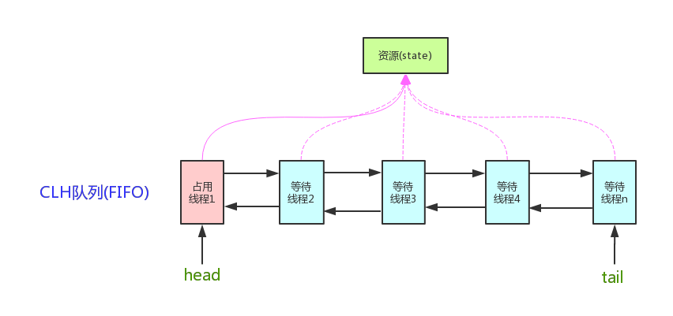

以 ReentrantLock 为例, state 初始值为 0, 表示未锁定状态; A 线程 lock 时, 会调用 `tryAcquire()`  独占该锁并将 state+1; 此后, 其他线程再 `tryAcquire()` 时就会失败, 直到 A 线程 unlock 到 state=0 (即释放锁) 为止, 其他线程才有机会获取该锁; 当然释放锁之前, A 线程自己是可以重复获取此锁的 (state 会累加); 获取多少次就要释放多少次, 这样才能保证 state 是能回到 0 的


## CountDownLatch 和 CyclicBarrier 区别

1.   CyclicBarrier 的某个线程运行到某个点上之后, 该线程即停止运行, 直到所有的线程都到达了这个点, 所有线程才重新运行; CountDownLatch 则不是, 某线程运行到某个点之后, 只是给某个数值 - 1 而已, 该线程继续运行
2.   CyclicBarrier 只能唤起一个任务, 而 CountDownLatch 可以唤起多个任务
3.   CyclicBarrier 可重用, 而 CountDownLatch 不可重用, 计数值为 0 该 CountDownLatch 就不可再用了


# JVM

## 运行时数据区域

*   **线程私有区**
    *   **程序计数器**: 当同时进行的线程数超过 CPU 数或者其内核数时, 不免发生线程切换, 这时每个线程就需要一个属于自己的计数器来记录下一条要运行的指令
    *   **虚拟机栈**:与线程在同一时间创建, 是管理 Java 方法执行的内存模型
    *   **本地方法栈**: 类似于虚拟机栈, 但它不是为 Java 方法服务的, 而是本地方法 (C 语言)
*   **线程共享区**
    *   **方法区**: 用于存储类的结构信息, 静态变量, 常量等数据
    *   **堆**: 用于存储对象实例和数组, 是 Java 虚拟机管理的最大的一块内存区域


## Java 创建一个对象的过程

1.   **类加载**: 当程序第一次使用某个类时, Java 虚拟机会通过类加载器加载该类
2.   **内存分配**: 一旦类加载完成, Java 虚拟机会在堆中为该类的对象分配内存空间
3.   **初始化对象**: 分配内存后, Java 虚拟机会对对象进行初始化; 这个过程包括设置对象的初始值, 例如基本类型的默认值 (0, false, null 等), 以及对象头信息的设置等
4.   **执行构造方法**: 初始化完成后, Java 虚拟机会调用对象的构造方法进行进一步的初始化
5.   **对象引用**: 最后, Java 虚拟机会返回对象的引用 (对象的地址)


## 内存分配策略

*   **指针碰撞**: 通过一个分配指针来记录当前可用的内存起始地址, 每当分配对象时, 分配指针向后移动到下一个可用的内存块的起始位置
*   **空闲列表**: 将堆内存划分为多个大小不同的内存块, 并维护一个空闲列表, 记录每个内存块的可用大小和起始地址; 当需要分配内存时, 内存管理器会根据需要的内存大小从空闲列表中找到合适的内存块, 并将其分配给对象; 在分配完内存后, 空闲列表会相应地更新


## 避免内存分配并发问题

*   **CAS+失败重试**: 虚拟机采用 CAS 配上失败重试的方式保证更新操作的原子性
*   **线程本地分配缓存 (Thread Local Allocation Buffer, TLAB)**: TLAB 是为每个线程预先分配的一小块堆内存区域; 每个线程在进行对象分配时, 首先尝试在自己的 TLAB 中分配内存; 由于 TLAB 是线程私有的, 这样避免了线程之间的竞争, 提高了内存分配的效率; 当对象大于 TLAB 的剩余内存或 TLAB 的内存已用尽时, 在采用上述的 CAS 进行内存分配


## 对象的访问定位的两种方式

*   **句柄方式**: Java虚拟机会为每个对象都分配一个句柄, 当程序需要访问对象时, 首先通过句柄来获取对象的引用, 然后再根据句柄中存储的地址信息去访问对象的实际数据; 好处是对象的地址可以是变化的 (例如垃圾回收时移动对象), 不足之处是需要多一次内存访问操作
*   **直接指针方式**: 当程序需要访问对象时, 直接通过对象引用即可获取对象的内存地址, 然后访问对象的实际数据; 好处是省略了一次内存访问, 提高访问对象的效率; 不足之处是如果对象的地址发生变化, 需要更新对象引用, 会增加额外开销


## Java 程序是如何执行的

先把 Java 代码编译成字节码, 即 .class 类型的文件, 然后把 class 文件放置到 Java 虚拟机, Java 虚拟机使用类加载器装载 class 文件; 类加载完成后, 会进行字节码校验, 字节码校验通过后, JVM 解释器会把字节码翻译成机器码交由操作系统执行


## 堆空间的基本结构

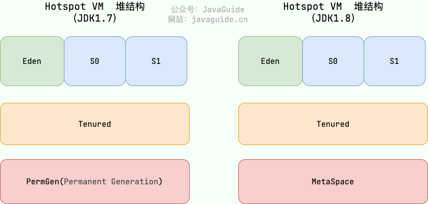

1.   新生代内存 (Eden, S0, S1)
2.   老年代 (中间一层)
3.   永久代 (最后一层)

JDK 8 版本之后永久代 (PermGen) 已被元数据区 (Metaspace) 取代, 元空间使用的是直接内存


## 元数据区和永久代的区别

*   **动态大小**: 元数据区的大小可以根据应用程序的需要动态调整, 不再受固定大小的限制
*   **本地内存分配**: 元数据区的内存分配使用本地内存来代替 Java 堆中的内存, 从而避免了一些传统永久代的限制
*   **垃圾回收**: 元数据区的垃圾回收由 Java 虚拟机的垃圾回收器来负责, 不再需要专门的永久代垃圾回收器


## 死亡对象判断方法

*   **引用计数法**: 给对象中添加一个引用计数器, 每当有一个地方引用它, 计数器就加 1, 当引用失效, 计数器就减 1, 任何时候计数器为 0 的对象就是不可能再被使用; 但是主流的虚拟机中并没有选择这个算法来管理内存, 其最主要的原因是它很难解决对象之间循环引用的问题
*   **可达性分析算法**: 从 GC Roots 开始向下搜索, 搜索所走过的路径称为引用链; 当一个对象到 GC Roots 没有任何引用链相连时, 则证明此对象是不可用的, 为不可达对象, 需要被回收


## JDK 中的引用类型

1.   **强引用**: 最常见的引用类型, 也是默认的引用类型 (比如 A a = new A() 这种); 只要存在强引用指向一个对象, 该对象就不会被垃圾回收器回收, 即使系统内存不足时也不会被回收
2.   **软引用**: 用于描述一些还有用但非必需的对象; 在内存不足时, 垃圾回收器可能会回收软引用指向的对象, 但不是强制性的
3.   **弱引用**: 比软引用更容易被回收; 弱引用对象在下一次垃圾收集时, 如果没有强引用指向它, 就会被回收
4.   **虚引用**: 最弱的引用类型, 存在主要是为了跟踪对象被垃圾回收的状态


## 垃圾收集算法

*   **标记-清除算法**: 首先, 从根对象开始, 通过可达性分析标记所有活动对象; 然后, 遍历整个堆内存, 将未被标记的对象认定为垃圾, 进而回收; 优点是不需要大规模移动对象, 因此适用于长期存活对象较多的场景; 缺点是不进行内存整理会产生内存碎片, 且会产生停顿
*   **标记-复制算法**: 将堆内存分为两个区域, 一个用于存放活动对象, 另一个用于回收垃圾对象; 首先从根对象开始, 通过可达性分析标记所有活动对象; 然后将活动对象复制到另一个区域, 同时清理掉原来区域中的所有对象; 优点是消除了内存碎片; 缺点是需要额外的内存空间来存放复制的对象, 且也会产生停顿
*   **标记-整理算法**: 与标记复制类似, 首先标记所有活动对象, 然后将它们移动到堆的一端, 接着将所有未被标记的对象视为垃圾, 将他们清除; 最后将所有活动对象向堆的一端移动, 从而达到内存整理的目的; 优点是消除了内存碎片, 且相对于标记复制, 不需要额外的内存空间; 缺点是同样会产生停顿


## 分代理论 (Minor GC & Full GC)

在分代理论中, 常见的垃圾回收算法包括**新生代的标记复制算法和老年代的标记清除/标记整理算法**

*   **Minor GC**: 针对新生代执行的垃圾回收称为 Minor GC; 新生代通常采用的是标记复制算法, 将新生代分为一个 Eden 区和两个 Survivor 区, 对象首先在 Eden 区分配,  经过一次 Minor GC 后, Eden 区中存活的对象会被复制到其中一个 Survivor 区, 而且存活多次的对象会逐渐晋升到老年代; 这样清理出新生代的垃圾对象, 提高新生代的空闲空间, 减少垃圾对象对堆内存的占用
*   **Full GC**: Full GC 是对整个堆内存进行垃圾回收的过程, 包括新生代和老年代; 在进行 Full GC 时, 通常会执行老年代的垃圾回收, 并且可能会清理永久代 (或者元数据区) 中的垃圾; Full GC 通常会比 Minor GC 耗时更长, 因为它需要对整个堆内存进行扫描和清理, 同时会导致应用程序的暂停时间更长


## 垃圾收集器

*   **Serial GC (标记复制算法)**: 新生代单线程收集器, 只会使用一条垃圾收集线程去完成垃圾收集工作, 而且它在进行垃圾收集工作的时候必须暂停其他所有的工作线程, 直到它收集结束

*   **ParNew GC (标记复制算法)**: 是 Serial GC 的多线程版本, 其余行为和 Serial GC 完全一样

*   **Parallel Scavenge GC (标记复制算法)**: 新生代并行收集器, 追求高吞吐量, 高效利用 CPU

*   **Serial Old GC (标记整理算法)**: Serial GC 的老年代版本

*   **Parallel Old GC (标记整理算法)**: Parallel Scavenge GC 的老年代版本

*   **CMS GC (ConcurrentMarkSweep 标记清除算法)**: 老年代并行收集器, 以获取最短回收停顿时间为目标的收集器, 具有高并发, 低停顿的特点, 追求最短 GC 回收停顿时间, 运行过程如下: 

    *   **初始标记**: CMS GC 首先会短暂得暂停所有应用程序线程, 并标记根对象以及直接与根对象关联的对象 
    *   **并发标记**: 初始标记完成后, CMS GC 会与应用程序线程并发执行, 继续标记所有可达对象
    *   **重新标记**: 标记在并发标记期间产生的新对象, 这个阶段的停顿时间一般会比初始标记阶段的时间稍长, 远远比并发标记阶段时间短
    *   **并发清除**: 对未标记的区域做清扫

    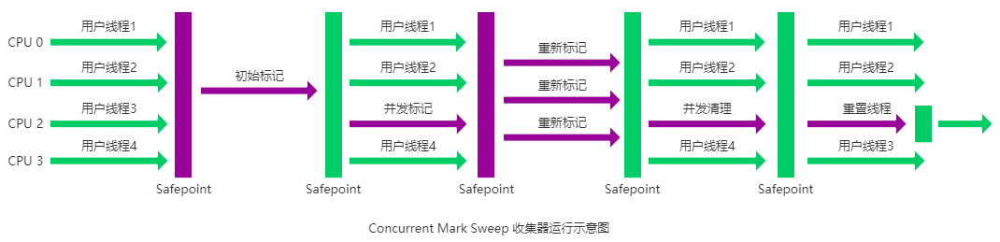

*   **G1 GC (标记整理算法)**: Java 堆并行收集器, 是 JDK1.7 提供的一个新收集器, 标记整理算法不会产生内存碎片; 不同于之前的收集器的一个重要特点就是 <u>G1 回收范围是整个 Java 堆, 而前六种收集器回收的范围仅限于新生代和老年代</u>, 运行过程如下: 

    *   **初始标记**: G1 GC 首先会短暂得暂停所有应用程序线程, 并标记根对象以及直接与根对象关联的对象 
    *   **并发标记**: 初始标记完成后, G1 GC 会与应用程序线程并发执行, 继续标记所有可达对象
    *   **最终标记**: G1 GC 短暂得暂停所有应用程序线程, 并标记在并发标记期间产生的新对象
    *   **筛选回收**: G1 GC 会根据各个区域中的存活对象数量和垃圾对象数量, 优先收集垃圾最多的区域, 并进行垃圾回收
    *   **空闲阶段**: 垃圾回收完成后, G1 GC 会进入空闲阶段, 等待下一次垃圾回收的触发

    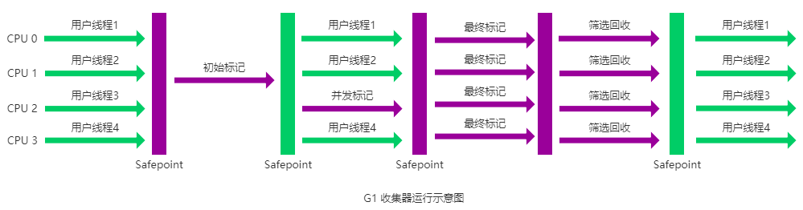


## 类的生命周期

一个类的生命周期包括加载, 链接, 初始化, 使用和卸载五个阶段

1.   **加载 (Loading)**: 通过类加载器将类的字节码加载到内存中, 并生成对应的 Class 对象
2.   **链接 (Linking)**: 
     *   **验证 (Verification)**: 检查类文件格式的正确性, 验证字节码等
     *   **准备 (Preparation)**: 为类的静态变量分配内存, 并设置默认初始值
     *   **解析 (Resolution)**: 将符号引用转换为直接引用
3.   **初始化 (Initialization)**: JVM 会对类进行初始化, 执行类的静态变量赋值和静态代码块等初始化操作
4.   **使用 (Usage)**: 类的实例可以被创建, 方法可以被调用, 静态变量可以被访问等 (new)
5.   **卸载 (unloading)**: 当类不再被引用, 且没有任何活动的实例时, 类加载器可以选择卸载类

**类加载的过程包括加载, 链接和初始化三个步骤**


## 类加载器

类加载器的主要作用就是加载 Java 类的字节码到 JVM 中, 在内存中生成一个代表该类的 Class 对象; 类加载器还可以加载 Java 应用所需的资源如文本, 图像, 配置文件, 视频等等文件资源


## 双亲委派模型

*   自底向上查找判断类是否被加载
*   自顶向下尝试加载类

工作流程如下:

1.   在类加载的时候, 系统会首先判断当前类是否被加载过; 已经被加载的类会直接返回, 否则才会尝试加载 (每个父类加载器都会走一遍这个流程)
2.   类加载器在进行类加载的时候, 它首先不会自己去尝试加载这个类, 而是把这个请求委派给父类加载器去完成; 这样的话, 所有的请求最终都会传送到顶层的启动类加载器中
3.   只有当父加载器反馈自己无法完成这个加载请求时, 子加载器才会尝试自己去加载
4.   如果子类加载器也无法加载这个类, 那么它会抛出一个 `ClassNotFoundException` 异常

优点如下:

*   避免了类的重复加载, 保证了类的唯一性和一致性
*   避免了类的恶意加载, 提高了系统的安全性
*   可以根据需求自定义类加载器, 实现不同的加载策略和类加载行为


# Redis

## 什么是 Redis

Redis 是一个开源的内存数据结构存储系统, 主要作为数据库, 缓存和消息代理使用; 与传统数据库不同的是, Redis 的数据是保存在内存中的, 因此读写速度非常快, 被广泛应用于分布式缓存中


## Redis 有哪些数据类型及应用场景

1.   **String**
     *   缓存对象: 如用户信息, 会话数据等
     *   简单消息存储: 如短消息, 状态信息等
2.   **Hash**
     *   对象存储: 如存储用户信息 (用户名, 密码, 电子邮件等), 可以用哈希存储每个用户的属性
     *   配置管理: 存储应用配置参数, 便于动态更新
3.   **List**
     *   消息队列: 利用 LPUSH/RPUSH 和 LPOP/RPOP 实现任务队列, 工作队列
     *   时间线: 如社交网路中的时间线功能
4.   **Set**
     *   标签系统: 如用户标签, 文章标签
     *   交集, 并集, 差集运算: 如推荐系统中计算共同好友, 共同兴趣等
5.   **SortedSet**
     *   排行榜: 如游戏中的得分排行榜
     *   延迟队列: 按任务优先级或延迟时间排序
6.   **Bitmap**
     *   用户活跃状态: 记录用户每日活跃状态
     *   快速计数: 如统计每天的用户访问情况
7.   **HyperLogLog**
     *   唯一访客计数: 统计网站或应用的独立访问用户数
     *   去重计数: 如社交网路中独立标签的计数
8.   **Geospatial**
     -   位置服务：如附近的商家、用户定位。

     -   地理围栏：如确定用户是否在特定区域内。


## Redis6.0 之后为何引入了多线程

1.   **提高并发处理能力**: 通过引入多线程, Redis 可以并行处理多个网络请求, 从而减少每个请求的等待时间, 显著提高吞吐量和相应速度
2.   **优化网络 I/O**: 多线程主要用于处理网络 I/O 操作, 包括读取客户端请求和发送相应; 这些操作在单线程模式下会成为瓶颈, 通过多线程可以显著降低延迟
3.   **保持简单性**: Redis 引入多线程的方式非常谨慎, **主要用于 I/O 操作, 而命令的实际执行仍然在单线程中进行**; 这样既可以提高性能, 又避免了复杂的并发控制问题


## Redis 过期数据删除策略

*   **惰性删除**: 只会在取出/查询 key 的时候才对数据进行过期检查; 这种方式对 CPU 最友好, 但是可能会造成太多过期 key 没有被删除
*   **定期删除**: 周期性地随机从设置了过期时间的 key 中抽查一批, 然后逐个检查这些 key 是否过期; 过期就删除 key; 相比于惰性删除, 定期删除对内存更友好, 对 CPU 不太友好
*   **延迟队列**: 把设置过期时间的 key 放到一个延迟队列, 到期之后就删除 key; 这种方式可以保证每个过期 key 都能被删除, 但维护延迟队列太麻烦, 队列本身也要占用资源
*   **定时删除**: 每个设置了过期时间的 key 都会在设置的时间到达时立即被删除; 这种方法可以确保内存中不会有过期的 key, 但是它对 CPU 的压力最大, 因为它需要为每个 key 都设置一个定时器


## Redis 的持久化策略 (RDB & AOF)

*   **RDB (Redis Database Backup)**: Redis 会在指定时间间隔或特定条件下生成数据快照, 并将其保存到磁盘上; 生成快照的过程包括将内存中的所有数据写入一个临时文件, 完成后再将这个文件替换之前的 RDB 文件

    **优点**: 

    *   **性能开销低**: RDB 文件在生成期间的 I/O 操作是批量的, 因此对 Redis 性能的影响较小
    *   **恢复速度快**: RDB 文件是紧凑的二进制文件, 恢复数据时加载速度较快
    *   **数据备份方便**: RDB 文件是一个完整的数据快照, 便于备份和迁移

    **缺点**:

    *   **数据丢失风险**: 如果 Redis 崩溃, 在上次快照之后的数据会丢失
    *   **生成快照耗时**: 对于大数据集, 生成 RDB 快照可能会消耗较长时间和大量 I/O 资源

*   **AOF (Append-Only File)**: Redis 将每个写操作 (如 `SET`, `LPUSH` 等) 以追加的方式记录到 AOF 文件中; 这样 Redis 可以通过重放这些操作来恢复数据

    **优点**:

    *   **数据持久性高**: AOF 可以提供比 RDB 更高的数据安全性, 因为它记录了每个写操作
    *   **可读性和灵活性**: AOF 是一个日志文件, 记录了所有的写操作命令, 方便调试

    **缺点**:

    *   **文件体积大**: AOF 文件通常比 RDB 文件大, 尤其是长时间运行且没有进行重写时
    *   **恢复速度慢**: 因为恢复过程需要重放所有的写操作, 对于大的 AOF 文件, 恢复速度较慢

    *   **性能开销高**: 频繁的日志写入操作会增加 I/O 负担, 影响 Redis 性能

**结合使用**: Redis 支持同时开启 RDB 和 AOF 持久化, 以实现数据安全性和恢复速度的最佳平衡


## 缓存穿透, 缓存击穿, 缓存雪崩以及解决方法

*   **缓存穿透**: 指客户端请求的数据既不在缓存中, 也不在数据库中; 这种情况通常发生在请求一个不存在的数据项时, 因为缓存没有命中, 系统会直接请求数据库, 数据库查询也会返回空结果; 如果大量请求都是针对不存在的数据, 所有请求都会直接落到数据库上, 可能会对数据库造成很大压力

    **解决方案**:

    *   **缓存空结果**: 如果数据库中没有查到数据, 可以将结果 (如 null 或特定的占位符) 缓存起来, 并设置一个较短的过期时间; 这样相同的请求在短时间内会直接命中缓存, 避免重复查询数据库
    *   **布隆过滤器**: 在缓存层增加一个布隆过滤器, 用于快速判断请求的键是否可能存在; 如果布隆过滤器判断不存在, 则直接返回空结果, 避免查询数据库
    *   **参数合法性校验**: 对请求参数进行合法性校验, 过滤掉明显无效的请求

*   **缓存击穿**: 指某些热点数据在缓存过期后, 大量请求同时到达缓存, 但此时缓存未命中, 导致所有请求都打到数据库上, 可能引起数据库压力骤增; 大量请求同时查询数据库, 可能导致数据库负载过高, 甚至宕机

    **解决方案**: 

    *   **设置热点数据不过期**
    *   **互斥锁**: 在缓存失效后, 通过加锁来控制只有一个请求能够查询数据库并更新缓存, 其他请求等待缓存更新完成后再从缓存中读取数据

*   **缓存雪崩**: 指在某个时间段内, 大量缓存数据同时过期, 导致大量请求同时打到数据库上, 可能引起数据库崩溃; 数据库承受不住突然激增的请求负载, 可能导致服务不可用

    **解决方案**: 缓存过期时间分散, 缓存预热, 双层缓存等


## Redis 内存淘汰机制

Redis 的内存淘汰策略只有在运行内存达到了配置的最大内存阀值时才会触发

1.   **volatile-lru (least recently used)**: 从已设置过期时间的数据集 (`server.db[i].expires`) 中挑选最近最少使用的数据淘汰
2.   **volatile-ttl**: 从已设置过期时间的数据集 (`server.db[i].expires`) 中挑选将要过期的数据淘汰
3.   **volatile-random**: 从已设置过期时间的数据集 (`server.db[i].expires`) 中任意选择数据淘汰
4.   **allkeys-lru**: 从数据集 (`server.db[i].dict`) 中移除最近最少使用的数据淘汰
5.   **allkeys-random**: 从数据集 (`server.db[i].dict`) 中任意选择数据淘汰
6.   **no-eviction (默认内存淘汰策略)**: 禁止驱逐数据, 当内存不足以容纳新写入数据时, 新写入操作会报错


## Redis 事务

Redis 事务提供了一种将多个命令请求打包的功能, 然后再按顺序执行打包的所有命令, 并且不会被中途打断

Redis 事务的基本命令:

1.   **MULTI**: 开启一个事务; 所有后续的命令会被放入一个队列中, 知道执行 `EXEC` 命令
2.   **EXEC**: 执行事务中的所有命令; 事务中的所有命令会被按照顺序执行
3.   **WATCH**: 监视一个或者多个键; 在事务执行之前, 如果这些键中的任何一个被修改, 事务会被取消
4.   **DISCARD**: 放弃事务; 清空事务队列, 并取消事务

Redis 事务的特性:

1.   **原子性**: 事务中的命令按顺序执行, 但不保证整体的原子性; 也就是说, 事务中的部分命令可能会成功, 而部分命令可能会失败
2.   **隔离性**: 在 `MULTI` 和 `EXEC`  之间的命令不会被其他客户端看到
3.   **不支持回滚**: 如果事务中的某个命令失败, 其他命令仍然会继续执行, Redis 不支持回滚
