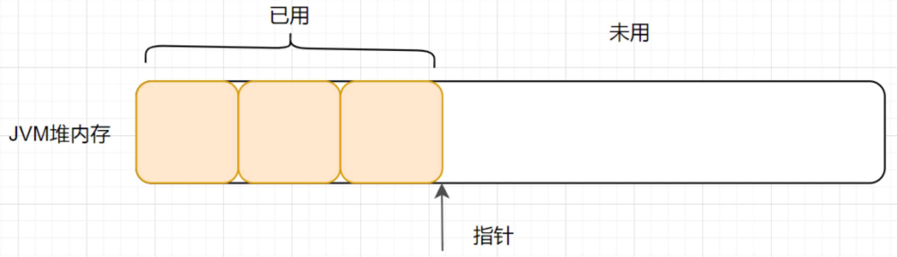
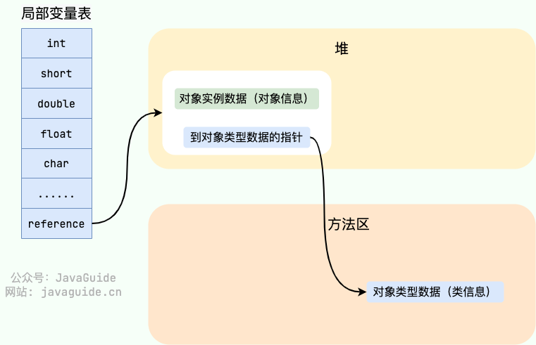

## 运行时数据区中包含哪些区域？哪些线程共享？哪些线程独享？

*   **线程私有区**
    *   **程序计数器 (Program Counter Register)**: 
        *   当同时进行的线程数超过 CPU 数或者其内核数时, 就要通过时间片轮询分派 CPU 的时间资源, 不免发生线程切换
        *   这时, 每个线程就需要一个属于自己的计数器来记录下一条要运行的指令
        *   如果执行的是 Java 方法, 计数器记录正在执行的 Java 字节码地址, 如果执行的是 native 方法, 则计数器为空
    *   **虚拟机栈 (Java Virtual Machine Stacks)**:
        *   与线程在同一时间创建, 是管理 Java 方法执行的内存模型
        *   每个方法的执行都会在栈上创建一个帧 (Frame), 用于存储局部变量, 操作数栈, 方法出口等信息，然后帧会被压入栈中。当方法执行完毕后，栈帧会从栈中移除。
    *   **本地方法栈 (Native Method Stack)**:
        *   类似于虚拟机栈
        *   但它不是为 Java 方法服务的, 而是本地方法 (C 语言)
*   **线程共享区**
    *   **方法区 (Method Area)**: 
        *   用于存储类的结构信息、静态变量、常量等数据
        *   在 HotSpot 虚拟机中, 方法区被称为永久代 (Permanent Generation), 但在较新的 JVM 实现中, 永久代被元数据区 (Metaspace) 所取代
    *   **堆 (Heap)**:
        *   用于存储对象实例和数组, 是 Java 虚拟机管理的最大的一块内存区域

## Java 创建一个对象的过程

1.  **类加载**: 当程序第一次使用某个类时，Java虚拟机会通过类加载器加载该类。类加载器负责将类的字节码文件加载到内存中，并生成对应的Class对象。
2.  **内存分配**: 一旦类加载完成，Java虚拟机会在堆（Heap）中为该类的对象分配内存空间。Java的对象都是在堆中动态分配的，而堆是所有线程共享的内存区域。
3.  **初始化对象**: 分配内存后，Java虚拟机会对对象进行初始化。这个过程包括设置对象的初始值，例如基本类型的默认值（0、false、null等），以及对象头信息的设置等。
4.  **执行构造方法**: 初始化完成后，Java虚拟机会调用对象的构造方法进行进一步的初始化。构造方法会执行用户定义的初始化操作，包括对成员变量的赋值、执行其他方法等。
5.  **对象引用**: 最后，Java虚拟机会返回对象的引用（或者叫对象的地址），这个引用可以被赋给类的成员变量、方法的参数或者局部变量等，从而使程序可以操作和使用这个对象。

## 内存分配策略

内存分配策略是指在程序运行过程中，如何有效地分配内存给对象。Java虚拟机通常使用以下两种主要的内存分配策略：

### 指针碰撞（Bump the Pointer）

-   指针碰撞是一种简单而高效的内存分配策略，通常用于堆上采用连续空间分配的情况。它通过一个指针（称为"分配指针"）来记录当前可用的内存起始地址，每当分配对象时，分配指针向后移动到下一个可用的内存块的起始位置。这种策略适用于采用标记-清除或者标记-整理算法的垃圾收集器。

    

### 空闲列表（Free List）

-   空闲列表是一种更加灵活的内存分配策略，适用于采用分代收集算法或者复杂的内存管理情况。它将堆内存划分为多个大小不同的内存块，并维护一个空闲列表，记录每个内存块的可用大小和起始地址。当需要分配内存时，内存管理器会根据需要的内存大小从空闲列表中找到合适的内存块，并将其分配给对象。在分配完内存后，空闲列表会相应地更新。

在进行内存分配时，Java虚拟机通常会考虑以下几个因素：

-   **内存碎片化**：内存碎片化是指内存中存在大量未被使用的小内存块，但由于它们分散在内存中，无法被利用。因此，内存分配策略需要尽量减少内存碎片化，以充分利用内存空间。
-   **分配速度**：内存分配策略应该尽可能地高效，以减少分配对象时的时间开销，提高程序的性能。
-   **内存利用率**：内存分配策略应该尽可能地提高内存利用率，以减少内存的浪费，提高系统的资源利用率。

## 内存分配并发问题

在创建对象的时候有一个很重要的问题，就是线程安全，因为在实际开发过程中，创建对象是很频繁的事情，作为虚拟机来说，必须要保证线程是安全的，通常来讲，虚拟机采用两种方式来保证线程安全：

-   **CAS+失败重试：** CAS 是乐观锁的一种实现方式。所谓乐观锁就是，每次不加锁而是假设没有冲突而去完成某项操作，如果因为冲突失败就重试，直到成功为止。**虚拟机采用 CAS 配上失败重试的方式保证更新操作的原子性。**
-   **线程本地分配缓存（Thread Local Allocation Buffer, TLAB）**：TLAB 是为每个线程预先分配的一小块堆内存区域。每个线程在进行对象分配时，首先尝试在自己的TLAB中分配内存。**由于TLAB是线程私有的，这样避免了线程之间的竞争，提高了内存分配的效率。**当对象大于 TLAB 中的剩余内存或 TLAB 的内存已用尽时，再采用上述的 CAS 进行内存分配

## 对象的访问定位的两种方式

### 句柄方式（Handle-Based）

-   在句柄方式中，Java虚拟机会为每个对象都分配一个句柄，句柄包含了对象的实际内存地址以及类型信息等。

-   <u>当程序需要访问对象时，首先通过句柄来获取对象的引用，然后再根据句柄中存储的地址信息去访问对象的实际数据</u>。

-   这种方式的好处是对象的地址可以是变化的，例如进行垃圾回收时可以移动对象，而句柄的地址不会变化，因此不需要更新对象引用。

-   不足之处是需要多一次内存访问操作，即先获取句柄，再通过句柄访问对象，会略微增加访问对象的开销。

    

### 直接指针方式（Direct Pointer-Based）

-   在直接指针方式中，对象的引用直接指向对象的内存地址，省略了句柄的间接访问。

-   <u>当程序需要访问对象时，直接通过对象引用即可获取对象的内存地址，然后访问对象的实际数据</u>。

-   这种方式的优势是省略了一次内存访问，直接从引用获取对象地址，提高了访问对象的效率。

-   不足之处是如果对象的地址发生变化（例如垃圾回收时移动对象），需要更新对象引用，而这个更新操作可能需要扫描堆中所有指向该对象的引用，因此在对象移动时会增加一些额外的开销。

    

## Java 程序是如何执行的

1.   <u>先把 Java 代码编译成字节码, 也就是把 .java 类型的文件编译成 .class 类型的文件</u>; 字节码是一种与特定硬件平台无关的中间代码; 这个过程的大致执行流程: Java 源代码 --> 词法分析器 --> 语法分析器 --> 语义分析器 --> 字符码生成器 --> 最终生成字节码, 其中任何一个节点执行失败就会造成编译失败
2.   <u>把 class 文件放置到 Java 虚拟机</u>, 这个虚拟机通常指的是 Oracle 官方自带的 Hotspot JVM
3.   <u>Java 虚拟机使用类加载器 (Class Loader) 装载 class 文件</u>
4.   <u>类加载完成后, 会进行字节码校验, 字节码校验通过后, JVM 解释器会把字节码翻译成机器码交由操作系统执行</u>; 但不是所有代码都是解释执行的, JVM 对此做了优化, 比如, 以 Hotspot 虚拟机来说, 它本身提供了 JIT (Just In Time), 也就是我们通常所说的动态编译器, 它能够在运行时将热点代码编译为机器码, 这个时候字节码就变成了编译执行

