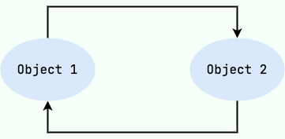
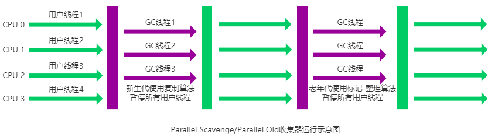

##  堆空间的基本结构

Java 的自动内存管理主要是针对对象内存的回收和对象内存的分配。同时，Java 自动内存管理最核心的功能是 **堆** 内存中对象的分配与回收。

Java 堆是垃圾收集器管理的主要区域，因此也被称作 **GC 堆（Garbage Collected Heap）**。

从垃圾回收的角度来说，由于现在收集器基本都采用分代垃圾收集算法，所以 Java 堆被划分为了几个不同的区域，这样我们就可以根据各个区域的特点选择合适的垃圾收集算法。

在 JDK 7 版本及 JDK 7 版本之前，堆内存被通常分为下面三部分：

1.  新生代内存(Young Generation)
2.  老生代(Old Generation)
3.  永久代(Permanent Generation)

下图所示的 Eden 区、两个 Survivor 区 S0 和 S1 都属于新生代，中间一层属于老年代，最下面一层属于永久代。


**JDK 8 版本之后 PermGen(永久) 已被 Metaspace(元空间) 取代，元空间使用的是直接内存** 。


## 方法区和永久代的关系

方法区（Method Area）和永久代（Permanent Generation）是Java虚拟机中的两个概念，但在一些早期的JVM实现中，特别是在HotSpot虚拟机的一些早期版本中，永久代是方法区的一种实现方式。

具体来说，<u>永久代是方法区的一部分</u>，它用于存储类的结构信息、静态变量、常量池以及编译器优化后的代码等。在HotSpot虚拟机中，<u>永久代是一个固定大小的内存区域</u>，其大小可以通过启动参数进行调整。由于<u>永久代是有限的，并且无法动态扩展</u>，因此在某些场景下会出现永久代内存溢出的情况，通常表现为"PermGen space"错误。

随着Java虚拟机的发展，为了解决永久代内存溢出的问题，并且提高类加载和卸载的性能，一些JVM实现开始逐渐淘汰永久代，转而采用<u>元数据区（Metaspace）来代替</u>。元数据区与永久代相比，有以下几个不同之处：

1.  **动态大小**: 元数据区的大小可以根据应用程序的需要动态调整，不再受固定大小的限制。
2.  **本地内存分配**: 元数据区的内存分配使用本地内存（native memory）来代替Java堆中的内存，从而避免了一些传统永久代的限制。
3.  **垃圾回收**: 元数据区的垃圾回收由Java虚拟机的垃圾回收器来负责，不再需要专门的永久代垃圾回收器。

因此，可以说<u>永久代是方法区的一种实现方式，在较新的JVM实现中，元数据区已经取代了永久代成为存储类信息等数据的主要区域。</u>


## 死亡对象判断方法

### 引用计数法

给对象中添加一个引用计数器：

-   每当有一个地方引用它，计数器就加 1；
-   当引用失效，计数器就减 1；
-   任何时候计数器为 0 的对象就是不可能再被使用的。

**这个方法实现简单，效率高，但是目前主流的虚拟机中并没有选择这个算法来管理内存，其最主要的原因是它很难解决对象之间循环引用的问题。**



###  可达性分析算法

这个算法的基本思想就是从 **GC Roots** 开始向下搜索, 搜索所走过的路径称为引用链; 当一个对象到 GC Roots 没有任何引用链相连时, 则证明此对象是不可用的, 为不可达对象, 需要被回收

下图中的 `Object 6 ~ Object 10` 之间虽有引用关系，但它们到 GC Roots 不可达，因此为需要被回收的对象。


##  JDK 中引用类型

在Java Development Kit (JDK) 中，Java提供了四种引用类型，它们分别是：

1.  **强引用 (Strong Reference)**:
    -   <u>强引用是最常见的引用类型</u>，也是默认的引用类型。(比如 A a = new A() 这种)
    -   只要存在强引用指向一个对象，该对象就<u>不会被垃圾回收器回收</u>。
    -   当一个对象具有强引用时，即使系统内存不足时也不会被回收，这可能导致内存泄漏问题。
2.  **软引用 (Soft Reference)**:
    -   <u>软引用用于描述一些还有用但非必需的对象。在内存不足时，垃圾回收器可能会回收软引用指向的对象，但不是强制性的</u>。
    -   当系统内存不足时，垃圾回收器可能会回收软引用对象，以释放内存空间，但在回收之前，软引用对象可以被访问和使用。
3.  **弱引用 (Weak Reference)**:
    -   弱引用用于描述非必需对象，但<u>比软引用更容易被回收</u>。
    -   <u>弱引用对象在下一次垃圾收集时，如果没有强引用指向它，就会被回收</u>。
4.  **虚引用 (Phantom Reference)**:
    -   <u>虚引用是最弱的引用类型</u>，几乎没有任何实质性的功能。
    -   <u>虚引用的存在主要是为了跟踪对象被垃圾回收的状态</u>，与其他引用类型不同，虚引用并不能通过get()方法来获取被引用的对象。
    -   当垃圾回收器准备回收一个对象时，如果该对象只有虚引用，垃圾回收器会将这个虚引用加入到与之关联的引用队列中。


##  垃圾收集算法

###  标记-清除算法（Mark and Sweep）

-   **工作原理**：首先，从根对象（如全局变量、栈中的引用等）开始，通过可达性分析标记所有活动对象。然后，遍历整个堆内存，将未被标记的对象认定为垃圾，进而回收。

-   优点：

    -   简单直观，易于实现。
    -   <u>不需要大规模移动对象，因此适用于长期存活对象较多的场景</u>。

-   缺点：

    -   <u>因为不进行内存整理，会产生内存碎片，可能会导致频繁的内存分配失败</u>。
    -   会产生<u>停顿</u>，因为在标记和清除的过程中需要停止应用程序的运行。

    


### 标记-复制算法（Mark and Copy）

-   **工作原理**：将堆内存分为两个区域，一个用于存放活动对象，另一个用于回收垃圾对象。首先，从根对象开始，通过可达性分析标记所有活动对象。然后，将活动对象复制到另一个区域，同时清理掉原来的区域中的所有对象。

-   优点：

    -   <u>消除了内存碎片</u>，因为整个区域的存活对象被连续地存放在一起。
    -   因为不需要标记的对象被清理，因此<u>回收效率较高</u>。

-   缺点：

    -   <u>需要额外的内存空间来存放复制的对象</u>。
    -   复制过程中可能会产生<u>停顿</u>，因为所有的活动对象都需要复制到另一个区域。

    


###  标记-整理算法（Mark and Compact）

-   **工作原理**：与标记复制类似，首先标记所有活动对象，然后将它们移动到堆的一端，然后将所有未被标记的对象视为垃圾，将它们清除。最后，将所有活动对象向堆的一端移动，从而达到内存整理的目的。

-   优点：

    -   <u>消除了内存碎片</u>，因为所有活动对象都被整理到一端。
    -   <u>相对于标记复制，不需要额外的内存空间</u>。

-   缺点：

    -   与标记清除一样，会产生<u>停顿</u>，因为在移动对象的过程中需要停止应用程序的运行。适合老年代这种垃圾回收频率不是很高的场景。

    


## 分代理论

分代理论是Java虚拟机（JVM）中的一种内存管理策略，它基于这样的假设：大部分对象的生命周期较短，而只有少部分对象是长期存活的。根据这一假设，JVM将堆内存分为不同的代（Generation），通常分为新生代（Young Generation）、老年代（Old Generation）和永久代（或者元数据区，Metaspace）。

在分代理论中，常见的垃圾回收算法包括<u>新生代的复制算法和老年代的标记-清除/标记-整理算法</u>。

-   **Minor GC**（年轻代垃圾回收）：针对新生代执行的垃圾回收称为Minor GC。新生代通常采用的是复制算法，将新生代分为一个Eden区和两个Survivor区（通常是From和To区），对象首先在Eden区分配，经过一次Minor GC 后，Eden区中存活的对象会被复制到其中一个Survivor区，而且存活多次的对象会逐渐晋升到老年代。Minor GC 的目标是清理出新生代的垃圾对象，提高新生代的空闲空间，减少垃圾对象对堆内存的占用，以降低频繁回收的成本。
-   **Full GC**（老年代垃圾回收）：Full GC 是对整个堆内存进行垃圾回收的过程，包括新生代和老年代。在进行 Full GC 时，通常会执行老年代的垃圾回收，并且可能会清理永久代（或者元数据区）中的垃圾。Full GC 通常会比 Minor GC 耗时更长，因为它需要对整个堆内存进行扫描和清理，同时会导致应用程序的暂停时间更长。


## 垃圾收集器

**如果说收集算法是内存回收的方法论，那么垃圾收集器就是内存回收的具体实现。**

虽然我们对各个收集器进行比较，但并非要挑选出一个最好的收集器。因为直到现在为止还没有最好的垃圾收集器出现，更加没有万能的垃圾收集器，**我们能做的就是根据具体应用场景选择适合自己的垃圾收集器**。试想一下：如果有一种四海之内、任何场景下都适用的完美收集器存在，那么我们的 HotSpot 虚拟机就不会实现那么多不同的垃圾收集器了。

JDK 默认垃圾收集器（使用 `java -XX:+PrintCommandLineFlags -version` 命令查看）：

-   JDK 8：Parallel Scavenge（新生代）+ Parallel Old（老年代）
-   JDK 9 ~ JDK20: G1

###  Serial GC

Serial（串行）收集器是最基本、历史最悠久的垃圾收集器了。大家看名字就知道这个收集器是一个单线程收集器了。它的 **“单线程”** 的意义不仅仅意味着它只会使用一条垃圾收集线程去完成垃圾收集工作，更重要的是它在进行垃圾收集工作的时候必须暂停其他所有的工作线程（ **"Stop The World"** ），直到它收集结束。

**新生代采用标记-复制算法，老年代采用标记-整理算法。**


虚拟机的设计者们当然知道 Stop The World 带来的不良用户体验，所以在后续的垃圾收集器设计中停顿时间在不断缩短（仍然还有停顿，寻找最优秀的垃圾收集器的过程仍然在继续）。

但是 Serial 收集器有没有优于其他垃圾收集器的地方呢？当然有，它**简单而高效（与其他收集器的单线程相比）**。Serial 收集器由于没有线程交互的开销，自然可以获得很高的单线程收集效率。Serial 收集器对于运行在 Client 模式下的虚拟机来说是个不错的选择。

###  ParNew GC

ParNew 收集器其实就是 Serial 收集器的多线程版本，除了使用多线程进行垃圾收集外，其余行为（控制参数、收集算法、回收策略等等）和 Serial 收集器完全一样。

**新生代采用标记-复制算法，老年代采用标记-整理算法。**


它是许多运行在 Server 模式下的虚拟机的首要选择，除了 Serial 收集器外，只有它能与 CMS 收集器（真正意义上的并发收集器，后面会介绍到）配合工作。

**并行和并发概念补充：**

-   **并行（Parallel）**：指多条垃圾收集线程并行工作，但此时用户线程仍然处于等待状态。
-   **并发（Concurrent）**：指用户线程与垃圾收集线程同时执行（但不一定是并行，可能会交替执行），用户程序在继续运行，而垃圾收集器运行在另一个 CPU 上。

###  Parallel Scavenge GC

Parallel Scavenge 收集器也是使用标记-复制算法的多线程收集器，它看上去几乎和 ParNew 都一样。 **那么它有什么特别之处呢？**

```
-XX:+UseParallelGC

    使用 Parallel 收集器+ 老年代串行

-XX:+UseParallelOldGC

    使用 Parallel 收集器+ 老年代并行
```

Parallel Scavenge 收集器关注点是吞吐量（高效率的利用 CPU）。CMS 等垃圾收集器的关注点更多的是用户线程的停顿时间（提高用户体验）。所谓吞吐量就是 CPU 中用于运行用户代码的时间与 CPU 总消耗时间的比值。 Parallel Scavenge 收集器提供了很多参数供用户找到最合适的停顿时间或最大吞吐量，如果对于收集器运作不太了解，手工优化存在困难的时候，使用 Parallel Scavenge 收集器配合自适应调节策略，把内存管理优化交给虚拟机去完成也是一个不错的选择。

**新生代采用标记-复制算法，老年代采用标记-整理算法。**


**这是 JDK1.8 默认收集器**

###  Serial Old GC

**Serial 收集器的老年代版本**，它同样是一个单线程收集器。它主要有两大用途：一种用途是在 JDK1.5 以及以前的版本中与 Parallel Scavenge 收集器搭配使用，另一种用途是作为 CMS 收集器的后备方案。


### Parallel Old 收集器

**Parallel Scavenge 收集器的老年代版本**。使用多线程和“标记-整理”算法。在注重吞吐量以及 CPU 资源的场合，都可以优先考虑 Parallel Scavenge 收集器和 Parallel Old 收集器。



### CMS GC

**CMS（Concurrent Mark Sweep）收集器是一种以获取最短回收停顿时间为目标的收集器。它非常符合在注重用户体验的应用上使用。**

**CMS（Concurrent Mark Sweep）收集器是 HotSpot 虚拟机第一款真正意义上的并发收集器，它第一次实现了让垃圾收集线程与用户线程（基本上）同时工作。**

从名字中的**Mark Sweep**这两个词可以看出，CMS 收集器是一种 **“标记-清除”算法**实现的，它的运作过程相比于前面几种垃圾收集器来说更加复杂一些。整个过程分为四个步骤：

-   **初始标记：** 

    CMS垃圾收集器首先会<u>暂停所有应用程序线程</u>，进行一次短暂的暂停，称为初始标记阶段。在这个阶段中，<u>CMS会标记根对象以及直接与根对象关联的对象，标记所有从根对象直接可达的对象，以建立起标记链表</u>。

-   **并发标记：** 

    在初始标记完成后，<u>CMS垃圾收集器会与应用程序线程并发执行，继续标记所有可达对象</u>。在这个阶段中，<u>应用程序线程可以继续运行</u>，而CMS垃圾收集器通过遍历对象图标记所有可达对象，直到标记完成。

-   **重新标记：** 

    重新标记阶段就是为了<u>修正并发标记期间因为用户程序继续运行而导致标记产生变动的那一部分对象的标记记录</u>，这个阶段的停顿时间一般会比初始标记阶段的时间稍长，远远比并发标记阶段时间短

-   **并发清除：** 

    开启用户线程，同时 GC 线程开始<u>对未标记的区域做清扫</u>。


从它的名字就可以看出它是一款优秀的垃圾收集器，主要优点：**并发收集、低停顿**。但是它有下面三个明显的缺点：

-   **内存碎片问题**：CMS使用标记-清除算法，会导致内存碎片化，可能会影响程序的性能。由于CMS不会进行内存整理，因此在长时间运行后，可能会导致内存碎片累积，进而影响垃圾收集的效率。
-   **并发模式失败（Concurrent Mode Failure）**：在并发标记阶段，如果在标记的过程中堆空间不足，CMS会触发一次老年代串行收集，这会导致较长时间的停顿，称为并发模式失败。并发模式失败可能会影响应用程序的性能和可预测性。
-   **CPU占用过高**：CMS在标记和清除阶段都会消耗大量的CPU资源，可能会导致应用程序的性能下降，特别是在大堆上运行时。
-   **无法处理浮动垃圾**：CMS是一种并发的垃圾收集器，无法处理一些浮动垃圾（Floating Garbage），可能导致内存泄漏或者溢出的问题。

**CMS 垃圾回收器在 Java 9 中已经被标记为过时(deprecated)，并在 Java 14 中被移除。**


### G1 GC

**G1 (Garbage-First) 是一款面向服务器的垃圾收集器,主要针对配备多颗处理器及大容量内存的机器. 以极高概率满足 GC 停顿时间要求的同时,还具备高吞吐量性能特征.**

被视为 JDK1.7 中 HotSpot 虚拟机的一个重要进化特征。它具备以下特点：

-   **并行与并发**：G1 能充分利用 CPU、多核环境下的硬件优势，使用多个 CPU（CPU 或者 CPU 核心）来缩短 Stop-The-World 停顿时间。部分其他收集器原本需要停顿 Java 线程执行的 GC 动作，G1 收集器仍然可以通过并发的方式让 java 程序继续执行。
-   **分代收集**：虽然 G1 可以不需要其他收集器配合就能独立管理整个 GC 堆，但是还是保留了分代的概念。
-   **空间整合**：与 CMS 的“标记-清除”算法不同，G1 从整体来看是基于“标记-整理”算法实现的收集器；从局部上来看是基于“标记-复制”算法实现的。
-   **可预测的停顿**：这是 G1 相对于 CMS 的另一个大优势，降低停顿时间是 G1 和 CMS 共同的关注点，但 G1 除了追求低停顿外，还能建立可预测的停顿时间模型，能让使用者明确指定在一个长度为 M 毫秒的时间片段内，消耗在垃圾收集上的时间不得超过 N 毫秒。

G1 收集器的运作大致分为以下几个步骤：

-   **初始标记阶段（Initial Marking）**：

    G1垃圾收集器首先会进行一次<u>短暂的暂停</u>，称为初始标记阶段。在这个阶段中，<u>G1会标记根对象以及直接与根对象关联的对象，标记所有从根对象直接可达的对象，并确定需要回收的区域</u>。

-   **并发标记阶段（Concurrent Marking）**：

    在初始标记完成后，<u>G1垃圾收集器会与应用程序线程并发执行，继续标记所有可达对象</u>。在这个阶段中，应用程序线程可以继续运行，而G1垃圾收集器通过遍历对象图标记所有可达对象，直到标记完成。

-   **最终标记阶段（Final Marking）**：

    在并发标记阶段结束后，G1垃圾收集器会进行一次<u>短暂的暂停</u>，称为最终标记阶段。在这个阶段中，<u>G1会标记在并发标记期间产生的新对象，并且确定需要回收的区域</u>。

-   **筛选回收阶段（Live Data Counting and Evacuation）**：

    在最终标记完成后，G1垃圾收集器会根据各个区域中的存活对象数量和垃圾对象数量，选择需要回收的区域，并进行<u>垃圾回收</u>。在这个阶段中，G1会优先收集垃圾最多的区域，以实现垃圾优先的回收策略。

-   **空闲阶段（Idle）**：

    在垃圾回收完成后，G1垃圾收集器会进入空闲阶段，等待下一次垃圾回收的触发。


**G1 收集器在后台维护了一个优先列表，每次根据允许的收集时间，优先选择回收价值最大的 Region(这也就是它的名字 Garbage-First 的由来)** 。这种使用 Region 划分内存空间以及有优先级的区域回收方式，保证了 G1 收集器在有限时间内可以尽可能高的收集效率（把内存化整为零）。

G1垃圾收集器的优点包括：

-   **可预测的停顿时间**：G1通过优先回收垃圾最多的区域，可以控制停顿时间，从而避免长时间的停顿，提高了应用程序的响应速度。
-   **高吞吐量**：G1使用多线程进行并发标记和并发清理，可以充分利用多核CPU的性能优势，提高了垃圾回收的吞吐量。

G1垃圾收集器的缺点包括：

-   **内存占用**：G1需要维护大量的数据结构来管理各个区域，可能会占用较多的内存空间。
-   **并发标记的开销**：并发标记过程可能会占用大量的CPU资源，影响应用程序的性能。
-   **并发模式失败**：在并发标记阶段，如果在标记的过程中堆空间不足，G1会触发一次老年代串行收集，导致较长时间的停顿，称为并发模式失败。

**从 JDK9 开始，G1 垃圾收集器成为了默认的垃圾收集器。**
