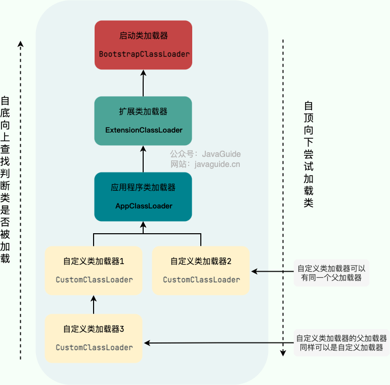

## 类加载器

-   类加载器是一个负责加载类的对象，用于实现类加载过程中的加载这一步。
-   每个 Java 类都有一个引用指向加载它的 `ClassLoader`。
-   数组类不是通过 `ClassLoader` 创建的（数组类没有对应的二进制字节流），是由 JVM 直接生成的。

```java
class Class<T> {
  ...
  private final ClassLoader classLoader;
  @CallerSensitive
  public ClassLoader getClassLoader() {
     //...
  }
  ...
}
```

简单来说，**类加载器的主要作用就是加载 Java 类的字节码（ `.class` 文件）到 JVM 中（在内存中生成一个代表该类的 `Class` 对象）。** 字节码可以是 Java 源程序（`.java`文件）经过 `javac` 编译得来，也可以是通过工具动态生成或者通过网络下载得来。

其实除了加载类之外，类加载器还可以加载 Java 应用所需的资源如文本、图像、配置文件、视频等等文件资源。


## 双亲委派模型

双亲委派模型（Parent Delegation Model）是Java类加载器（ClassLoader）的一种工作机制，用于保证Java类的唯一性和安全性。该模型主要包括两个核心概念：双亲委派和负责委派。

1.  **双亲委派（Parent Delegation）**：
    -   根据双亲委派模型，当一个类加载器需要加载一个类时，它首先将加载请求委派给父类加载器，如果父类加载器能够完成加载，那么这个类加载器的任务就完成了；如果父类加载器无法完成加载，那么当前类加载器才会尝试加载这个类。这样一层一层的委派关系就形成了一个类加载器的层次结构。
2.  **负责委派（Responsibility Delegation）**：
    -   负责委派是指类加载器在接到加载请求后，首先尝试委派给父类加载器，只有在父类加载器无法完成加载时，才会尝试自己加载。这种机制保证了类加载器的唯一性和安全性，防止了同一个类被多个类加载器加载，从而导致类的冲突和安全漏洞。



双亲委派模型的工作流程如下：

1.  在类加载的时候，系统会首先判断当前类是否被加载过。已经被加载的类会直接返回，否则才会尝试加载（每个父类加载器都会走一遍这个流程）。
2.  类加载器在进行类加载的时候，它首先不会自己去尝试加载这个类，而是把这个请求委派给父类加载器去完成（调用父加载器 `loadClass()`方法来加载类）。这样的话，所有的请求最终都会传送到顶层的启动类加载器 `BootstrapClassLoader` 中。
3.  只有当父加载器反馈自己无法完成这个加载请求（它的搜索范围中没有找到所需的类）时，子加载器才会尝试自己去加载（调用自己的 `findClass()` 方法来加载类）。
4.  如果子类加载器也无法加载这个类，那么它会抛出一个 `ClassNotFoundException` 异常。

双亲委派模型的优点在于：

-   避免了类的重复加载，保证了类的唯一性和一致性。
-   避免了恶意类的加载，提高了系统的安全性。
-   可以根据需求自定义类加载器，实现不同的加载策略和类加载行为。

双亲委派模型在Java中起着至关重要的作用，保证了类加载器的层次结构和加载机制的安全性和稳定性。