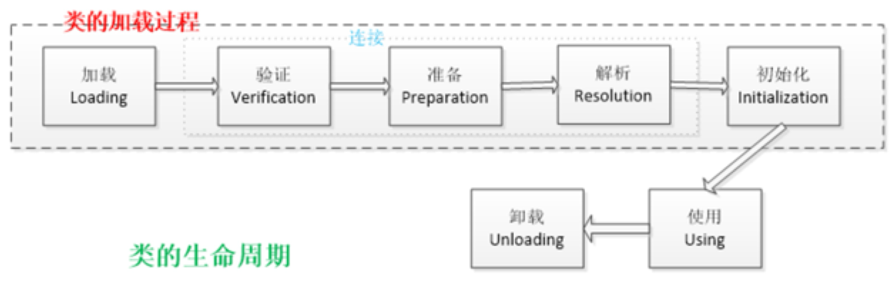

## 类的生命周期

一个类的生命周期包括加载（Loading）、链接（Linking）、初始化（Initialization）、使用（Usage）和卸载（Unloading）五个阶段。下面简要介绍这些阶段：

1.  **加载（Loading）**：
    -   <u>加载阶段是指通过类加载器将类的字节码加载到内存中，并生成对应的Class对象</u>。加载阶段完成后，类的字节码被存储在方法区（Java 8及之前）或者元空间（Java 8之后）中。
2.  **链接（Linking）**：
    -   链接阶段包括验证（Verification）、准备（Preparation）和解析（Resolution）三个步骤：
        -   **验证**：确保加载的类符合Java虚拟机规范，比如检查类文件格式的正确性、验证字节码等。
        -   **准备**：为类的静态变量分配内存，并设置默认初始值。
        -   **解析**：将符号引用转换为直接引用。
3.  **初始化（Initialization）**：
    -   初始化阶段是类加载过程中的最后一步，也是类生命周期中的关键阶段。在初始化阶段，<u>JVM会对类进行初始化，执行类的静态变量赋值和静态代码块等初始化操作</u>。如果一个类具有父类，则父类也会在子类初始化之前被初始化。在初始化阶段，类的字节码会被执行，静态变量会被赋予初始值，静态代码块会被执行。在初始化阶段中，有几种情况下类必须被初始化，例如：
        -   创建类的实例（new 关键字、通过反射等方式）；
        -   访问类的静态变量（被 final 修饰的静态变量除外）或者静态方法；
        -   使用类的静态成员（静态代码块、静态方法）。
4.  **使用（Usage）**：
    -   在初始化完成后，类就进入了使用阶段。在使用阶段，类的实例可以被创建，方法可以被调用，静态变量可以被访问等 (new)。
5.  **卸载（Unloading）**：
    -   当类不再被引用，且没有任何活动的实例时，类加载器可以选择卸载类。如果一个类被卸载，则它所占用的内存会被释放。

类加载的过程包括加载、链接和初始化三个步骤。加载阶段是通过类加载器将类的字节码加载到内存中；链接阶段是对类的字节码进行验证、准备和解析；初始化阶段是执行类的初始化操作，包括静态变量赋值和静态代码块的执行。在初始化阶段中，必须对类进行初始化的情况包括创建类的实例、访问类的静态变量或静态方法以及使用类的静态成员。