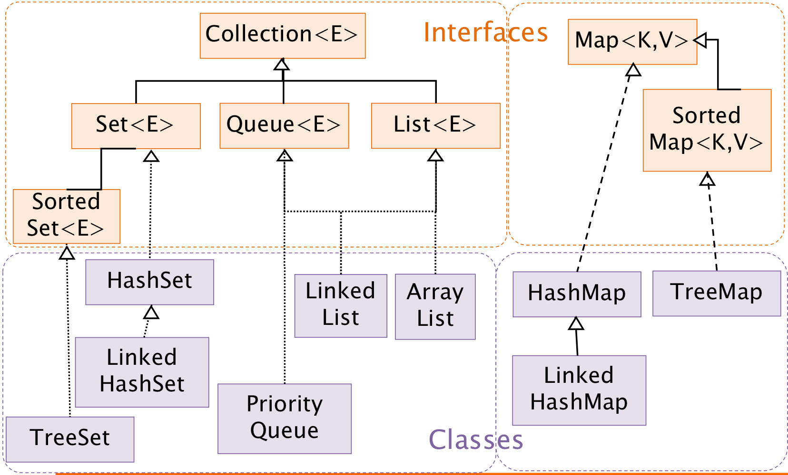

## Collection 包结构, 与 Collections 的区别

**Collection** 是集合类的上级接口, 子接口有 Set, List, LinkedList, ArrayList, Vector, Stack, Set

**Collections** 是集合类的一个帮助类, 它包含有各种有关集合操作的静态多态方法, 用于实现对各种集合的搜索, 排序, 线程化安全等操作; 此类不能实例化, 就像一个工具类, 服务于 Java 的 Collection 框架

## List, Set 和 Map 的三者区别

-   **List**：
    1.  有序性： List 是有序集合，可以按照元素插入的顺序来访问和遍历元素。
    2.  元素重复： List 允许元素重复，即可以包含相同的元素多次。
    3.  索引访问： List 支持通过索引来访问和修改元素。
    4.  常见实现类： 常见的 List 实现类包括 ArrayList 和 LinkedList。

-   **Set**：
    1.  无序性： Set 是无序集合，不保证元素的存储顺序，遍历元素的顺序可能与添加元素的顺序不同。
    2.  元素唯一性： Set 不允许包含重复的元素，即每个元素都是唯一的。
    3.  不支持索引： Set 不支持通过索引来访问和修改元素，因为元素没有固定的顺序。

-   **Map**：
    1.  键值对： Map 是键值对的集合，每个元素都包含一个键和一个值，键是唯一的。
    2.  键的唯一性： Map 中每个键都必须是唯一的，但值可以重复。
    3.  键的顺序： 不同的 Map 实现类可能有不同的特性，有的保证键的顺序，有的不保证。

## ArrayList 和 LinkedList 的区别

-   **ArrayList**：
    1.  内部实现： ArrayList 使用数组来存储元素，它可以动态增长和收缩数组的大小，以适应元素的添加和删除操作。
    2.  随机访问效率高：由于内部是数组实现，ArrayList 支持快速的随机访问，即通过索引来访问元素的效率很高。
    3.  插入和删除效率低：对于插入和删除操作，特别是在列表的中间位置，由于需要移动大量元素，所以效率相对较低。
    4.  适合随机访问：由于支持高效的随机访问，ArrayList 适合于需要频繁随机访问元素的场景。

-   **LinkedList**：
    1.  内部实现：LinkedList 使用双向链表来存储元素，每个节点包含对前后节点的引用。
    2.  插入和删除效率高：由于是链表实现，对于插入和删除操作，特别是在列表的中间位置，效率较高，因为只需要修改相邻节点的引用。
    3.  随机访问效率低：相比于 ArrayList，LinkedList 的随机访问效率较低，因为要遍历链表找到目标元素。
    4.  适合频繁插入和删除：由于插入和删除操作的高效性，LinkedList 适合于需要频繁插入和删除元素的场景。

## HashSet, LinkedHashSet, TreeSet 三者的异同

-   共同点：
    1.  唯一性：所有这三种集合都不允许包含重复的元素，每个元素都是唯一的。
    2.  无序性：HashSet 和 TreeSet 是无序集合，不保证元素的存储顺序；LinkedHashSet 保留元素插入的顺序，即它按照插入顺序维护元素。

 

-   不同点：
    1.  内部实现：
        -   HashSet 使用哈希表（hash table）来存储元素，因此添加、删除和查找元素的时间复杂度均为 O(1)，但不保证元素的顺序。
        -   LinkedHashSet 使用哈希表和链表来存储元素，它通过链表维护元素的插入顺序，因此在遍历集合时会按照插入顺序返回元素。
        -   TreeSet 使用红黑树（Red-Black tree）来存储元素，因此它会对元素进行排序，并且支持一系列的有序操作，例如获取最小值、最大值和范围查找。
    2.  性能：
        -   HashSet 的插入、删除和查找操作性能较高，但不保证元素的顺序。
        -   LinkedHashSet 的插入和删除操作性能略低于 HashSet，但在遍历时保持元素的插入顺序。
        -   TreeSet 的插入、删除和查找操作性能较 HashSet 和 LinkedHashSet 略低，但它会对元素进行排序，并且支持有序操作。
    3.  排序：
        -   TreeSet 是有序集合，它会对元素进行排序，因此可以方便地进行有序操作。
        -   HashSet 和 LinkedHashSet 是无序集合，不保证元素的顺序。
    4.  适用场景：
        -   如果需要高效的插入、删除和查找操作，并且不关心元素的顺序，则可以使用 HashSet。
        -   如果需要保持元素的插入顺序，并且能够较快地进行插入、删除和查找操作，则可以使用       LinkedHashSet。
        -   如果需要对元素进行排序，并且需要有序操作，则可以使用 TreeSet。

## HashMap 的长度为什么是 2 的幂次方

取余 (%) 操作中如果除数是 2 的幂次方, 则等价于与其除数减一的 AND(&) 操作 (也就是说 `hash % length == hash & (length - 1)` 的前提是 length 是 2 的 n 次方).

另外，使用长度为 2 的幂次方的数组长度还有一个优势，就是在进行哈希计算时，可以使用位运算来替代除法运算，从而提高计算效率。具体来说，取模运算可以转化为位与运算，而位与运算的计算速度通常比除法运算要快得多。

## HashMap 中的 Key 我们可以使用任何类作为 key 吗

如果我们想使用某个自定义类作为 HashMap 的 key, 那就需要注意一下几点:

*   如果类重写了 equals 方法, 它也应该重写 hashCode 方法
*   类的所有实例需要遵循与 equals 和 hashCode 相关的规则
*   如果一个类没有使用 equals, 那就不应该再 hashCode 中使用它
*   我们自定义 key 类的最佳实践是使之为**不可变的**, 这样 hashCode 值就可以被缓存起来, 拥有更好的性能; 不可变的类也可以确保 hashCode 和 equals 在未来不会改变, 这样就解决与可变相关的问题了

## HashMap, HashTable 和 ConcurrentHashMap 的区别

-   **HashMap**：
    1.  线程安全性：HashMap 是非线程安全的，不支持并发访问。多个线程同时访问 HashMap 可能会导致数据不一致或其他异常。
    2.  性能： 在单线程环境下，HashMap 的性能通常比 HashTable 和 ConcurrentHashMap 更好，因为它不需要进行同步控制。 

-   **HashTable**：
    1.  线程安全性：HashTable 是线程安全的，对所有的公共方法都进行了同步控制，因此可以安全地在多个线程之间共享。
    2.  性能：由于所有的方法都进行了同步控制，HashTable 的性能通常比 HashMap 要差，尤其是在高并发情况下。
    3.  遗留类：HashTable 是 JDK 1.0 引入的遗留类，现在已经不推荐使用，推荐使用 ConcurrentHashMap 替代。

-   **ConcurrentHashMap**：
    1.  线程安全性：ConcurrentHashMap 是线程安全的，使用了锁分段技术（lock striping）来实现并发访问，不同的段（segment）可以由不同的线程同时访问，因此能够在高并发情况下保持较好的性能。
    2.  性能：在高并发情况下，ConcurrentHashMap 的性能通常比 HashTable 要好，因为它采用了细粒度的锁，不会对整个哈希表进行同步控制。
    3.  可扩展性：ConcurrentHashMap 支持高并发访问，并且能够有效地扩展到多个 CPU 核心上，因此适合在多线程环境中使用。
    4.  并发迭代：ConcurrentHashMap 的迭代器是弱一致性的（weakly consistent），它允许在迭代期间对 Map 进行修改，但不保证迭代器一定能够访问到最新的修改。