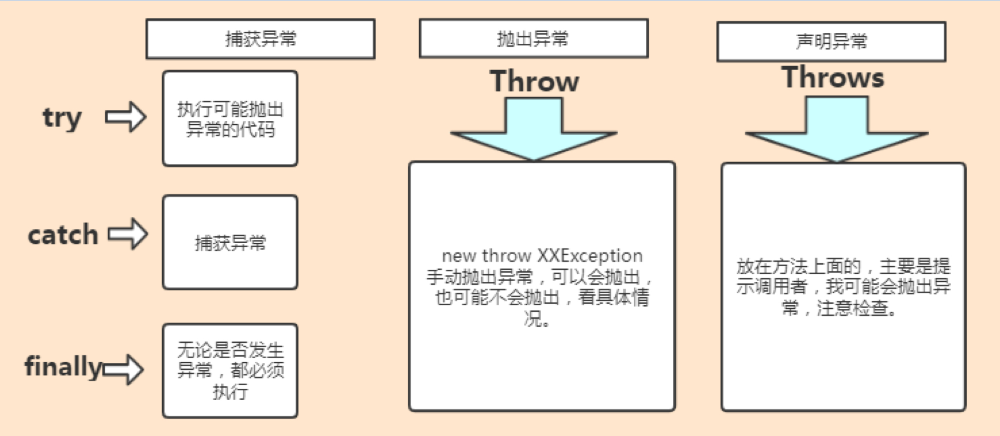

*   **检查异常（Checked Exception）**：这是一种在<u>编译时必须处理的异常，否则编译器会报错</u>。典型的例子包括I/O异常（IOException）和SQL异常（SQLException）。

*   **未检查异常（Unchecked Exception）**：这些异常通常是编程错误或者环境问题引起的，<u>编译器不要求强制处理</u>。


## Exception 和 Error 有什么区别？

在 Java 中，所有的异常都有一个共同的祖先 `java.lang` 包中的 `Throwable` 类。`Throwable` 类有两个重要的子类:

-   **`Exception`** :程序本身可以处理的异常，可以通过 `catch` 来进行捕获。`Exception` 又可以分为 Checked Exception (受检查异常，必须处理) 和 Unchecked Exception (不受检查异常，可以不处理)。
-   **`Error`**：`Error` 属于程序无法处理的错误 ，不建议通过`catch`捕获 。例如 Java 虚拟机运行错误（`Virtual MachineError`）、虚拟机内存不够错误(`OutOfMemoryError`)、类定义错误（`NoClassDefFoundError`）等 。这些异常发生时，Java 虚拟机（JVM）一般会选择线程终止。


## 说说你平时是怎么处理 Java 异常的

1.  **捕获异常：** 在可能抛出异常的代码块中使用 `try-catch` 语句捕获异常。这有助于防止异常向上传播到程序的其他部分，并提供更好的错误处理机制。

    ```java
    try {
        // 可能抛出异常的代码
    } catch (SomeException e) {
        // 处理异常的代码
    }
    ```

2.  **处理异常：** 处理异常时，我会根据具体情况采取适当的措施，比如记录日志、给用户提供友好的错误消息、尝试恢复程序的运行状态，或者抛出新的异常。

    ```java
    catch (SomeException e) {
        // 记录异常信息到日志
        logger.error("An error occurred: ", e);
        // 提供友好的错误消息给用户
        displayErrorMessage("An error occurred. Please try again later.");
    }
    ```

3.  **向上抛出异常：** 在某些情况下，我可能会选择不在当前层级处理异常，而是将异常向上层传播，让调用者或更高级别的代码来处理异常。

    ```java
    catch (SomeException e) {
        // 向上抛出异常
        throw e;
    }
    ```

4.  **使用finally块：** 在一些情况下，无论是否发生异常，我都需要执行一些清理工作，比如释放资源。这时，我会使用 `finally` 块来确保这些代码块一定会被执行。

    ```java
    try {
        // 可能抛出异常的代码
    } catch (SomeException e) {
        // 处理异常的代码
    } finally {
        // 执行清理工作
    }
    ```

5.  **使用异常链：** 在捕获异常时，如果需要将原始异常信息传递给上层调用者，我会使用异常链来将原始异常包装在新的异常中，并抛出。

    ```java
    catch (SomeException e) {
        // 将原始异常包装在新的异常中并抛出
        throw new CustomException("An error occurred while processing data.", e);
    }
    ```

