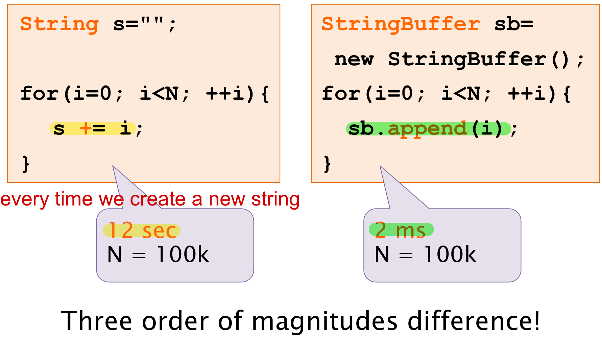

## String, StringBuffer, StringBuilder 的区别

1.  **String**：
    -   String 类是不可变的，一旦创建就无法修改其内容。
    -   每次对 String 类的方法进行操作时，都会创建一个新的 String 对象，因此频繁的字符串操作会产生大量的临时对象，造成内存开销。
    -   String 是线程安全的，因为它的不可变性，多个线程可以同时访问一个 String 对象而不会产生竞态条件。
2.  **StringBuffer**：
    -   StringBuffer 类是可变的，它的内容可以被修改。
    -   StringBuffer 的操作不会创建新的对象，而是直接在原对象上进行操作，因此它适用于频繁的字符串操作，效率较高。
    -   StringBuffer 是线程安全的，它的方法都使用了同步关键字，因此可以安全地被多个线程同时访问。
3.  **StringBuilder**：
    -   StringBuilder 类也是可变的，与 StringBuffer 类似，它的内容可以被修改。
    -   与 StringBuffer 不同的是，StringBuilder 不是线程安全的，它的方法没有使用同步关键字，因此在单线程环境下效率更高。
    -   StringBuilder 通常优先使用于单线程环境下的字符串操作，而 StringBuffer 适用于多线程环境下的字符串操作。

## 字符串拼接用“+” 还是 StringBuilder?

## 字符串常量池

**字符串常量池** 是 JVM 为了提升性能和减少内存消耗针对字符串（String 类）专门开辟的一块区域，主要目的是为了避免字符串的重复创建。

