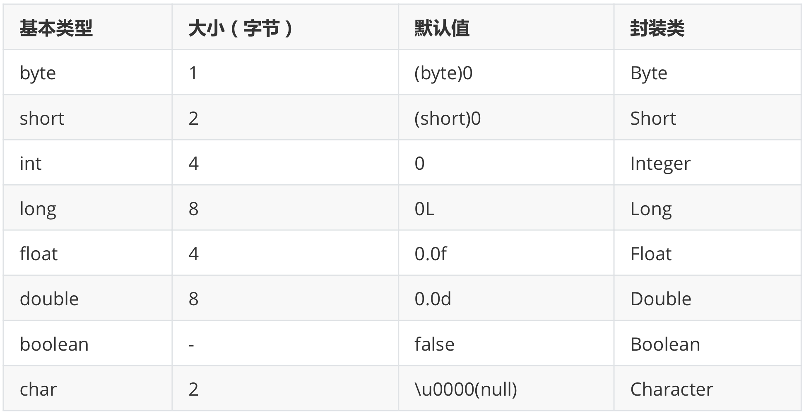

## 八种基本数据类型的大小, 以及他们的封装类




## Java 自动装箱与拆箱

-   **装箱**就是自动将 primitive type 转换为 wrapper class `(int --> Integer)`; 调用方法: Integer 的 valueOf(int) 方法

-   **拆箱**就是自动将 wrapper class 转换为 primitive type `(Integer --> int)`; 调用方法: Integer 的 intValue 方法

    

在 Java SE5 之前, 如果要生成一个数值为 10 的 Integer 对象, 必须这样进行:

```java
Integer i = new Integer(10); 
```

从 Java SE5 开始就提供了自动装箱的特性, 如果要生成一个数值为 10 的 Integer 对象, 只需要这样就可以:

```java
Integer i = 10;
```


## 重载和重写的区别

-   **重载 (Overload)**

    -   在一个类中, 同名的方法如果有不同的参数列表 (参数类型不同, 参数个数不同甚至是参数顺序不同) 则视为重载
    -   同时, 重载对返回类型没有要求, 可以相同也可以不同, 但不能通过返回类型是否相同来判断重载

    ```java
    class Car {
    	String color;
      // Same method name, different parameters pass
      void paint() {
        color = "white";
      }
      
      void paint(int i) {...}
      
      void paint(String newCol) {
        color = newCol;
      }
    }
    ```

*   重写 (Override)

    -   在子类中把父类本身有的方法重新写一遍; 子类继承了父类原有的方法, 但有时子类并不想原封不动的继承父类中的某个方法, 所以在方法名, 参数列表, 返回类型都相同的情况下, 对方法本身进行修改或者重写, 这就是重写
    -   注意子类函数的访问修饰权限不能少于父类 (`public > protected > default > private`)
    
    ```java
    class Employee{
    	String name;
      public void print() {
        System.out.println(name);
      }
    }
    
    class Manager extends Employee{
      private String managedUnit;
      
      @override
      public void print() {
        System.out.println(name + ", manages " + managedUnit);
      }
    }
    ```
    
    


​    
