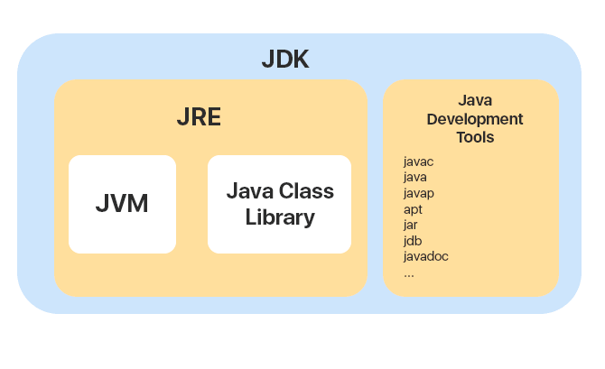
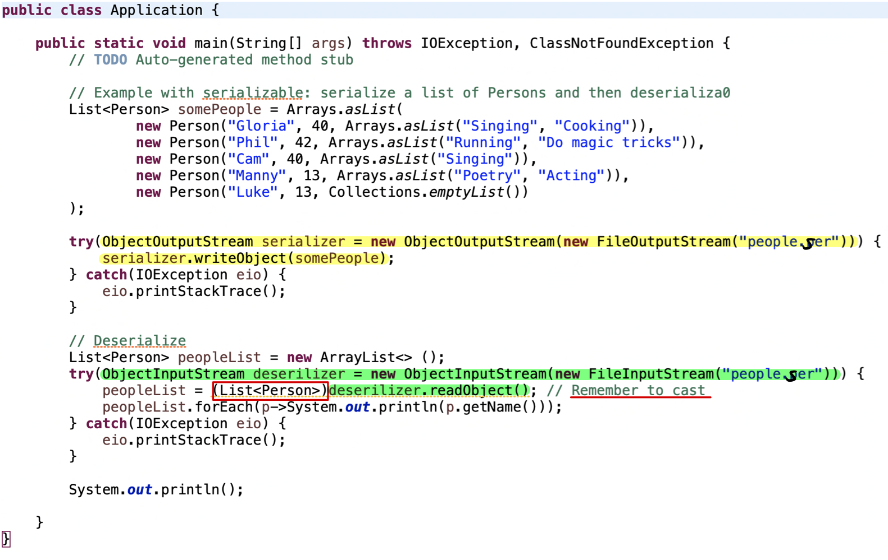
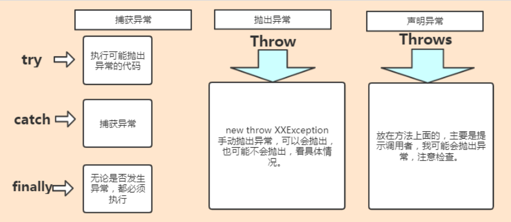

## Java 语言有哪些特点

1.  简单易学, 有丰富的类库
2.  面向对象 (Java 最重要的特性, 让程序耦合度更低, 内聚性更高)
3.  与平台无关性 (JVM 是 Java 跨平台使用的根本)
4.  可靠安全
5.  支持多线程


## 比较 JVM 和 JDK 以及 JRE

1.  **JVM（Java虚拟机）**：JVM是Java应用程序的运行时环境。它是Java平台的核心组件，负责在各种操作系统上执行Java字节码。JVM解释并执行Java字节码，并管理内存、垃圾回收和其他运行时任务。JVM的目标是提供与平台无关的执行环境，使Java程序能够在不同的平台上运行，只需在目标平台上安装适当版本的JVM即可。

2.  **JDK（Java开发工具包）**：JDK是Java开发人员用来开发Java应用程序的软件开发工具包。它包含了JVM、Java类库（如Java标准库）、编译器（javac）、调试器、开发工具等。JDK是面向开发者的，用于编写、编译和调试Java代码。

3.  **JRE（Java运行时环境）**：JRE是Java应用程序的运行时环境，它包含了JVM和Java类库，但没有开发工具。如果你只是想运行Java程序而不是进行开发，只需安装JRE即可。JRE提供了Java程序在计算机上执行所需的一切，但不包含用于编写、编译和调试代码的工具。

    

简而言之，JVM是Java程序运行的虚拟机，JDK是用于开发Java程序的工具包，而JRE是运行Java程序所需的环境。


## 为什么说 Java 语言“解释与编译并存”

Java语言被称为“解释与编译并存”，主要是因为它采用了混合的执行方式，既有编译也有解释的过程。这种混合方式是Java语言的独特特性，有助于提供平台无关性、高性能和灵活性。

1.  **编译**：Java源代码首先被编译成Java字节码，这是一种与平台无关的中间代码。编译器（javac）将Java源代码转换成字节码文件（.class文件），其中包含了与特定平台无关的指令集。
2.  **解释**：JVM（Java虚拟机）将Java字节码解释成本地机器代码，以便在特定平台上执行。JVM根据需要逐行解释字节码，并在运行时将其转换成机器码。这使得Java程序能够在任何安装了适当版本JVM的平台上运行。


## 八种基本数据类型的大小, 以及他们的封装类


## Java 创建对象有几种方式

1.  **使用new关键字：** 这是最常见的方式。通过使用`new`关键字，你可以调用类的构造函数来实例化一个对象。例如：

```java
MyClass obj = new MyClass();
```

1.  **通过反射：** Java的反射机制允许在运行时动态地获取类的信息并操作类或对象。使用反射，你可以通过类的完全限定名（Fully Qualified Name）来实例化对象。例如：

```java
Class<?> clazz = Class.forName("com.example.MyClass");
MyClass obj = (MyClass) clazz.newInstance();
```

1.  **通过对象的clone方法：** 如果一个类实现了`Cloneable`接口，你可以使用`clone()`方法来创建一个对象的副本。例如：

```java
MyClass obj1 = new MyClass();
MyClass obj2 = (MyClass) obj1.clone();
```

1.  **通过反序列化：** 对象的反序列化是将对象从字节流中重新构建出来。你可以使用Java的序列化和反序列化机制来创建对象。例如：

```java
ObjectInputStream in = new ObjectInputStream(new FileInputStream("object.ser"));
MyClass obj = (MyClass) in.readObject();
```


## Java 泛型，类型擦除

Java 的泛型是一种在编译时期进行类型检查的机制，但在**编译后会被擦除**，这就是所谓的类型擦除。这是为了保持与Java之前版本的向后兼容性，并且允许Java虚拟机在运行时执行泛型代码。

类型擦除意味着在编译后，泛型类型信息会被擦除，用实际的类型替代。例如，如果你有一个泛型类 `List<T>`，编译后的字节码中，所有的 `T` 都会被替换为 `Object`。这就是为什么在运行时你无法获得泛型的具体类型信息，因为它已经被擦除了。

尽管在运行时泛型信息被擦除了，但Java编译器会**插入必要的类型转换来保证类型安全性**。这就是为什么你可以在使用泛型时获得编译时期的类型检查。


## Java 自动装箱与拆箱

-   **装箱**就是自动将 primitive type 转换为 wrapper class `(int --> Integer)`; 调用方法: Integer 的 valueOf(int) 方法

-   **拆箱**就是自动将 wrapper class 转换为 primitive type `(Integer --> int)`; 调用方法: Integer 的 intValue 方法

在 Java SE5 之前, 如果要生成一个数值为 10 的 Integer 对象, 必须这样进行:

```java
Integer i = new Integer(10); 
```

从 Java SE5 开始就提供了自动装箱的特性, 如果要生成一个数值为 10 的 Integer 对象, 只需要这样就可以:

```java
Integer i = 10;
```


## 重载和重写的区别

-   重载 (Overload)

    -   在一个类中, 同名的方法如果有不同的参数列表 (参数类型不同, 参数个数不同甚至是参数顺序不同) 则视为重载

    -   同时, 重载对返回类型没有要求, 可以相同也可以不同, 但不能通过返回类型是否相同来判断重载

        

-   重写 (Override)

    -   在子类中把父类本身有的方法重新写一遍; 子类继承了父类原有的方法, 但有时子类并不想原封不动的继承父类中的某个方法, 所以在方法名, 参数列表, 返回类型都相同的情况下, 对方法本身进行修改或者重写, 这就是重写

    -   注意子类函数的访问修饰权限不能少于父类 (public > protected > default > private)

        


## equals 与 == 的区别

1.  `==` 操作符用于比较两个对象的引用是否指向相同的内存地址。换句话说，它检查的是对象的引用是否相同，而不是对象的内容是否相同。
2.  `equals()` 方法用于比较两个对象的内容是否相等。默认情况下，`equals()` 方法在 Object 类中是使用 `==` 运算符来比较两个对象的引用，因此它与 `==`  的作用相似。但是，`equals()` 方法可以被子类重写，以实现自定义的相等比较逻辑。
3.  通常情况下，当我们想要比较两个对象的内容时，应该使用 `equals()` 方法而不是 `==` 运算符。

1.  对于基本数据类型（如 int, double, char 等），`==`  运算符用于比较它们的值是否相等。但对于对象类型，`==`  运算符用于比较它们的引用是否相等。


## hashCode() 和 equals()

1.  **`equals()` 方法**：这个方法用于比较两个对象是否相等。默认情况下，它与 `==`  运算符的作用相同，即比较两个对象的引用是否相同。但是，它可以被子类重写以实现自定义的相等比较逻辑。通常情况下，如果你重写了 `equals()` 方法，就应该同时重写 `hashCode()` 方法。
2.  **`hashCode()` 方法**：这个方法返回对象的哈希码值，哈希码是对象根据其内容生成的一个整数。哈希码通常用于确定对象在哈希表等数据结构中的存储位置。**如果两个对象通过 `equals()` 方法被判断为相等，那么它们的哈希码应该是相同的**。因此，如果你重写了 `equals()` 方法，就应该同时重写 `hashCode()`  方法，以确保对象在使用哈希表的集合中的正确行为。

在Java中，HashSet 是基于哈希表实现的集合类，它使用了哈希算法来存储元素，并提供了快速的插入、删除和查找操作。当我们向 HashSet 中添加元素时，HashSet 会使用每个元素的哈希码来确定其在内部数组中的存储位置，从而实现快速的查找。

然而，如果我们不重写 hashCode() 方法，而仅仅重写了 equals() 方法，那么在使用 HashSet 等基于哈希表的集合类时，可能会出现问题。这是因为默认的 hashCode() 方法是根据对象的内存地址生成的，如果两个对象的内存地址不同，它们的哈希码也会不同，即使它们的内容相同。这样就会导致相等的对象被视为不同的对象，从而影响 HashSet 的正确行为。


## 深拷贝和浅拷贝的区别

*   **浅拷贝（Shallow Copy**）：

    -   浅拷贝是指在复制过程中，只复制对象本身，而不复制对象内部的引用类型成员变量所指向的对象。也就是说，新对象与原对象共享同一组内部对象的引用。

    -   <u>因此，如果修改了原对象内部的引用类型成员变量所指向的对象，那么新对象的对应成员变量也会受到影响。</u>

    -   浅拷贝通常通过对象的 clone() 方法来实现，或者通过复制构造函数等方式。

*   **深拷贝（Deep Copy）**：

    -   深拷贝是指在复制过程中，不仅复制对象本身，还会递归复制对象内部的所有引用类型成员变量所指向的对象。也就是说，新对象与原对象完全独立，不共享任何内部对象。
    -   <u>因此，即使修改了原对象内部的引用类型成员变量所指向的对象，新对象的对应成员变量也不会受到影响。</u>
    -   深拷贝通常需要自定义实现，可以通过对象序列化与反序列化、手动递归复制对象的方式来实现。

    **总的来说，浅拷贝只复制对象本身，而深拷贝则递归地复制对象的所有引用类型成员变量所指向的对象。深拷贝生成的新对象与原对象完全独立，不共享任何内部对象，而浅拷贝生成的新对象可能与原对象共享一些内部对象。**


## 面向过程和面向对象的区别

-   面向过程: 是分析解决问题的步骤, 然后用函数把这些步骤一步一步地实现, 然后在使用的时候一一调用即可; 性能较高, 所以单片机, 嵌入式开发等一般采用面向过程开发

-   面向对象: 是把构成问题的事务分解成各个对象, 而建立对象的目的也不是为了完成一个个步骤, 而是为了描述某个事物在解决整个问题的过程中所发生的行为; 面向对象有封装, 继承, 多态的特性, 所以易维护, 易复用, 易拓展. 可以设计出低耦合的系统; 但是从性能上来说, 比面向过程要低


## 面向对象的三大特性

1.  **封装（Encapsulation）**：

    -   封装是指将数据和操作数据的方法封装在一个单元（类）中，对外部隐藏对象的内部细节，只暴露必要的接口供外部访问。
    -   封装可以保护对象的状态，防止外部直接访问和修改对象的内部数据，从而提高代码的安全性和可靠性。
    -   通过封装，对象的内部实现可以独立于外部的变化，提高了代码的可维护性和灵活性。

2.  **继承（Inheritance）**：

    -   继承是指一个类（子类）可以从另一个类（父类或基类）继承属性和方法，以便于共享已有代码并扩展功能。
    -   子类可以继承父类的公共属性和方法，并可以重写父类的方法或定义自己的新方法，从而实现代码的重用和扩展。
    -   继承可以建立类之间的层次结构，使代码更加组织化和易于理解。

3.  **多态（Polymorphism）**：

    -   多态是指同一个方法调用在不同对象上有不同的行为。在面向对象编程中，多态通常表现为父类类型的引用变量可以指向子类类型的对象，并调用子类重写的方法。

    -   多态提高了代码的灵活性和可扩展性，使得代码更加通用和易于维护。

    -   多态分为编译时多态（静态多态）和运行时多态（动态多态）。编译时多态是指方法重载，根据方法参数的静态类型决定调用哪个方法；运行时多态是指方法重写，根据对象的实际类型决定调用哪个方法。

        


## 成员变量与局部变量的区别

1.  **定义位置**：
    -   成员变量是定义在类中的变量，可以位于类的任何位置，但通常放在类的顶部，作为类的属性。它们被声明在类中的方法之外，可以被整个类中的方法访问。
    -   局部变量是定义在方法、构造函数或块中的变量，它们只能在所属的方法、构造函数或块中被访问，超出其作用域范围就无法访问。
2.  **作用域**：
    -   成员变量的作用域是整个类，可以被类中的所有方法访问。
    -   局部变量的作用域仅限于所属的方法、构造函数或块，超出该范围就无法访问。
3.  **生命周期**：
    -   成员变量的生命周期取决于对象的生命周期，它们随着对象的创建而创建，随着对象的销毁而销毁。
    -   局部变量的生命周期取决于方法、构造函数或块的执行过程，它们在方法、构造函数或块执行时创建，在执行结束时被销毁。
4.  **默认值**：
    -   如果成员变量没有被显式初始化，它们会被赋予默认值，如数值类型默认为0，布尔类型默认为false，引用类型默认为null。
    -   局部变量不会被赋予默认值，必须显式初始化后才能使用。
5.  **访问修饰符**：
    -   可以使用访问修饰符（public、protected、private、default）来限制对成员变量的访问。
    -   局部变量不允许使用访问修饰符，因为它们的作用域已经由所属方法、构造函数或块限制了访问范围。


## String, StringBuffer, StringBuilder 的区别

1.  **String**：
    -   String 类是不可变的，一旦创建就无法修改其内容。
    -   每次对 String 类的方法进行操作时，都会创建一个新的 String 对象，因此频繁的字符串操作会产生大量的临时对象，造成内存开销。
    -   String 是线程安全的，因为它的不可变性，多个线程可以同时访问一个 String 对象而不会产生竞态条件。
2.  **StringBuffer**：
    -   StringBuffer 类是可变的，它的内容可以被修改。
    -   StringBuffer 的操作不会创建新的对象，而是直接在原对象上进行操作，因此它适用于频繁的字符串操作，效率较高。
    -   StringBuffer 是线程安全的，它的方法都使用了同步关键字，因此可以安全地被多个线程同时访问。
3.  **StringBuilder**：
    -   StringBuilder 类也是可变的，与 StringBuffer 类似，它的内容可以被修改。
    -   与 StringBuffer 不同的是，StringBuilder 不是线程安全的，它的方法没有使用同步关键字，因此在单线程环境下效率更高。
    -   StringBuilder 通常优先使用于单线程环境下的字符串操作，而 StringBuffer 适用于多线程环境下的字符串操作。


## 序列化和反序列化

-   **序列化（Serialization）**：序列化是将对象转换为字节流的过程，这些字节流可以被写入文件、数据库或通过网络传输。序列化的主要目的是将对象的状态保存下来，以便在稍后的时间点能够重新创建相同的对象。 

-   **反序列化（Deserialization）**：反序列化是将字节流转换回对象的过程。通过反序列化，可以从存储或网络传输中的字节流重新构建对象，并恢复其之前的状态。

Java 是一个广泛使用序列化和反序列化的语言，在 Java 中，可以通过实现 Serializable 接口来指示一个类是可序列化的。在 Java 中，你可以使用 ObjectOutputStream 来序列化对象，使用 ObjectInputStream 来反序列化对象。




## 获取一个类 Class 对象的方式有哪些

1.   **使用.class语法：** 在编译时可以使用 `.class` 语法获取类的Class对象。这是最简单的方式，适用于已知类的情况。

     ```java
     Class<?> clazz = MyClass.class;
     ```

2.   **调用对象的getClass()方法：** 如果已经有了一个类的实例，可以调用该实例的 `getClass()` 方法来获取其对应的Class对象。

     ```java
     MyClass obj = new MyClass();
     Class<?> clazz = obj.getClass();
     ```

3.   **使用Class.forName()方法：** 可以通过类的全限定名（Fully Qualified Name）来使用 `Class.forName()` 方法来获取Class对象。这种方式在编译时不需要知道类的具体名称，可以在运行时动态地加载类。

     ```java
     Class<?> clazz = Class.forName("com.example.MyClass");
     ```


## Java 创建对象有几种方式

1.  **使用new关键字：** 这是最常见的方式，通过 `new` 关键字调用类的构造函数来实例化一个对象。

    ```java
    MyClass obj = new MyClass();
    ```

2.  **通过反射机制：** 使用Java的反射机制可以在运行时动态地获取类的信息并实例化对象。通过反射，你可以通过类的全限定名来创建对象。

    ```java
    Class<?> clazz = Class.forName("com.example.MyClass");
    MyClass obj = (MyClass) clazz.newInstance();
    ```

3.  **通过克隆：** 如果一个类实现了 `Cloneable` 接口，你可以使用对象的 `clone()` 方法来创建对象的副本。

    ```java
    MyClass obj1 = new MyClass();
    MyClass obj2 = (MyClass) obj1.clone();
    ```

4.  **通过反序列化：** 对象的反序列化是将对象从字节流中重新构建出来。你可以使用Java的序列化和反序列化机制来创建对象。

    ```java
    ObjectInputStream in = new ObjectInputStream(new FileInputStream("object.ser"));
    MyClass obj = (MyClass) in.readObject();
    ```


## List, Set 和 Map 的三者区别

-   **List**：
    1.  有序性： List 是有序集合，可以按照元素插入的顺序来访问和遍历元素。
    2.  元素重复： List 允许元素重复，即可以包含相同的元素多次。
    3.  索引访问： List 支持通过索引来访问和修改元素。
    4.  常见实现类： 常见的 List 实现类包括 ArrayList 和 LinkedList。

-   **Set**：
    1.  无序性： Set 是无序集合，不保证元素的存储顺序，遍历元素的顺序可能与添加元素的顺序不同。
    2.  元素唯一性： Set 不允许包含重复的元素，即每个元素都是唯一的。
    3.  不支持索引： Set 不支持通过索引来访问和修改元素，因为元素没有固定的顺序。

-   **Map**：
    1.  键值对： Map 是键值对的集合，每个元素都包含一个键和一个值，键是唯一的。
    2.  键的唯一性： Map 中每个键都必须是唯一的，但值可以重复。
    3.  键的顺序： 不同的 Map 实现类可能有不同的特性，有的保证键的顺序，有的不保证。


## ArrayList 和 LinkedList 的区别

-   **ArrayList**：
    1.  内部实现： ArrayList 使用数组来存储元素，它可以动态增长和收缩数组的大小，以适应元素的添加和删除操作。
    2.  随机访问效率高：由于内部是数组实现，ArrayList 支持快速的随机访问，即通过索引来访问元素的效率很高。
    3.  插入和删除效率低：对于插入和删除操作，特别是在列表的中间位置，由于需要移动大量元素，所以效率相对较低。
    4.  适合随机访问：由于支持高效的随机访问，ArrayList 适合于需要频繁随机访问元素的场景。

-   **LinkedList**：
    1.  内部实现：LinkedList 使用双向链表来存储元素，每个节点包含对前后节点的引用。
    2.  插入和删除效率高：由于是链表实现，对于插入和删除操作，特别是在列表的中间位置，效率较高，因为只需要修改相邻节点的引用。
    3.  随机访问效率低：相比于 ArrayList，LinkedList 的随机访问效率较低，因为要遍历链表找到目标元素。
    4.  适合频繁插入和删除：由于插入和删除操作的高效性，LinkedList 适合于需要频繁插入和删除元素的场景。


## HashSet, LinkedHashSet, TreeSet 三者的异同

-   共同点：
    1.  唯一性：所有这三种集合都不允许包含重复的元素，每个元素都是唯一的。
    2.  无序性：HashSet 和 TreeSet 是无序集合，不保证元素的存储顺序；LinkedHashSet 保留元素插入的顺序，即它按照插入顺序维护元素。

 

-   不同点：
    1.  内部实现：
        -   HashSet 使用哈希表（hash table）来存储元素，因此添加、删除和查找元素的时间复杂度均为 O(1)，但不保证元素的顺序。
        -   LinkedHashSet 使用哈希表和链表来存储元素，它通过链表维护元素的插入顺序，因此在遍历集合时会按照插入顺序返回元素。
        -   TreeSet 使用红黑树（Red-Black tree）来存储元素，因此它会对元素进行排序，并且支持一系列的有序操作，例如获取最小值、最大值和范围查找。
    2.  性能：
        -   HashSet 的插入、删除和查找操作性能较高，但不保证元素的顺序。
        -   LinkedHashSet 的插入和删除操作性能略低于 HashSet，但在遍历时保持元素的插入顺序。
        -   TreeSet 的插入、删除和查找操作性能较 HashSet 和 LinkedHashSet 略低，但它会对元素进行排序，并且支持有序操作。
    3.  排序：
        -   TreeSet 是有序集合，它会对元素进行排序，因此可以方便地进行有序操作。
        -   HashSet 和 LinkedHashSet 是无序集合，不保证元素的顺序。
    4.  适用场景：
        -   如果需要高效的插入、删除和查找操作，并且不关心元素的顺序，则可以使用 HashSet。
        -   如果需要保持元素的插入顺序，并且能够较快地进行插入、删除和查找操作，则可以使用       LinkedHashSet。
        -   如果需要对元素进行排序，并且需要有序操作，则可以使用 TreeSet。


## HashMap, HashTable 和 ConcurrentHashMap 的区别

-   **HashMap**：
    1.  线程安全性：HashMap 是非线程安全的，不支持并发访问。多个线程同时访问 HashMap 可能会导致数据不一致或其他异常。
    2.  性能： 在单线程环境下，HashMap 的性能通常比 HashTable 和 ConcurrentHashMap 更好，因为它不需要进行同步控制。 

-   **HashTable**：
    1.  线程安全性：HashTable 是线程安全的，对所有的公共方法都进行了同步控制，因此可以安全地在多个线程之间共享。
    2.  性能：由于所有的方法都进行了同步控制，HashTable 的性能通常比 HashMap 要差，尤其是在高并发情况下。
    3.  遗留类：HashTable 是 JDK 1.0 引入的遗留类，现在已经不推荐使用，推荐使用 ConcurrentHashMap 替代。

-   **ConcurrentHashMap**：
    1.  线程安全性：ConcurrentHashMap 是线程安全的，使用了锁分段技术（lock striping）来实现并发访问，不同的段（segment）可以由不同的线程同时访问，因此能够在高并发情况下保持较好的性能。
    2.  性能：在高并发情况下，ConcurrentHashMap 的性能通常比 HashTable 要好，因为它采用了细粒度的锁，不会对整个哈希表进行同步控制。
    3.  可扩展性：ConcurrentHashMap 支持高并发访问，并且能够有效地扩展到多个 CPU 核心上，因此适合在多线程环境中使用。
    4.  并发迭代：ConcurrentHashMap 的迭代器是弱一致性的（weakly consistent），它允许在迭代期间对 Map 进行修改，但不保证迭代器一定能够访问到最新的修改。


## 红黑树有哪几个特征

*   每个节点是黑色或者红色
*   根节点是黑色
*   每个叶子节点都是黑色 (指向空的叶子节点)
*   如果一个叶子节点是红色, 那么其子节点必须都是黑色的
*   从一个节点到该节点的子孙节点的所有路径上包含相同数目的黑节点


## HashMap 的长度为什么是 2 的幂次方

取余 (%) 操作中如果除数是 2 的幂次方, 则等价于与其除数减一的 AND(&) 操作 (也就是说 `hash % length == hash & (length - 1)` 的前提是 length 是 2 的 n 次方).

另外，使用长度为 2 的幂次方的数组长度还有一个优势，就是在进行哈希计算时，可以使用位运算来替代除法运算，从而提高计算效率。具体来说，取模运算可以转化为位与运算，而位与运算的计算速度通常比除法运算要快得多。


## HashMap 中的 Key 我们可以使用任何类作为 key 吗

如果我们想使用某个自定义类作为 HashMap 的 key, 那就需要注意一下几点:

*   如果类重写了 equals 方法, 它也应该重写 hashCode 方法
*   类的所有实例需要遵循与 equals 和 hashCode 相关的规则
*   如果一个类没有使用 equals, 那就不应该再 hashCode 中使用它
*   我们自定义 key 类的最佳实践是使之为**不可变的**, 这样 hashCode 值就可以被缓存起来, 拥有更好的性能; 不可变的类也可以确保 hashCode 和 equals 在未来不会改变, 这样就解决与可变相关的问题了


## Collection 包结构, 与 Collections 的区别

**Collection** 是集合类的上级接口, 子接口有 Set, List, LinkedList, ArrayList, Vector, Stack, Set

**Collections** 是集合类的一个帮助类, 它包含有各种有关集合操作的静态多态方法, 用于实现对各种集合的搜索, 排序, 线程化安全等操作; 此类不能实例化, 就像一个工具类, 服务于 Java 的 Collection 框架


## instanceof 关键字的作用

instanceof 严格来说是 Java 中的一个双目运算符, 用来测试一个对象是否为一个类的实例


以此为例, instanceof 可以用于一个对象是否能 down-cast 的判断


## 异常可以分为哪几种

1.  运行时异常（Runtime Exception）：这些异常在程序执行期间出现，通常是由于程序错误或逻辑错误引起的。例如，空指针异常（NullPointerException）和数组越界异常（ArrayIndexOutOfBoundsException）就属于这一类。
2.  编译时异常（Compile-time Exception）：这些异常在编译代码时就能被检测到，需要在代码中显式地处理或声明。例如，文件找不到异常（FileNotFoundException）就是一种编译时异常。
3.  检查异常（Checked Exception）：这是一种在编译时必须处理的异常，否则编译器会报错。典型的例子包括I/O异常（IOException）和SQL异常（SQLException）。
4.  未检查异常（Unchecked Exception）：这些异常通常是编程错误或者环境问题引起的，编译器不要求强制处理。这类异常包括运行时异常和错误（Error）。
5.  错误（Error）：这是一种比较严重的问题，通常表示虚拟机本身出现了问题，而不是程序代码。例如，内存溢出错误（OutOfMemoryError）就属于这一类。


## 说说你平时是怎么处理 Java 异常的

1.  **捕获异常：** 在可能抛出异常的代码块中使用 `try-catch` 语句捕获异常。这有助于防止异常向上传播到程序的其他部分，并提供更好的错误处理机制。

    ```java
    try {
        // 可能抛出异常的代码
    } catch (SomeException e) {
        // 处理异常的代码
    }
    ```

2.  **处理异常：** 处理异常时，我会根据具体情况采取适当的措施，比如记录日志、给用户提供友好的错误消息、尝试恢复程序的运行状态，或者抛出新的异常。

    ```java
    catch (SomeException e) {
        // 记录异常信息到日志
        logger.error("An error occurred: ", e);
        // 提供友好的错误消息给用户
        displayErrorMessage("An error occurred. Please try again later.");
    }
    ```

3.  **向上抛出异常：** 在某些情况下，我可能会选择不在当前层级处理异常，而是将异常向上层传播，让调用者或更高级别的代码来处理异常。

    ```java
    catch (SomeException e) {
        // 向上抛出异常
        throw e;
    }
    ```

4.  **使用finally块：** 在一些情况下，无论是否发生异常，我都需要执行一些清理工作，比如释放资源。这时，我会使用 `finally` 块来确保这些代码块一定会被执行。

    ```java
    try {
        // 可能抛出异常的代码
    } catch (SomeException e) {
        // 处理异常的代码
    } finally {
        // 执行清理工作
    }
    ```

5.  **使用异常链：** 在捕获异常时，如果需要将原始异常信息传递给上层调用者，我会使用异常链来将原始异常包装在新的异常中，并抛出。

    ```java
    catch (SomeException e) {
        // 将原始异常包装在新的异常中并抛出
        throw new CustomException("An error occurred while processing data.", e);
    }
    ```


