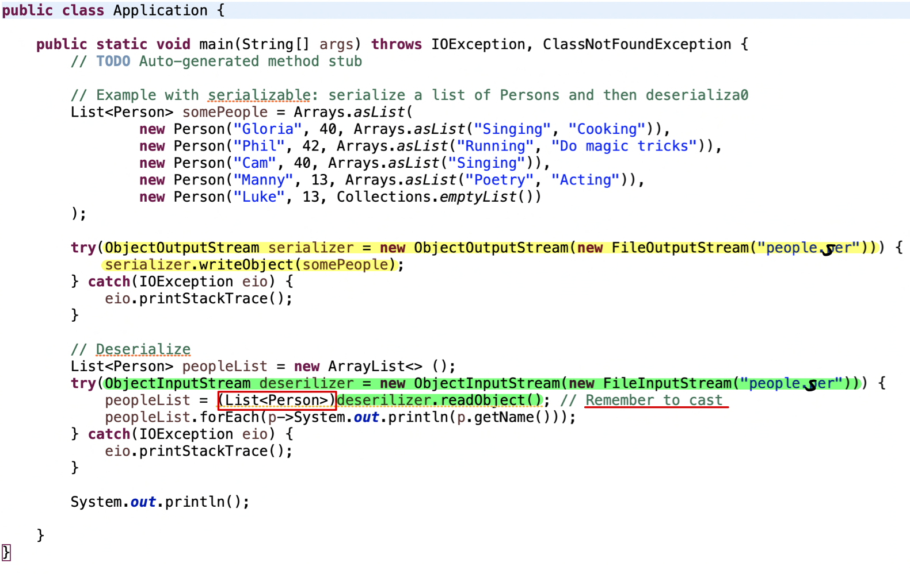

## 序列化和反序列化

-   **序列化（Serialization）**：序列化是将对象转换为字节流的过程，这些字节流可以被写入文件、数据库或通过网络传输。序列化的主要目的是将对象的状态保存下来，以便在稍后的时间点能够重新创建相同的对象。 

-   **反序列化（Deserialization）**：反序列化是将字节流转换回对象的过程。通过反序列化，可以从存储或网络传输中的字节流重新构建对象，并恢复其之前的状态。

Java 是一个广泛使用序列化和反序列化的语言，在 Java 中，可以通过实现 Serializable 接口来指示一个类是可序列化的。在 Java 中，你可以使用 ObjectOutputStream 来序列化对象，使用 ObjectInputStream 来反序列化对象。

