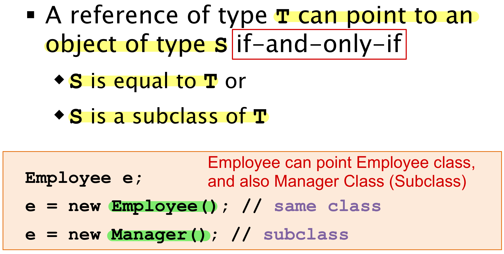

## 面向过程和面向对象的区别

-   **面向过程**: 是分析解决问题的步骤, 然后用函数把这些步骤一步一步地实现, 然后在使用的时候一一调用即可; 性能较高, 所以单片机, 嵌入式开发等一般采用面向过程开发

-   **面向对象**: 是把构成问题的事务分解成各个对象, 而建立对象的目的也不是为了完成一个个步骤, 而是为了描述某个事物在解决整个问题的过程中所发生的行为; 面向对象有封装, 继承, 多态的特性, 所以易维护, 易复用, 易拓展. 可以设计出低耦合的系统; 但是从性能上来说, 比面向过程要低


## Java 创建对象有几种方式

1.  **使用new关键字：** 这是最常见的方式。通过使用`new`关键字，你可以调用类的构造函数来实例化一个对象。例如：

```java
MyClass obj = new MyClass();
```

2.   **通过反射：** Java的反射机制允许在运行时动态地获取类的信息并操作类或对象。使用反射，你可以通过类的完全限定名（Fully Qualified Name）来实例化对象。例如：

```java
Class<?> clazz = Class.forName("com.example.MyClass");
MyClass obj = (MyClass) clazz.newInstance();
```

3.   **通过对象的clone方法：** 如果一个类实现了`Cloneable`接口，你可以使用`clone()`方法来创建一个对象的副本。例如：

```java
MyClass obj1 = new MyClass();
MyClass obj2 = (MyClass) obj1.clone();
```

4.   **通过反序列化：** 对象的反序列化是将对象从字节流中重新构建出来。你可以使用Java的序列化和反序列化机制来创建对象。例如：

```java
ObjectInputStream in = new ObjectInputStream(new FileInputStream("object.ser"));
MyClass obj = (MyClass) in.readObject();
```


## 获取一个类 Class 对象的方式有哪些

1.   **使用.class语法：** 在编译时可以使用 `.class` 语法获取类的Class对象。这是最简单的方式，适用于已知类的情况。

     ```java
     Class<?> clazz = MyClass.class;
     ```

2.   **调用对象的getClass()方法：** 如果已经有了一个类的实例，可以调用该实例的 `getClass()` 方法来获取其对应的Class对象。

     ```java
     MyClass obj = new MyClass();
     Class<?> clazz = obj.getClass();
     ```

3.   **使用Class.forName()方法：** 可以通过类的全限定名（Fully Qualified Name）来使用 `Class.forName()` 方法来获取Class对象。这种方式在编译时不需要知道类的具体名称，可以在运行时动态地加载类。

     ```java
     Class<?> clazz = Class.forName("com.example.MyClass");
     ```


## 对象的相等和引用相等的区别

-   对象的相等一般比较的是内存中存放的内容是否相等。
-   引用相等一般比较的是他们指向的内存地址是否相等。

这里举一个例子：

```java
String str1 = "hello";
String str2 = new String("hello");
String str3 = "hello";
// 使用 == 比较字符串的引用相等
System.out.println(str1 == str2);
System.out.println(str1 == str3);
// 使用 equals 方法比较字符串的相等
System.out.println(str1.equals(str2));
System.out.println(str1.equals(str3));
```

输出结果：

```java
false
true
true
true
```

从上面的代码输出结果可以看出：

-   `str1` 和 `str2` 不相等，而 `str1` 和 `str3` 相等。这是因为 `==` 运算符比较的是字符串的引用是否相等。
-   `str1`、 `str2`、`str3` 三者的内容都相等。这是因为`equals` 方法比较的是字符串的内容，即使这些字符串的对象引用不同，只要它们的内容相等，就认为它们是相等的。


## 面向对象的三大特性

### 封装（Encapsulation）

-   封装是指将数据和操作数据的方法封装在一个单元（类）中，对外部隐藏对象的内部细节，只暴露必要的接口供外部访问。
-   封装可以保护对象的状态，防止外部直接访问和修改对象的内部数据，从而提高代码的安全性和可靠性。
-   通过封装，对象的内部实现可以独立于外部的变化，提高了代码的可维护性和灵活性。

### 继承（Inheritance）

-   继承是指一个类（子类）可以从另一个类（父类或基类）继承属性和方法，以便于共享已有代码并扩展功能。
-   子类可以继承父类的公共属性和方法，并可以重写父类的方法或定义自己的新方法，从而实现代码的重用和扩展。
-   继承可以建立类之间的层次结构，使代码更加组织化和易于理解。

### 多态（Polymorphism）

-   多态是指同一个方法调用在不同对象上有不同的行为。在面向对象编程中，多态通常表现为父类类型的引用变量可以指向子类类型的对象，并调用子类重写的方法。

-   多态提高了代码的灵活性和可扩展性，使得代码更加通用和易于维护。

-   多态分为编译时多态（静态多态）和运行时多态（动态多态）。编译时多态是指方法重载，根据方法参数的静态类型决定调用哪个方法；运行时多态是指方法重写，根据对象的实际类型决定调用哪个方法。

    


## 接口 (Interface) 和抽象类 (Abstract Class) 有什么共同点和区别？

**共同点**：

-   都不能被实例化。
-   都可以包含抽象方法。
-   都可以有默认实现的方法（Java 8 可以用 `default` 关键字在接口中定义默认方法）。

**区别**：

-   接口主要用于对类的行为进行约束，你实现了某个接口就具有了对应的行为。抽象类主要用于代码复用，强调的是所属关系。
-   一个类只能继承一个类，但是可以实现多个接口。
-   接口中的成员变量只能是 `public static final` 类型的，不能被修改且必须有初始值，而抽象类的成员变量默认 default，可在子类中被重新定义，也可被重新赋值。


## 深拷贝和浅拷贝的区别

*   **浅拷贝（Shallow Copy**）：

    -   浅拷贝是指在复制过程中，只复制对象本身，而不复制对象内部的引用类型成员变量所指向的对象。也就是说，新对象与原对象共享同一组内部对象的引用。

    -   <u>因此，如果修改了原对象内部的引用类型成员变量所指向的对象，那么新对象的对应成员变量也会受到影响。</u>

    -   浅拷贝通常通过对象的 clone() 方法来实现，或者通过复制构造函数等方式。

*   **深拷贝（Deep Copy）**：

    -   深拷贝是指在复制过程中，不仅复制对象本身，还会递归复制对象内部的所有引用类型成员变量所指向的对象。也就是说，新对象与原对象完全独立，不共享任何内部对象。
    -   <u>因此，即使修改了原对象内部的引用类型成员变量所指向的对象，新对象的对应成员变量也不会受到影响。</u>
    -   深拷贝通常需要自定义实现，可以通过对象序列化与反序列化、手动递归复制对象的方式来实现。

    **总的来说，浅拷贝只复制对象本身，而深拷贝则递归地复制对象的所有引用类型成员变量所指向的对象。深拷贝生成的新对象与原对象完全独立，不共享任何内部对象，而浅拷贝生成的新对象可能与原对象共享一些内部对象。**


## instanceof 关键字的作用

instanceof 严格来说是 Java 中的一个双目运算符, <u>用来测试一个对象是否为一个类的实例</u>

```java
@Override
public boolean equals(Object o) {
  // Note: null instanceof X -> false
  if (!(o instanceof Employee)) {
    return false;
  }
  
  Employee other = (Employee) o;
  return this.name.equals(other.name);
}
```

以此为例, instanceof 可以用于一个对象是否能 down-cast 的判断