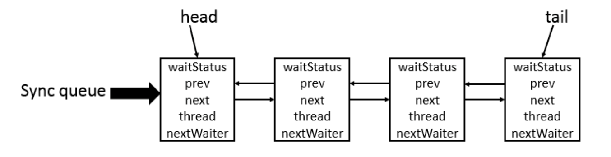
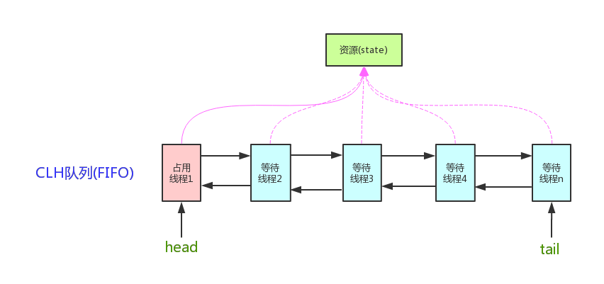

## AQS 是什么

AQS 是 AbstractQueuedSynchronizer 的缩写，是 Java 并发包中一个重要的同步器类，用于实现各种并发控制的基础框架。AQS 提供了一个可扩展的、高效的、通用的同步器框架，可以用于构建各种同步器，如锁、信号量、倒计时门栓等。

AQS 的设计思想是基于阻塞队列和双向链表，它通过维护一个等待线程的双向链表来管理并发访问共享资源的线程，通过状态字段来表示共享资源的状态，以及通过 CAS 操作来实现对共享资源的原子操作。

AQS 核心思想是，如果被请求的共享资源空闲，则将当前请求资源的线程设置为有效的工作线程，并且将共享资源设置为锁定状态。如果被请求的共享资源被占用，那么就需要一套线程阻塞等待以及被唤醒时锁分配的机制，这个机制 AQS 是用 **CLH 队列锁** 实现的，即将暂时获取不到锁的线程加入到队列中。

CLH(Craig,Landin,and Hagersten) 队列是一个虚拟的双向队列（虚拟的双向队列即不存在队列实例，仅存在结点之间的关联关系）。AQS 是将每条请求共享资源的线程封装成一个 CLH 锁队列的一个结点（Node）来实现锁的分配。在 CLH 同步队列中，一个节点表示一个线程，它保存着线程的引用（thread）、 当前节点在队列中的状态（waitStatus）、前驱节点（prev）、后继节点（next）。

CLH 队列结构如下图所示：

AQS(`AbstractQueuedSynchronizer`)的核心原理图如下：

AQS 主要包括以下几个重要的概念和方法：

1.  **状态（State）**： AQS 中的状态字段用于表示共享资源的状态，可以是一个简单的整数或者一个复杂的对象。不同的同步器可以根据自己的需求定义不同的状态，例如，<u>ReentrantLock 使用一个整数来表示锁的重入次数，Semaphore 使用一个整数来表示可用的许可数量等</u>。
2.  **队列（Queue）**： <u>AQS 中维护了一个等待线程的双向链表，通过这个队列来管理等待获取共享资源的线程。当一个线程请求获取共享资源时，如果资源不可用，线程就会被加入到等待队列中，直到资源可用时再唤醒线程</u>。
3.  **获取资源（Acquire）**： AQS 中定义了 `acquire` 方法来获取共享资源，不同的同步器可以根据自己的需求实现 acquire 方法的具体逻辑。<u>当一个线程请求获取共享资源时，如果资源可用，则直接获取资源并返回；如果资源不可用，则将当前线程加入到等待队列中，然后阻塞等待资源</u>。
4.  **释放资源（Release）**： AQS 中定义了 `release` 方法来释放共享资源，不同的同步器可以根据自己的需求实现 release 方法的具体逻辑。<u>当一个线程释放共享资源时，需要唤醒等待队列中的一个或多个线程，让它们竞争获取资源</u>。
5.  **条件变量（Condition）**： AQS 还提供了条件变量（Condition）的支持，可以通过条件变量来实现线程间的等待和通知机制。条件变量可以与 AQS 中的锁进行关联，从而实现灵活的线程同步。

以 `ReentrantLock` 为例，`state` 初始值为 0，表示未锁定状态。A 线程 `lock()` 时，会调用 `tryAcquire()` 独占该锁并将 `state+1` 。此后，其他线程再 `tryAcquire()` 时就会失败，直到 A 线程 `unlock()` 到 `state=`0（即释放锁）为止，其它线程才有机会获取该锁。当然，释放锁之前，A 线程自己是可以重复获取此锁的（`state` 会累加），这就是可重入的概念。但要注意，获取多少次就要释放多少次，这样才能保证 state 是能回到零态的。

再以 `CountDownLatch` 以例，任务分为 N 个子线程去执行，`state` 也初始化为 N（注意 N 要与线程个数一致）。这 N 个子线程是并行执行的，每个子线程执行完后`countDown()` 一次，state 会 CAS(Compare and Swap) 减 1。等到所有子线程都执行完后(即 `state=0` )，会 `unpark()` 主调用线程，然后主调用线程就会从 `await()` 函数返回，继续后余动作。

AQS 定义了对双向队列所有的操作, 而只开放了 `tryLock()` 和 `tryRelease()` 方法给方法者使用, 开发者可以根据自己的实现重写 `tryLock()` 和 `tryRelease()` 方法, 以实现自己的并发功能

## Semaphore 有什么用

Semaphore 就是一个信号量, 他的作用是**限制某段代码块的并发数**; Semaphore 有一个构造函数, 可以传入一个 int 型整数 n, 表示某段代码最多只有 n 个线程可以访问, 如果超出了 n, 那么请等待, 等到某个线程执行完毕这段代码块后, 下一个线程再进入;

由此可以看出如果 Semaphore 构造函数中传入的 int 型整数 n = 1, 相当于变成了一个 synchronized 了

## CountDownLatch 有什么用？

CountDownLatch 允许 `count` 个线程阻塞在一个地方，直至所有线程的任务都执行完毕。

CountDownLatch 是一次性的，计数器的值只能在构造方法中初始化一次，之后没有任何机制再次对其设置值，当 CountDownLatch 使用完毕后，它不能再次被使用。

## CyclicBarrier 有什么用？

CyclicBarrier 和 CountDownLatch 非常类似，它也可以实现线程间的技术等待，但是它的功能比 CountDownLatch 更加复杂和强大。主要应用场景和 CountDownLatch 类似。

>   CountDownLatch 的实现是基于 AQS 的，而 CycliBarrier 是基于 ReentrantLock (ReentrantLock 也属于 AQS 同步器)和 Condition 的。

CyclicBarrier 的字面意思是可循环使用（Cyclic）的屏障（Barrier）。它要做的事情是：让一组线程到达一个屏障（也可以叫同步点）时被阻塞，直到最后一个线程到达屏障时，屏障才会开门，所有被屏障拦截的线程才会继续干活。

## 说说 CyclicBarrier 和 CountDownLatch 的区别

两个看上去有点像的类, 都在 java.util.concurrent 下, 都可以用来表示代码运行到某个点上, 二者的区别在于:

1.   CyclicBarrier 的某个线程运行到某个点上之后, 该线程即停止运行, 直到所有的线程都到达了这个点, 所有线程才重新运行; CountDownLatch 则不是, 某线程运行到某个点上之后, 只是给某个数值 -1 而已, 该线程继续运行
2.   CyclicBarrier 只能唤起一个任务, CountDownLatch 可以唤起多个任务
3.   CyclicBarrier 可重用, CountDownLatch 不可重用, 计数值为 0 该 CountDownLatch 就不可再用了