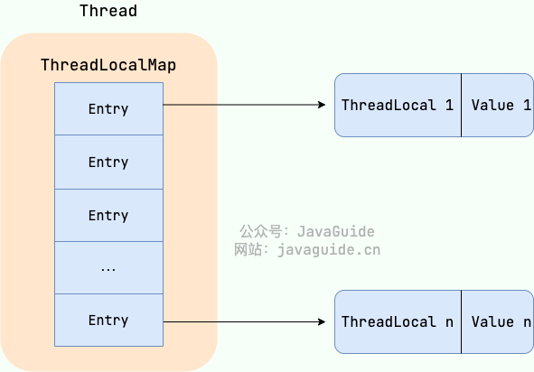

## ThreadLocal 有什么用？

通常情况下，我们创建的变量是可以被任何一个线程访问并修改的。**如果想实现每一个线程都有自己的专属本地变量该如何解决呢？**

JDK 中自带的`ThreadLocal`类正是为了解决这样的问题。 **`ThreadLocal`类主要解决的就是让每个线程绑定自己的值，可以将`ThreadLocal`类形象的比喻成存放数据的盒子，盒子中可以存储每个线程的私有数据。**

如果你创建了一个`ThreadLocal`变量，那么访问这个变t量的每个线程都会有这个变量的本地副本，这也是`ThreadLocal`变量名的由来。他们可以使用 `get()` 和 `set()` 方法来获取默认值或将其值更改为当前线程所存的副本的值，从而避免了线程安全问题。

再举个简单的例子：两个人去宝屋收集宝物，这两个共用一个袋子的话肯定会产生争执，但是给他们两个人每个人分配一个袋子的话就不会出现这样的问题。如果把这两个人比作线程的话，那么 ThreadLocal 就是用来避免这两个线程竞争的。

## ThreadLocal 原理

`ThreadLocal` 是 Java 中的一个线程封闭技术，它允许将数据与线程关联起来，使得每个线程都拥有自己独立的数据副本，从而实现了线程之间的数据隔离。`ThreadLocal` 的原理可以简单描述如下：

1.  **每个线程拥有自己的变量副本**： 当使用 `ThreadLocal` 创建一个变量时，每个线程都会拥有该变量的一个副本，这个副本存储在线程自己的 `ThreadLocalMap` 中。

2.  **数据存储在 ThreadLocalMap 中**： `ThreadLocal` 内部维护了一个 `ThreadLocalMap` 对象，用于存储线程本地变量。`ThreadLocalMap` 是一个以 `ThreadLocal` 对象为键、变量副本为值的哈希表，它保证了每个线程可以独立地访问自己的变量副本，而不会被其他线程访问到。

    

3.  **数据访问通过 ThreadLocal 对象**： 在使用 `ThreadLocal` 存取数据时，实际上是通过 `ThreadLocal` 对象来进行的。每个线程都可以通过 `ThreadLocal` 对象获取自己的变量副本，而不会受到其他线程的影响。

4.  **自动清理**： 在线程结束时，`ThreadLocalMap` 中的对应条目会被自动清理，从而避免了内存泄漏的问题。

但是这样还是会存在内存泄漏的问题, 假如 key 和 ThreadLocal 对象被回收后, entry 中就存在 key 为 null, 但是 value 有值的 Entry 对象, 但是永远没办法被访问到, 同样除非线程结束运行; 但是只要 ThreadLocal 使用恰当, 在使用完之后调用 `remove()` 方法删除 Entry 对象, 实际上是不会出现这个问题的

*   `ThreadLocal`和`Synchonized`：

    两者都用于解决多线程并发访问。但是`ThreadLocal`与`Synchronized`有本质的区别。<u>`Synchronized`用于线程间的数据共享，而`ThreadLocal`则用于线程间的数据隔离</u>。`Synchronized`是利用锁的机制，使变量或代码块在某一时该只能被一个线程访问。而`ThreadLocal`为每一个线程都提供了变量的副本，使得每个线程在某一时间访问到的并不是同一个对象，这样就隔离了多个线程对数据的数据共享。而`Synchronized`却正好相反，它用于在多个线程间通信时能够获得数据共享。