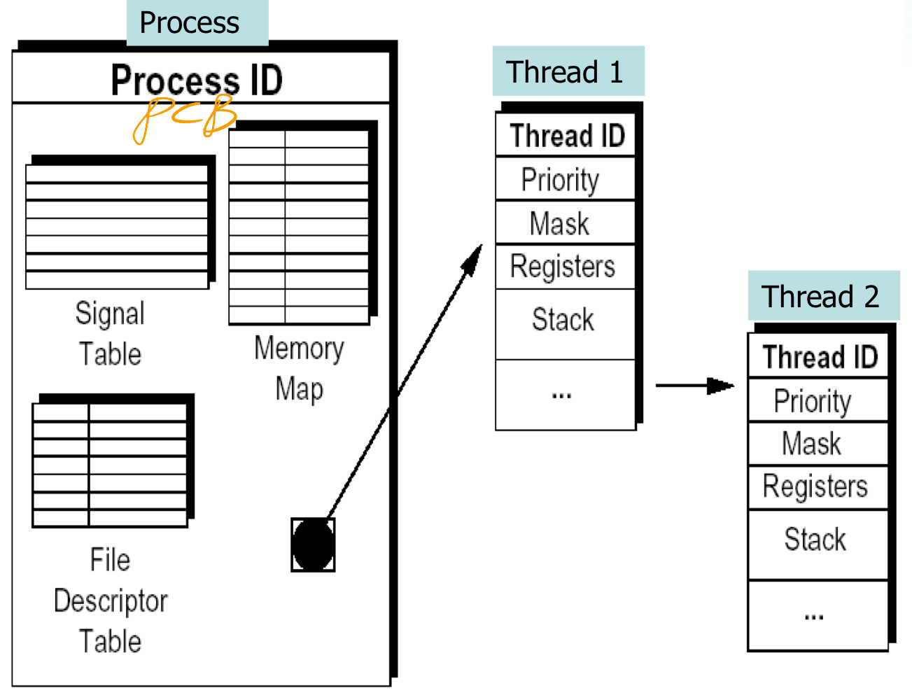
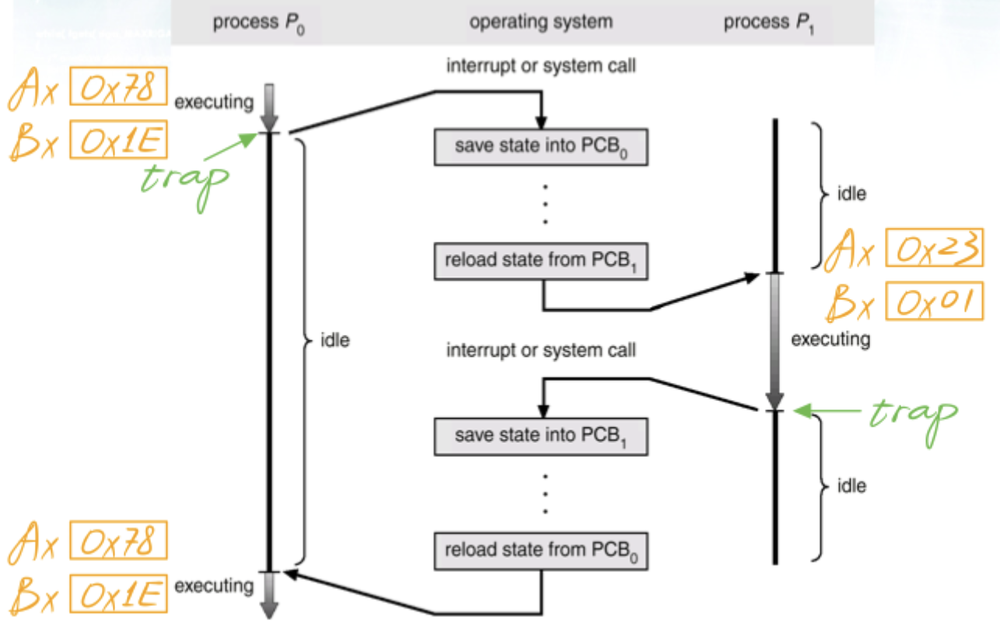
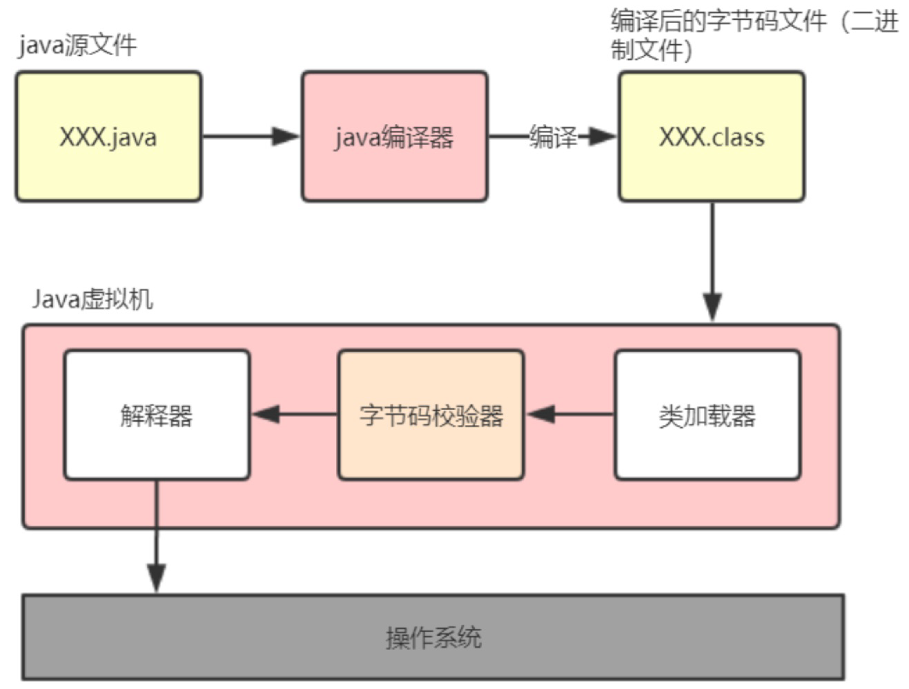
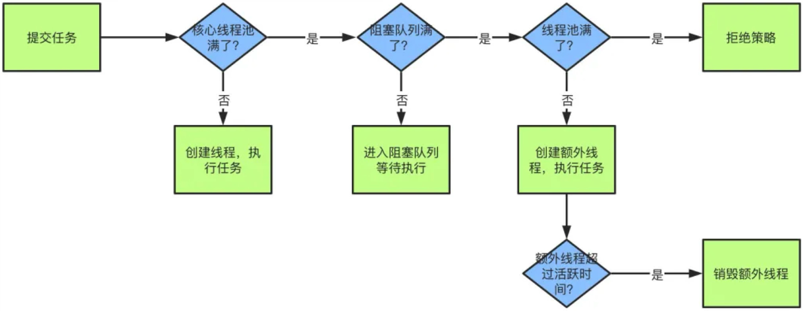
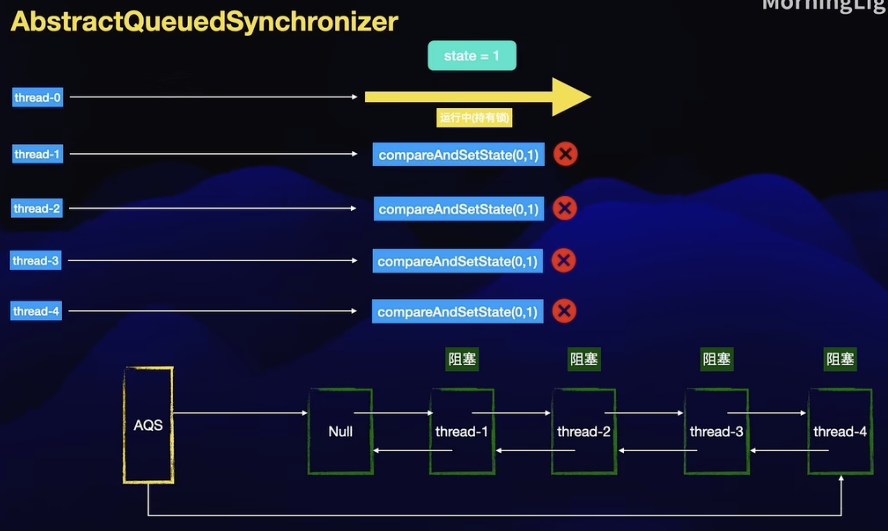
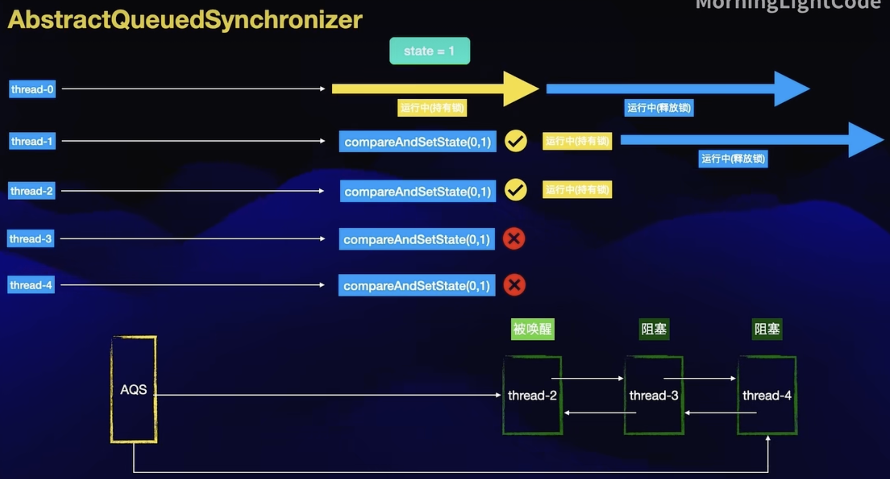
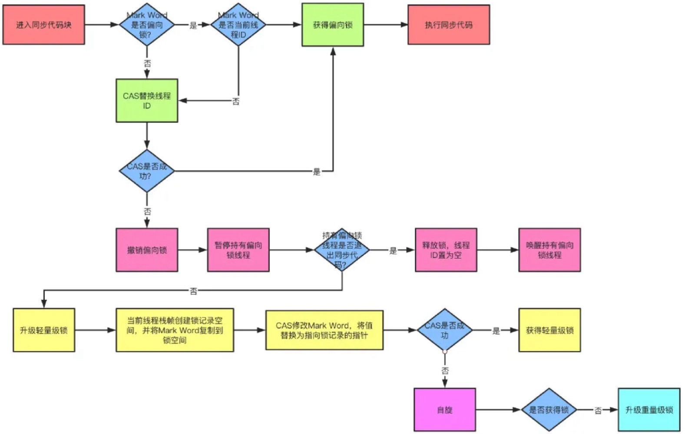

## 进程和线程的区别

-   进程 (Process) 是计算机中运行的程序的实例。每个进程都有自己的地址空间、内存、数据栈以及其他系统资源的副本。进程之间相互独立，彼此之间不共享内存或其他资源，要进行进程间通信通常需要通过特定的机制，比如管道、套接字等。每个进程都由操作系统调度，操作系统负责分配资源并协调进程之间的执行顺序。

-   线程 (Thread) 是在进程内部运行的一个执行单元，也可以说是进程内的子任务。同一个进程内的线程共享相同的内存空间和其他资源，因此线程之间的通信更加高效。线程由操作系统调度，但是线程的创建、销毁、切换等操作相比进程更加轻量级，因为线程间的切换不涉及到地址空间和其他资源的切换，所以开销相对较小。



-   下面是进程和线程的一些对比：
    -   **资源消耗**：进程比线程消耗的资源更多，因为每个进程都有自己的地址空间和系统资源的副本。线程共享相同的资源，所以比较节省资源。
    -   **通信和同步**：进程间的通信比较复杂，需要使用特定的机制，而线程间通信更加简单，因为它们共享相同的地址空间。但是线程间的同步可能会导致竞态条件等问题，需要额外的同步机制来解决。
    -   **并发性**：进程并发执行的基本单位，不同进程之间可以并行执行。线程是进程内部的执行单元，同一个进程内的多个线程可以并行执行，利用多核处理器的优势提高程序性能。
    -   **灵活性**：由于进程之间相互独立，进程可以更灵活地部署和管理。但是进程的创建、销毁等操作相对较慢。线程之间共享资源，因此可以更快速地创建、销毁和切换，提高了程序的响应速度。


## 创建线程的方式

*   继承 Thread 类:

    ```java
    class MyThread extends Thread {
        public void run() {
            // 线程执行的代码
            System.out.println("MyThread is running");
        }
    }
    
    public class Main {
        public static void main(String[] args) {
            // 创建并启动线程
            MyThread thread = new MyThread();
            thread.start();
        }
    }
    ```

*   实现 Runnable 接口: 

    ```java
    class MyRunnable implements Runnable {
        public void run() {
            // 线程执行的代码
            System.out.println("MyRunnable is running");
        }
    }
    
    public class Main {
        public static void main(String[] args) {
            // 创建线程对象
            MyRunnable myRunnable = new MyRunnable();
            // 创建线程
            Thread thread = new Thread(myRunnable);
            // 启动线程
            thread.start();
        }
    }
    ```

这两种方式都能创建线程，但一般推荐使用实现 Runnable 接口的方式，因为这样可以避免 Java 单继承的限制，使得类可以继承其他类。另外，通过实现 Runnable 接口，可以将线程的任务与线程本身分离开来，提高了代码的灵活性和可维护性。

**继承 Thread 类的优缺点：**

优点：

1.  **简单直观**：继承 Thread 类的方式比较直观，不需要额外定义一个类来实现 Runnable 接口。
2.  **便于访问线程相关方法**：通过继承 Thread 类，可以直接调用 Thread 类中定义的方法，如 `getName()`、`getId()` 等。

缺点：

1.  **不灵活**：Java 是单继承的语言，如果选择继承 Thread 类，就不能再继承其他类。这会限制程序的灵活性。
2.  **资源浪费**：每个线程都是一个独立的对象，创建多个线程会占用较多的系统资源，因此并不适合大规模并发。

**实现 Runnable 接口的优缺点**：

优点：

1.  **灵活性**：实现 Runnable 接口使得类可以继续继承其他类，从而增加了程序的灵活性。
2.  **资源节约**：Runnable 接口只是一个普通的接口，创建多个线程时共享同一个 Runnable 实现对象，减少了资源消耗。

缺点：

1.  **稍微复杂**：相对于继承 Thread 类，实现 Runnable 接口需要多定义一个类来实现 Runnable 接口，有一点额外的复杂性。
2.  **不便于访问线程相关方法**：通过实现 Runnable 接口，不能直接调用 Thread 类中的方法，需要通过创建 Thread 对象并传入 Runnable 对象来使用。


## 如何停止一个正在运行的线程

1.   **使用标志位**：在线程的 `run()` 方法中使用一个标志位来控制线程的执行，当标志位为 true 时，线程继续执行；当标志位为 false 时，线程退出循环，从而终止执行。

     ```java
     class MyThread extends Thread {
         private volatile boolean running = true;
     
         public void run() {
             while (running) {
                 // 线程执行的代码
             }
         }
     
         public void stopThread() {
             running = false;
         }
     }
     ```

2.   **使用 interrupt() 方法**：可以通过调用线程的 `interrupt()` 方法来中断线程的执行。被中断的线程会抛出 `InterruptedException` 异常，可以在捕获异常后执行清理工作并退出线程。

     ```java
     class MyThread extends Thread {
         public void run() {
             try {
                 while (!Thread.currentThread().isInterrupted()) {
                     // 线程执行的代码
                 }
             } catch (InterruptedException e) {
                 // 清理工作
             }
         }
     
         public void stopThread() {
             interrupt();
         }
     }
     ```

3.   **使用 Thread.stop() 方法（不推荐使用）**： Java 提供了 `stop()` 方法来立即停止一个线程，但该方法已被废弃，不推荐使用。因为它会导致线程被突然终止，可能会导致数据不一致或者资源泄露等问题。


## 什么是多线程中的上下文切换

多线程中的上下文切换是指在一个 CPU 上同时运行多个线程时，由于 CPU 时间片轮转调度策略或者线程阻塞等原因，导致 <u>CPU 需要暂时中断当前正在执行的线程，保存当前线程的执行状态（上下文），然后切换到另一个线程继续执行</u>，这个过程就是上下文切换。从这个角度看, 上下文切换有点像我们同时阅读几本书, 在来回切换书本的同时我们需要记住每本书当前读到的页码



在程序中, 上下文切换过程中的“页码”信息是保存在进程控制块 (PCB) 中的; PCB 还经常被称作“切换帧” (switchframe); “页码”信息会一直保存在 CPU 的内存中, 直到他们再次被使用

上下文切换是存储和恢复 CPU 状态的过程, 它使得线程执行能够从中断点恢复执行; 上下文切换是多任务操作系统和多线程环境的基本特征


## notify() 和 notifyAll() 有什么区别

`notify()` 和 `notifyAll()` 都是 Java 中用于线程间通信的方法，它们都属于 `Object` 类中的方法，并且用于唤醒因调用 `wait()` 方法而进入等待状态的线程。它们的区别在于：

1.  **notify() 方法**：
    -   `notify()` 方法用于唤醒在当前对象上调用 `wait()` 方法而进入等待状态的单个线程。
    -   如果有多个线程在对象上等待，调用 `notify()` 方法只会随机选择其中一个线程唤醒。
    -   唤醒的线程会尝试重新获得对象的锁，如果成功获得锁，则继续执行；否则，它会继续等待。
2.  **notifyAll() 方法**：
    -   `notifyAll()` 方法用于唤醒在当前对象上调用 `wait()` 方法而进入等待状态的所有线程。
    -   调用 `notifyAll()` 方法会唤醒所有等待的线程，让它们有机会去竞争对象的锁。
    -   被唤醒的线程会逐个尝试重新获得对象的锁，如果成功获得锁，则继续执行；否则，它会继续等待。

一般来说，在多线程编程中，如果需要唤醒所有等待线程时，应该使用 `notifyAll()` 方法，以确保所有线程都有机会去竞争对象的锁。而在某些特定情况下，如果只想唤醒一个等待线程，可以使用 `notify()` 方法。


## sleep() 和 wait() 有什么区别

1.  **作用对象**：
    -   `sleep()` 方法是 `Thread` 类的静态方法，用于让当前线程暂停执行一段时间，不释放对象锁。
    -   `wait()` 方法是 `Object` 类的方法，用于让当前线程进入等待状态，同时释放对象的锁，直到被其他线程调用 `notify()` 或 `notifyAll()` 方法唤醒。
2.  **调用方式**：
    -   `sleep()` 方法可以在任何地方调用，包括静态方法中，通过 `Thread.sleep()` 调用。
    -   `wait()` 方法只能在同步代码块或同步方法中调用，即必须先获得对象的锁，然后才能调用 `wait()` 方法。
3.  **释放锁**：
    -   在调用 `sleep()` 方法时，线程会暂停执行，但不会释放对象的锁。
    -   在调用 `wait()` 方法时，线程会进入等待状态，并释放对象的锁，其他线程可以获得对象的锁并修改对象状态。
4.  **使用场景**：
    -   `sleep()` 方法通常用于暂停执行一段时间，比如在定时任务中、模拟延迟等场景。
    -   `wait()` 方法通常用于线程间的协作，等待特定条件满足后再继续执行，比如在多线程生产者-消费者模式中等待生产者生产产品或消费者消费产品。


## volatile 是什么? 可以保证有序性

`volatile` 是 Java 中的一个关键字，用于修饰变量。它主要用于保证变量的可见性和禁止指令重排序，但并不能保证原子性。

1.  **可见性**：当一个变量被声明为 `volatile` 时，线程在修改该变量的值后，会<u>立即将该变量的最新值写回到主内存中，并且当其他线程需要读取该变量时，会从主内存中重新获取最新的值，而不是使用线程自己的缓存</u>。这样可以确保所有线程看到的都是同一个最新的值，从而保证了变量的可见性。

2.  **禁止指令重排序**：`volatile` 关键字还可以禁止编译器和处理器对被修饰变量进行指令重排序，保证了一定的有序性。<u>当程序执行到 volatile 变量的读操作或者写操作时, 在其前面的操作的更改肯定全部已经进行, 且结果已经对后面的操作可见; 在其后面的操作肯定还没有进行</u>; 这对于一些特定的多线程场景非常重要，比如双重检查锁定模式中使用 `volatile` 来确保线程安全。

    ```java
    x = 2;  // 语句1
    y = 0;  // 语句2
    flag = true;  // 语句3
    x = 4;  // 语句4
    y = -1;  // 语句5
    ```

    由于 flag 变量为 volatile 变量, 那么在进行指令重排序的过程中, 不会讲语句 3 放到语句1, 2 前面, 也不会将语句 3 放到语句 4, 5 的后面; 但是要注意语句 1 和 2 的顺序, 语句 4 和 5 的顺序是不做任何保证的

虽然 `volatile` 能够保证可见性和一定程度的有序性，<u>但它并不能保证原子性</u>。如果要保证原子性操作，需要使用 `synchronized` 关键字或者 `java.util.concurrent` 包中提供的原子类。

总之，`volatile` 关键字主要用于保证变量的可见性和禁止指令重排序，但并不能保证原子性。


## thread类中的 start() 和 run() 方法有什么区别

1.  **start() 方法**：
    -   `start()` 方法是 `Thread` 类的一个实例方法，用于启动一个新的线程并让该线程开始执行。
    -   <u>当调用 `start()` 方法时，系统会为该线程分配资源并调用线程的 `run()` 方法，使得线程处于就绪（Runnable）状态</u>。
    -   <u>在多线程编程中，通常通过调用 `start()` 方法来启动一个新线程，而不是直接调用 `run()` 方法</u>。
2.  **run() 方法**：
    -   `run()` 方法是 `Thread` 类的一个普通方法，用于定义线程的执行逻辑。
    -   当线程被启动后，系统会调用线程对象的 `run()` 方法来执行线程的任务。<u>如果直接调用 `run()` 方法，该方法会在当前线程中同步执行，并不会启动一个新的线程</u>。

总之, start() 方法被用来启动新创建的线程, 而且 start() 内部调用了 run() 方法, 这和直接调用 run() 方法的效果不一样; 当调用 run() 方法的时候, 只会是在原来的线程中调用, 没有新的线程启动, start() 方法才会启动新线程


## 为什么 wait(), notify() 和 notifyAll() 这些方法不在 thread 类里面

`wait()`、`notify()` 和 `notifyAll()` 方法是用于线程间通信的方法，它们确实并没有被直接放置在 `Thread` 类中。<u>这是因为这些方法的作用对象并不是线程本身，而是对象的监视器（也称为锁），因此它们被定义在 `Object` 类中</u>。这样设计的主要原因有以下几点：

1.  **与监视器相关**：`wait()`、`notify()` 和 `notifyAll()` 方法的作用对象是对象的监视器，而不是线程本身。在 Java 中，每个对象都有一个相关联的监视器，而线程只是通过获取对象的锁来与监视器交互。因此，将这些方法定义在 `Object` 类中更符合其作用对象的逻辑。
2.  **与同步机制相关**：`wait()`、`notify()` 和 `notifyAll()` 方法通常用于实现线程间的等待/通知机制，它们需要与同步关键字 `synchronized` 结合使用，而 `synchronized` 关键字是用于控制对对象的监视器的访问的。因此，将这些方法放置在 `Object` 类中更符合它们与同步机制的紧密关联。
3.  **多态性**：将这些方法定义在 `Object` 类中可以使得任意对象都可以调用这些方法，而不仅仅局限于 `Thread` 类的实例。

简单来说, 由于 `wait()`、`notify()` 和 `notifyAll()` 都是锁级别的操作, 所以把他们定义在 `Object` 类中, 因为锁属于对象


## 为什么 wait() 和 notify() 方法要在同步块中调用

`wait()` 和 `notify()` 方法通常要在同步块（或者同步方法）中调用的原因是确保线程对共享资源的访问是同步的，从而避免出现竞争条件、数据不一致或者死锁等问题。主要有以下几点原因：

1.  **获取对象的锁**：<u>在调用 `wait()` 和 `notify()` 方法之前，线程必须先获取对象的监视器（锁）</u>。同步块或者同步方法是获取对象锁的一种方式，确保线程在调用 `wait()` 和 `notify()` 方法时已经获取了对象的锁。
2.  **释放对象的锁**：<u>`wait()` 方法会释放对象的锁，使得其他线程可以获取锁并执行同步代码</u>。同样，`notify()` 方法也需要在同步块中调用，<u>确保在调用 `notify()` 方法时已经持有对象的锁，从而可以唤醒其他等待该锁的线程</u>。
3.  **防止竞争条件和数据不一致**：<u>如果不在同步块中调用 `wait()` 和 `notify()` 方法，可能会导致线程在调用这些方法时没有获取对象的锁</u>，从而导致其他线程在并发情况下修改了共享资源，造成竞争条件和数据不一致。
4.  **避免死锁**：<u>如果在没有获取对象锁的情况下调用 `wait()` 和 `notify()` 方法，可能会导致线程在等待或唤醒时出现死锁情况</u>，因为没有获取锁的线程无法执行 `wait()` 或 `notify()` 方法，而其他线程也无法唤醒它们。


## Java 中 interrupted 和 isInterrupted 方法的区别

1.  interrupted() 方法：

    -   <u>`interrupted()` 是 `Thread` 类的静态方法，用于检查当前线程的中断状态，并清除中断状态标志</u>。
    -   如果当前线程被中断（即调用过 `interrupt()` 方法），则 `interrupted()` 方法会返回 `true`；否则返回 `false`。
    -   调用 `interrupted()` 方法会清除当前线程的中断状态，即将中断状态标志重新置为 `false`。

    ```java
    // 检查并清除当前线程的中断状态
    boolean interrupted = Thread.interrupted();
    ```

2.  isInterrupted() 方法：

    -   <u>`isInterrupted()` 是 `Thread` 类的实例方法，用于检查调用该方法的线程的中断状态，但不清除中断状态标志</u>。
    -   如果调用线程被中断，则 `isInterrupted()` 方法返回 `true`；否则返回 `false`。
    -   调用 `isInterrupted()` 方法不会清除线程的中断状态，即不会改变中断状态标志的值。

    ```java
    // 检查当前线程的中断状态，不清除中断状态标志
    boolean isInterrupted = Thread.currentThread().isInterrupted();
    ```


## Java 中 synchronized 和 ReentrantLock 有什么不同

`Synchronized` 和 `ReentrantLock` 都是 Java 中用于实现线程同步的机制，它们都可以保证多个线程对共享资源的安全访问，但在实现和使用上有一些不同之处：

1.  **性能**：
    -   <u>在低并发的情况下，`synchronized` 的性能通常比较好</u>，因为它是 JVM 层面的内置语言特性，在锁的申请和释放上有很多优化。
    -   <u>在高并发的情况下，`ReentrantLock` 的性能可能会比较好</u>，因为它提供了更多的功能和灵活性，并且可以通过手动控制锁的申请和释放来优化性能。
2.  **可中断性**：
    -   <u>`ReentrantLock` 提供了可中断的锁获取机制，即在等待锁的过程中，可以响应中断信号，而 `synchronized` 不支持可中断性</u>。
3.  **公平性**：
    -   <u>`ReentrantLock` 提供了公平锁和非公平锁两种方式，默认情况下是非公平锁。而 `synchronized` 关键字只能使用非公平锁，即无法保证线程获取锁的公平性</u>。
4.  **条件等待**：
    -   <u>`ReentrantLock` 提供了 `Condition` 接口</u>，可以通过 `await()`、`signal()` 和 `signalAll()` 方法实现线程间的条件等待和通知机制，而 `synchronized` 并没有直接提供这样的功能。
5.  **灵活性**：
    -   <u>`ReentrantLock` 提供了更多的高级功能</u>，比如可重入性、超时等待、公平锁、条件等待等，使得它在一些特定的场景下更加灵活和强大。

总的来说，`synchronized` 是 Java 中的一种基本的内置锁机制，简单易用，在低并发情况下性能良好；而 `ReentrantLock` 是 `Lock` 接口的实现类，提供了更多的高级功能，可以满足一些特定的需求，但使用起来相对复杂一些。选择使用哪种锁机制取决于具体的场景和需求。


## 有三个线程 T1, T2, T3, 如何保证顺序执行

在多线程中有多种方法让线程按特定顺序执行, 可以用线程类的 join() 方法在一个线程中启动另一个线程, 另一个线程完成后, 该线程继续执行; 为了确保三个线程的顺序我们应该先启动最后一个 (T3 调用 T2, T2 调用 T1), 这样 T1 就会先完成而 T3 最后完成

实际上先启动三个线程中的哪一个都行, 因为在每个线程的 run 方法中用 join 方法限定了三个线程的执行顺序

```java
public class JoinTest2 {
  	
  	// 现在有 T1, T2, T3 三个线程, 怎么保证 T2 在 T1 执行完后执行, T3 在 T2 执行完后执行
  
  	public static void main(String[] args) {
      	final Thread t1 = new Thread(new Runnable() {
          	@Override
          	public void run() {
              	System.out.println("t1");
            }
        });
      
      	final Thread t2 = new Thread(new Runnable() {
          	@Override
          	public void run() {
              	try {
                  	// 引用 T1 线程, 等待 T1 线程执行完
                  	t1.join();
                } catch (InterruptedException e) {
                  	e.printStackTrace();
                }
              
              	System.out.println("t2");
            }
        });
      
      	final Thread t3 = new Thread(new Runnable() {
          	@Override
          	public void run() {
              	try {
                  	// 引用 T2 线程, 等待 T2 线程执行完
                  	t2.join();
                } catch (InterruptedException e) {
                  	e.printStackTrace();
                }
              
              	System.out.println("t3");
            }
        });
      
      	// 这里三个线程的启动顺序可以任意!
      	t3.start();
      	t2.start();
      	t1.start();
    }
}
```


## SynchronizedMap 和 ConcurrentHashMap 有什么区别

`SynchronizedMap` 和 `ConcurrentHashMap` 都是 Java 中用于实现线程安全的 Map 集合的类，但它们有一些区别：

1.  **线程安全性**：
    -   `SynchronizedMap` 使用同步机制来保证线程安全。它通过在每个公共方法上加锁的方式来实现同步，保证了多个线程对 Map 的操作是安全的。但是这样的同步方式可能会导致性能下降，特别是在高并发环境下。
    -   <u>`ConcurrentHashMap` 使用分段锁（Segment）来实现线程安全</u>。它将整个 Map 分成多个 Segment，并在每个 Segment 上使用独立的锁来控制并发访问，从而提高了并发性能。<u>在读取操作上，`ConcurrentHashMap` 支持并发访问，而写入操作只会锁定对应的 Segment，不会锁定整个 Map，因此在高并发环境下性能更好</u>。
2.  **锁的粒度**：
    -   <u>`SynchronizedMap` 在对整个 Map 进行操作时，会锁定整个 Map 对象，因此在高并发环境下可能会出现性能瓶颈</u>。
    -   <u>`ConcurrentHashMap` 使用了分段锁机制，将整个 Map 分成多个 Segment，每个 Segment 都有自己的锁，因此在并发操作时只会锁定对应的 Segment，不会锁定整个 Map，提高了并发性能</u>。
3.  **迭代器**：
    -   在 `SynchronizedMap` 中，如果<u>在迭代过程中对 Map 进行了修改操作，可能会抛出 `ConcurrentModificationException` 异常</u>。
    -   在 `ConcurrentHashMap` 中，迭代器是弱一致的，即它<u>允许在迭代过程中对 Map 进行修改操作，但是不保证迭代器会反映出修改的结果</u>。

综上所述，`ConcurrentHashMap` 在高并发环境下性能更好，由于使用了分段锁机制，减少了锁的竞争，提高了并发访问的效率。而 `SynchronizedMap` 使用简单的同步机制来保证线程安全，适用于低并发场景或者对并发性能要求不高的情况。


## 什么是线程安全

**如果你的代码在多线程下执行和在单线程下执行永远都能获得一样的结果, 那么你的代码就是线程安全的**

线程安全也是有几个级别的:

1.   **不可变**: <u>像 String, Integer, Long 这些, 都是 final 类型的类, 任何一个线程都改变不了它们的值,</u> 要改变除非新创建一个, 因此这些不可变对象不需要任何同步手段就可以直接在多线程环境下使用
2.   **绝对线程安全**: <u>不管运行时环境如何, 调用者都不需要额外的同步措施</u>; 要做到这一点通常需要付出许多额外的代价, Java 中标注自己是线程安全的类, 实际上绝大多数都不是线程安全的, 不过绝对线程安全的类, Java 中也有, 比方说 CopyOnWriteArrayList, CopyOnWriteArraySet
3.   **相对线程安全**: 相对线程安全也就是我们通常意义上所说的线程安全, 像 Vector 这种, add, remove 方法都是原子操作, 不会被打断, 但也仅限于此, <u>如果有个线程在遍历某个 Vector, 有个线程同时在 add 这个 Vector, 99% 的情况下都会出现 ConcurrentModificationException, 也就是 **fail-fast 机制</u>**
4.   线程非安全: <u>ArrayList, LinkedList, HashMap 等都是线程非安全的类</u>


## 并发编程的三大特性

1.  **原子性（Atomicity）**：即一个操作或者一系列操作要么全部执行并且执行过程不会被中断，要么不执行，不会出现执行过程中被其他线程干扰的情况。在多线程环境下，确保对共享资源的操作是原子性的，避免数据竞争和数据不一致。
2.  **可见性（Visibility）**：即一个线程对共享变量的修改能够被其他线程及时感知到。在多线程环境下，由于线程的工作内存与主内存之间的数据不一致性，可能会导致一个线程对共享变量的修改对其他线程不可见，因此需要采取措施确保数据的可见性，比如使用`volatile`关键字或者`synchronized`关键字。
3.  **有序性（Ordering）**：即线程的执行顺序与代码的书写顺序一致，保证程序的执行结果是可预期的。在多线程环境下，由于线程调度的不确定性，可能会导致代码的执行顺序发生变化，因此需要采取措施确保程序的有序性，比如使用同步机制或者其他线程间的协调机制。


## Thread 类中的 yield 方法有什么作用

<u>`yield()` 方法是 `Thread` 类的一个静态方法，它的作用是让出当前线程的执行权，使得其他具有相同优先级的线程有机会执行</u>。调用 `yield()` 方法并不会让线程进入阻塞状态，而是将线程从运行状态转换为就绪状态，让 CPU 重新选择执行下一个线程。`yield()` 方法只保证当前线程放弃 CPU 占用而不能保证其他线程一定能占用 CPU, 执行`yield()`的线程有可能在进入到暂停状态后马上又被执行


## Java 线程池中 submit() 和 execute() 方法有什么区别

在 Java 中，线程池提供了 `submit()` 和 `execute()` 两种方法来向线程池提交任务，它们有以下区别: 

-   `submit()` 方法定义在 `ExecutorService` 接口中，它接受一个 `Callable` 或者 `Runnable` 对象作为参数，并返回一个 `Future` 对象，通过 `Future` 对象可以获取任务执行的结果或者取消任务的执行。
-   `execute()` 方法定义在 `Executor` 接口中，它接受一个 `Runnable` 对象作为参数，并且没有返回值。


## 什么是 Callable 和 Future

Callable 接口类似于 Runnable, 但是 Runnable 不会返回结果, 并且无法抛出返回结果的异常, 而 Callable 功能更强大一些, 被线程执行后, 可以返回值, 这个返回值可以被 Future 拿到, 也就是说, <u>Future 可以拿到异步执行任务的返回值, Callable 可以认为是带有回调的 Runnable</u>

Future 接口表示异步任务, 是还没有完成的任务给出的未来结果; 所以说 <u>Callable 用于产生结果, Future 用于获取结果</u>

<u>Callable 和 Future 通常一起使用，通过 Callable 提交一个带返回值的任务，并通过 Future 来获取任务的执行结果</u>。这种方式可以使得任务的执行和结果的获取分离，使得任务的执行与结果的处理更加灵活和异步。


## 说一说自己对于 synchronized 关键字的了解

`synchronized` 是 Java 中用于实现线程同步的关键字，它可以用于代码块和方法上，主要用于控制对共享资源的访问，保证多个线程之间的安全访问。

1.  **对象锁**：`synchronized` 可以用于代码块或方法上，作用于对象实例或者类。<u>当 `synchronized` 用于实例方法时，它锁定的是当前对象实例，称为对象锁；当 `synchronized` 用于静态方法时，它锁定的是类的 `Class` 对象，称为类锁</u>。
2.  **互斥性**：<u>`synchronized` 保证了同一时刻只有一个线程可以获取到锁</u>，并且其他线程必须等待该线程释放锁之后才能获取锁，从而避免了多个线程同时访问共享资源导致的数据竞争和数据不一致问题。
3.  **可重入性**：<u>同一个线程可以多次获取同一个锁</u>，即允许在同一个线程中嵌套使用 `synchronized` 块，这种机制称为锁的可重入性。这样的设计简化了并发编程的复杂性，避免了死锁的发生。
4.  **内存可见性**：`synchronized` 除了实现互斥性之外，还具有内存可见性的特性，即<u>当一个线程释放锁时，它会将最新的变量值刷新到主内存中，从而保证其他线程能够及时看到变量的最新值</u>。
5.  **性能影响**：虽然 `synchronized` 是 Java 中最基本的同步机制，但是它的性能相对较低，因为它会引入线程的上下文切换和竞争锁的开销。<u>在高并发情况下，可以考虑使用 `ReentrantLock` 等更高级的锁机制来替代 `synchronized`，以提高性能</u>。

综上所述，`synchronized` 关键字是 Java 中用于实现线程同步的基本机制，它保证了多个线程之间的安全访问共享资源，具有互斥性、可重入性和内存可见性等特性。


## 说说自己是怎么使用 synchronized 关键字

1.   **方法级别的同步**：

     ```java
     public synchronized void synchronizedMethod() {
         // 需要保护的共享资源操作
     }
     ```

     这种方式适用于需要对整个方法进行同步的场景，<u>它可以确保同一时刻只有一个线程可以执行该方法，避免了多个线程同时访问共享资源的问题</u>。

2.   **代码块级别的同步**：

     ```java
     public void someMethod() {
         synchronized (lock) {
             // 需要保护的共享资源操作
         }
     }
     ```

     这种方式适用于只需要对部分代码进行同步的场景，通过<u>指定一个对象作为锁来控制多个线程之间的同步访问</u>。通常我会定义一个私有的对象作为锁，以保证锁的唯一性。

3.   **静态方法级别的同步**：

     ```java
     public static synchronized void synchronizedStaticMethod() {
         // 需要保护的共享资源操作
     }
     ```

     对于静态方法，我也可以使用 `synchronized` 关键字来实现同步，<u>它会锁定类的 `Class` 对象，从而确保同一时刻只有一个线程可以执行静态方法</u>。


## 常用的线程池有哪些

*   **SingleThreadExecutor**: 创建一个单线程的线程池, 此线程池保持所有任务的执行顺序按照任务的提交顺序执行
*   **FixedThreadPool**: 创建固定大小的线程池, 每次提交一个任务就创建一个线程, 直到线程达到线程池的最大大小
*   **CachedThreadPool**: 创建一个可缓存的线程池, 次线程池不会对线程池的大小做限制, 线程池的大小完全依赖于操作系统 (或者说 JVM) 能够创建的最大线程大小
*   **ScheduleThreadPool**: 创建一个大小无限的线程池, 此线程池支持定时以及周期性执行任务的需求
*   **SingleThreadExecutor**: 创建一个单线程的线程池, 此线程池支持定时以及周期性执行任务的需求


## 简述一下你对线程池的理解

合理利用线程池能够带来三个好处:

1.   **降低资源消耗**: 通过重复利用已创建的线程降低线程创建和销毁造成的消耗
2.   **提高相应速度**: 当任务到达时, 任务可以不需要等到线程创建就能立即执行
3.   **提高线程的可管理性**: 线程是稀缺资源, 如果无限制的创建, 不仅会消耗系统资源, 还会降低系统的稳定性, 使用线程池可以进行统一的分配, 调优和监控


## Java 线程池中队列常用类型

首先我们引入阻塞队列的概念: <u>阻塞队列 (Blocking Queue) 是一种特殊的队列, 它支持在队列为空时, 从队列中获取元素的操作会被阻塞, 直到队列中有元素可取; 同时, 当队列已满时, 向队列中添加元素的操作也会被阻塞, 直到队列有空闲位置可用</u>

Java 线程池中常用的队列类型包括以下几种: 

*   **ArrayBlockingQueue**: 是一个基于数组结构的<u>有界阻塞队列</u>, 次队列按照 FIFO 原则对元素进行排序
*   **LinkedBlockingQueue**: 是一个基于链表结构的<u>无界阻塞队列</u>, 次队列按照 FIFO 排序元素, 吞吐量通常要高于 `ArrayBlockingQueue`
*   **SynchronousQueue**: 是一个<u>没有存储元素的阻塞队列</u>, 每个插入操作必须等待另一个线程的相应删除操作, 反之亦然; 它的容量为零, 任何插入操作都会被阻塞, 直到另一个线程调用了对应的删除操作
*   **PriorityBlockingQueue**: 是一个基于优先级堆实现的<u>无界阻塞队列</u>, 它可以按照元素的优先级进行排序; 当向队列中添加元素时, 元素会根据优先级被放置在合适的位置; 当从队列中取出元素时, 优先级最高的元素会被先取出
*   **DelayQueue**: 是一个支持延时获取元素的<u>无界阻塞队列</u>，队列中的元素必须实现了 Delayed 接口，根据元素的延时时间进行排序。当从队列中取出元素时，只有延时时间已过的元素才会被取出


## Java 程序是如何执行的

1.   <u>先把 Java 代码编译成字节码, 也就是把 .java 类型的文件编译成 .class 类型的文件</u>; 字节码是一种与特定硬件平台无关的中间代码; 这个过程的大致执行流程: Java 源代码 --> 词法分析器 --> 语法分析器 --> 语义分析器 --> 字符码生成器 --> 最终生成字节码, 其中任何一个节点执行失败就会造成编译失败
2.   <u>把 class 文件放置到 Java 虚拟机</u>, 这个虚拟机通常指的是 Oracle 官方自带的 Hotspot JVM
3.   <u>Java 虚拟机使用类加载器 (Class Loader) 装载 class 文件</u>
4.   <u>类加载完成后, 会进行字节码校验, 字节码校验通过后, JVM 解释器会把字节码翻译成机器码交由操作系统执行</u>; 但不是所有代码都是解释执行的, JVM 对此做了优化, 比如, 以 Hotspot 虚拟机来说, 它本身提供了 JIT (Just In Time), 也就是我们通常所说的动态编译器, 它能够在运行时将热点代码编译为机器码, 这个时候字节码就变成了编译执行




## 线程池核心线程数怎么设置

*   **CPU 密集型**: 

    这种任务消耗的主要是 CPU 资源, 可以将<u>线程数设置为 N (CPU 核心数) + 1</u>, 比 CPU 核心数多出来的一个线程是为了防止线程偶发的缺页中断, 或者其他原因导致的任务暂停而带来的影响; 一旦任务暂停, CPU 就会处于空闲状态, 而在这种情况下多出来的一个线程数就可以充分利用 CPU 的空闲时间

*   **IO 密集型**: 

    这种任务应用起来, 系统会用大部分的时间来处理 I/O 交互, 而线程在处理 I/O 的时间段内不会占用 CPU 来处理, 这时候就可以将 CPU 交出给其他线程使用; 因此在 I/O 密集型任务的应用中, 我们可以多配置一些线程, 具体的计算方法是: <u>线程数 = CPU 核心数 * 2</u>


## 线程之间是如何通信的

1.   **共享内存**： 

     共享内存是指<u>多个线程共享同一块内存区域，在这个内存区域中存放着需要共享的数据</u>。线程可以通过读写共享内存来进行通信。在 Java 中，共享内存通常通过共享对象或者共享变量来实现。

     例如线程 A 与 线程 B 之间如果要通信, 那么就必须经历下面两个步骤:

     *   线程 A 把本地内存 A 更新过的共享变量刷新到主内存中去
     *   线程 B 到主内存中去读取线程 A 之前更新过的共享变量

2.   **消息传递**:

     消息传递是指<u>线程之间通过发送消息来进行通信</u>。每个线程都有自己的消息队列，当一个线程需要与其他线程通信时，可以向其他线程发送消息，其他线程则可以从自己的消息队列中接收消息。消息通常包含一些特定的信息或者指令，用于告知接收线程需要执行的操作。在 Java 中，消息传递可以通过阻塞队列（如 `LinkedBlockingQueue`、`ArrayBlockingQueue` 等）来实现。


## CAS 的原理是什么

CAS 是 Compare And Swap 的缩写，中文意思是比较并交换。CAS 是一种用于实现多线程同步的<u>原子操作</u>，通常用于解决多线程并发访问共享数据时的线程安全性问题。

CAS 操作包括三个操作数：

1.  内存地址（或者说是变量的引用）：用来指定需要进行操作的内存地址。
2.  旧的预期值：表示当前内存地址上期望的值。
3.  新的值：表示期望更新后的新值。

CAS 操作的执行过程如下：

1.  首先，CPU 会从内存中读取当前内存地址的值，并将该值与旧的预期值进行比较。
2.  如果当前内存地址的值等于旧的预期值，则将新的值写入内存地址，并返回操作成功；否则，不做任何操作，直接返回操作失败。


## CAS 有什么缺点

1.  **ABA 问题**：ABA 问题是 CAS 原子操作中的一个经典问题。<u>假设一个线程在执行 CAS 操作之前读取了内存地址的值 A，然后另一个线程修改了该内存地址的值为 B，接着又将值修改回 A</u>。在这种情况下，CAS 操作会错误地认为内存地址的值没有发生改变，因为它仅仅比较了当前值与预期值。为了解决 ABA 问题，通常需要使用带版本号的 CAS 操作，如 `AtomicStampedReference` 或 `AtomicMarkableReference`。
2.  **自旋次数限制**：CAS 操作是一个自旋操作，即在操作失败时会一直尝试执行 CAS 操作直到成功。<u>如果线程竞争激烈或者操作频繁失败，就会导致线程一直自旋，浪费 CPU 资源</u>。为了避免无限自旋，通常会在 CAS 操作中设置自旋次数的限制。
3.  **只能保证单个变量的原子性**：<u>CAS 操作仅能保证对单个变量的原子性操作，无法保证多个变量之间的复合操作的原子性</u>。如果需要对多个变量进行复合操作，需要通过加锁等其他手段来保证原子性。


## 说说 ThreadLocal 原理

`ThreadLocal` 是 Java 中的一个线程封闭技术，它允许将数据与线程关联起来，使得每个线程都拥有自己独立的数据副本，从而实现了线程之间的数据隔离。`ThreadLocal` 的原理可以简单描述如下：

1.  **每个线程拥有自己的变量副本**： 当使用 `ThreadLocal` 创建一个变量时，每个线程都会拥有该变量的一个副本，这个副本存储在线程自己的 ThreadLocalMap 中。
2.  **数据存储在 ThreadLocalMap 中**： `ThreadLocal` 内部维护了一个 `ThreadLocalMap` 对象，用于存储线程本地变量。`ThreadLocalMap` 是一个以 `ThreadLocal` 对象为键、变量副本为值的哈希表，它保证了每个线程可以独立地访问自己的变量副本，而不会被其他线程访问到。
3.  **数据访问通过 ThreadLocal 对象**： 在使用 `ThreadLocal` 存取数据时，实际上是通过 `ThreadLocal` 对象来进行的。每个线程都可以通过 `ThreadLocal` 对象获取自己的变量副本，而不会受到其他线程的影响。
4.  **自动清理**： 在线程结束时，`ThreadLocalMap` 中的对应条目会被自动清理，从而避免了内存泄漏的问题。

但是这样还是会存在内存泄漏的问题, 假如 key 和 ThreadLocal 对象被回收后, entry 中就存在 key 为 null, 但是 value 有值的 Entry 对象, 但是永远没办法被访问到, 同样除非线程结束运行; 但是只要 ThreadLocal 使用恰当, 在使用完之后调用 remove 方法删除 Entry 对象, 实际上是不会出现这个问题的

*   `ThreadLocal`和`Synchonized`：

    两者都用于解决多线程并发访问。但是`ThreadLocal`与`Synchronized`有本质的区别。<u>`Synchronized`用于线程间的数据共享，而`ThreadLocal`则用于线程间的数据隔离</u>。`Synchronized`是利用锁的机制，使变量或代码块在某一时该只能被一个线程访问。而`ThreadLocal`为每一个线程都提供了变量的副本，使得每个线程在某一时间访问到的并不是同一个对象，这样就隔离了多个线程对数据的数据共享。而`Synchronized`却正好相反，它用于在多个线程间通信时能够获得数据共享。


## 线程池原理以及核心参数

线程池的原理可以简单描述如下：

1.  **线程池初始化**： 当应用程序启动时，线程池会被初始化，根据预先配置的参数创建一定数量的线程，并将这些线程保存在线程池中。
2.  **任务提交**： 当应用程序有任务需要执行时，可以将任务提交给线程池。线程池会根据任务的类型和线程池的配置来决定如何执行任务，通常有两种方式：如果线程池中有空闲线程，任务会被分配给空闲线程执行；如果线程池中没有空闲线程，任务会被放入工作队列中等待执行。
3.  **任务执行**： 当线程池中的线程空闲时，会从工作队列中取出任务并执行。线程执行任务的过程是并发的，多个线程可以同时执行不同的任务，提高了任务的执行效率。
4.  **线程复用**： 当任务执行完成后，线程会被重新放入线程池中，以供下次使用。这样可以避免线程的频繁创建和销毁，减少了系统资源的消耗。
5.  **动态调整**： 线程池通常会根据系统的负载情况和任务的执行情况动态调整线程池的大小，以保证系统的性能和资源利用率。

线程池的核心参数包括：

1.  **核心线程数（Core Pool Size）**： 核心线程数是线程池中保持活动状态的最小线程数，即使这些线程处于空闲状态也不会被销毁。当有新的任务提交时，线程池会优先使用核心线程来执行任务。
2.  **最大线程数（Maximum Pool Size）**： 最大线程数是线程池中允许存在的最大线程数，当工作队列已满且核心线程数达到上限时，线程池会创建新的线程来执行任务，直到达到最大线程数。
3.  **工作队列（Work Queue）**： 工作队列是用来存放等待执行的任务的队列，当线程池中的线程都处于忙碌状态时，新的任务会被放入工作队列中等待执行。工作队列的类型可以是有界队列或者无界队列。
4.  **线程空闲时间（Keep Alive Time）**： 线程空闲时间是指当线程处于空闲状态时，如果在一定时间内没有执行新的任务，线程会被销毁。这个参数通常和核心线程数配合使用，用来动态调整线程池中的线程数量。
5.  **拒绝策略（Rejected Execution Handler）**： 拒绝策略是用来处理任务提交被拒绝的情况，例如线程池已经关闭或者工作队列已满。常见的拒绝策略包括丢弃任务、抛出异常、阻塞等待和调用者运行等。

当提交一个新任务到线程时, 具体的执行流程如下:

1.   当我们提交任务, 线程池会根据 `CorePoolSize` 大小创建若干任务数量线程执行任务
2.   当任务的数量超过 `CorePoolSize` 数量, 后续的任务将会进入阻塞队列阻塞排队
3.   当阻塞队列也满了之后, 那么将会继续创建 `MaximumPoolSize - CorePoolSize` 个数量的线程来执行任务, 如果任务处理完成, `MaximumPoolSize - CorePoolSize` 个额外创建的线程等待 `KeepAliveTime` 之后被自动销毁
4.   如果达到 `MaximumPoolSize`, 阻塞队列还是满的状态, 那么将根据不同的拒绝策略应对处理




## 线程池的拒绝策略有哪些

主要有 4 种拒绝策略:

1.   **Abort Policy**: 直接丢弃任务, 抛出异常, 这是默认策略
2.   **Caller Runs Policy**: 只用调用者所在的线程来处理任务
3.   **Discard Oldest Policy**: 丢弃等待队列中最旧的任务, 并执行当前任务
4.   **Discard Policy**: 直接丢弃任务,也不抛出异常


## 说说你对 JMM 内存模型的理解, 为什么需要 JMM

随着 CPU 和内存的发展速度差异的问题, 导致 CPU 的速度远快于内存, 所以现在的 CPU 加入了高速缓存, 高速缓存一般可以分为 L1, L2, L3 三级缓存, 这会导致缓存一致性的问题, 所以加入了缓存一致性协议, 同时也导致了内存可见性的问题, 而编译器和 CPU 的重排序导致了原子性和有序性的问题, JMM 内存模型正是对多线程操作下的一系列规范约束, 因为不可能让程序员的代码去兼容所有的 CPU, 通过 JMM 我们才屏蔽了不同硬件和操作系统内存的访问差异, 这样保证了 Java 程序在不同的平台下达成一致的内存访问效果, 同时也是保证在高效并发的时候程序能够正确执行

*   **原子性**: Java 内存模型通过 `read`, `load`, `assign`, `use`, `store`, `write` 来保证原子性操作, 此外还有 `lock`, `unlock`, 直接对应 `synchronized` 关键字的 `monitorenter` 和 `monitorexit` 字节码指令

*   **可见性**: Java 保证可见性可以认为通过 `volatile`, `synchronized`, `final` 来实现

*   **有序性**: 由于处理器和编译器的重排序导致的有序性问题, Java 通过 `volatile`, `synchronized` 来保证

*   **happen-before 规则**:

    happens-before 原则是 JMM 中的一个重要概念，它定义了程序中操作之间的一种 happens-before 关系，用来确保程序执行的顺序和可预期性。具体来说，如果操作 A happens-before 操作 B，那么操作 A 的执行结果将对操作 B 可见，即操作 A 在时间上发生在操作 B 之前。

    happens-before 原则定义了一系列规则来确定 happens-before 关系，包括程序顺序性规则（Program Order Rule）、管程锁定规则（Monitor Locking Rule）、volatile 变量规则等。这些规则可以保证程序在不同线程之间的操作顺序是符合预期的。


## 说说 CyclicBarrier 和 CountDownLatch 的区别

两个看上去有点像的类, 都在 java.util.concurrent 下, 都可以用来表示代码运行到某个点上, 二者的区别在于:

1.   CyclicBarrier 的某个线程运行到某个点上之后, 该线程即停止运行, 知道所有的线程都到达了这个点, 所有线程才重新运行; CountDownLatch 则不是, 某线程运行到某个点上之后, 只是给某个数值 -1 而已, 该线程继续运行
2.   CyclicBarrier 只能唤起一个任务, CountDownLatch 可以唤起多个任务
3.   CyclicBarrier 可重用, CountDownLatch 不可重用, 计数值为 0 该 CountDownLatch 就不可再用了


## 什么是 AQS

AQS 是 AbstractQueuedSynchronizer 的缩写，是 Java 并发包中一个重要的同步器类，用于实现各种并发控制的基础框架。AQS 提供了一个可扩展的、高效的、通用的同步器框架，可以用于构建各种同步器，如锁、信号量、倒计时门栓等。

AQS 的设计思想是基于阻塞队列和双向链表，它通过维护一个等待线程的双向链表来管理并发访问共享资源的线程，通过状态字段来表示共享资源的状态，以及通过 CAS 操作来实现对共享资源的原子操作。

AQS 主要包括以下几个重要的概念和方法：

1.  **状态（State）**： AQS 中的状态字段用于表示共享资源的状态，可以是一个简单的整数或者一个复杂的对象。不同的同步器可以根据自己的需求定义不同的状态，例如，<u>ReentrantLock 使用一个整数来表示锁的重入次数，Semaphore 使用一个整数来表示可用的许可数量等</u>。
2.  **队列（Queue）**： <u>AQS 中维护了一个等待线程的双向链表，通过这个队列来管理等待获取共享资源的线程。当一个线程请求获取共享资源时，如果资源不可用，线程就会被加入到等待队列中，直到资源可用时再唤醒线程</u>。
3.  **获取资源（Acquire）**： AQS 中定义了 acquire 方法来获取共享资源，不同的同步器可以根据自己的需求实现 acquire 方法的具体逻辑。<u>当一个线程请求获取共享资源时，如果资源可用，则直接获取资源并返回；如果资源不可用，则将当前线程加入到等待队列中，然后阻塞等待资源</u>。
4.  **释放资源（Release）**： AQS 中定义了 release 方法来释放共享资源，不同的同步器可以根据自己的需求实现 release 方法的具体逻辑。<u>当一个线程释放共享资源时，需要唤醒等待队列中的一个或多个线程，让它们竞争获取资源</u>。
5.  **条件变量（Condition）**： AQS 还提供了条件变量（Condition）的支持，可以通过条件变量来实现线程间的等待和通知机制。条件变量可以与 AQS 中的锁进行关联，从而实现灵活的线程同步。





AQS 是 Java 并发包中实现各种同步器的基础框架，通过继承 AQS 类并重写其中的一些方法，可以方便地实现各种自定义的同步器。因此，AQS 是实现 Java 中高级并发控制的关键组件之一。

AQS 定义了对双向队列所有的操作, 而只开放了 tryLock 和 tryRelease 方法给方法者使用, 开发者可以根据自己的实现重写 tryLock 和 tryRelease 方法, 以实现自己的并发功能


## 了解 Semaphore 吗

Semaphore 就是一个信号量, 他的作用是**限制某段代码块的并发数**; Semaphore 有一个构造函数, 可以传入一个 int 型整数 n, 表示某段代码最多只有 n 个线程可以访问, 如果超出了 n, 那么请等待, 等到某个线程执行完毕这段代码块后, 下一个线程再进入;

由此可以看出如果 Semaphore 构造函数中传入的 int 型整数 n = 1, 相当于变成了一个 synchronized 了


## 什么是 Daemon 线程? 它有什么意义

在 Java 中，Daemon 线程（守护线程）是一种特殊类型的线程，<u>它的生命周期取决于它所服务的非 Daemon 线程。当所有非 Daemon 线程结束时，虚拟机会自动退出，同时会杀死所有还在运行的 Daemon 线程</u>。

Daemon 线程的特点包括：

1.  **后台执行**：Daemon 线程通常用于执行一些后台任务，它们在程序运行的后台默默地执行一些辅助性工作，如垃圾回收、定时任务等，不需要用户干预。
2.  **随非 Daemon 线程退出而退出**：当所有非 Daemon 线程结束时，虚拟机会自动退出，同时会杀死所有还在运行的 Daemon 线程。这意味着 Daemon 线程通常不会执行一些关键的、必须完成的任务，因为它们可能会在非 Daemon 线程退出时被意外终止。
3.  **设置方式**：可以通过 Thread 类的 setDaemon(boolean on) 方法来设置一个线程是否为 Daemon 线程，默认情况下，所有线程都是非 Daemon 线程。

Daemon 线程的意义在于<u>它们提供了一种方式来执行一些后台任务，使得主程序的执行不会受到这些任务的阻塞</u>。它们通常用于执行一些辅助性工作，如垃圾回收、日志记录、定时任务等。在某些情况下，Daemon 线程也可以用于执行一些需要长时间运行的任务，但需要注意的是，由于 Daemon 线程的特性，它们可能会在非 Daemon 线程退出时被意外终止，因此<u>不适合执行一些关键的、必须完成的任务</u>。


## 乐观锁和悲观锁的理解及如何实现, 有哪些实现方式

1.  **悲观锁**：
    -   <u>悲观锁的核心思想是假设并发访问的情况下会发生冲突，因此在访问共享资源之前先获取锁，确保在任何时候只有一个线程可以访问该资源，其他线程必须等待锁的释放</u>。(总是假设最坏的情况, 每次去拿数据的时候都认为别人会修改, 所以每次在拿数据的时候都会上锁, 这样别人想拿这个数据就会阻塞直到它拿到锁)
    -   悲观锁常用于保护临界区，例如使用 <u>synchronized 关键字或 ReentrantLock 类来实现</u>。在进入临界区之前，线程会尝试获取锁；如果锁已经被其他线程持有，则当前线程会被阻塞等待锁的释放。
2.  **乐观锁**：
    -   <u>乐观锁的核心思想是假设并发访问的情况下不会发生冲突，因此不需要在访问共享资源之前获取锁。相反，线程会直接尝试访问共享资源，但在更新共享资源之前会先检查该资源是否被其他线程修改过，如果被修改过则进行相应的处理，例如重试或放弃更新</u>。(顾名思义, 就是很乐观, 每次去拿数据的时候都认为别人不会修改, 所以不会上锁, 但是在更新的时候会判断一下在此期间别人有没有去更新这个数据)
    -   乐观锁的常见实现方式包括<u>版本号控制和 CAS（Compare and Swap）算法</u>。在版本号控制中，每个共享资源都有一个版本号，线程在更新资源时会比较当前版本号和之前获取的版本号是否一致；在 CAS 算法中，线程会尝试原子地比较共享资源的当前值和期望值，如果相等则进行更新，否则重试。


## 锁的优化机制

常见的锁优化机制有:

*   **自旋锁**: 

    <u>自旋锁是一种基于忙等待的锁优化机制，它的核心思想是当一个线程尝试获取锁时，如果发现锁已经被其他线程持有，则不会立即进入阻塞状态，而是在循环中不断地尝试获取锁，直到成功获取锁为止</u>。由于大部分时候, 锁被占用的时间很短, 共享变量的锁定时间也很短, 所以没有必要挂起线程, 用户态和内核态的来回上下文切换严重影响性能; 自旋的概念就是让线程执行一个忙循环, 可以理解为就是啥也不干, 防止从用户态转入内核态

*   **自适应锁**: 

    <u>自适应锁的核心思想是根据锁的竞争情况来选择合适的锁实现方式，从而达到最佳的性能表现</u>。例如，在锁的竞争激烈的情况下，自适应锁可以自动切换到适合高并发情况的锁实现方式，如重量级锁；而在锁的竞争不激烈的情况下，自适应锁可以选择更轻量级的锁实现方式，如轻量级锁或偏向锁。自适应锁就是自适应的自旋锁, 自旋的时间不是固定时间, 而是由前一次在同一锁上的自旋时间和锁的持有者状态来决定

*   **锁消除**: 

    锁消除指的是 JVM 检测到一些同步的代码块, 完全不存在数据竞争的场景, 也就是不需要加锁, 就会进行锁消除

*   **锁粗化**: 

    锁粗化是一种锁优化技术，它的核心思想是将多个连续的锁操作合并成一个范围更大的锁操作，从而减少加锁和解锁的次数，提高程序的性能。<u>在锁粗化的场景中，如果发现连续的加锁和解锁操作是针对同一个对象，并且加锁和解锁的操作之间没有其他耗时操作，则可以将这些连续的锁操作合并成一个更大范围的锁操作</u>。这样做的好处是减少了加锁和解锁的次数，减少了锁竞争的开销，提高了程序的性能和并发度。

*   **偏向锁**:

    偏向锁是一种针对单线程场景的锁优化机制，<u>它的核心思想是假设锁一直被同一个线程持有，因此不需要进行任何同步操作</u>。当一个线程首次访问同步代码块时，会尝试获取偏向锁，并将锁的标记设为当前线程的标识，之后再次进入同步代码块时，会直接判断锁的标记是否为当前线程的标识，如果是，则不需要进行任何同步操作，可以直接执行代码。

*   **轻量级锁**:

    <u>轻量级锁是一种针对多线程竞争情况下的锁优化机制，它的核心思想是使用CAS（Compare and Swap）操作来减少锁的争用</u>。JVM 的对象的对象头中包含有一些锁的标志位, 代码进入同步块的时候, JVM将会使用 CAS 方式来尝试获取锁, 如果更新成功则会把对象头中的状态位标记为轻量级锁, 如果更新失败, 当前线程就尝试自旋来获得锁




