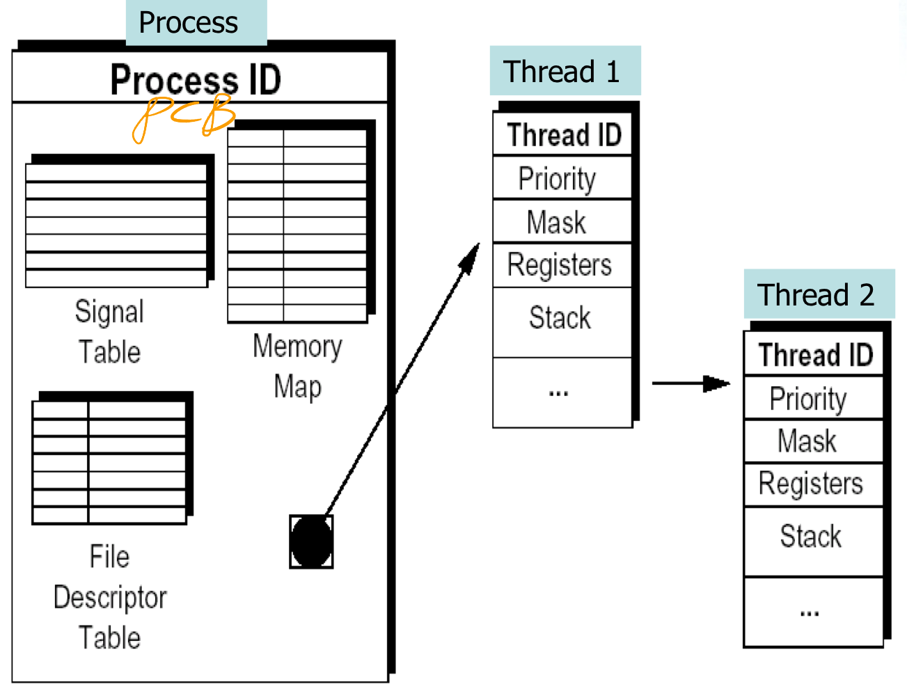
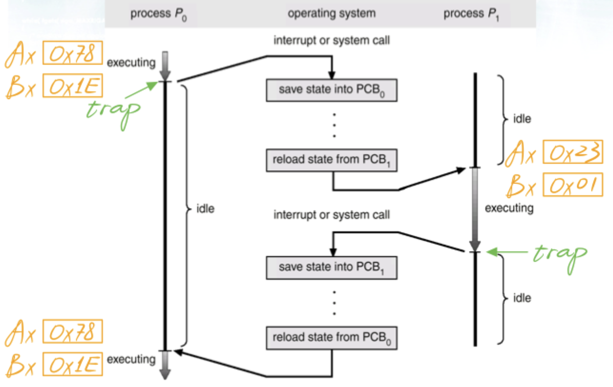

## 进程和线程的区别

-   进程 (Process) 是计算机中运行的程序的实例。每个进程都有自己的地址空间、内存、数据栈以及其他系统资源的副本。进程之间相互独立，彼此之间不共享内存或其他资源，要进行进程间通信通常需要通过特定的机制，比如管道、套接字等。每个进程都由操作系统调度，操作系统负责分配资源并协调进程之间的执行顺序。

-   线程 (Thread) 是在进程内部运行的一个执行单元，也可以说是进程内的子任务。同一个进程内的线程共享相同的内存空间和其他资源，因此线程之间的通信更加高效。线程由操作系统调度，但是线程的创建、销毁、切换等操作相比进程更加轻量级，因为线程间的切换不涉及到地址空间和其他资源的切换，所以开销相对较小。



-   下面是进程和线程的一些对比：
    -   **资源消耗**：进程比线程消耗的资源更多，因为每个进程都有自己的地址空间和系统资源的副本。线程共享相同的资源，所以比较节省资源。
    -   **通信和同步**：进程间的通信比较复杂，需要使用特定的机制，而线程间通信更加简单，因为它们共享相同的地址空间。但是线程间的同步可能会导致竞态条件等问题，需要额外的同步机制来解决。
    -   **并发性**：进程并发执行的基本单位，不同进程之间可以并行执行。线程是进程内部的执行单元，同一个进程内的多个线程可以并行执行，利用多核处理器的优势提高程序性能。
    -   **灵活性**：由于进程之间相互独立，进程可以更灵活地部署和管理。但是进程的创建、销毁等操作相对较慢。线程之间共享资源，因此可以更快速地创建、销毁和切换，提高了程序的响应速度。


## 线程之间是如何通信的

1.   **共享内存**： 

     共享内存是指<u>多个线程共享同一块内存区域，在这个内存区域中存放着需要共享的数据</u>。线程可以通过读写共享内存来进行通信。在 Java 中，共享内存通常通过共享对象或者共享变量来实现。

     例如线程 A 与 线程 B 之间如果要通信, 那么就必须经历下面两个步骤:

     *   线程 A 把本地内存 A 更新过的共享变量刷新到主内存中去
     *   线程 B 到主内存中去读取线程 A 之前更新过的共享变量

2.   **消息传递**:

     消息传递是指<u>线程之间通过发送消息来进行通信</u>。每个线程都有自己的消息队列，当一个线程需要与其他线程通信时，可以向其他线程发送消息，其他线程则可以从自己的消息队列中接收消息。消息通常包含一些特定的信息或者指令，用于告知接收线程需要执行的操作。在 Java 中，消息传递可以通过阻塞队列（如 `LinkedBlockingQueue`、`ArrayBlockingQueue` 等）来实现。


## 创建线程的方式

*   继承 Thread 类:

    ```java
    class MyThread extends Thread {
        public void run() {
            // 线程执行的代码
            System.out.println("MyThread is running");
        }
    }
    
    public class Main {
        public static void main(String[] args) {
            // 创建并启动线程
            MyThread thread = new MyThread();
            thread.start();
        }
    }
    ```

*   实现 Runnable 接口: 

    ```java
    class MyRunnable implements Runnable {
        public void run() {
            // 线程执行的代码
            System.out.println("MyRunnable is running");
        }
    }
    
    public class Main {
        public static void main(String[] args) {
            // 创建线程对象
            MyRunnable myRunnable = new MyRunnable();
            // 创建线程
            Thread thread = new Thread(myRunnable);
            // 启动线程
            thread.start();
        }
    }
    ```

这两种方式都能创建线程，但<u>一般推荐使用实现 Runnable 接口的方式，因为这样可以避免 Java 单继承的限制，使得类可以继承其他类。另外，通过实现 Runnable 接口，可以将线程的任务与线程本身分离开来，提高了代码的灵活性和可维护性</u>。

**继承 Thread 类的优缺点：**

优点：

1.  **简单直观**：继承 Thread 类的方式比较直观，不需要额外定义一个类来实现 Runnable 接口。
2.  **便于访问线程相关方法**：通过继承 Thread 类，可以直接调用 Thread 类中定义的方法，如 `getName()`、`getId()` 等。

缺点：

1.  **不灵活**：Java 是单继承的语言，如果选择继承 Thread 类，就不能再继承其他类。这会限制程序的灵活性。
2.  **资源浪费**：每个线程都是一个独立的对象，创建多个线程会占用较多的系统资源，因此并不适合大规模并发。

**实现 Runnable 接口的优缺点**：

优点：

1.  **灵活性**：实现 Runnable 接口使得类可以继续继承其他类，从而增加了程序的灵活性。
2.  **资源节约**：Runnable 接口只是一个普通的接口，创建多个线程时共享同一个 Runnable 实现对象，减少了资源消耗。

缺点：

1.  **稍微复杂**：相对于继承 Thread 类，实现 Runnable 接口需要多定义一个类来实现 Runnable 接口，有一点额外的复杂性。
2.  **不便于访问线程相关方法**：通过实现 Runnable 接口，不能直接调用 Thread 类中的方法，需要通过创建 Thread 对象并传入 Runnable 对象来使用。


## 如何停止一个正在运行的线程

1.   **使用标志位**：在线程的 `run()` 方法中使用一个标志位来控制线程的执行，当标志位为 true 时，线程继续执行；当标志位为 false 时，线程退出循环，从而终止执行。

     ```java
     class MyThread extends Thread {
         private volatile boolean running = true;
     
         public void run() {
             while (running) {
                 // 线程执行的代码
             }
         }
     
         public void stopThread() {
             running = false;
         }
     }
     ```

2.   **使用 interrupt() 方法**：可以通过调用线程的 `interrupt()` 方法来中断线程的执行。被中断的线程会抛出 `InterruptedException` 异常，可以在捕获异常后执行清理工作并退出线程。

     ```java
     class MyThread extends Thread {
         public void run() {
             try {
                 while (!Thread.currentThread().isInterrupted()) {
                     // 线程执行的代码
                 }
             } catch (InterruptedException e) {
                 // 清理工作
             }
         }
     
         public void stopThread() {
             interrupt();
         }
     }
     ```

3.   **使用 Thread.stop() 方法（不推荐使用）**： Java 提供了 `stop()` 方法来立即停止一个线程，但该方法已被废弃，不推荐使用。因为它会导致线程被突然终止，可能会导致数据不一致或者资源泄露等问题。


## Java 中 interrupted 和 isInterrupted 方法的区别

1.  interrupted() 方法：

    -   <u>`interrupted()` 是 `Thread` 类的静态方法，用于检查当前线程的中断状态，并清除中断状态标志</u>。
    -   如果当前线程被中断（即调用过 `interrupt()` 方法），则 `interrupted()` 方法会返回 `true`；否则返回 `false`。
    -   调用 `interrupted()` 方法会清除当前线程的中断状态，即将中断状态标志重新置为 `false`。

    ```java
    // 检查并清除当前线程的中断状态
    boolean interrupted = Thread.interrupted();
    ```

2.  isInterrupted() 方法：

    -   <u>`isInterrupted()` 是 `Thread` 类的实例方法，用于检查调用该方法的线程的中断状态，但不清除中断状态标志</u>。
    -   如果调用线程被中断，则 `isInterrupted()` 方法返回 `true`；否则返回 `false`。
    -   调用 `isInterrupted()` 方法不会清除线程的中断状态，即不会改变中断状态标志的值。

    ```java
    // 检查当前线程的中断状态，不清除中断状态标志
    boolean isInterrupted = Thread.currentThread().isInterrupted();
    ```


## sleep() 和 wait() 有什么区别

1.  **作用对象**：
    -   `sleep()` 方法是 `Thread` 类的静态方法，用于让当前线程暂停执行一段时间，不释放对象锁。
    -   `wait()` 方法是 `Object` 类的方法，用于让当前线程进入等待状态，同时释放对象的锁，直到被其他线程调用 `notify()` 或 `notifyAll()` 方法唤醒。
2.  **调用方式**：
    -   `sleep()` 方法可以在任何地方调用，包括静态方法中，通过 `Thread.sleep()` 调用。
    -   `wait()` 方法只能在同步代码块或同步方法中调用，即必须先获得对象的锁，然后才能调用 `wait()` 方法。
3.  **释放锁**：
    -   在调用 `sleep()` 方法时，线程会暂停执行，但不会释放对象的锁。
    -   在调用 `wait()` 方法时，线程会进入等待状态，并释放对象的锁，其他线程可以获得对象的锁并修改对象状态。
4.  **使用场景**：
    -   `sleep()` 方法通常用于暂停执行一段时间，比如在定时任务中、模拟延迟等场景。
    -   `wait()` 方法通常用于线程间的协作，等待特定条件满足后再继续执行，比如在多线程生产者-消费者模式中等待生产者生产产品或消费者消费产品。


## notify() 和 notifyAll() 有什么区别

`notify()` 和 `notifyAll()` 都是 Java 中用于线程间通信的方法，它们都属于 `Object` 类中的方法，并且用于唤醒因调用 `wait()` 方法而进入等待状态的线程。它们的区别在于：

1.  **notify() 方法**：
    -   `notify()` 方法用于唤醒在当前对象上调用 `wait()` 方法而进入等待状态的单个线程。
    -   如果有多个线程在对象上等待，调用 `notify()` 方法只会随机选择其中一个线程唤醒。
    -   唤醒的线程会尝试重新获得对象的锁，如果成功获得锁，则继续执行；否则，它会继续等待。
2.  **notifyAll() 方法**：
    -   `notifyAll()` 方法用于唤醒在当前对象上调用 `wait()` 方法而进入等待状态的所有线程。
    -   调用 `notifyAll()` 方法会唤醒所有等待的线程，让它们有机会去竞争对象的锁。
    -   被唤醒的线程会逐个尝试重新获得对象的锁，如果成功获得锁，则继续执行；否则，它会继续等待。

一般来说，在多线程编程中，如果需要唤醒所有等待线程时，应该使用 `notifyAll()` 方法，以确保所有线程都有机会去竞争对象的锁。而在某些特定情况下，如果只想唤醒一个等待线程，可以使用 `notify()` 方法。


## 为什么 wait(), notify() 和 notifyAll() 这些方法不在 Thread 类里面

`wait()`、`notify()` 和 `notifyAll()` 方法是用于线程间通信的方法，它们确实并没有被直接放置在 `Thread` 类中。<u>这是因为这些方法的作用对象并不是线程本身，而是对象的监视器（也称为锁），因此它们被定义在 `Object` 类中</u>。这样设计的主要原因有以下几点：

1.  **与监视器相关**：`wait()`、`notify()` 和 `notifyAll()` 方法的作用对象是对象的监视器，而不是线程本身。在 Java 中，每个对象都有一个相关联的监视器，而线程只是通过获取对象的锁来与监视器交互。因此，将这些方法定义在 `Object` 类中更符合其作用对象的逻辑。
2.  **与同步机制相关**：`wait()`、`notify()` 和 `notifyAll()` 方法通常用于实现线程间的等待/通知机制，它们需要与同步关键字 `synchronized` 结合使用，而 `synchronized` 关键字是用于控制对对象的监视器的访问的。因此，将这些方法放置在 `Object` 类中更符合它们与同步机制的紧密关联。
3.  **多态性**：将这些方法定义在 `Object` 类中可以使得任意对象都可以调用这些方法，而不仅仅局限于 `Thread` 类的实例。

简单来说, 由于 `wait()`、`notify()` 和 `notifyAll()` 都是锁级别的操作, 所以把他们定义在 `Object` 类中, 因为锁属于对象


## 为什么 wait() 和 notify() 方法要在同步块中调用

`wait()` 和 `notify()` 方法通常要在同步块（或者同步方法）中调用的原因是确保线程对共享资源的访问是同步的，从而避免出现竞争条件、数据不一致或者死锁等问题。主要有以下几点原因：

1.  **获取对象的锁**：<u>在调用 `wait()` 和 `notify()` 方法之前，线程必须先获取对象的监视器（锁）</u>。同步块或者同步方法是获取对象锁的一种方式，确保线程在调用 `wait()` 和 `notify()` 方法时已经获取了对象的锁。
2.  **释放对象的锁**：<u>`wait()` 方法会释放对象的锁，使得其他线程可以获取锁并执行同步代码</u>。同样，`notify()` 方法也需要在同步块中调用，<u>确保在调用 `notify()` 方法时已经持有对象的锁，从而可以唤醒其他等待该锁的线程</u>。
3.  **防止竞争条件和数据不一致**：<u>如果不在同步块中调用 `wait()` 和 `notify()` 方法，可能会导致线程在调用这些方法时没有获取对象的锁</u>，从而导致其他线程在并发情况下修改了共享资源，造成竞争条件和数据不一致。
4.  **避免死锁**：<u>如果在没有获取对象锁的情况下调用 `wait()` 和 `notify()` 方法，可能会导致线程在等待或唤醒时出现死锁情况</u>，因为没有获取锁的线程无法执行 `wait()` 或 `notify()` 方法，而其他线程也无法唤醒它们。


## Thread类中的 start() 和 run() 方法有什么区别

1.  **start() 方法**：
    -   `start()` 方法是 `Thread` 类的一个实例方法，用于启动一个新的线程并让该线程开始执行。
    -   <u>当调用 `start()` 方法时，系统会为该线程分配资源并调用线程的 `run()` 方法，使得线程处于就绪（Runnable）状态</u>。
    -   <u>在多线程编程中，通常通过调用 `start()` 方法来启动一个新线程，而不是直接调用 `run()` 方法</u>。
2.  **run() 方法**：
    -   `run()` 方法是 `Thread` 类的一个普通方法，用于定义线程的执行逻辑。
    -   当线程被启动后，系统会调用线程对象的 `run()` 方法来执行线程的任务。<u>如果直接调用 `run()` 方法，该方法会在当前线程中同步执行，并不会启动一个新的线程</u>。

总之, **start() 方法被用来启动新创建的线程, 而且 start() 内部调用了 run() 方法, 这和直接调用 run() 方法的效果不一样; 当调用 run() 方法的时候, 只会是在原来的线程中调用, 没有新的线程启动, start() 方法才会启动新线程**


## Thread 类中的 yield() 方法有什么作用

<u>`yield()` 方法是 `Thread` 类的一个静态方法，它的作用是让出当前线程的执行权，使得其他具有相同优先级的线程有机会执行</u>。调用 `yield()` 方法并不会让线程进入阻塞状态，而是将线程从运行状态转换为就绪状态，让 CPU 重新选择执行下一个线程。`yield()` 方法只保证当前线程放弃 CPU 占用而不能保证其他线程一定能占用 CPU, 执行`yield()`的线程有可能在进入到暂停状态后马上又被执行


## 什么是多线程中的上下文切换

多线程中的上下文切换是指在一个 CPU 上同时运行多个线程时，由于 CPU 时间片轮转调度策略或者线程阻塞等原因，导致 <u>CPU 需要暂时中断当前正在执行的线程，保存当前线程的执行状态（上下文），然后切换到另一个线程继续执行</u>，这个过程就是上下文切换。从这个角度看, 上下文切换有点像我们同时阅读几本书, 在来回切换书本的同时我们需要记住每本书当前读到的页码



在程序中, 上下文切换过程中的“页码”信息是保存在进程控制块 (PCB) 中的; PCB 还经常被称作“切换帧” (switchframe); “页码”信息会一直保存在 CPU 的内存中, 直到他们再次被使用

上下文切换是存储和恢复 CPU 状态的过程, 它使得线程执行能够从中断点恢复执行; 上下文切换是多任务操作系统和多线程环境的基本特征


## 什么是线程安全

**如果你的代码在多线程下执行和在单线程下执行永远都能获得一样的结果, 那么你的代码就是线程安全的**

线程安全也是有几个级别的:

1.   **不可变**: <u>像 String, Integer, Long 这些, 都是 final 类型的类, 任何一个线程都改变不了它们的值,</u> 要改变除非新创建一个, 因此这些不可变对象不需要任何同步手段就可以直接在多线程环境下使用
2.   **绝对线程安全**: <u>不管运行时环境如何, 调用者都不需要额外的同步措施</u>; 要做到这一点通常需要付出许多额外的代价, Java 中标注自己是线程安全的类, 实际上绝大多数都不是线程安全的, 不过绝对线程安全的类, Java 中也有, 比方说 CopyOnWriteArrayList, CopyOnWriteArraySet
3.   **相对线程安全**: 相对线程安全也就是我们通常意义上所说的线程安全, 像 Vector 这种, add, remove 方法都是原子操作, 不会被打断, 但也仅限于此, <u>如果有个线程在遍历某个 Vector, 有个线程同时在 add 这个 Vector, 99% 的情况下都会出现 ConcurrentModificationException, 也就是 fail-fast 机制</u>
4.   线程非安全: <u>ArrayList, LinkedList, HashMap 等都是线程非安全的类</u>


## SynchronizedMap 和 ConcurrentHashMap 有什么区别

`SynchronizedMap` 和 `ConcurrentHashMap` 都是 Java 中用于实现线程安全的 Map 集合的类，但它们有一些区别：

1.  **线程安全性**：
    -   `SynchronizedMap` 使用同步机制来保证线程安全。它通过在每个公共方法上加锁的方式来实现同步，保证了多个线程对 Map 的操作是安全的。但是这样的同步方式可能会导致性能下降，特别是在高并发环境下。
    -   <u>`ConcurrentHashMap` 使用分段锁（Segment）来实现线程安全</u>。它将整个 Map 分成多个 Segment，并在每个 Segment 上使用独立的锁来控制并发访问，从而提高了并发性能。<u>在读取操作上，`ConcurrentHashMap` 支持并发访问，而写入操作只会锁定对应的 Segment，不会锁定整个 Map，因此在高并发环境下性能更好</u>。
2.  **锁的粒度**：
    -   <u>`SynchronizedMap` 在对整个 Map 进行操作时，会锁定整个 Map 对象，因此在高并发环境下可能会出现性能瓶颈</u>。
    -   <u>`ConcurrentHashMap` 使用了分段锁机制，将整个 Map 分成多个 Segment，每个 Segment 都有自己的锁，因此在并发操作时只会锁定对应的 Segment，不会锁定整个 Map，提高了并发性能</u>。
3.  **迭代器**：
    -   在 `SynchronizedMap` 中，如果<u>在迭代过程中对 Map 进行了修改操作，可能会抛出 `ConcurrentModificationException` 异常</u>。
    -   在 `ConcurrentHashMap` 中，迭代器是弱一致的，即它<u>允许在迭代过程中对 Map 进行修改操作，但是不保证迭代器会反映出修改的结果</u>。

综上所述，`ConcurrentHashMap` 在高并发环境下性能更好，由于使用了分段锁机制，减少了锁的竞争，提高了并发访问的效率。而 `SynchronizedMap` 使用简单的同步机制来保证线程安全，适用于低并发场景或者对并发性能要求不高的情况。


## 并发编程的三大特性

1.  **原子性（Atomicity）**：即一个操作或者一系列操作要么全部执行并且执行过程不会被中断，要么不执行，不会出现执行过程中被其他线程干扰的情况。在多线程环境下，确保对共享资源的操作是原子性的，避免数据竞争和数据不一致。
2.  **可见性（Visibility）**：即一个线程对共享变量的修改能够被其他线程及时感知到。在多线程环境下，由于线程的工作内存与主内存之间的数据不一致性，可能会导致一个线程对共享变量的修改对其他线程不可见，因此需要采取措施确保数据的可见性，比如使用`volatile`关键字或者`synchronized`关键字。
3.  **有序性（Ordering）**：即线程的执行顺序与代码的书写顺序一致，保证程序的执行结果是可预期的。在多线程环境下，由于线程调度的不确定性，可能会导致代码的执行顺序发生变化，因此需要采取措施确保程序的有序性，比如使用同步机制或者其他线程间的协调机制。


## 有三个线程 T1, T2, T3, 如何保证顺序执行

在多线程中有多种方法让线程按特定顺序执行, 可以用线程类的 join() 方法在一个线程中启动另一个线程, 另一个线程完成后, 该线程继续执行; 为了确保三个线程的顺序我们应该先启动最后一个 (T3 调用 T2, T2 调用 T1), 这样 T1 就会先完成而 T3 最后完成

实际上先启动三个线程中的哪一个都行, 因为在每个线程的 run 方法中用 join 方法限定了三个线程的执行顺序

```java
public class JoinTest2 {
  	
  	// 现在有 T1, T2, T3 三个线程, 怎么保证 T2 在 T1 执行完后执行, T3 在 T2 执行完后执行
  
  	public static void main(String[] args) {
      	final Thread t1 = new Thread(new Runnable() {
          	@Override
          	public void run() {
              	System.out.println("t1");
            }
        });
      
      	final Thread t2 = new Thread(new Runnable() {
          	@Override
          	public void run() {
              	try {
                  	// 引用 T1 线程, 等待 T1 线程执行完
                  	t1.join();
                } catch (InterruptedException e) {
                  	e.printStackTrace();
                }
              
              	System.out.println("t2");
            }
        });
      
      	final Thread t3 = new Thread(new Runnable() {
          	@Override
          	public void run() {
              	try {
                  	// 引用 T2 线程, 等待 T2 线程执行完
                  	t2.join();
                } catch (InterruptedException e) {
                  	e.printStackTrace();
                }
              
              	System.out.println("t3");
            }
        });
      
      	// 这里三个线程的启动顺序可以任意!
      	t3.start();
      	t2.start();
      	t1.start();
    }
}
```

