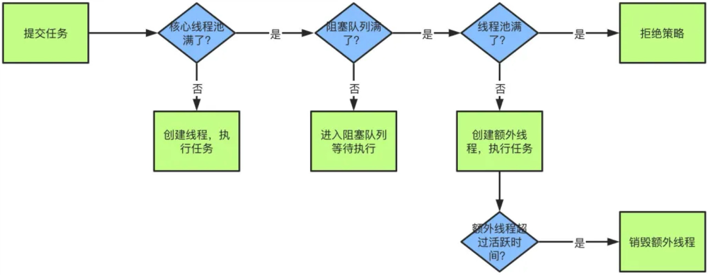

## 什么是线程池?

顾名思义，线程池就是管理一系列线程的资源池。当有任务要处理时，直接从线程池中获取线程来处理，处理完之后线程并不会立即被销毁，而是等待下一个任务。

##  为什么要用线程池？

合理利用线程池能够带来三个好处:

1.   **降低资源消耗**: 通过重复利用已创建的线程降低线程创建和销毁造成的消耗
2.   **提高相应速度**: 当任务到达时, 任务可以不需要等到线程创建就能立即执行
3.   **提高线程的可管理性**: 线程是稀缺资源, 如果无限制的创建, 不仅会消耗系统资源, 还会降低系统的稳定性, 使用线程池可以进行统一的分配, 调优和监控

## 常用的线程池有哪些

*   **newSingleThreadExecutor**: 创建一个单线程的线程池, 此线程池保持所有任务的执行顺序按照任务的提交顺序执行
*   **newFixedThreadPool**: 创建固定大小的线程池, 每次提交一个任务就创建一个线程, 直到线程达到线程池的最大大小
*   **newCachedThreadPool**: 创建一个可缓存的线程池, 次线程池不会对线程池的大小做限制, 线程池的大小完全依赖于操作系统 (或者说 JVM) 能够创建的最大线程大小
*   **newScheduleThreadPool**: 创建一个大小无限的线程池, 此线程池支持定时以及周期性执行任务的需求

## 线程池的拒绝策略有哪些

主要有 4 种拒绝策略:

1.   **Abort Policy**: 直接丢弃任务, 抛出异常, 这是默认策略
2.   **Caller Runs Policy**: 只用调用者所在的线程来处理任务
3.   **Discard Oldest Policy**: 丢弃等待队列中最旧的任务, 并执行当前任务
4.   **Discard Policy**: 直接丢弃任务,也不抛出异常

## Java 线程池中队列常用类型

首先我们引入阻塞队列的概念: <u>阻塞队列 (Blocking Queue) 是一种特殊的队列, 它支持在队列为空时, 从队列中获取元素的操作会被阻塞, 直到队列中有元素可取; 同时, 当队列已满时, 向队列中添加元素的操作也会被阻塞, 直到队列有空闲位置可用</u>

Java 线程池中常用的队列类型包括以下几种: 

*   **ArrayBlockingQueue**: 是一个基于数组结构的<u>有界阻塞队列</u>, 按照 FIFO 原则对元素进行排序
*   **LinkedBlockingQueue**: 是一个基于链表结构的<u>无界阻塞队列</u>, 按照 FIFO 排序元素, 吞吐量通常要高于 `ArrayBlockingQueue`
*   **SynchronousQueue**: 是一个<u>没有存储元素的阻塞队列</u>, 每个插入操作必须等待另一个线程的相应删除操作, 反之亦然; 它的容量为零, 任何插入操作都会被阻塞, 直到另一个线程调用了对应的删除操作
*   **PriorityBlockingQueue**: 是一个基于优先级堆实现的<u>无界阻塞队列</u>, 它可以按照元素的优先级进行排序; 当向队列中添加元素时, 元素会根据优先级被放置在合适的位置; 当从队列中取出元素时, 优先级最高的元素会被先取出
*   **DelayQueue**: 是一个支持延时获取元素的<u>无界阻塞队列</u>，队列中的元素必须实现了 Delayed 接口，根据元素的延时时间进行排序。当从队列中取出元素时，只有延时时间已过的元素才会被取出

## 线程池核心线程数怎么设置

*   **CPU 密集型**: 

    这种任务消耗的主要是 CPU 资源, 可以将<u>线程数设置为 N (CPU 核心数) + 1</u>, 比 CPU 核心数多出来的一个线程是为了防止线程偶发的缺页中断, 或者其他原因导致的任务暂停而带来的影响; 一旦任务暂停, CPU 就会处于空闲状态, 而在这种情况下多出来的一个线程数就可以充分利用 CPU 的空闲时间

*   **IO 密集型**: 

    这种任务应用起来, 系统会用大部分的时间来处理 I/O 交互, 而线程在处理 I/O 的时间段内不会占用 CPU 来处理, 这时候就可以将 CPU 交出给其他线程使用; 因此在 I/O 密集型任务的应用中, 我们可以多配置一些线程, 具体的计算方法是: <u>线程数 = CPU 核心数 * 2</u>

## Java 线程池中 submit() 和 execute() 方法有什么区别

在 Java 中，线程池提供了 `submit()` 和 `execute()` 两种方法来向线程池提交任务，它们有以下区别: 

-   `submit()` 方法定义在 `ExecutorService` 接口中，它接受一个 `Callable` 或者 `Runnable` 对象作为参数，并返回一个 `Future` 对象，通过 `Future` 对象可以获取任务执行的结果或者取消任务的执行。
-   `execute()` 方法定义在 `Executor` 接口中，它接受一个 `Runnable` 对象作为参数，并且没有返回值。

## 线程池原理以及核心参数

线程池的原理可以简单描述如下：

1.  **线程池初始化**： 当应用程序启动时，线程池会被初始化，根据预先配置的参数创建一定数量的线程，并将这些线程保存在线程池中。
2.  **任务提交**： 当应用程序有任务需要执行时，可以将任务提交给线程池。线程池会根据任务的类型和线程池的配置来决定如何执行任务，通常有两种方式：如果线程池中有空闲线程，任务会被分配给空闲线程执行；如果线程池中没有空闲线程，任务会被放入工作队列中等待执行。
3.  **任务执行**： 当线程池中的线程空闲时，会从工作队列中取出任务并执行。线程执行任务的过程是并发的，多个线程可以同时执行不同的任务，提高了任务的执行效率。
4.  **线程复用**： 当任务执行完成后，线程会被重新放入线程池中，以供下次使用。这样可以避免线程的频繁创建和销毁，减少了系统资源的消耗。
5.  **动态调整**： 线程池通常会根据系统的负载情况和任务的执行情况动态调整线程池的大小，以保证系统的性能和资源利用率。

线程池的核心参数包括：

1.  **核心线程数（Core Pool Size）**： 核心线程数是线程池中保持活动状态的最小线程数，即使这些线程处于空闲状态也不会被销毁。当有新的任务提交时，线程池会优先使用核心线程来执行任务。
2.  **最大线程数（Maximum Pool Size）**： 最大线程数是线程池中允许存在的最大线程数，当工作队列已满且核心线程数达到上限时，线程池会创建新的线程来执行任务，直到达到最大线程数。
3.  **工作队列（Work Queue）**： 工作队列是用来存放等待执行的任务的队列，当线程池中的线程都处于忙碌状态时，新的任务会被放入工作队列中等待执行。工作队列的类型可以是有界队列或者无界队列。
4.  **线程空闲时间（Keep Alive Time）**： 线程空闲时间是指当线程处于空闲状态时，如果在一定时间内没有执行新的任务，线程会被销毁。这个参数通常和核心线程数配合使用，用来动态调整线程池中的线程数量。
5.  **拒绝策略（Rejected Execution Handler）**： 拒绝策略是用来处理任务提交被拒绝的情况，例如线程池已经关闭或者工作队列已满。常见的拒绝策略包括丢弃任务、抛出异常、阻塞等待和调用者运行等。

当提交一个新任务到线程时, 具体的执行流程如下:

1.   当我们提交任务, 线程池会根据 `CorePoolSize` 大小创建若干任务数量线程执行任务
2.   当任务的数量超过 `CorePoolSize` 数量, 后续的任务将会进入阻塞队列阻塞排队
3.   当阻塞队列也满了之后, 那么将会继续创建 `MaximumPoolSize - CorePoolSize` 个数量的线程来执行任务, 如果任务处理完成, `MaximumPoolSize - CorePoolSize` 个额外创建的线程等待 `KeepAliveTime` 之后被自动销毁
4.   如果达到 `MaximumPoolSize`, 阻塞队列还是满的状态, 那么将根据不同的拒绝策略应对处理

