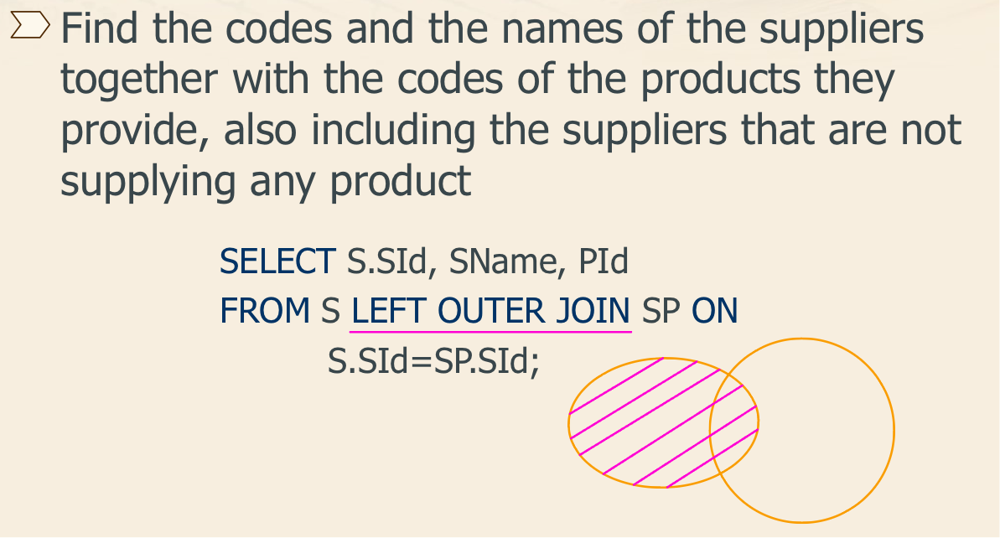

## 数据库的三范式是什么

1.  第一范式（1NF）：确保每个列都是原子性的，不可再分。这意味着每个列中的值都是单一的，不包含多个值或重复组。
2.  第二范式（2NF）：确保表中的每列都完全依赖于主键 (primary key)（或主键的组合）。换句话说，每个非主键列都应该完全依赖于主键，而不是部分依赖。
3.  第三范式（3NF）：在达到第二范式的基础上，消除非主属性对其他非主属性的传递依赖。换句话说，表中的每个非主属性都应该直接依赖于主键，而不是依赖于其他非主属性。


## MySQL 数据库引擎有哪些

mysql常用引擎包括: MyISAM, InnoDB, Memory, MERGE:

*   **MYISAM**: 全表锁, 拥有较高的执行速度, 不支持事务, 不支持外键, 并发性能差, 占用空间相对较小, 对事务完整性没有要求, 以 `SELECT`, `INSERT` 为主的应用基本上可以使用这引擎
*   **InnoDB**: 行级锁, 提供了具有提交, 回滚和崩溃回复能力的事务安全, 支持自动增长列, 支持外键约束, 并发能力强, 占用空间是 MyISAM 的 2.5 倍, 处理效率相对会差一些
*   **Memory**: 全表锁, 存储在内容中, 速度快, 但会占用和数据量成正比的内存空间且数据在 MySQL 重启时会丢失, 默认使用 HASH 索引, 检索效率非常高, 但不适用于精确查找, 主要用于 那些内容变化不频繁的代码表
*   **MERGE**: 是一组 MyISAM 表的组合


## 数据库的事务

<u>数据库事务是一系列数据库操作（例如插入、更新、删除等），它们被视为一个单独的逻辑单元，并且要么全部成功执行，要么全部回滚（即撤销）</u>。事务具有四个标准特性，通常称为 ACID 特性：

1.  **原子性（Atomicity）**：<u>事务是一个原子操作单元，它要么完全执行，要么完全不执行</u>。如果事务的所有操作都成功执行，则事务被提交（commit），否则事务将被回滚（rollback）到初始状态。
2.  **一致性（Consistency）**：<u>事务执行之后，数据库的状态应该从一个一致状态转变为另一个一致状态</u>。这意味着事务必须遵守数据库的所有约束，包括唯一性约束、外键约束等。即数据不会被破坏, 如 A 转账 100 元给 B, 不管操作是否成功, A 和 B 的账户总额是不变的
3.  **隔离性（Isolation）**：<u>事务的执行应该是相互隔离的，即一个事务的执行不应该影响其他事务的执行</u>。隔离性确保了并发事务的正确执行，防止了由于多个事务并发执行而导致的数据不一致问题。
4.  **持久性（Durability）**：<u>一旦事务提交，其所做的修改应该永久保存在数据库中，即使系统崩溃或发生故障也不会丢失</u>。持久性保证了数据的持久性和可靠性。

数据库事务的目的是确保数据的完整性和一致性，同时提供并发控制和故障恢复功能，以确保数据库在任何情况下都能保持可靠性。


## 主键和候选键有什么区别

主键和候选键都用于唯一标识表中的记录，但主键是从候选键中选出来的主要标识键，一个表只能有一个主键，但可以有多个候选键。主键有更严格的约束条件，且数据库系统会为其自动创建索引，而候选键通常通过 `UNIQUE` 约束定义，索引需要手动创建。按照惯例, 候选键可以被指定为主键, 并且可以用于任何外键引用


## 主键与索引有什么区别

*   <u>主键一定会创建一个唯一索引, 但是有唯一索引的列不一定是主键</u>
*   主键不允许为空值, 唯一索引列允许空值
*   一个表只能有一个主键, 但是可以有多个唯一索引
*   <u>主键可以被其他表引用为外键, 唯一索引列不可以</u>;
*   主键主要用于数据完整性和唯一标识, 而索引主要用于加速数据检索


## 索引是什么

在数据库中，索引是一种数据结构，用于<u>提高数据库表的检索速度和查询性能</u>。通过使用索引，数据库系统可以快速定位到符合特定条件的行，而无需扫描整个表。更通俗的说, 数据库索引好比是一本书的前目录, 能<u>加快数据库的查询速度</u>

一般来说索引本身也很大, 不可能全部存储在内存中, 因此<u>索引往往是存储在磁盘上的文件中的</u> (可能存储在单独的索引文件中, 也可能和数据一起存储在数据文件中)

<u>我们通常所说的索引, 包括聚集索引, 覆盖索引, 组合索引, 前缀索引, 唯一索引等, 没有特别说明, 默认都是使用 B+ 树结构组织 (多路搜索树, 并不一定是二叉的) 的索引</u>


## 索引有什么优缺点

优点:

1.   <u>提高数据的检索速度, 降低数据库 IO 成本</u>: 使用索引的意义就是通过缩小表中需要查询的记录的数目从而加快搜索的速度
2.   <u>降低数据排序的成本, 降低 CPU 消耗</u>: 索引之所以查的快, 是因为先将数据排好序, 若该字段正好需要排序, 则正好降低了排序的成本

缺点:

1.   <u>占用存储空间</u>: 索引实际上也就是一张表, 记录了主键与索引字段, 一般以索引文件的形式存储在磁盘上
2.   <u>降低更新表的速度</u>: 表的数据发生了变化, 对于的索引也需要一起变更, 从而降低了更新速度; 否则索引指向的物理数据可能不对, 这也是索引失效的原因之一


## MySQL 索引类型有哪些

1.   **主键索引（Primary Key Index）**:

     主键索引是唯一索引的一种特殊类型。每个表只能有一个主键，主键列中的值必须唯一且不能为空（NOT NULL）。

2.   **唯一索引（Unique Index）**:

     唯一索引要求索引列中的所有值必须唯一，可以有多个唯一索引。唯一索引列可以包含NULL值，但NULL值不能重复。

3. **常规索引（Regular Index）或 普通索引（Index）**:

    常规索引允许列中的值重复和空，可以在一个表中创建多个常规索引。

4. **全文索引（Full-text Index）**:

    全文索引用于全文搜索，在InnoDB和MyISAM存储引擎中都支持。只能在文本类型 CHAR, VARCHAR, TEXT 类型字段上创建全文索引; 字段长度比较长, 如果创建普通索引, 在进行 like 模糊查询时效率比较低, 这时可以创建全文索引

5. **空间索引 (Spatial Index)**:

    MySQL 在 5.7 之后的版本支持了空间索引, 而且支持 OpenGIS 几何数据模型; MySQL 在空间索引这方面遵循 OpenGIS 几何数据模型规则

6. **前缀索引**: 

    在文本类型如 CHAR, VARCHAR, TEXT 类列上创建索引时, 可以指定索引列的长度, 但是数值类型不能指定

7. **其他 (按照索引列数量分类)**:

    *   单列索引

    *   组合索引

        组合索引的使用, 需要遵循<u>最左前缀匹配原则 (最左匹配原则);</u> 一般情况下在条件允许的情况下使用组合索引替代多个单列索引使用


## 什么时候不要使用索引

1.   <u>经常增删改的列不要建立索引</u>; 索引需要维护, 一旦列频繁更新, 每次更新都会涉及索引的更新, 导致额外的性能开销
2.   <u>表记录太少不要建立索引</u>; 对于行数很少的小表, 全表扫描的成本并不高, 使用索引可能带来的性能提升微乎其微, 甚至会因为维护索引而增加开销
3.   <u>有大量重复的列不要建立索引</u>; 


## 使用 MySQL 的索引应该注意些什么


## SQL 优化手段有哪些

*   **尽量避免使用 SELECT ***：只选择所需的列，可以减少传输的数据量和处理时间。
*   **使用 WHERE 子句过滤数据**：尽量在查询中使用WHERE子句过滤数据，减少返回的行数。
*   **尽量避免使用子查询**：可以将子查询改为JOIN操作，减少嵌套查询的复杂度和执行时间。
*   **使用 JOIN 替代子查询**：在很多情况下，JOIN比子查询更高效。(LEFT JOIN, RIGHT JOIN, INNER JOIN)
*   **减少使用 IN 或者 NOT IN**: 使用 EXISTS, NOT EXISTS 或者关联查询语句替代
*   **OR 的查询尽量用 UNION 或者 UNION ALL 代替**: 在确认没有重复数据或者不用剔除重复数据时, UNION ALL 会更好
*   **尽量避免在 WHERE 子句中使用 != 或 <> 操作符**: 否则将导致引擎放弃使用索引而进行全表扫描
*   **尽量避免在 WHERE 子句中对字段进行 NULL 值判断**: 否则将导致引擎放弃使用索引而进行全表扫描, 如 SELECT id FROM t WHERE num IS NULL 可以在 num 上设置默认值为 0, 确保表中的 num 列没有 NULL 值, 然后这样查询: SELECT id FROM t WHERE num=0


## 简单说一说 DROP, DELETE 与 TRUNCATE 的区别

1.   **DROP**:

     **用途**：用于删除整个数据库对象（如表、视图、索引等）。

     **特点**：

     -   完全删除数据库对象及其所有数据。
     -   不可回滚，删除操作后无法恢复。
     -   删除后，该对象不再存在，所有与之相关的权限和依赖关系也会被删除。

     ```sql
     DROP TABLE table_name;
     DROP DATABASE database_name;
     DROP INDEX index_name ON table_name;
     ```

2.   **DELETE**:

     **用途**：用于删除表中的特定行（记录）。

     **特点**：

     -   只删除满足条件的行。如果不加 `WHERE` 子句，会删除表中所有行，但表结构依然保留。
     -   删除操作会记录在事务日志中，因此可以回滚。
     -   支持触发器 (Trigger)，可以触发与删除操作相关的触发器。
     -   可以删除特定的记录，更加灵活。

     ```sql
     DELETE FROM table_name WHERE condition;
     ```

3.   **TRUNCATE**:

     **用途**：用于快速清空表中的所有数据，但保留表结构。

     **特点**：

     -   删除所有行，但保留表结构（包括列、约束等）。
     -   不记录逐行删除操作，而是整体清空，因此速度比 `DELETE` 快。
     -   一般情况下，无法回滚，因为不记录每行删除操作（取决于具体数据库系统的实现）。
     -   不会触发 `DELETE` 触发器，因为它不是逐行删除操作。
     -   重置表的自增计数器（如果有）。

     ```sql
     TRUNCATE TABLE table_name;
     ```

总结:

-   **`DROP`**：删除整个数据库对象（如表），不可恢复。
-   **`DELETE`**：删除表中的特定行，可恢复，支持条件删除。
-   **`TRUNCATE`**：清空表中的所有数据，保留表结构，不记录逐行删除操作，速度快，通常不可恢复。


## 什么是视图

视图（View）是关系数据库管理系统（RDBMS）中的一种<u>虚拟表</u>，它是基于一个或多个基础表（或视图）的查询结果。视图不存储实际的数据，而是存储一个查询定义。通过视图，用户可以像操作真实表一样查询数据。对视图的修改不影响基本表, 它使得我们获取数据更容易, 相比于多表查询

使用 `CREATE VIEW` 语句可以创建视图: 

```sql
CREATE VIEW view_name AS
SELECT column1, column2, ...
FROM table_name
WHERE condition;
```

假设我们有一个员工表 `employees`: 

```sql
CREATE TABLE employees (
    employee_id INT,
    first_name VARCHAR(50),
    last_name VARCHAR(50),
    department VARCHAR(50),
    salary DECIMAL(10, 2)
);
```

我们可以创建一个视图，只显示员工的姓名和部门: 

```sql
CREATE VIEW employee_view AS
SELECT first_name, last_name, department
FROM employees;
```

现在，我们可以像查询表一样查询视图: 

```sql
SELECT * FROM employee_view;
```


## 什么是内联接, 左外联接, 右外联接

*   内联接 (Inner Join): 匹配两张表中相关联的记录

    

*   左外联接 (Left Outer Join): 除了匹配 2 张表中相关联的记录外, 还会匹配左表中剩余的记录, 右表中未匹配到的字段用 NULL 表示

    

*   右外联接 (Right Outer Join): 除了匹配 2 张表中相关联的记录外, 还会匹配右表中剩余的记录, 左表中未匹配到的字段用 NULL 表示


## 并发事务带来了哪些问题

并发事务是指多个事务同时在数据库中执行，可能导致数据一致性和完整性问题。以下是并发事务带来的主要问题：

1.   **脏读 (Dirty Read)**:

     <u>一个事务读取了另一个事务尚未提交的修改数据。如果第一个事务回滚，这些读取的数据将变为无效</u>。

     -   事务A修改了一个值，但未提交。
     -   事务B读取了该修改值。
     -   如果事务A回滚，事务B读到的数据将是无效的。

2.   **不可重复读 (Non-repeatable Read)**:

     在同一事务中，先后两次读取同一行数据，结果不一致。因为在两次读取之间，另一个事务修改了该数据并提交了。

     -   事务A读取一个值。
     -   事务B修改该值并提交。
     -   事务A再次读取同一值，发现值已改变。

3.   **幻读 (Phantom Read)**:

     一个事务在读取某个范围的数据时，另一个事务在该范围内插入了新数据，导致前一个事务再次读取时，发现多了一些“幻影”行。

     -   事务A读取符合某条件的一组行。
     -   事务B插入一些新行，这些新行也符合事务A的条件。
     -   事务A再次读取时，发现比第一次读取多了一些行。

4.   **更新丢失 (Lose Update)**:

     两个事务都读取同一个数据并进行修改，最后一个事务的修改覆盖了前一个事务的修改，导致前一个事务的更新丢失。

     -   事务A和事务B都读取同一个值。
     -   事务A修改该值并提交。
     -   事务B也修改该值并提交，覆盖了事务A的修改。

**不可重复读和幻读的区别**:

不可重复读的重点是修改比如多次读取一条记录发现其中某些列的值被修改, 而幻读的重点在于新增或者删除比如多次读取一条记录发现记录增多或减少了


## 事务隔离级别有哪些? MySQL 的默认隔离级别是

1. **读未提交（Read Uncommitted）**

    -   最低的隔离级别。

    -   允许一个事务读取另一个事务未提交的数据（脏读）。

    -   <u>可能出现的并发问题：脏读（Dirty Read）、不可重复读（Non-repeatable Read）、幻读（Phantom Read）</u>。

2.   **读已提交（Read Committed）**
     -   事务只能读取已经提交的数据。
     -   <u>防止脏读，但可能出现不可重复读和幻读</u>。
     -   Oracle数据库的默认隔离级别。

3.   **可重复读（Repeatable Read）**
     -   确保在一个事务内多次读取同一数据，结果是一致的。
     -   <u>防止脏读和不可重复读，但可能出现幻读</u>。
     -   <u>MySQL的默认隔离级别</u>

4.   **可序列化（Serializable）**
     -   最高的隔离级别, 完全服从 ACID 的隔离级别
     -   强制事务按顺序执行，完全隔离。
     -   <u>防止脏读、不可重复读和幻读</u>。
     -   代价高，性能影响大，因为它会导致大量的锁定和等待。


## 大表如何优化

当 MySQL 单表记录数过大时, 数据库的 CRUD 性能会明显下降, 一些常见的优化措施如下:

1.   **限定数据的范围**: 务必禁止不带任何限制数据范围条件的查询语句; 比如: 我们当用户在查询订单历史的时候, 我们可以控制在一个月的范围内

2.   **读/写分离**: 经典的数据库拆分方案, 主库负责写, 从库负责读

3.   **垂直分区**: 将大表拆分成多个小表，每个小表包含部分列。通过垂直分割可以将热点数据和冷数据分离，提高数据访问效率。例如，将大表中的常用列和不常用列分别存储在不同的表中。

     *   **优点**: 可以使得列数据变小, 在查询时减少读取的 Block 数, 减少 I/O 次数; 此外, 垂直分区可以简化表的结构, 易于维护
     *   **缺点**: 主键会出现冗余, 需要管理冗余列, 并会引起 JOIN 操作; 此外, 垂直分区会让事务变得更加复杂

     

4.   **水平分区**: 将大表按照某个条件（如ID范围、日期范围等）拆分成多个子表，每个子表包含部分数据。水平分割可以减少单个表的数据量，提高查询性能和并发能力。例如, 我们可以将用户信息表拆分成多个用户信息表, 这样就可以避免单一表数据量过大对性能造成影响

     *   **优点**: 不存在单库大数据和高并发的性能瓶颈; 应用端改造较少; 提高了系统的稳定性和负载能力
     *   **缺点**: 分片事务一致性难以解决; 跨节点 JOIN 性能差, 逻辑复杂; 数据多次拓展难度和维护量极大
     *   需要注意的一点是: 分表仅仅是解决了单一表数据过大的问题, 但由于表的数据还是在同一台机器上, 其实对于提升 MySQL 并发能力没有什么意义, 所以**水平拆分最好分库**

     


## 分库分表后, id 主键如何处理


## 说说在 MySQL 中一条查询 SQL 是如何执行的

```sql
SELECT name FROM t_user WHERE id=1
```

-   **连接**: 客户端连接到MySQL服务器
-   **查询缓存**: key 为 SQL 语句, value 为查询结果, 如果查到就直接返回; 不建议使用次缓存, 在 MySQL 8.0 版本已经将查询缓存删除, 也就是说 MySQL 8.0 版本后不存在此功能
-   **解析和预处理**: 解析器解析SQL语句, 检查语法和表结构; 一般语法错误在此阶段
-   **优化**: 在表里有多个索引的时候, 决定使用哪个索引; 或者一个语句中存在多表关联的时候 (JOIN), 决定各个表的连接顺序
-   **执行**: 通过分析器让 SQL 知道你要干啥, 通过优化器知道该怎么做, 于是开始执行语句; 执行语句的时候还要判断是否具备此权限, 没有权限就直接返回提示没有权限的错误; 有权限则打开表, 根据表的引擎定义, 去使用这个引擎提供的接口, 获取这个表的第一行, 判断 id 是都等于 1; 如果是, 直接返回; 如果不是继续调用引擎接口去下一行, 重复相同的判断, 直到取到这个表的最后一行, 最后返回
-   **返回结果**：将查询结果发送回客户端。


## MySQL 中的 VARCHAR 与 CHAR 的区别, 以及 VARCHAR(30) 中的 30 代表的含义

*   VARCHAR 与 CHAR 的区别, CHAR 是一种固定长度的类型, VARCHAR 则是一种可变长度的类型
*   VARCHAR(30) 中 30 的含义是最多存放 30 个字符; VARCHAR(30) 和 VARCHAR(100) 存储的 hello 所占的空间一样, 但后者在排序时会消耗更多内存, 因为 ORDER BY col 采用 fixed_length 计算 col 长度 (memory 引擎也一样)
*   对效率要求高用 CHAR, 对空间使用要求高用 VARCHAR


## INT(11) 中的 11 代表什么含义

在 MySQL 中，`INT(11)` 中的 `11` 并不表示存储的字节数，也不影响 `INT` 数据类型能够存储的数值范围。相反，它代表的是显示宽度（Display Width）。


## 说说 InnoDB 与 MyISAM 有什么区别

**事务支持**

-   **InnoDB**：
    -   支持事务（Transactions），即支持ACID（原子性、一致性、隔离性、持久性）特性。
    -   支持提交（COMMIT）、回滚（ROLLBACK）和保存点（SAVEPOINT）。
-   **MyISAM**：
    -   不支持事务，所有操作立即生效，无法回滚。

**外键支持**

-   **InnoDB**：
    -   支持外键约束，可以定义外键关系，保证数据的参照完整性。
-   **MyISAM**：
    -   不支持外键约束。

**锁机制**

-   **InnoDB**：
    -   支持行级锁（Row-level locking），并发性能更好。
    -   支持MVCC（多版本并发控制），提高了并发事务处理的能力。
-   **MyISAM**：
    -   仅支持表级锁（Table-level locking），在高并发写操作时性能较差。

**备份和恢复**

-   **InnoDB**：
    -   支持崩溃恢复（Crash Recovery），由于其支持事务日志（redo log）和回滚日志（undo log），可以在崩溃后进行数据恢复。
    -   适合在线热备份。
-   **MyISAM**：
    -   不支持崩溃恢复，如果崩溃会导致数据丢失或表损坏。
    -   备份时需要锁表，不适合在线热备份。

**可靠性**

-   **InnoDB**：
    -   更可靠，适合需要高可靠性和数据完整性的应用。
    -   数据存储在表空间（tablespace）中，可以配置为多个文件或单个文件。
-   **MyISAM**：
    -   可靠性较低，适合以读操作为主的应用。

**性能**

-   **InnoDB**：
    -   在大量写操作、高并发环境下性能较好，行级锁和事务支持带来了更好的性能和并发控制。
    -   适合需要事务支持和高可靠性的应用，如金融系统、电子商务平台等。
-   **MyISAM**：
    -   在读操作频繁、写操作较少的环境下性能较好。
    -   表级锁在读操作为主的场景中效率较高，如数据仓库、报表系统等。

**全文索引**

-   **InnoDB**：
    -   从MySQL 5.6版本开始支持全文索引（Full-text Index），但在早期版本中不支持。
-   **MyISAM**：
    -   一直支持全文索引，适合搜索应用。

**数据存储和索引**

-   **InnoDB**：
    -   使用聚簇索引（Clustered Index），数据和主键索引存储在一起。
    -   支持自动增长的主键（AUTO_INCREMENT）。
-   **MyISAM**：
    -   使用非聚簇索引，数据和索引分开存储。
    -   AUTO_INCREMENT列在表级别实现。

**表大小限制**

-   **InnoDB**：
    -   支持更大的表和数据量。
    -   默认表大小限制是64TB，但可以通过配置文件调整。
-   **MyISAM**：
    -   表大小限制为256TB，但由于其文件系统的限制，实际使用中可能受限。

**总结**

-   **InnoDB**：适用于需要高可靠性、高并发、事务支持和外键约束的应用。它提供了更强的安全性和数据完整性保证，是现代Web应用和企业级应用的首选。
-   **MyISAM**：适用于读操作频繁、写操作较少、不需要事务和外键约束的应用。它在查询性能和全文索引方面有一定优势，适合数据仓库和搜索引擎等应用。

选择合适的存储引擎需要根据具体的应用需求进行权衡。InnoDB在许多现代应用中逐渐成为默认选择，但MyISAM在特定场景下仍有其独特的优势。


## 说说什么是 MVCC

多版本并发控制（Multi-Version Concurrency Control，MVCC）是一种用于处理数据库中并发事务的方法。<u>MVCC 允许多个事务同时读取和写入数据</u>，而不会相互阻塞，从而提高了数据库的并发性能和吞吐量。<u>MVCC 通过维护数据的多个版本，使得读操作可以在不阻塞写操作的情况下进行</u>。

<u>MVCC 的核心思想是为每个数据行保留多个版本，每个版本都有相关的时间戳或事务ID</u>。当一个事务读取数据时，它根据自己的时间戳或事务ID决定读取哪个版本的数据。写操作则会创建新的数据版本，旧版本不会立即被删除，而是保留到没有事务需要访问它们为止。


## MVCC 可以为数据库解决什么问题

1.  **提高并发性能**：多个事务可以同时读取数据而不阻塞写操作，提高了数据库的并发性能。
2.  **减少锁争用**：读取操作不需要加锁，减少了事务之间的锁争用和等待。
3.  **实现快照隔离**：保证事务读取一致性，通过读取数据快照避免了脏读、不可重复读等问题, 但不能解决更新丢失问题


## 说说 MVCC 的实现原理

1.   **数据结构**

-   隐藏列：在每行数据中存储两个隐藏的列：`DB_TRX_ID` 和 `DB_ROLL_PTR`
    -   <u>`DB_TRX_ID`：记录最近一次修改该行数据的事务ID</u>。
    -   <u>`DB_ROLL_PTR`：指向回滚段（Undo Log），用于存储数据行的旧版本</u>。

2.   **插入和更新**

-   插入数据：
    -   插入新的数据行时，设置 `DB_TRX_ID` 为当前事务ID，`DB_ROLL_PTR` 为空。
-   更新数据：
    -   更新数据行时，创建一个新版本，`DB_TRX_ID` 设置为当前事务ID，新版本指向旧版本的 `DB_ROLL_PTR`。
    -   旧版本的数据保存在回滚段中。

3.   **读取数据**

-   一致性读（快照读）：
    -   读取数据时，根据事务ID决定读取哪个版本的数据。
    -   事务会检查每行数据的 `DB_TRX_ID`，只有在事务开始之前已经提交的事务ID对应的数据才会被读取。
-   当前读：
    -   当前读需要最新的数据版本，会读取当前正在修改的数据，并可能加锁以保证一致性。

4.   **回滚和清理**

-   回滚段（Undo Log）：
    -   回滚段保存旧版本的数据，用于支持事务回滚和一致性读。
    -   当事务回滚时，利用回滚段将数据恢复到之前的状态。
-   清理（Purge）：
    -   随着时间推移，旧版本数据可能不再需要，数据库系统会定期清理这些旧版本以释放空间。


## 请说说 MySQL数据库的锁

1.   **共享锁 (Shared Lock)**: 

     允许多个事务同时获得共享锁, 可以进行读操作, 但不能进行写操作; 不堵塞, 多个用户可以同一时刻读取同一个资源, 相互之间没有影响

2.   **排他锁 (Exclusive Lock)**:

     一个事务获得排他锁后, 其他事务不能进行任何读或写操作, 这样可以只允许一个用户进行写入, 防止其他用户读取正在写入的资源

3.   **表锁 (Table Lock)**: 系统开销最小, 会锁定整张表, MyISAM 使用表锁

4.   **行锁 (Row Lock)**: 容易出现死锁, 发生冲突概率低, 并发高, InnoDB 支持行锁 (必须有索引才能实现, 否则会自动锁全表, 那么就不是行锁了)


## 说说什么是锁升级

锁升级（Lock Escalation）是数据库管理系统（DBMS）在资源争用激烈或系统资源紧张时，将细粒度的锁（如行锁）升级为粗粒度的锁（如页锁或表锁）的一种机制。锁升级通常用于减少系统的锁管理开销和提升整体性能，但可能会降低并发性。

*   <u>MySQL 行锁只能加在索引上, 如果操作不走索引, 就会升级为表锁</u>; 因为 InnoDB 的行锁是加在索引上的, 如果不走索引, 自然就没法使用行锁了, 原因是 InnoDB 是将 Primary Key Index 和相关的行数据共同放在 B+ 树的叶节点; InnoDB 一定会有一个 Primary Key, Secondary Index 查找的时候, 也是通过找到对应的 Primary, 再找对应的数据行
*   <u>当非唯一索引上记录树超过一定数量时, 行锁也会升级为表锁</u>; 测试发现当非唯一索引相同的内容不少于整个表记录的二分之一时会升级为表锁; 因为当非唯一索引相同的内容达到整个记录的二分之一时, 索引需要的性能比全文检索还要大, 查询语句优化时会选择不走索引, 造成索引失效, 行锁自然就会升级为表锁


## 说说悲观锁和乐观锁

*   **悲观锁（Pessimistic Locking）**: 

    悲观锁是一种严格的并发控制机制，假设并发冲突频繁发生。因此，每次对数据进行操作之前，都会先加锁，确保其他事务无法对数据进行修改，<u>直到当前事务完成并释放锁</u>。悲观锁通常依赖数据库系统的锁机制，如行锁、表锁等。

*   **乐观锁（Optimistic Locking）**: 

    乐观锁是一种宽松的并发控制机制，假设并发冲突很少发生。因此，在数据操作时不加锁，而是在<u>提交数据时检查是否有冲突</u>。如果检测到冲突，则回滚并重试。乐观锁通常使用版本号或时间戳来检测冲突。


## 怎样尽量避免死锁的出现

1.   **保持事务简短**

     尽量减少事务中包含的操作数量和执行时间，尽快提交或回滚事务。事务运行时间越短，持有锁的时间越短，死锁的可能性就越低。

2.   **按固定顺序访问资源**

     确保所有事务以相同的顺序访问数据库资源（如表、行等）。这样可以避免两个事务在相反的顺序上获取锁，从而减少死锁的可能性。

3.   **尽量减少锁的粒度**

     只锁定必要的数据。比如，使用行级锁而不是表级锁，减少锁的覆盖范围，降低锁冲突的概率。

4.   **使用合适的隔离级别**

     根据实际需要选择合适的事务隔离级别。较低的隔离级别（如读已提交）可能会减少死锁的发生，但要权衡数据一致性需求。

5.   **避免长时间持有锁**

     在事务中，尽量避免长时间持有锁的操作，如用户输入、复杂计算等。可以先获取必要的数据，释放锁后再进行长时间操作，然后再重新获取锁进行更新。

6.   **合理使用索引**

     使用索引可以加速查询，减少锁定的时间和范围，降低死锁的概率。

7.   **使用乐观锁**

     在并发冲突较少的场景下，使用乐观锁（通过版本号或时间戳）可以避免加锁，减少死锁的发生。

8.   **检测和处理死锁**

     数据库管理系统通常具备自动检测和处理死锁的机制。当检测到死锁时，会主动回滚其中一个事务来解除死锁。可以在应用程序中捕获死锁异常，并进行重试逻辑处理。

9.   **避免批量操作在一个事务中**

     大批量的更新、删除或插入操作，可能会持有大量锁，从而增加死锁的概率。可以将这些操作拆分成多个小的事务来执行。

