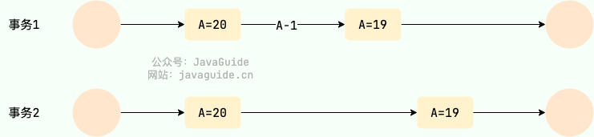
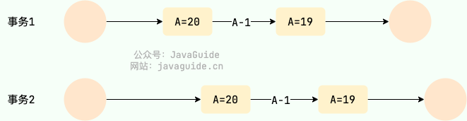
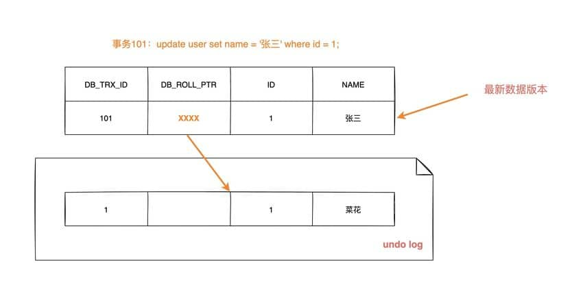

## 什么是事务

<u>数据库事务是一系列数据库操作（例如插入、更新、删除等），它们被视为一个单独的逻辑单元，并且要么全部成功执行，要么全部回滚（即撤销）</u>。事务具有四个标准特性，通常称为 ACID 特性：

1.  **原子性（Atomicity）**：<u>事务是一个原子操作单元，它要么完全执行，要么完全不执行</u>。如果事务的所有操作都成功执行，则事务被提交（commit），否则事务将被回滚（rollback）到初始状态。
2.  **一致性（Consistency）**：<u>事务执行之后，数据库的状态应该从一个一致状态转变为另一个一致状态</u>。这意味着事务必须遵守数据库的所有约束，包括唯一性约束、外键约束等。即数据不会被破坏, 如 A 转账 100 元给 B, 不管操作是否成功, A 和 B 的账户总额是不变的
3.  **隔离性（Isolation）**：<u>事务的执行应该是相互隔离的，即一个事务的执行不应该影响其他事务的执行</u>。隔离性确保了并发事务的正确执行，防止了由于多个事务并发执行而导致的数据不一致问题。
4.  **持久性（Durability）**：<u>一旦事务提交，其所做的修改应该永久保存在数据库中，即使系统崩溃或发生故障也不会丢失</u>。持久性保证了数据的持久性和可靠性。

数据库事务的目的是确保数据的完整性和一致性，同时提供并发控制和故障恢复功能，以确保数据库在任何情况下都能保持可靠性。

## 并发事务带来了哪些问题

并发事务是指多个事务同时在数据库中执行，可能导致数据一致性和完整性问题。以下是并发事务带来的主要问题：

### 脏读 (Dirty Read)

一个事务读取了另一个事务尚未提交的修改数据。如果第一个事务回滚，这些读取的数据将变为无效。

-   事务A修改了一个值，但未提交。
-   事务B读取了该修改值。
-   如果事务A回滚，事务B读到的数据将是无效的。

### 不可重复读 (Non-repeatable Read)

在同一事务中，先后两次读取同一行数据，结果不一致。因为在两次读取之间，另一个事务修改了该数据并提交了。

-   事务A读取一个值。
-   事务B修改该值并提交。
-   事务A再次读取同一值，发现值已改变。

### 幻读 (Phantom Read)

一个事务在读取某个范围的数据时，另一个事务在该范围内插入了新数据，导致前一个事务再次读取时，发现多了一些“幻影”行。

-   事务A读取符合某条件的一组行。
-   事务B插入一些新行，这些新行也符合事务A的条件。
-   事务A再次读取时，发现比第一次读取多了一些行。

### 更新丢失 (Lose Update)

两个事务都读取同一个数据并进行修改，最后一个事务的修改覆盖了前一个事务的修改，导致前一个事务的更新丢失。

-   事务A和事务B都读取同一个值。
-   事务A修改该值并提交。
-   事务B也修改该值并提交，覆盖了事务A的修改。

**不可重复读和幻读的区别**:

不可重复读的重点是修改比如多次读取一条记录发现其中某些列的值被修改, 而幻读的重点在于新增或者删除比如多次读取一条记录发现记录增多或减少了

## 并发事务的控制方式有哪些？

MySQL 中并发事务的控制方式无非就两种：**锁** 和 **MVCC**。锁可以看作是悲观控制的模式，多版本并发控制（MVCC，Multiversion concurrency control）可以看作是乐观控制的模式。

**锁** 控制方式下会通过锁来显式控制共享资源而不是通过调度手段，MySQL 中主要是通过 **读写锁** 来实现并发控制。

-   **共享锁（S 锁）**：又称读锁，事务在读取记录的时候获取共享锁，允许多个事务同时获取（锁兼容）。
-   **排他锁（X 锁）**：又称写锁/独占锁，事务在修改记录的时候获取排他锁，不允许多个事务同时获取。如果一个记录已经被加了排他锁，那其他事务不能再对这条记录加任何类型的锁（锁不兼容）。

读写锁可以做到读读并行，但是无法做到写读、写写并行。另外，根据根据锁粒度的不同，又被分为 **表级锁(table-level locking)**和 **行级锁(row-level locking)** 。InnoDB 不光支持表级锁，还支持行级锁，默认为行级锁。行级锁的粒度更小，仅对相关的记录上锁即可（对一行或者多行记录加锁），所以对于并发写入操作来说， InnoDB 的性能更高。不论是表级锁还是行级锁，都存在共享锁（Share Lock，S 锁）和排他锁（Exclusive Lock，X 锁）这两类。

## MVCC

多版本并发控制（Multi-Version Concurrency Control，MVCC）是一种用于处理数据库中并发事务的方法。<u>MVCC 允许多个事务同时读取和写入数据</u>，而不会相互阻塞，从而提高了数据库的并发性能和吞吐量。<u>MVCC 通过维护数据的多个版本，使得读操作可以在不阻塞写操作的情况下进行</u>。

<u>MVCC 的核心思想是为每个数据行保留多个版本，每个版本都有相关的时间戳或事务ID</u>。当一个事务读取数据时，它根据自己的时间戳或事务ID决定读取哪个版本的数据。写操作则会创建新的数据版本，旧版本不会立即被删除，而是保留到没有事务需要访问它们为止。

### 可以为数据库解决什么问题

1.  **提高并发性能**：多个事务可以同时读取数据而不阻塞写操作，提高了数据库的并发性能。
2.  **减少锁争用**：读取操作不需要加锁，减少了事务之间的锁争用和等待。
3.  **实现快照隔离**：保证事务读取一致性，通过读取数据快照避免了脏读、不可重复读等问题, 但不能解决更新丢失问题

### 实现原理

1.   **数据结构**

-   隐藏列：在每行数据中存储两个隐藏的列：`DB_TRX_ID` 和 `DB_ROLL_PTR`
    -   <u>`DB_TRX_ID`：记录最近一次修改该行数据的事务ID</u>。
    -   <u>`DB_ROLL_PTR`：指向回滚段（Undo Log），用于存储数据行的旧版本</u>。

2.   **插入和更新**

-   插入数据：

    -   插入新的数据行时，设置 `DB_TRX_ID` 为当前事务ID，`DB_ROLL_PTR` 为空。

        

-   更新数据：

    -   更新数据行时，创建一个新版本，`DB_TRX_ID` 设置为当前事务ID，新版本指向旧版本的 `DB_ROLL_PTR`。

    -   旧版本的数据保存在回滚段中。

    -   数据第一次被修改时：

        

    -   数据第二次被修改时：

        

3.   **读取数据**

-   一致性读（快照读）：
    -   读取数据时，根据事务ID决定读取哪个版本的数据。
    -   事务会检查每行数据的 `DB_TRX_ID`，只有在事务开始之前已经提交的事务ID对应的数据才会被读取。
-   当前读：
    -   当前读需要最新的数据版本，会读取当前正在修改的数据，并可能加锁以保证一致性。

4.   **回滚和清理**

-   回滚段（Undo Log）：
    -   回滚段保存旧版本的数据，用于支持事务回滚和一致性读。
    -   当事务回滚时，利用回滚段将数据恢复到之前的状态。
    -   不同事务或者相同事务的对同一记录行的修改，会使该记录行的 Undo log 成为一条链表，链首就是最新的记录，链尾就是最早的旧记录。
-   清理（Purge）：
    -   随着时间推移，旧版本数据可能不再需要，数据库系统会定期清理这些旧版本以释放空间。

## 事务隔离级别

1. **读未提交（Read Uncommitted）**

    -   最低的隔离级别。

    -   允许一个事务读取另一个事务未提交的数据（脏读）。

    -   <u>可能出现的并发问题：脏读（Dirty Read）、不可重复读（Non-repeatable Read）、幻读（Phantom Read）</u>。

2. **读已提交（Read Committed）**
    -   事务只能读取已经提交的数据。
    -   <u>防止脏读，但可能出现不可重复读和幻读</u>。
    -   Oracle数据库的默认隔离级别。

3. **可重复读（Repeatable Read）**
    -   确保在一个事务内多次读取同一数据，结果是一致的。
    -   <u>防止脏读和不可重复读，但可能出现幻读</u>。
    -   **<u>MySQL的默认隔离级别</u>**

4. **可序列化（Serializable）**
    -   最高的隔离级别, 完全服从 ACID 的隔离级别
    -   强制事务按顺序执行，完全隔离。
    -   <u>防止脏读、不可重复读和幻读</u>。
    -   代价高，性能影响大，因为它会导致大量的锁定和等待。

| 隔离级别         | 脏读 | 不可重复读 | 幻读 |
| :--------------- | :--- | ---------- | ---- |
| READ-UNCOMMITTED | √    | √          | √    |
| READ-COMMITTED   | ×    | √          | √    |
| REPEATABLE-READ  | ×    | ×          | √    |
| SERIALIZABLE     | ×    | ×          | ×    |

##  MySQL 的隔离级别是基于锁实现的吗？

MySQL 的隔离级别基于锁和 MVCC 机制共同实现的。

SERIALIZABLE 隔离级别是通过锁来实现的，READ-COMMITTED 和 REPEATABLE-READ 隔离级别是基于 MVCC 实现的。不过， SERIALIZABLE 之外的其他隔离级别可能也需要用到锁机制，就比如 REPEATABLE-READ 在当前读情况下需要使用加锁读来保证不会出现幻读。