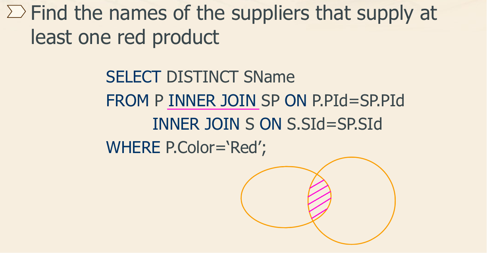
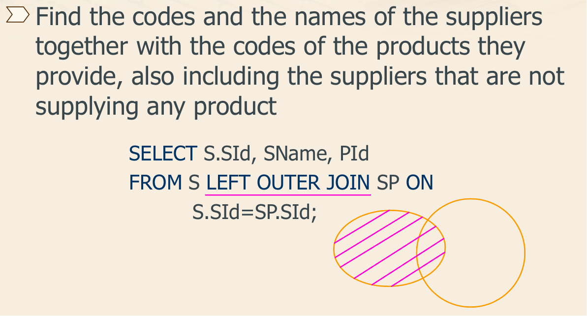

## 数据库的三范式是什么

1.  第一范式（1NF）：确保每个列都是原子性的，不可再分。这意味着每个列中的值都是单一的，不包含多个值或重复组。

2.  第二范式（2NF）：确保表中的每列都完全依赖于主键 (primary key)（或主键的组合）。换句话说，每个非主键列都应该完全依赖于主键，而不是部分依赖。

    

3.  第三范式（3NF）：在达到第二范式的基础上，消除非主属性对其他非主属性的传递依赖。换句话说，表中的每个非主属性都应该直接依赖于主键，而不是依赖于其他非主属性。


##  主键和外键有什么区别?

-   **主键(主码)**：主键用于唯一标识一个元组，不能有重复，不允许为空。一个表只能有一个主键。
-   **外键(外码)**：外键用来和其他表建立联系用，外键是另一表的主键，外键是可以有重复的，可以是空值。一个表可以有多个外键。


## 主键和候选键有什么区别

主键和候选键都用于唯一标识表中的记录，但主键是从候选键中选出来的主要标识键，一个表只能有一个主键，但可以有多个候选键。主键有更严格的约束条件，且数据库系统会为其自动创建索引，而候选键通常通过 `UNIQUE` 约束定义，索引需要手动创建。按照惯例, 候选键可以被指定为主键, 并且可以用于任何外键引用


## DROP, DELETE 与 TRUNCATE 的区别

1.   **DROP**:

     **用途**：用于删除整个数据库对象（如表、视图、索引等）。

     **特点**：

     -   完全删除数据库对象及其所有数据。
     -   不可回滚，删除操作后无法恢复。
     -   删除后，该对象不再存在，所有与之相关的权限和依赖关系也会被删除。

     ```sql
     DROP TABLE table_name;
     DROP DATABASE database_name;
     DROP INDEX index_name ON table_name;
     ```

2.   **DELETE**:

     **用途**：用于删除表中的特定行（记录）。

     **特点**：

     -   只删除满足条件的行。如果不加 `WHERE` 子句，会删除表中所有行，但表结构依然保留。
     -   删除操作会记录在事务日志中，因此可以回滚。
     -   支持触发器 (Trigger)，可以触发与删除操作相关的触发器。
     -   可以删除特定的记录，更加灵活。

     ```sql
     DELETE FROM table_name WHERE condition;
     ```

3.   **TRUNCATE**:

     **用途**：用于快速清空表中的所有数据，但保留表结构。

     **特点**：

     -   删除所有行，但保留表结构（包括列、约束等）。
     -   不记录逐行删除操作，而是整体清空，因此速度比 `DELETE` 快。
     -   一般情况下，无法回滚，因为不记录每行删除操作（取决于具体数据库系统的实现）。
     -   不会触发 `DELETE` 触发器，因为它不是逐行删除操作。
     -   重置表的自增计数器（如果有）。

     ```sql
     TRUNCATE TABLE table_name;
     ```

总结:

-   **`DROP`**：删除整个数据库对象（如表），不可恢复。
-   **`DELETE`**：删除表中的特定行，可恢复，支持条件删除。
-   **`TRUNCATE`**：清空表中的所有数据，保留表结构，不记录逐行删除操作，速度快，通常不可恢复。


## 什么是视图

视图（View）是关系数据库管理系统（RDBMS）中的一种<u>虚拟表</u>，它是基于一个或多个基础表（或视图）的查询结果。视图不存储实际的数据，而是存储一个查询定义。通过视图，用户可以像操作真实表一样查询数据。对视图的修改不影响基本表, 它使得我们获取数据更容易, 相比于多表查询

使用 `CREATE VIEW` 语句可以创建视图: 

```sql
CREATE VIEW view_name AS
SELECT column1, column2, ...
FROM table_name
WHERE condition;
```

假设我们有一个员工表 `employees`: 

```sql
CREATE TABLE employees (
    employee_id INT,
    first_name VARCHAR(50),
    last_name VARCHAR(50),
    department VARCHAR(50),
    salary DECIMAL(10, 2)
);
```

我们可以创建一个视图，只显示员工的姓名和部门: 

```sql
CREATE VIEW employee_view AS
SELECT first_name, last_name, department
FROM employees;
```

现在，我们可以像查询表一样查询视图: 

```sql
SELECT * FROM employee_view;
```


## 什么是内联接, 左外联接, 右外联接

*   内联接 (Inner Join): 匹配两张表中相关联的记录

    

*   左外联接 (Left Outer Join): 除了匹配 2 张表中相关联的记录外, 还会匹配左表中剩余的记录, 右表中未匹配到的字段用 NULL 表示

    

*   右外联接 (Right Outer Join): 除了匹配 2 张表中相关联的记录外, 还会匹配右表中剩余的记录, 左表中未匹配到的字段用 NULL 表示


## 说说在 MySQL 中一条查询 SQL 是如何执行的

```sql
SELECT name FROM t_user WHERE id=1
```

-   **连接**: 客户端连接到MySQL服务器
-   **查询缓存**: key 为 SQL 语句, value 为查询结果, 如果查到就直接返回; 不建议使用次缓存, 在 MySQL 8.0 版本已经将查询缓存删除, 也就是说 MySQL 8.0 版本后不存在此功能
-   **解析和预处理**: 解析器解析SQL语句, 检查语法和表结构; 一般语法错误在此阶段
-   **优化**: 在表里有多个索引的时候, 决定使用哪个索引; 或者一个语句中存在多表关联的时候 (JOIN), 决定各个表的连接顺序
-   **执行**: 通过分析器让 SQL 知道你要干啥, 通过优化器知道该怎么做, 于是开始执行语句; 执行语句的时候还要判断是否具备此权限, 没有权限就直接返回提示没有权限的错误; 有权限则打开表, 根据表的引擎定义, 去使用这个引擎提供的接口, 获取这个表的第一行, 判断 id 是都等于 1; 如果是, 直接返回; 如果不是继续调用引擎接口去下一行, 重复相同的判断, 直到取到这个表的最后一行, 最后返回
-   **返回结果**：将查询结果发送回客户端。

