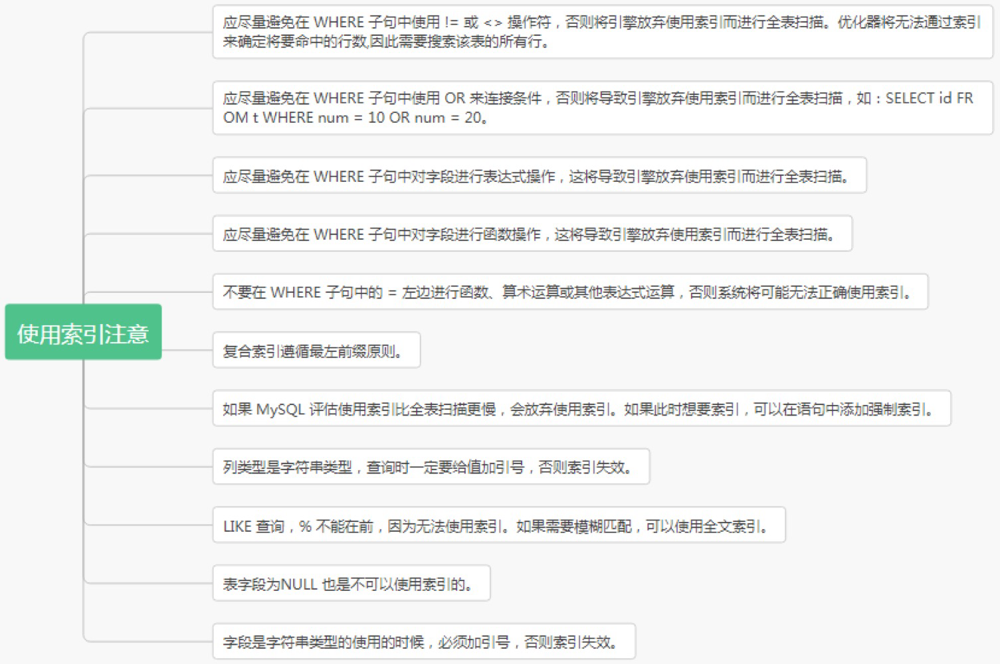
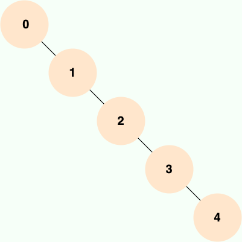
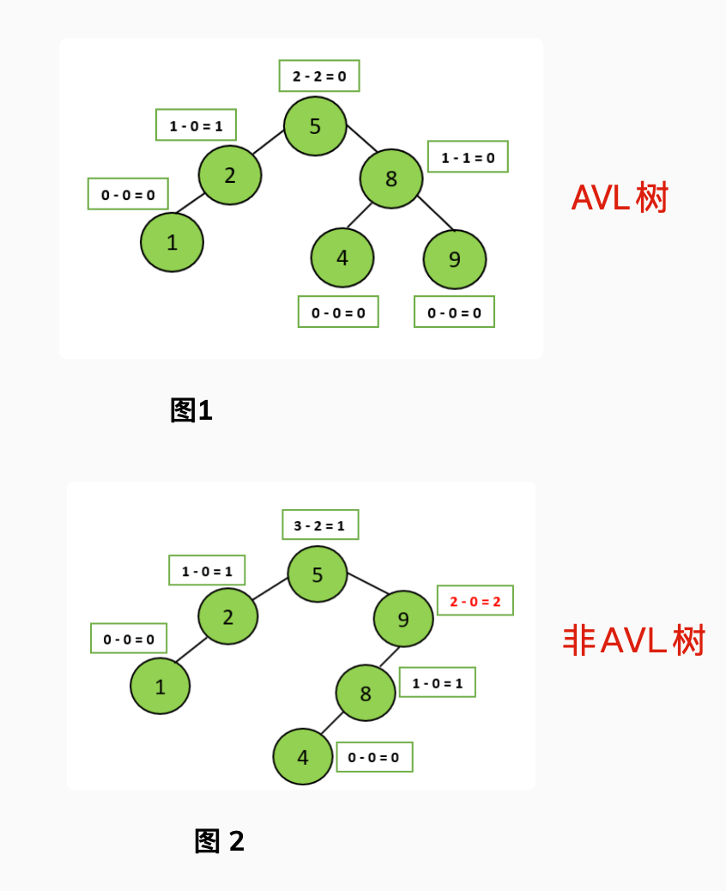

## 索引是什么

在数据库中，**索引是一种用于提高数据库表的检索速度和查询性能的数据结构，其本质可以看成是一种排序好的数据结构**。通过使用索引，数据库系统可以快速定位到符合特定条件的行，而无需扫描整个表。更通俗的说, 数据库索引好比是一本书的前目录, 能<u>加快数据库的查询速度</u>

一般来说索引本身也很大, 不可能全部存储在内存中, 因此<u>索引往往是存储在磁盘上的文件中的</u> (可能存储在单独的索引文件中, 也可能和数据一起存储在数据文件中)

索引底层数据结构存在很多种类型，常见的索引结构有: B 树， B+树 和 Hash、红黑树。在 MySQL 中，无论是 Innodb 还是 MyIsam，都使用了 <u>B+树作为索引结构</u>。


## 索引的优缺点

**优点:**

1.   <u>提高数据的检索速度, 降低数据库 IO 成本</u>: 使用索引的意义就是通过缩小表中需要查询的记录的数目从而加快搜索的速度
2.   <u>降低数据排序的成本, 降低 CPU 消耗</u>: 索引之所以查的快, 是因为先将数据排好序, 若该字段正好需要排序, 则正好降低了排序的成本

**缺点:**

1.   <u>占用存储空间</u>: 索引实际上也就是一张表, 记录了主键与索引字段, 一般以索引文件的形式存储在磁盘上
2.   <u>降低更新表的速度</u>: 表的数据发生了变化, 对于的索引也需要一起变更, 从而降低了更新速度; 否则索引指向的物理数据可能不对, 这也是索引失效的原因之一


## 主键与索引有什么区别

*   <u>主键一定会创建一个唯一索引, 但是有唯一索引的列不一定是主键</u>
*   主键不允许为空值, 唯一索引列允许空值
*   一个表只能有一个主键, 但是可以有多个唯一索引
*   <u>主键可以被其他表引用为外键, 唯一索引列不可以</u>;
*   主键主要用于数据完整性和唯一标识, 而索引主要用于加速数据检索


## 索引类型有哪些

1.   **主键索引（Primary Key Index）**:

     主键索引是唯一索引的一种特殊类型。每个表只能有一个主键，主键列中的值必须唯一且不能为空（NOT NULL）。

2.   **唯一索引（Unique Index）**:

     唯一索引要求索引列中的所有值必须唯一，可以有多个唯一索引。唯一索引列可以包含NULL值，但NULL值不能重复。

3. **常规索引（Regular Index）或 普通索引（Index）**:

    常规索引允许列中的值重复和空，可以在一个表中创建多个常规索引。

4. **前缀索引（Prefix Index）**: 

    前缀索引只适用于字符串类型的数据。前缀索引是对文本的前几个字符创建索引，相比普通索引建立的数据更小，因为只取前几个字符。

5. **全文索引（Full-text Index）**:

    全文索引用于全文搜索，在InnoDB和MyISAM存储引擎中都支持。只能在文本类型 CHAR, VARCHAR, TEXT 类型字段上创建全文索引; 字段长度比较长, 如果创建普通索引, 在进行 like 模糊查询时效率比较低, 这时可以创建全文索引

6. **空间索引 (Spatial Index)**:

    MySQL 在 5.7 之后的版本支持了空间索引, 而且支持 OpenGIS 几何数据模型; MySQL 在空间索引这方面遵循 OpenGIS 几何数据模型规则

7. **其他 (按照索引列数量分类)**:

    *   单列索引

    *   组合索引

        组合索引的使用, 需要遵循<u>最左前缀匹配原则 (最左匹配原则);</u> 一般情况下在条件允许的情况下使用组合索引替代多个单列索引使用


## 什么时候不要使用索引

1.   <u>经常增删改的列不要建立索引</u>; 索引需要维护, 一旦列频繁更新, 每次更新都会涉及索引的更新, 导致额外的性能开销
2.   <u>表记录太少不要建立索引</u>; 对于行数很少的小表, 全表扫描的成本并不高, 使用索引可能带来的性能提升微乎其微, 甚至会因为维护索引而增加开销
3.   <u>有大量重复的列不要建立索引</u>; 


## 使用 MySQL 的索引应该注意些什么




## 索引底层数据结构选型

### Hash 表

哈希表是键值对的集合，通过键(key)即可快速取出对应的值(value)，因此哈希表可以快速检索数据（接近 O（1））。

**为何能够通过 key 快速取出 value 呢？** 原因在于 **哈希算法**（也叫散列算法）。通过哈希算法，我们可以快速找到 key 对应的 index，找到了 index 也就找到了对应的 value。

```
hash = hashfunc(key)
index = hash % array_size
```


但是！哈希算法有个 **Hash 冲突** 问题，也就是说多个不同的 key 最后得到的 index 相同。通常情况下，我们常用的解决办法是 **链地址法**。链地址法就是将哈希冲突数据存放在链表中。就比如 JDK1.8 之前 `HashMap` 就是通过链地址法来解决哈希冲突的。不过，JDK1.8 以后`HashMap`为了减少链表过长的时候搜索时间过长引入了红黑树。


为了减少 Hash 冲突的发生，一个好的哈希函数应该“均匀地”将数据分布在整个可能的哈希值集合中。

既然哈希表这么快，**为什么 MySQL 没有使用其作为索引的数据结构呢？** 主要是因为 Hash 索引不支持顺序和范围查询。假如我们要对表中的数据进行排序或者进行范围查询，那 Hash 索引可就不行了。并且，每次 IO 只能取一个。

试想一种情况:

```
SELECT * FROM tb1 WHERE id < 500;
```

在这种范围查询中，优势非常大，直接遍历比 500 小的叶子节点就够了。而 Hash 索引是根据 hash 算法来定位的，难不成还要把 1 - 499 的数据，每个都进行一次 hash 计算来定位吗?这就是 Hash 最大的缺点了。

### 二叉查找树(BST)

二叉查找树（Binary Search Tree）是一种基于二叉树的数据结构，它具有以下特点：

1.  左子树所有节点的值均小于根节点的值。
2.  右子树所有节点的值均大于根节点的值。
3.  左右子树也分别为二叉查找树。

当二叉查找树是平衡的时候，也就是树的每个节点的左右子树深度相差不超过 1 的时候，查询的时间复杂度为 O(log2(N))，具有比较高的效率。然而，当二叉查找树不平衡时，例如在最坏情况下（有序插入节点），树会退化成线性链表（也被称为斜树），导致查询效率急剧下降，时间复杂退化为 O（N）。



也就是说，**二叉查找树的性能非常依赖于它的平衡程度，这就导致其不适合作为 MySQL 底层索引的数据结构。**

为了解决这个问题，并提高查询效率，人们发明了多种在二叉查找树基础上的改进型数据结构，如平衡二叉树、B-Tree、B+Tree 等。

### AVL 树

AVL 树是计算机科学中最早被发明的自平衡二叉查找树，它的名称来自于发明者 G.M. Adelson-Velsky 和 E.M. Landis 的名字缩写。AVL 树的特点是保证任何节点的左右子树高度之差不超过 1，因此也被称为高度平衡二叉树，它的查找、插入和删除在平均和最坏情况下的时间复杂度都是 O(logn)。



AVL 树采用了旋转操作来保持平衡。主要有四种旋转操作：LL 旋转、RR 旋转、LR 旋转和 RL 旋转。其中 LL 旋转和 RR 旋转分别用于处理左左和右右失衡，而 LR 旋转和 RL 旋转则用于处理左右和右左失衡。

由于 AVL 树需要频繁地进行旋转操作来保持平衡，因此会有较大的计算开销进而降低了数据库写操作的性能。并且， 在使用 AVL 树时，每个树节点仅存储一个数据，而每次进行磁盘 IO 时只能读取一个节点的数据，如果需要查询的数据分布在多个节点上，那么就需要进行多次磁盘 IO。 **磁盘 IO 是一项耗时的操作，在设计数据库索引时，我们需要优先考虑如何最大限度地减少磁盘 IO 操作的次数。**

实际应用中，AVL 树使用的并不多。

### 红黑树

红黑树是一种自平衡二叉查找树，通过在插入和删除节点时进行颜色变换和旋转操作，使得树始终保持平衡状态，它具有以下特点：

1.  每个节点非红即黑；
2.  根节点总是黑色的；
3.  每个叶子节点都是黑色的空节点（NIL 节点）；
4.  如果节点是红色的，则它的子节点必须是黑色的（反之不一定）；
5.  从任意节点到它的叶子节点或空子节点的每条路径，必须包含相同数目的黑色节点（即相同的黑色高度）。


和 AVL 树不同的是，红黑树并不追求严格的平衡，而是大致的平衡。正因如此，红黑树的查询效率稍有下降，因为红黑树的平衡性相对较弱，可能会导致树的高度较高，这可能会导致一些数据需要进行多次磁盘 IO 操作才能查询到，这也是 MySQL 没有选择红黑树的主要原因。也正因如此，红黑树的插入和删除操作效率大大提高了，因为<u>红黑树在插入和删除节点时只需进行 O(1) 次数的旋转和变色操作，即可保持基本平衡状态，而不需要像 AVL 树一样进行 O(logn) 次数的旋转操作</u>。

**红黑树的应用还是比较广泛的，TreeMap、TreeSet 以及 JDK1.8 的 HashMap 底层都用到了红黑树。对于数据在内存中的这种情况来说，红黑树的表现是非常优异的。**

### B 树 & B+树

B 树也称 B-树,全称为 **多路平衡查找树** ，B+ 树是 B 树的一种变体。B 树和 B+树中的 B 是 `Balanced` （平衡）的意思。

目前大部分数据库系统及文件系统都采用 B-Tree 或其变种 B+Tree 作为索引结构。

**B 树 & B+树两者有何异同呢？**

-   B 树的所有节点既存放键(key) 也存放数据(data)，而 B+树只有叶子节点存放 key 和 data，其他内节点只存放 key。
-   B 树的叶子节点都是独立的;B+树的叶子节点有一条引用链指向与它相邻的叶子节点。
-   B 树的检索的过程相当于对范围内的每个节点的关键字做二分查找，可能还没有到达叶子节点，检索就结束了。而 B+树的检索效率就很稳定了，任何查找都是从根节点到叶子节点的过程，叶子节点的顺序检索很明显。
-   在 B 树中进行范围查询时，首先找到要查找的下限，然后对 B 树进行中序遍历，直到找到查找的上限；而 B+树的范围查询，只需要对链表进行遍历即可。

综上，B+树与 B 树相比，具备更少的 IO 次数、更稳定的查询效率和更适于范围查询这些优势。

在 MySQL 中，MyISAM 引擎和 InnoDB 引擎都是使用 B+Tree 作为索引结构，但是，两者的实现方式不太一样。
