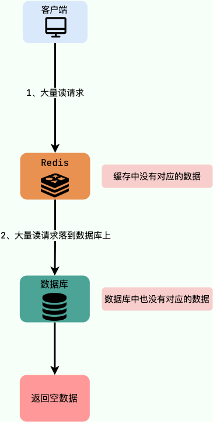

## 什么是 Redis

Redis（Remote Dictionary Server）是一个开源的内存数据结构存储系统，主要作为数据库、缓存和消息代理使用。与传统数据库不同的是，Redis 的数据是保存在内存中的（内存数据库，支持持久化），因此读写速度非常快，被广泛应用于分布式缓存方向。并且，Redis 存储的是 KV 键值对数据。Redis 支持多种数据结构，如字符串、哈希表、列表、集合、有序集合、位图、HyperLogLogs 以及地理空间索引半径查询。以下是 Redis 的一些主要特点和用途：

1.  **内存存储**：所有数据都保存在内存中，提供了极快的读写速度。适合对速度要求极高的应用场景。
2.  **持久化**：虽然数据存储在内存中，但可以通过快照（RDB）或日志追加（AOF）实现持久化，确保数据在重启后不会丢失。
3.  **丰富的数据结构**：Redis 支持多种高级数据结构，方便实现复杂的数据操作。
4.  **复制和高可用性**：Redis 支持主从复制，可以设置从服务器进行读操作，减轻主服务器压力。还可以通过Redis Sentinel实现高可用性和自动故障转移。
5.  **分片和集群**：通过 Redis Cluster 实现数据分片，支持大规模数据集和高并发处理。
6.  **脚本和事务**：支持 Lua 脚本和事务操作，确保一系列命令的原子性。

## Redis 除了做缓存，还能做什么

-   **分布式锁**：通过 Redis 来做分布式锁是一种比较常见的方式。通常情况下，我们都是基于 Redisson 来实现分布式锁。
-   **限流**：一般是通过 Redis + Lua 脚本的方式来实现限流。如果不想自己写 Lua 脚本的话，也可以直接利用 Redisson 中的 `RRateLimiter` 来实现分布式限流，其底层实现就是基于 Lua 代码+令牌桶算法。
-   **消息队列**：Redis 自带的 List 数据结构可以作为一个简单的队列使用。Redis 5.0 中增加的 Stream 类型的数据结构更加适合用来做消息队列。它比较类似于 Kafka，有主题和消费组的概念，支持消息持久化以及 ACK 机制。
-   **延时队列**：Redisson 内置了延时队列（基于 Sorted Set 实现的）。
-   **分布式 Session** ：利用 String 或者 Hash 数据类型保存 Session 数据，所有的服务器都可以访问。
-   **复杂业务场景**：通过 Redis 以及 Redis 扩展（比如 Redisson）提供的数据结构，我们可以很方便地完成很多复杂的业务场景比如通过 Bitmap 统计活跃用户、通过 Sorted Set 维护排行榜。
-   ……

## Redis 有哪些数据类型？这些数据类型的应用场景分别是什么？

Redis 中比较常见的数据类型有下面这些：

-   **5 种基础数据类型**：String（字符串）、List（列表）、Set（集合）、Hash（散列）、SortedSet（有序集合）。
-   **3 种特殊数据类型**：HyperLogLog（基数统计）、Bitmap （位图）、Geospatial (地理位置)。

以下是 Redis 的主要数据类型及其应用场景：

1. **字符串（String）**：Redis 中最基本的数据类型，可以是文本、二进制数据、JSON 等。每个键最多存储 512MB 的数据。 

    **应用场景**：

    -   **缓存对象**：如用户信息、会话数据。

    -   **计数器**：利用 INCR 和 DECR 命令实现原子计数。

    -   **简单消息存储**：如短消息、状态信息等。

2. **哈希表（Hash）**：存储键值对的集合，类似于 Python 的字典或 Java 的 HashMap。 

    **应用场景**：

    -   **对象存储**：如存储用户信息（用户名、密码、电子邮件等），可以用哈希存储每个用户的属性。

    -   **配置管理**：存储应用配置参数，便于动态更新。

3. **列表（List）**：有序的字符串列表，支持从两端推入/弹出元素。 

    **应用场景**：

    -   **消息队列**：利用 LPUSH/RPUSH 和 LPOP/RPOP 实现任务队列、工作队列。

    -   **日志存储**：记录日志信息，按时间顺序存储和读取。

    -   **时间线**：如社交网络中的时间线功能。

4. **集合（Set）**：无序的字符串集合，集合中的元素是唯一的。 

    **应用场景**：

    -   **标签系统**：如用户标签、文章标签。

    -   **去重功能**：如统计独立访问用户（UV）。

    -   **交集、并集、差集运算**：如推荐系统中计算共同好友、共同兴趣等。

5. **有序集合（Sorted Set）**：类似集合，但每个元素都有一个分数（score），元素按分数排序。 

    **应用场景**：

    -   **排行榜**：如游戏中的得分排行榜。

    -   **延迟队列**：按任务优先级或延迟时间排序。

    -   **时间序列数据**：如股票价格变化、事件日志等。

6. **位图（Bitmap）**：操作字符串的比特位，可以看作是一个连续的位数组。 

    **应用场景**：

    -   **用户活跃状态**：记录用户每日活跃状态。

    -   **布隆过滤器**：用于快速判断一个元素是否存在于集合中。

    -   **快速计数**：如统计每天的用户访问情况。

7. **HyperLogLog**：一种用于基数估计的数据结构，可以在固定的内存空间内估算集合的基数（独立元素的数量）。

    **应用场景**：

    -   **唯一访客计数**：统计网站或应用的独立访问用户数。

    -   **去重计数**：如社交网络中独立标签的计数。

8. **地理空间索引（Geospatial）**：支持存储地理位置和执行地理空间查询。 

    **应用场景**：

    -   **位置服务**：如附近的商家、用户定位。

    -   **地理围栏**：如确定用户是否在特定区域内。

Redis 提供的多种数据类型及其强大的功能，使其适用于各种复杂的应用场景，满足不同的数据存储和处理需求。

## Redis6.0 之后为何引入了多线程

虽然说 Redis 是单线程模型，但实际上，**Redis 在 4.0 之后的版本中就已经加入了对多线程的支持。**

<u>Redis 6.0 引入多线程的主要目的是为了提升网络 I/O 性能，从而提高整体吞吐量和响应速度</u>。以下是具体原因和多线程带来的优势：

**原因**:

1.  **I/O 瓶颈**：在 Redis 6.0 之前，Redis 主要依赖单线程处理所有任务，包括网络 I/O 和命令执行。虽然这种设计简化了实现并避免了并发问题，但也导致了 I/O 操作成为性能瓶颈。尤其在高并发环境中，网络 I/O 操作（如读取客户端请求和发送响应）会占用大量时间，限制了 Redis 的整体性能。
2.  **CPU 利用率**：尽管 Redis 的核心是单线程，但现代多核处理器的普及意味着单线程无法充分利用多核 CPU 的计算能力。在 I/O 密集型任务中，这种单线程设计导致了 CPU 利用率低下。

**多线程的优势**:

1.  **提高并发处理能力**：通过引入多线程，Redis 可以并行处理多个网络请求，从而减少每个请求的等待时间，显著提高吞吐量和响应速度。
2.  **优化网络 I/O**：多线程主要用于处理网络 I/O 操作，包括读取客户端请求和发送响应。这些操作在单线程模式下会成为瓶颈，通过多线程可以显著降低延迟。
3.  **保持简单性**：Redis 引入多线程的方式非常谨慎，<u>主要用于 I/O 操作，而命令的实际执行仍然在单线程中进行</u>。这样既可以提高性能，又避免了复杂的并发控制问题。

**实现细节**:

1.  **I/O 多线程**：Redis 6.0 引入的多线程模型主要用于处理网络 I/O 操作。具体来说，Redis 使用多个 I/O 线程来读取客户端请求和发送响应，而命令的执行仍然由主线程负责。
2.  **可配置性**：多线程功能是可配置的，用户可以根据需要启用或禁用多线程，并指定使用的线程数量。通过配置 `io-threads` 选项，可以灵活调整 Redis 的性能。

**实际效果**:

在启用多线程后，Redis 的性能特别是在高并发环境下有了显著提升。例如，在处理大量小请求时，多线程能够充分利用 CPU 资源，降低每个请求的响应时间。

注意事项:

尽管多线程带来了性能提升，但并不是所有场景都适合启用多线程。在 CPU 绑定的任务（如复杂的命令执行）中，多线程可能不会带来显著的性能提升。因此，用户需要根据具体的使用场景和负载情况来决定是否启用多线程。

结论:

**Redis 6.0 引入多线程主要是为了解决网络 I/O 操作的瓶颈，通过并行处理提高系统的整体吞吐量和响应速度，同时保持了命令执行的单线程模式，简化了并发控制。**

## Redis 过期数据删除策略

如果假设你设置了一批 key 只能存活 1 分钟，那么 1 分钟后，Redis 是怎么对这批 key 进行删除的呢？

常用的过期数据的删除策略就下面这几种（重要！自己造缓存轮子的时候需要格外考虑的东西）：

1.  **惰性删除**：只会在取出/查询 key 的时候才对数据进行过期检查。这种方式对 CPU 最友好，但是可能会造成太多过期 key 没有被删除。
2.  **定期删除**：周期性地随机从设置了过期时间的 key 中抽查一批，然后逐个检查这些 key 是否过期，过期就删除 key。相比于惰性删除，定期删除对内存更友好，对 CPU 不太友好。
3.  **延迟队列**：把设置过期时间的 key 放到一个延迟队列里，到期之后就删除 key。这种方式可以保证每个过期 key 都能被删除，但维护延迟队列太麻烦，队列本身也要占用资源。
4.  **定时删除**：每个设置了过期时间的 key 都会在设置的时间到达时立即被删除。这种方法可以确保内存中不会有过期的键，但是它对 CPU 的压力最大，因为它需要为每个键都设置一个定时器。

## Redis 的持久化策略了解嘛？分别介绍下 RDB 和 AOF

Redis 提供了两种主要的持久化策略：RDB（Redis Database Backup）和 AOF（Append-Only File）。这两种策略各有优缺点，适用于不同的使用场景。下面详细介绍这两种持久化方式：

**RDB（Redis Database Backup）**: RDB 持久化通过生成 Redis 数据集在某一时间点上的快照来保存数据。

**机制**:

-   **快照生成**：Redis 会在指定的时间间隔或特定条件下生成数据快照，并将其保存到磁盘上。生成快照的过程包括将内存中的所有数据写入一个临时文件，完成后再将这个文件替换之前的 RDB 文件。
-   **触发条件**：
    -   自动触发：根据配置文件 `redis.conf` 中的 `save` 选项，Redis 可以在满足特定条件（如一定时间内有一定数量的写操作）时自动生成快照。
    -   手动触发：通过执行 `SAVE` 或 `BGSAVE` 命令，用户可以手动触发快照生成。`SAVE` 命令会阻塞 Redis 服务器，而 `BGSAVE` 命令则会在后台进行。

**优点**: 

-   **性能开销低**：RDB 文件在生成期间的 I/O 操作是批量的，因此对 Redis 性能的影响较小。
-   **恢复速度快**：RDB 文件是紧凑的二进制文件，恢复数据时加载速度较快。
-   **数据备份方便**：RDB 文件是一个完整的数据快照，便于备份和迁移。

**缺点**: 

-   **数据丢失风险**：因为 RDB 是定时生成快照，在两次快照之间的数据变更可能会丢失。如果 Redis 崩溃，在上次快照之后的数据会丢失。
-   **生成快照耗时**：对于大数据集，生成 RDB 快照可能会消耗较长时间和大量 I/O 资源。

**AOF（Append-Only File）**: AOF 持久化通过记录每个写操作的日志来保存数据。

**机制**: 

-   **操作日志记录**：Redis 将每个写操作（如 `SET`、`LPUSH` 等）以追加的方式记录到 AOF 文件中。这样，Redis 可以通过重放这些操作来恢复数据。
-   **日志写入策略**：AOF 文件写入策略可配置，有三种模式：
    -   `always`：每次写操作后立即将日志写入磁盘，提供最高的数据安全性，但性能较差。
    -   `everysec`：每秒将日志同步到磁盘，这是默认配置，提供较好的平衡。
    -   `no`：由操作系统决定何时将日志写入磁盘，性能最好，但数据丢失风险最高。
-   **AOF 重写**：随着时间推移，AOF 文件会变得越来越大。Redis 提供 AOF 重写机制，通过创建新的、内容等效但更紧凑的 AOF 文件来减小文件大小。重写过程是在后台进行的，不会阻塞 Redis 服务。

**优点**: 

-   **数据持久性高**：AOF 可以提供比 RDB 更高的数据安全性，因为它记录了每个写操作。特别是在 `always` 模式下，数据丢失的风险最小。
-   **可读性和灵活性**：AOF 文件是一个日志文件，记录了所有的写操作命令，方便审计和调试。

**缺点**: 

-   **文件体积大**：AOF 文件通常比 RDB 文件大，尤其是长时间运行且没有进行重写时。
-   **恢复速度慢**：因为恢复过程需要重放所有的写操作日志，对于大的 AOF 文件，恢复速度较慢。
-   **性能开销高**：频繁的日志写入操作会增加 I/O 负担，影响 Redis 性能。

**结合使用**: 

Redis 支持同时开启 RDB 和 AOF 持久化。这样可以利用 RDB 的快速恢复特性和 AOF 的高数据持久性优势。在实际应用中，通常会同时开启这两种持久化策略，以实现数据安全性和恢复速度的最佳平衡。

## 什么是缓存穿透？什么是缓存击穿？什么是缓存雪崩？怎么解决（最高频问题）

缓存穿透、缓存击穿和缓存雪崩是缓存系统中常见的问题，理解这些问题及其解决方法对于保证缓存系统的稳定性和性能至关重要。

### 缓存穿透

**描述**： 缓存穿透是指客户端请求的数据既不在缓存中，也不在数据库中。这种情况通常发生在请求一个不存在的数据项时，因为缓存没有命中，系统会直接请求数据库，数据库查询也会返回空结果。

**问题**： 如果大量请求都是针对不存在的数据，所有请求都会直接落到数据库上，可能会对数据库造成很大压力。

**解决方案**：

*   **缓存空结果**：如果数据库中没有查到数据，可以将结果（如 null 或特定的占位符）缓存起来，并设置一个较短的过期时间。这样相同的请求在短时间内会直接命中缓存，避免重复查询数据库。

-   **布隆过滤器**：在缓存层增加一个布隆过滤器，用于快速判断请求的键是否可能存在。如果布隆过滤器判断不存在，则直接返回空结果，避免查询数据库。

-   **参数合法性校验**：对请求参数进行合法性校验，过滤掉明显无效的请求。

### 缓存击穿

**描述**： 缓存击穿是指某些热点数据（经常被访问的数据）在缓存过期后，大量请求同时到达缓存，但此时缓存未命中，导致所有请求都打到数据库上，可能引起数据库压力骤增。

**问题**： 大量请求同时查询数据库，可能导致数据库负载过高，甚至宕机。

**解决方案**：

-   **设置热点数据不过期**：对于非常热点的数据，可以设置成永不过期，并通过后台线程定期刷新缓存。

-   **互斥锁（Mutex）**：在缓存失效后，通过加锁（如使用 Redis 的分布式锁）来控制只有一个请求能够查询数据库并更新缓存，其他请求等待缓存更新完成后再从缓存中读取数据。

-   **提前预热**：在缓存失效前，提前刷新缓存中的热点数据。

### 缓存雪崩

**描述**： 缓存雪崩是指在某个时间段内，大量缓存数据同时过期，或者缓存服务器宕机，导致大量请求同时打到数据库上，可能引起数据库崩溃。

**问题**： 数据库承受不住突然激增的请求负载，可能导致服务不可用。

**解决方案**：

-   **缓存过期时间分散**：设置缓存过期时间时，增加随机因子，使缓存过期时间尽量分散，避免同一时间大量缓存数据同时过期。

-   **缓存预热**：在系统启动时，将热点数据预先加载到缓存中，避免缓存未命中。

-   **双层缓存**：在主缓存（如 Redis）和本地缓存之间增加一级缓存，减小缓存宕机时对数据库的直接影响。

-   **限流和熔断**：在应用层增加限流和熔断机制，避免在缓存失效时所有请求直接打到数据库，可以降级处理部分请求。

-   **监控和告警**：实时监控缓存的命中率和数据库的负载情况，出现异常时及时告警并处理。

## Redis 内存淘汰机制了解么？类似问题：MySQL 里有 2000w 数据，Redis 中只存 20w 的数据，如何保证 Redis 中的数据都是热点数据?

<u>Redis 的内存淘汰策略只有在运行内存达到了配置的最大内存阈值时才会触发</u>，这个阈值是通过`redis.conf`的`maxmemory`参数来定义的。64 位操作系统下，`maxmemory` 默认为 0 ，表示不限制内存大小。32 位操作系统下，默认的最大内存值是 3GB。

Redis 提供了 6 种内存淘汰策略：

1.  **volatile-lru（least recently used）**：从已设置过期时间的数据集（`server.db[i].expires`）中<u>挑选最近最少使用的数据淘汰</u>。
2.  **volatile-ttl**：从已设置过期时间的数据集（`server.db[i].expires`）中<u>挑选将要过期的数据淘汰</u>。
3.  **volatile-random**：从已设置过期时间的数据集（`server.db[i].expires`）中<u>任意选择数据淘汰</u>。
4.  **allkeys-lru（least recently used）**：从数据集（`server.db[i].dict`）中移除<u>最近最少使用的数据淘汰</u>。
5.  **allkeys-random**：从数据集（`server.db[i].dict`）中<u>任意选择数据淘汰</u>。
6.  **no-eviction**（默认内存淘汰策略）：禁止驱逐数据，当内存不足以容纳新写入数据时，新写入操作会报错。

4.0 版本后增加以下两种：

1.  **volatile-lfu（least frequently used）**：从已设置过期时间的数据集（`server.db[i].expires`）中挑选最不经常使用的数据淘汰。
2.  **allkeys-lfu（least frequently used）**：从数据集（`server.db[i].dict`）中移除最不经常使用的数据淘汰。

## Redis 事务你了解吗

你可以将 Redis 中的事务理解为：**Redis 事务提供了一种将多个命令请求打包的功能。然后，再按顺序执行打包的所有命令，并且不会被中途打断。**

Redis 事务实际开发中使用的非常少，功能比较鸡肋，不要将其和我们平时理解的关系型数据库的事务混淆了。除了不满足原子性和持久性之外，事务中的每条命令都会与 Redis 服务器进行网络交互，这是比较浪费资源的行为。明明一次批量执行多个命令就可以了，这种操作实在是看不懂。因此，Redis 事务是不建议在日常开发中使用的。

Redis 事务的基本命令: 

1.  **MULTI**：开启一个事务。所有后续的命令会被放入一个队列中，直到执行 `EXEC` 命令。
2.  **EXEC**：执行事务中的所有命令。事务中的所有命令会被按照顺序执行。
3.  **WATCH**：监视一个或多个键。在事务执行之前，如果这些键中的任何一个被修改，事务会被取消。
4.  **DISCARD**：放弃事务。清空事务队列，并取消事务。

Redis 事务的特性: 

1.  **原子性**：事务中的命令按顺序执行，但不保证整体的原子性。也就是说，事务中的部分命令可能会成功，而部分命令可能会失败。
2.  **隔离性**：在 `MULTI` 和 `EXEC` 之间的命令不会被其他客户端看到。
3.  **不支持回滚**：如果事务中的某个命令失败，其它命令仍然会继续执行，Redis 不支持回滚。
