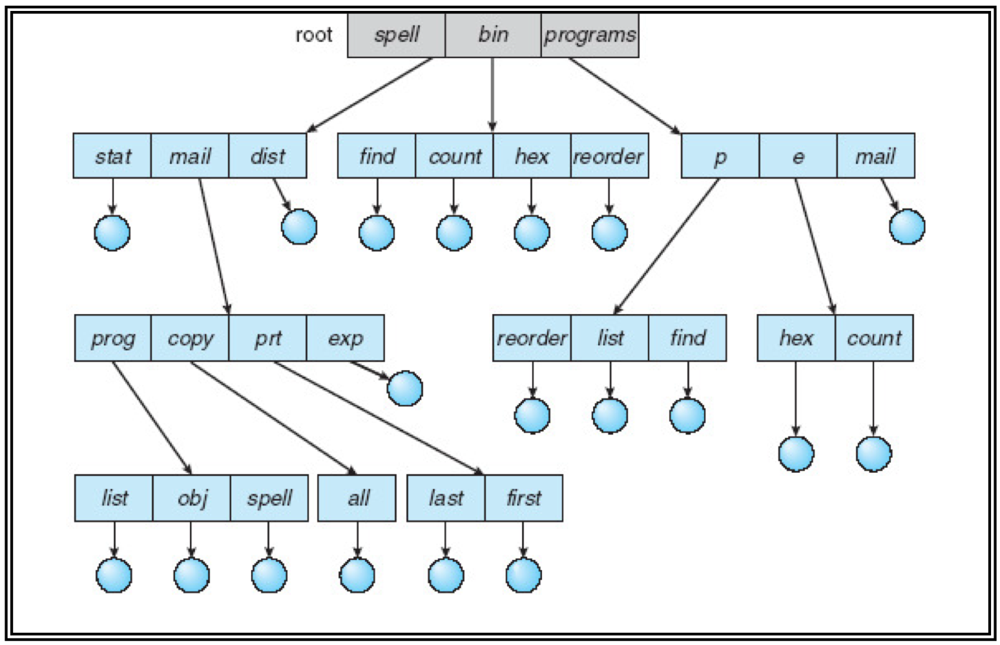

## 常用命令

### 目录切换

*   绝对路径 (From the filesystem root) : /dir1/dir2/file

*   相对路径 (From the current working directory) : ./subdir1/subdir2/file

*   当前目录和上层目录: ./ ../

*   主目录: ~/

*   切换目录: cd

### 怎么查看当前进程? 怎么执行推出? 怎么查看当前路径?

*   查看当前进程: ps
    *   ps -l 列出与本次登录有关的进程信息
    *   ps -aux 查询内存中进程信息
    *   ps -aux | grep * 查询 * 进程的详细信息
    *   top 查看内存中进程的动态信息
    *   kill -9 pid 杀死进程
*   执行退出: exit
*   查看当前路径: pwd

### 查看文件有哪些命令

```bash
vi filename # 编辑方式查看, 可修改
cat filename # 显示全部文件内容
cat filename1 filename2 # Output and concatenate files
more filename # 分页显示文件内容
less filename # 与 more 相似, 更好的是可以往前翻页
tail filename # 仅查看尾部, 还可以指定行数, default num=10, ex: tail -n 2 file.txt
head filename # 仅查看头部, 还可以指定行数, default num=10, ex: head -n 3 file.txt
```

### 列举几个常用的 Linux 命令

*   列出文件列表: ls
    *   ls -a # shows also hidden files (filenames beginning with '.')
    *   ls -l # shows long list format (extended output)
*   创建目录和移除目录: mkdir rmdir
*   用于显示文件后几行内容: tail -n 1000 # 显示最后 1000 行
*   打包: tar -xvf
*   打包并压缩: tar -zcvf
*   查找字符串: grep
*   显示当前所在目录: pwd
*   创建空文件: touch
*   编辑器 vim vi


## 文件系统主要做了什么

文件系统主要负责管理和组织计算机存储设备上的文件和目录，其功能包括以下几个方面：

1.  **存储管理**：将文件数据存储到物理存储介质中，并且管理空间分配，以确保每个文件都有足够的空间存储，并避免文件之间发生冲突。
2.  **文件管理**：文件的创建、删除、移动、重命名、压缩、加密、共享等等。
3.  **目录管理**：目录的创建、删除、移动、重命名等等。
4.  **文件访问控制**：管理不同用户或进程对文件的访问权限，以确保用户只能访问其被授权访问的文件，以保证文件的安全性和保密性。


## 软链接与硬链接

-   **Symbolic or soft link**
    -   Particular type of file that simply contains a path (i.e., the name) of another object (file or      directory)
    -   Allows references between different file-systems (partitions)
    -   If you remove the file the link remains pending

-   **Physical or hard link**
    -   Association between an object name and its content (pointer from directory-entry to i-node)
    -   It is not possible to create hard links between different file-systems, or hard links to a directory
    -   The file is removed only when it is removed the last of its hard links

**Link creation**

```
ln [options] source [destination]
```

 Default behavior

-   Creates a hard link

-   If the destination is not present, creates a link with the same filename on the working directory


## 目录结构

### Directories with one level (单级目录结构)

-   The simplest structure has only one level
-   All the files of the file system are stored within the same directory
    -   The files are differentiated by their name only
    -   Each name is unique within the entire file system
-   特点: 全部文件登记在同一目录中, 实现按名存取, 所以必须确保没有重名的现象发生; 查找速度慢, 不能重名, 不便于共享


### Directories with two levels (二级目录结构)

-   Files are contained in a two-level tree
-   Each user can have their own directory
    -   Each user has its own directory
    -   All the operations are executed only in the correct home directory
-   特点: 不同用户可以有相同的文件名, 提高了检索目录的速度; 缺点是不利于文件共享


### Tree Directories (树形目录结构)

-   Generalize previous directories systems
-   Directories and files are organized as a tree
-   Every user can manage both files and directories and subdirectories
-   特点: 系统中的每一个文件都有唯一路径名 (绝对路径和相对路径)



### Acyclic graph directories (非循环目录结构)

-   A Tree file system does not allow sharing
-   It is often useful to refer to the same object in the file system with different filenames
    -   Same user refers to an object with different pathnames
    -   Different users want to share objects
-   Tree file systems can be generalized organizing them as acyclic graphs
    -   They allow to share information, making it visible with different paths
-   特点: 它允许一个文件或目录在多个父目录中占有项目, 但不构成环路, 便于文件共享; 一看见链接(软链接和硬链接)就要想到这种结构


