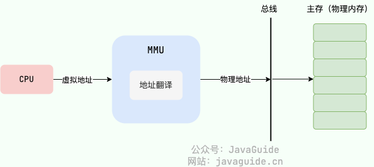
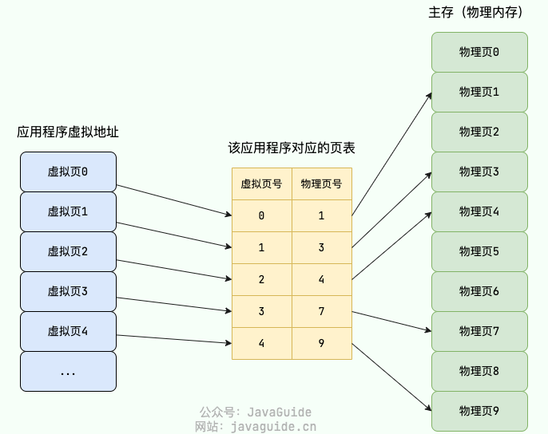
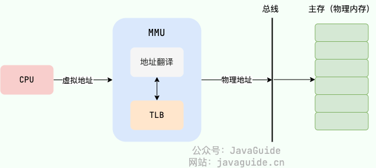

##  内存管理主要做了什么

操作系统的内存管理非常重要，主要负责下面这些事情：

-   **内存的分配与回收**：对进程所需的内存进行分配和释放，malloc 函数：申请内存，free 函数：释放内存。
-   **地址转换**：将程序中的虚拟地址转换成内存中的物理地址。
-   **内存扩充**：当系统没有足够的内存时，利用虚拟内存技术或自动覆盖技术，从逻辑上扩充内存。
-   **内存映射**：将一个文件直接映射到进程的进程空间中，这样可以通过内存指针用读写内存的办法直接存取文件内容，速度更快。
-   **内存优化**：通过调整内存分配策略和回收算法来优化内存使用效率。
-   **内存安全**：保证进程之间使用内存互不干扰，避免一些恶意程序通过修改内存来破坏系统的安全性。
-   ……

##  什么是内存碎片？

*   **内部内存碎片 (Internal Fragmentation)**: 

    内部内存碎片指的是在内存分配时，由于分配的内存块大小大于实际需要的内存量，导致未被使用的内存部分。也就是说，当一个进程申请内存时，系统按照固定大小的内存块进行分配，如果实际使用的内存小于分配的内存块大小，剩余的部分就形成了内部碎片。这些未被使用的内存空间在分配给其他进程之前，暂时是无法利用的。

    **示例**：假设一个进程需要10 KB的内存，而操作系统按16 KB的块进行分配，那么分配给这个进程的16 KB内存中，有6 KB是未被使用的，这6 KB就形成了内部内存碎片。

*   **外部内存碎片 (External Fragmentation)**: 

    外部内存碎片指的是内存中的空闲空间由于分配和释放的不连续性，导致空闲内存被分割成多个小块，虽然这些小块的总和可能足够分配一个新进程所需的内存，但由于它们是不连续的，无法满足新进程的需求。这种不连续的空闲内存块就被称为外部碎片。

    **示例**：假设内存中有几个进程释放了一些不连续的小块内存，每个小块分别是4 KB、8 KB和6 KB，总共是18 KB。如果一个新进程需要16 KB的连续内存，由于这些空闲块是分散的，无法满足分配需求，尽管总空闲内存足够，这些不连续的小块就形成了外部内存碎片。

    

##  常见的内存管理方式有哪些？

### **连续内存管理**

在连续内存管理中，每个进程在内存中占据一个连续的内存区域。即，分配给某个进程的内存地址空间是连续的。连续内存管理主要有两种方式：固定分区和动态分区。

*   **固定分区 (Fixed Partitioning)**

    -   特点：内存被划分为若干个固定大小的分区，每个分区只分配给一个进程。

    -   优点：实现简单，分配和管理容易。

    -   缺点：可能导致内存利用率低，容易产生内部碎片，因为进程可能用不到整个分区的空间。

*   **动态分区 (Dynamic Partitioning)**

    -   特点：内存不预先划分，进程需要多少就分配多少，分区大小是动态变化的。

    -   优点：提高内存利用率，减少内部碎片。

    -   缺点：容易产生外部碎片，需要定期进行内存紧凑以合并分散的空闲块。

### 非连续内存管理

在非连续内存管理中，一个进程的内存空间可以分散在内存的不同位置，不需要是连续的。这种方式通过更复杂的内存管理机制来提高内存利用率，减少碎片。

*   **分页 (Paging)**

    -   基本原理：把物理内存分为连续等长的物理页，应用程序的虚拟地址空间也被划分为连续等长的虚拟页。

    -   优点：有效减少外部碎片，因为内存块大小一致。内存分配和释放灵活。

    -   缺点：可能产生一些内部碎片（因为进程最后一页可能未完全使用），需要页表进行地址转换，增加了内存访问的开销。

*   **分段 (Segmentation)**

    -   基本原理：将内存分为不固定大小的段（Segment），每个段代表逻辑上的一个部分，如代码段、数据段、堆栈段等。

    -   优点：便于实现逻辑分区，符合程序的逻辑结构。可以方便地进行段的保护和共享。

    -   缺点：可能产生外部碎片，因为段的大小不固定。需要段表进行地址转换，增加了管理的复杂度。

*   **段页式管理 (Segmented Paging)**

    -   基本原理：结合分页和分段的优点，首先将进程地址空间分为段，每个段再分为若干页。

    -   优点：既能实现段的逻辑分区，又能利用分页减少外部碎片。

    -   缺点：复杂度高，需要维护段表和页表。

##  什么是虚拟内存?有什么用？

**虚拟内存(Virtual Memory)** 是计算机系统内存管理非常重要的一个技术，本质上来说它只是逻辑存在的，是一个假想出来的内存空间，主要作用是作为进程访问主存（物理内存）的桥梁并简化内存管理。

总结来说，虚拟内存主要提供了下面这些能力：

-   **隔离进程**：物理内存通过虚拟地址空间访问，虚拟地址空间与进程一一对应。每个进程都认为自己拥有了整个物理内存，进程之间彼此隔离，一个进程中的代码无法更改正在由另一进程或操作系统使用的物理内存。
-   **提升物理内存利用率**：有了虚拟地址空间后，操作系统只需要将进程当前正在使用的部分数据或指令加载入物理内存。
-   **简化内存管理**：进程都有一个一致且私有的虚拟地址空间，程序员不用和真正的物理内存打交道，而是借助虚拟地址空间访问物理内存，从而简化了内存管理。
-   **多个进程共享物理内存**：进程在运行过程中，会加载许多操作系统的动态库。这些库对于每个进程而言都是公用的，它们在内存中实际只会加载一份，这部分称为共享内存。
-   **提高内存使用安全性**：控制进程对物理内存的访问，隔离不同进程的访问权限，提高系统的安全性。
-   **提供更大的可使用内存空间**：可以让程序拥有超过系统物理内存大小的可用内存空间。这是因为当物理内存不够用时，可以利用磁盘充当，将物理内存页（通常大小为 4 KB）保存到磁盘文件（会影响读写速度），数据或代码页会根据需要在物理内存与磁盘之间移动。

如果没有虚拟内存的话，程序直接访问和操作的都是物理内存，看似少了一层中介，但多了很多问题。

**具体有什么问题呢？** 这里举几个例子说明(参考虚拟内存提供的能力回答这个问题)：

1.  用户程序可以访问任意物理内存，可能会不小心操作到系统运行必需的内存，进而造成操作系统崩溃，严重影响系统的安全。
2.  同时运行多个程序容易崩溃。比如你想同时运行一个微信和一个 QQ 音乐，微信在运行的时候给内存地址 1xxx 赋值后，QQ 音乐也同样给内存地址 1xxx 赋值，那么 QQ 音乐对内存的赋值就会覆盖微信之前所赋的值，这就可能会造成微信这个程序会崩溃。
3.  程序运行过程中使用的所有数据或指令都要载入物理内存，根据局部性原理，其中很大一部分可能都不会用到，白白占用了宝贵的物理内存资源。
4.  ……

##  什么是虚拟地址和物理地址

**物理地址（Physical Address）** 是真正的物理内存中地址，更具体点来说是内存地址寄存器中的地址。程序中访问的内存地址不是物理地址，而是 **虚拟地址（Virtual Address）** 。

也就是说，我们编程开发的时候实际就是在和虚拟地址打交道。比如在 C 语言中，指针里面存储的数值就可以理解成为内存里的一个地址，这个地址也就是我们说的虚拟地址。

操作系统一般通过 CPU 芯片中的一个重要组件 **MMU(Memory Management Unit，内存管理单元)** 将虚拟地址转换为物理地址，这个过程被称为 **地址翻译/地址转换（Address Translation）** 。

通过 MMU 将虚拟地址转换为物理地址后，再通过总线传到物理内存设备，进而完成相应的物理内存读写请求。

MMU 将虚拟地址翻译为物理地址的主要机制有两种: **分段机制** 和 **分页机制** 。

## 虚拟地址与物理内存地址是如何映射的

MMU 将虚拟地址翻译为物理地址的主要机制有 3 种:

### 分段机制 (Segmentation)

分段机制将内存划分为若干个<u>大小不等</u>的段（Segment），每个段表示逻辑上的一个内存区域，如代码段、数据段、堆栈段等。每个段有一个段描述符，包含段的起始地址和长度。

分段机制下的虚拟地址由两部分组成：

-   **段号**：标识着该虚拟地址属于整个虚拟地址空间中的哪一个段。
-   **段内偏移量**：相对于该段起始地址的偏移量。

具体的地址翻译过程如下：

1.  MMU 首先解析得到虚拟地址中的段号；
2.  通过段号去该应用程序的段表中取出对应的段信息（找到对应的段表项）；
3.  从段信息中取出该段的起始地址（物理地址）加上虚拟地址中的段内偏移量得到最终的物理地址。

**通过段号一定要找到对应的段表项吗？得到最终的物理地址后对应的物理内存一定存在吗？**

不一定。段表项可能并不存在：

-   **段表项被删除**：软件错误、软件恶意行为等情况可能会导致段表项被删除。
-   **段表项还未创建**：如果系统内存不足或者无法分配到连续的物理内存块就会导致段表项无法被创建。

<u>分段机制容易出现外部内存碎片</u>，即在段与段之间留下碎片空间(不足以映射给虚拟地址空间中的段)。从而造成物理内存资源利用率的降低。

举个例子：假设可用物理内存为 5G 的系统使用分段机制分配内存。现在有 4 个进程，每个进程的内存占用情况如下：

-   进程 1：0~1G（第 1 段）
-   进程 2：1~3G（第 2 段）
-   进程 3：3~4.5G（第 3 段）
-   进程 4：4.5~5G（第 4 段）

此时，我们关闭了进程 1 和进程 4，则第 1 段和第 4 段的内存会被释放，空闲物理内存还有 1.5G。由于这 1.5G 物理内存并不是连续的，导致没办法将空闲的物理内存分配给一个需要 1.5G 物理内存的进程。

### 分页机制 (Paging)

<u>分页机制把主存（物理内存）分为连续等长的物理页，应用程序的虚拟地址空间划也被分为连续等长的虚拟页。现代操作系统广泛采用分页机制</u>。

**注意：这里的页是连续等长的，不同于分段机制下不同长度的段。**

在分页机制下，应用程序虚拟地址空间中的任意虚拟页可以被映射到物理内存中的任意物理页上，因此可以实现物理内存资源的离散分配。分页机制按照固定页大小分配物理内存，使得物理内存资源易于管理，可有效避免分段机制中外部内存碎片的问题。

分页管理通过 **页表（Page Table）** 映射虚拟地址和物理地址。

在分页机制下，每个应用程序都会有一个对应的页表。

分页机制下的虚拟地址由两部分组成：

-   **页号**：通过虚拟页号可以从页表中取出对应的物理页号；
-   **页内偏移量**：物理页起始地址+页内偏移量=物理内存地址。

具体的地址翻译过程如下：

1.  MMU 首先解析得到虚拟地址中的虚拟页号；
2.  通过虚拟页号去该应用程序的页表中取出对应的物理页号（找到对应的页表项）；
3.  用该物理页号对应的物理页起始地址（物理地址）加上虚拟地址中的页内偏移量得到最终的物理地址。

**通过虚拟页号一定要找到对应的物理页号吗？找到了物理页号得到最终的物理地址后对应的物理页一定存在吗？**

不一定！可能会存在 **页缺失** 。也就是说，物理内存中没有对应的物理页或者物理内存中有对应的物理页但虚拟页还未和物理页建立映射（对应的页表项不存在）。

### 段页机制 (Segmented Paging)

结合了段式管理和页式管理的一种内存管理机制，把物理内存先分成若干段，每个段又继续分成若干大小相等的页。

段页机制的特点:

-   双重映射：虚拟地址先分段，再分页，实现双重映射。
-   逻辑结构：段表示逻辑结构，页实现物理内存的灵活分配。
-   减少碎片：通过分页减少外部碎片，同时提供段的逻辑分区和保护。

具体的地址翻译过程如下：

1.  通过段号在段表中查找段描述符。
2.  从段描述符中获取页表的基址。
3.  通过页号在页表中查找页表条目。
4.  从页表条目中获取物理页框号。
5.  将页内偏移量加上页框号，得到物理地址。

## 多级页表

以 32 位的环境为例，虚拟地址空间范围共有 2^32（4G）。假设 一个页的大小是 2^12（4KB），那页表项共有 4G / 4K = 2^20 个。每个页表项为一个地址，占用 4 字节，`2^20 * 2^2 / 1024 * 1024= 4MB`。也就是说一个程序啥都不干，页表大小就得占用 4M。

系统运行的应用程序多起来的话，页表的开销还是非常大的。而且，绝大部分应用程序可能只能用到页表中的几项，其他的白白浪费了。

为了解决这个问题，操作系统引入了 **多级页表** ，多级页表对应多个页表，每个页表也前一个页表相关联。32 位系统一般为二级页表，64 位系统一般为四级页表。

这里以二级页表为例进行介绍：二级列表分为一级页表和二级页表。一级页表共有 1024 个页表项，一级页表又关联二级页表，二级页表同样共有 1024 个页表项。二级页表中的一级页表项是一对多的关系，二级页表按需加载（只会用到很少一部分二级页表），进而节省空间占用。

假设只需要 2 个二级页表，那两级页表的内存占用情况为: 4KB（一级页表占用） + 4KB * 2（二级页表占用） = 12 KB。

## 快表

为了提高虚拟地址到物理地址的转换速度，操作系统在 **页表方案** 基础之上引入了 **转址旁路缓存(Translation Lookaside Buffer，TLB，也被称为快表)** 。

在主流的 AArch64 和 x86-64 体系结构下，TLB 属于 (Memory Management Unit，内存管理单元) 内部的单元，本质上就是一块高速缓存（Cache），缓存了虚拟页号到物理页号的映射关系，你可以将其简单看作是存储着键（虚拟页号）值（物理页号）对的哈希表。

使用 TLB 之后的地址翻译流程是这样的：

1.  用虚拟地址中的虚拟页号作为 key 去 TLB 中查询；
2.  如果能查到对应的物理页的话，就不用再查询页表了，直接使用缓存的物理页框号构造物理地址，这种情况称为 TLB 命中（TLB hit)。
3.  如果不能查到对应的物理页的话，还是需要去查询主存中的页表，同时将页表中的该映射表项添加到 TLB 中，这种情况称为 TLB 未命中（TLB miss)。
4.  当 TLB 填满后，又要登记新页时，就按照一定的淘汰策略淘汰掉快表中的一个页。

由于页表也在主存中，因此在没有 TLB 之前，每次读写内存数据时 CPU 要访问两次主存。有了 TLB 之后，对于存在于 TLB 中的页表数据只需要访问一次主存即可。

TLB 的设计思想非常简单，但命中率往往非常高，效果很好。这就是因为被频繁访问的页就是其中的很小一部分

## 换页机制有什么用？

换页机制的思想是当物理内存不够用的时候，操作系统选择将一些物理页的内容放到磁盘上去，等要用到的时候再将它们读取到物理内存中。也就是说，换页机制利用磁盘这种较低廉的存储设备扩展的物理内存。

这也就解释了一个日常使用电脑常见的问题：为什么操作系统中所有进程运行所需的物理内存即使比真实的物理内存要大一些，这些进程也是可以正常运行的，只是运行速度会变慢。

这同样是一种时间换空间的策略，你用 CPU 的计算时间，页的调入调出花费的时间，换来了一个虚拟的更大的物理内存空间来支持程序的运行。

##  什么是页缺失

页缺失（Page Fault）是计算机内存管理中的一个重要概念。当一个进程试图访问一个不在物理内存中的页时，就会发生页缺失。操作系统需要处理页缺失，将所需的页从辅助存储（如磁盘）加载到物理内存中，然后继续执行进程。

常见的页缺失有下面这两种：

-   **硬性页缺失（Hard Page Fault）**：物理内存中没有对应的物理页。于是，Page Fault Handler 会指示 CPU 从已经打开的磁盘文件中读取相应的内容到物理内存，而后交由 MMU 建立相应的虚拟页和物理页的映射关系。
-   **软性页缺失（Soft Page Fault）**：物理内存中有对应的物理页，但虚拟页还未和物理页建立映射。于是，Page Fault Handler 会指示 MMU 建立相应的虚拟页和物理页的映射关系。

发生上面这两种缺页错误的时候，应用程序访问的是有效的物理内存，只是出现了物理页缺失或者虚拟页和物理页的映射关系未建立的问题。如果应用程序访问的是无效的物理内存的话，还会出现 **无效缺页错误（Invalid Page Fault）** 。

## 常见的页面置换算法有哪些

当发生硬性页缺失时，如果物理内存中没有空闲的物理页面可用的话。操作系统就必须将物理内存中的一个物理页淘汰出去，这样就可以腾出空间来加载新的页面了。

用来选择淘汰哪一个物理页的规则叫做 **页面置换算法** ，我们可以把页面置换算法看成是淘汰物物理页的规则。

页缺失太频繁的发生会非常影响性能，一个好的页面置换算法应该是可以减少页缺失出现的次数。

常见的页面置换算法有下面这 5 种（其他还有很多页面置换算法都是基于这些算法改进得来的）：

1.  **最佳页面置换算法（OPT，Optimal）**：优先选择淘汰的页面是以后永不使用的，或者是在最长时间内不再被访问的页面，这样可以保证获得最低的缺页率。但由于人们目前无法预知进程在内存下的若干页面中哪个是未来最长时间内不再被访问的，因而该算法无法实现，只是理论最优的页面置换算法，可以作为衡量其他置换算法优劣的标准。
2.  **先进先出页面置换算法（FIFO，First In First Out）** : 最简单的一种页面置换算法，总是淘汰最先进入内存的页面，即选择在内存中驻留时间最久的页面进行淘汰。该算法易于实现和理解，一般只需要通过一个 FIFO 队列即可满足需求。不过，它的性能并不是很好。
3.  **最近最久未使用页面置换算法（LRU ，Least Recently Used）**：LRU 算法赋予每个页面一个访问字段，用来记录一个页面自上次被访问以来所经历的时间 T，当须淘汰一个页面时，选择现有页面中其 T 值最大的，即最近最久未使用的页面予以淘汰。LRU 算法是根据各页之前的访问情况来实现，因此是易于实现的。OPT 算法是根据各页未来的访问情况来实现，因此是不可实现的。
4.  **最少使用页面置换算法（LFU，Least Frequently Used）** : 和 LRU 算法比较像，不过该置换算法选择的是之前一段时间内使用最少的页面作为淘汰页。
5.  **时钟页面置换算法（Clock）**：可以认为是一种最近未使用算法，即逐出的页面都是最近没有使用的那个。

## 局部性原理

要想更好地理解虚拟内存技术，必须要知道计算机中著名的 **局部性原理（Locality Principle）**。另外，局部性原理既适用于程序结构，也适用于数据结构，是非常重要的一个概念。

局部性原理是指在程序执行过程中，数据和指令的访问存在一定的空间和时间上的局部性特点。其中，时间局部性是指一个数据项或指令在一段时间内被反复使用的特点，空间局部性是指一个数据项或指令在一段时间内与其相邻的数据项或指令被反复使用的特点。

"If I am accessing a memory cell with address X now (time `t0`), then either I will access X again very likely at time `t0+∆` (in a close future), or I will access X±1 (a neighbouring cell) very likely at time `t0+∆`"

在分页机制中，页表的作用是将虚拟地址转换为物理地址，从而完成内存访问。在这个过程中，局部性原理的作用体现在两个方面：

-   **时间局部性**：由于程序中存在一定的循环或者重复操作，因此会反复访问同一个页或一些特定的页，这就体现了时间局部性的特点。为了利用时间局部性，分页机制中通常采用缓存机制来提高页面的命中率，即将最近访问过的一些页放入缓存中，如果下一次访问的页已经在缓存中，就不需要再次访问内存，而是直接从缓存中读取。
-   **空间局部性**：由于程序中数据和指令的访问通常是具有一定的空间连续性的，因此当访问某个页时，往往会顺带访问其相邻的一些页。为了利用空间局部性，分页机制中通常采用预取技术来预先将相邻的一些页读入内存缓存中，以便在未来访问时能够直接使用，从而提高访问速度。

总之，局部性原理是计算机体系结构设计的重要原则之一，也是许多优化算法的基础。在分页机制中，利用时间局部性和空间局部性，采用缓存和预取技术，可以提高页面的命中率，从而提高内存访问效率

