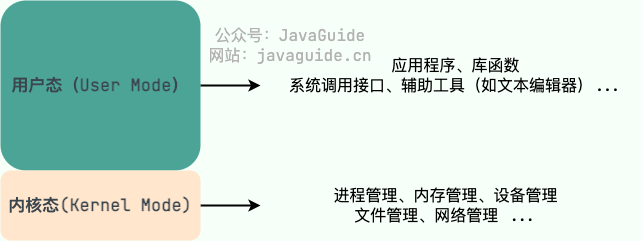
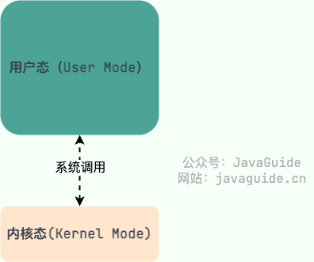

## 操作系统的作用、特点、分类、发展

-   作用:
    1.  **资源管理**：管理计算机硬件资源，包括处理器、内存、存储器、输入/输出设备等，以便为运行的程序提供必要的资源。
    2.  **提供用户接口**：提供用户与计算机系统进行交互的接口，包括命令行界面、图形用户界面等。
    3.  **提供文件系统**：管理存储设备上的文件和目录，提供文件的创建、读取、写入、删除等功能。
    4.  **进程管理**：创建、调度、终止进程，并提供进程间通信和同步机制。
    5.  **内存管理**：管理计算机的内存资源，包括内存分配、内存保护、内存共享等。
    6.  **I/O设备管理**：管理计算机的输入输出设备，包括设备的分配、控制、缓冲等。
    7.  **提供安全机制**：实施访问控制、身份验证、数据加密等安全机制，保护系统和用户数据的安全。

-   特点:
    1.  **并发性**：能够同时处理多个任务，实现多道程序设计和多线程并发执行。
    2.  **共享性**：多个程序能够共享计算机的硬件资源。
    3.  **虚拟性**：提供了一个虚拟的计算环境，使得每个程序都认为自己在独占计算机资源。
    4.  **抽象性**：向用户隐藏了底层硬件的复杂性，提供了更简洁的接口。
    5.  **可靠性**：能够保证系统的稳定性和可靠性，避免系统崩溃或数据丢失

-   分类:
    1.  **单用户单任务操作系统**：只能支持单个用户运行单个任务的操作系统，如早期的DOS系统。
    2.  **单用户多任务操作系统**：能够支持单个用户同时运行多个任务的操作系统，如Windows、macOS等。
    3.  **多用户操作系统**：能够同时支持多个用户访问系统资源的操作系统，如UNIX、Linux等。
    4.  **分时操作系统**：通过时间片轮转的方式实现多任务处理，以使每个用户感觉到系统在同时为他服务。
    5.  **实时操作系统**：能够保证任务在规定的时间内完成，对响应时间要求非常严格，如嵌入式系统中常见的实时操作系统。

-   发展:
    1.  **批处理系统（Batch Processing Systems）**：早期的操作系统，主要用于处理批量作业，没有交互式用户界面。
    2.  **分时系统（Time-sharing Systems）**：随着计算机技术的发展，出现了能够同时为多个用户提供服务的分时系统，如UNIX。
    3.  **个人计算机操作系统（Personal Computer Operating Systems）**：随着个人计算机的普及，出现了针对个人用户的操作系统，如DOS、Windows、macOS等。
    4.  **网络操作系统（Network Operating Systems）**：随着互联网的发展，操作系统需要提供网络功能，支持远程访问和分布式计算。
    5.  **移动操作系统（Mobile Operating Systems）**：随着智能手机的普及，出现了针对移动设备的操作系统，如Android、iOS等。

## 内核态和用户态, 系统调用

-   **用户态(User Mode)** : 用户态运行的进程可以直接读取用户程序的数据，拥有较低的权限。当应用程序需要执行某些需要特殊权限的操作，例如读写磁盘、网络通信等，就需要向操作系统发起系统调用请求，进入内核态。
    
-   **内核态(Kernel Mode)**：内核态运行的进程几乎可以访问计算机的任何资源包括系统的内存空间、设备、驱动程序等，不受限制，拥有非常高的权限。当操作系统接收到进程的系统调用请求时，就会从用户态切换到内核态，执行相应的系统调用，并将结果返回给进程，最后再从内核态切换回用户态。

    

-   **系统调用（System Call）**： 

    系统调用是用户程序请求操作系统内核提供服务或者访问系统资源的一种方式。当用户程序需要执行特权操作时（如读写文件、创建进程、申请内存等），无法直接在用户态下执行，而是通过系统调用进入内核态执行。系统调用提供了一个标准化的接口，用户程序通过调用系统调用接口来请求内核执行特权操作。
    
    
