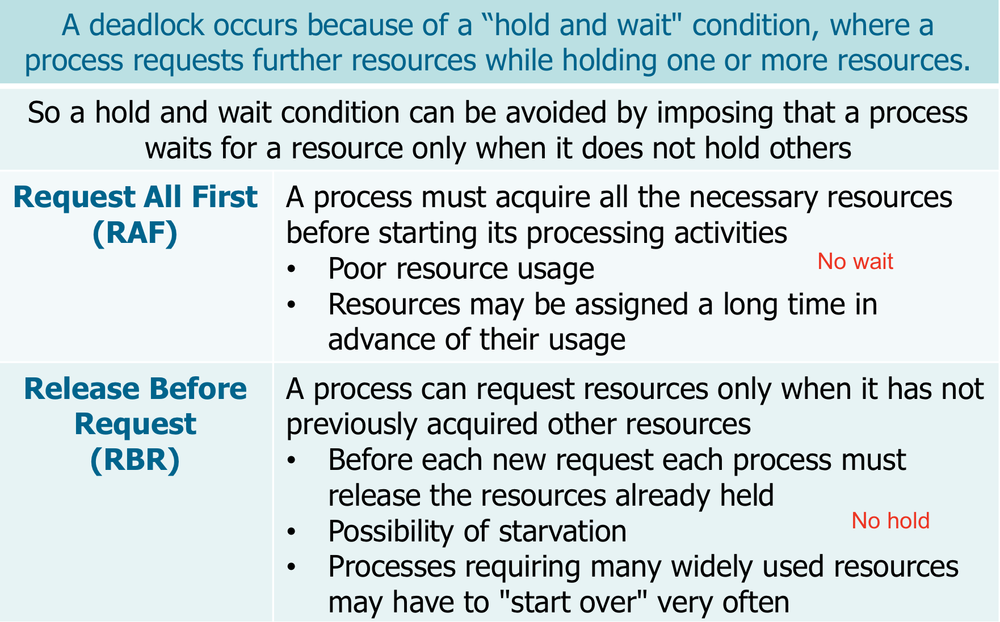
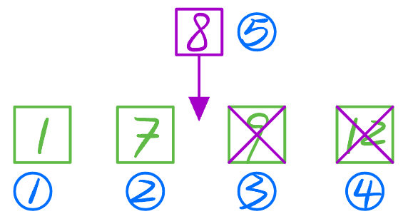

## 死锁的必要条件

## 死锁预防、避免、检测与解除

### 预防

*   破坏互斥条件： 尽量使用不可剥夺资源，或者允许资源共享，以减少资源的互斥使用

    

*   破坏请求和保持条件： 一次性申请所有需要的资源，如果不能满足，则释放已经持有的资源，等待重新请求

    

*   破坏非抢占条件： 允许操作系统抢占进程或线程的资源，以满足更高优先级的请求

    

    

*   破坏循环等待条件： 对资源进行全局编号，按照编号顺序申请资源，或者实施资源分级，禁止低级别资源等待高级别资源

    

    

### 避免

银行家算法 (Banker‘s Algorithm):

### 检测

Given an allocation graph, deadlock can be detected by checking for cycles

-   If the graph contains no cycles, then there is no deadlock (**No cycle => No deadlock**)

-   If the graph contains one or more cycles then

    -   Deadlock exist if each type of resource has a **single instance (Cycle => Deadlock)**

        

    -   Deadlock is possible if the are **several instances** per resource type (**Cycle (=> Can) Deadlock**)

        

        

        

### 解除

当死锁检测程序检测到存在死锁发生时，应设法让其解除，让系统从死锁状态中恢复过来，常用的解除死锁的方法有以下四种：

1.  **立即结束所有进程的执行，重新启动操作系统**：这种方法简单，但以前所在的工作全部作废，损失很大。
2.  **撤销涉及死锁的所有进程，解除死锁后继续运行**：这种方法能彻底打破**死锁的循环等待**条件，但将付出很大代价，例如有些进程可能已经计算了很长时间，由于被撤销而使产生的部分结果也被消除了，再重新执行时还要再次进行计算。
3.  **逐个撤销涉及死锁的进程，回收其资源直至死锁解除。**
4.  **抢占资源**：从涉及死锁的一个或几个进程中抢占资源，把夺得的资源再分配给涉及死锁的进程直至死锁解除。

