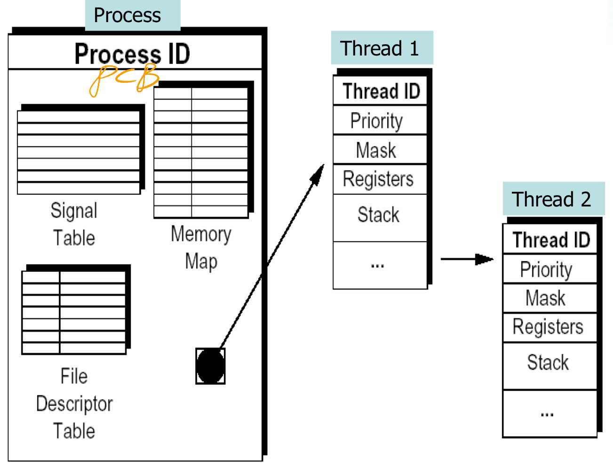
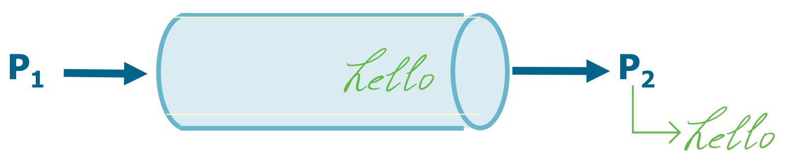
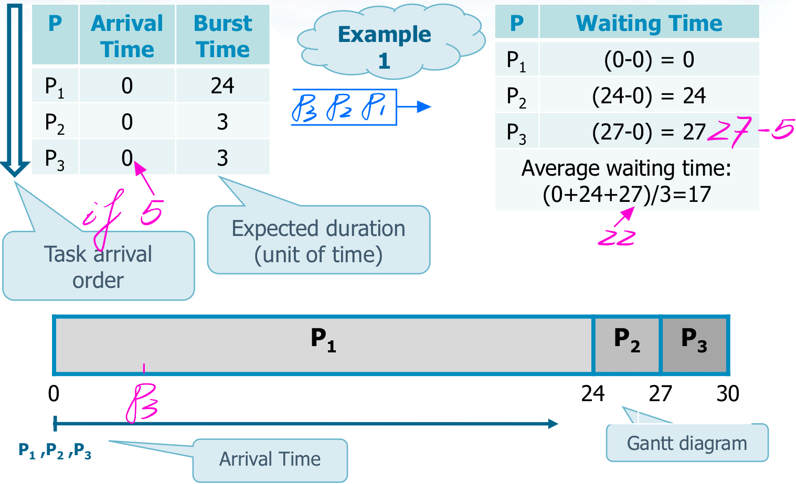
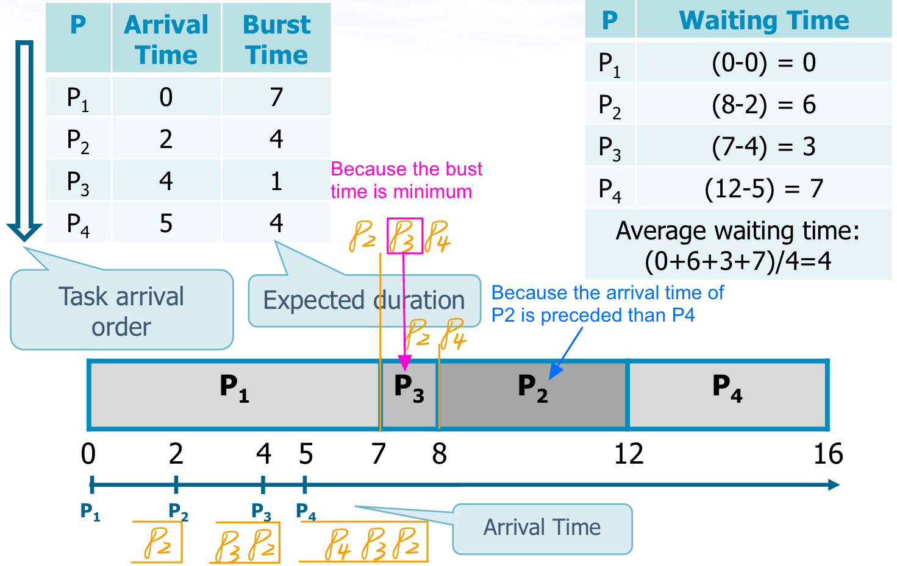
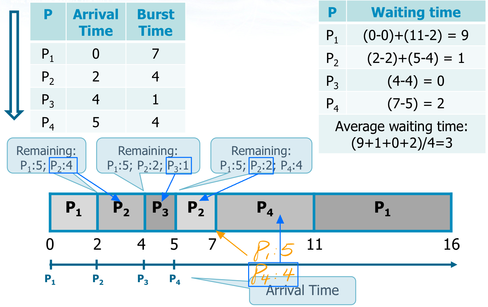
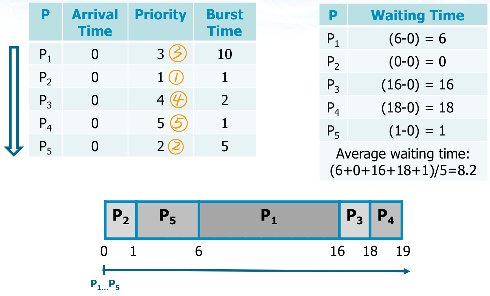
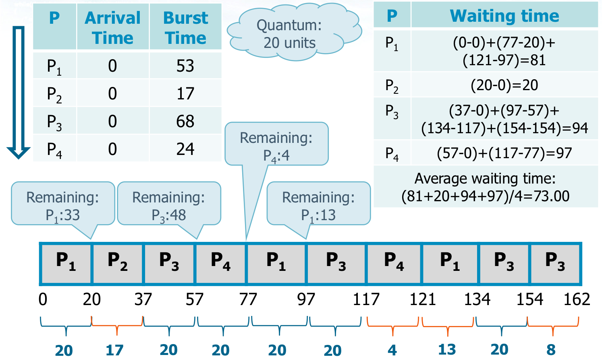
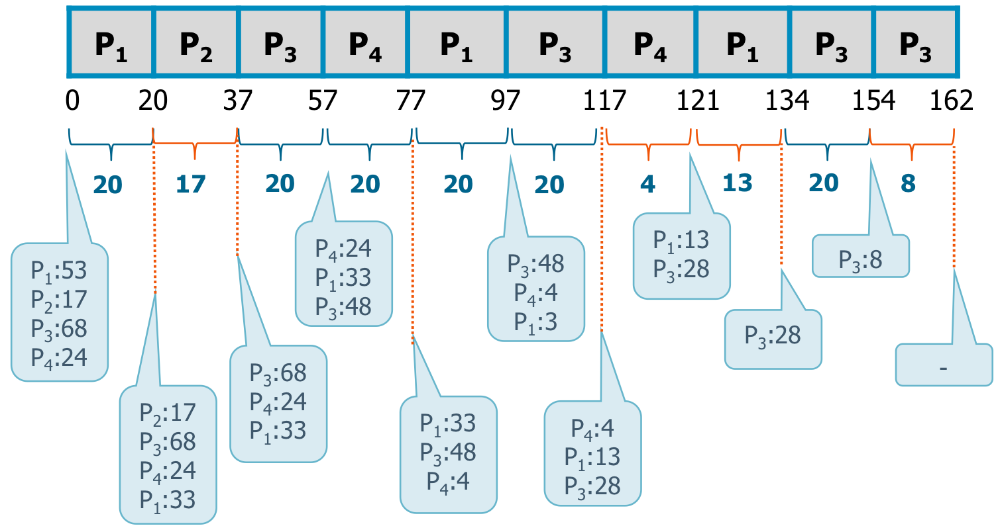
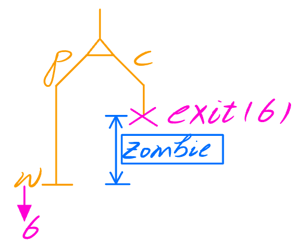

## 介绍一下进程和线程的基本定义，然后再对比一下两者

-   进程 (Process) 是计算机中运行的程序的实例。每个进程都有自己的地址空间、内存、数据栈以及其他系统资源的副本。进程之间相互独立，彼此之间不共享内存或其他资源，要进行进程间通信通常需要通过特定的机制，比如管道、套接字等。每个进程都由操作系统调度，操作系统负责分配资源并协调进程之间的执行顺序。 

-   线程 (Thread) 是在进程内部运行的一个执行单元，也可以说是进程内的子任务。同一个进程内的线程共享相同的内存空间和其他资源，因此线程之间的通信更加高效。线程由操作系统调度，但是线程的创建、销毁、切换等操作相比进程更加轻量级，因为线程间的切换不涉及到地址空间和其他资源的切换，所以开销相对较小。

下面是进程和线程的一些对比：

-   **资源消耗**：进程比线程消耗的资源更多，因为每个进程都有自己的地址空间和系统资源的副本。线程共享相同的资源，所以比较节省资源。
-   **通信和同步**：进程间的通信比较复杂，需要使用特定的机制，而线程间通信更加简单，因为它们共享相同的地址空间。但是线程间的同步可能会导致竞态条件等问题，需要额外的同步机制来解决。
-   **并发性**：进程并发执行的基本单位，不同进程之间可以并行执行。线程是进程内部的执行单元，同一个进程内的多个线程可以并行执行，利用多核处理器的优势提高程序性能。
-   **灵活性**：由于进程之间相互独立，进程可以更灵活地部署和管理。但是进程的创建、销毁等操作相对较慢。线程之间共享资源，因此可以更快速地创建、销毁和切换，提高了程序的响应速度。

## 进程的通信方式

1.   **管道（Pipe）**： 管道是一种单向通信机制，用于在相关进程之间传输数据。它可以是匿名管道（只能在父子进程间使用）或命名管道（可以在无关的进程之间使用）。管道是基于文件描述符进行通信的，一个进程将数据写入管道的一端，另一个进程从另一端读取数据。

     

2.   **消息队列（Message Queue）**：消息队列是一种通过消息传递进行通信的机制，允许进程通过发送和接收消息来进行通信。消息队列在内核中维护，不同进程可以通过特定的标识符访问同一个消息队列。发送方将消息写入队列，接收方从队列中读取消息。

3.   **共享内存（Shared Memory）**：共享内存是一种在多个进程之间共享数据的高效方式。它允许多个进程访问同一块物理内存区域，从而实现数据共享。不过需要注意的是，共享内存并不提供同步机制，因此在使用时需要额外的同步措施来避免竞态条件等问题。

4.   **信号量（Semaphore）**：信号量是一种用于进程间同步和互斥的机制。通过信号量可以实现进程间的资源共享和互斥访问，从而避免竞态条件和死锁。进程可以对信号量进行等待（Wait）和释放（Signal）操作来控制对临界资源的访问。

## CPU 如何应用不同的调度算法来调度进程

*   **先来先服务（First Come, First Served，FCFS）**：这是最简单的调度算法之一，按照进程到达的顺序来分配 CPU 时间。即当一个进程进入就绪队列时，它会被放在队列的末尾。优点是实现简单，但可能导致长作业等待时间（Convoy Effect）

    

*   **最短作业优先（Shortest Job First，SJF）**：这个算法会优先选择执行时间最短的进程，以最小化平均等待时间。需要预先知道每个进程的执行时间，因此在实际中可能需要估计或预测执行时间。这个算法可以减少平均等待时间，但可能导致长作业饥饿（Starvation）

    

*   **最短剩余时间优先（Shortest Remaining Time Next，SRTN）**：这是 SJF 的抢占式版本，当一个新进程到达时，如果它的执行时间比当前正在执行的进程的剩余执行时间更短，则会抢占 CPU 资源。这个算法可以最大程度地减少等待时间，但可能增加上下文切换的开销

    

*   **优先级调度（Priority Scheduling）**：每个进程都有一个优先级，优先级高的进程会优先被调度执行。可以根据进程的特性、重要性等因素来确定优先级。但可能导致低优先级进程饥饿，因此可能需要引入优先级抖动（Priority Aging）等机制来解决

    

*   **轮转调度（Round Robin，RR）**：每个进程被分配一个小的时间片，当一个进程的时间片用完时，操作系统会将 CPU 资源分配给下一个进程。这个算法可以避免长作业等待时间，但可能导致上下文切换频繁

    

    

## 僵尸进程和孤儿进程

*   僵尸进程: A child process terminated, whose parent is running, but has not executed wait is in the zombie state

    

    -   The data segment of the process **remains** in the process table because the parent could need the child exit status
    -   The child entry is removed only when the parent executes **wait**
        -   Many zombie processes may remain in the system if one or more parents do not execute their wait system call

*   孤儿进程: If the parent terminates before executing the wait, the child process

    -   Becomes an orphan

    -   The orphan processes, in order not to remain in this state, are inherited by the init process (the one with PID=1) or by a user custom init process

    -   Orphan processes and processes inherited by init will no longer become zombie processes