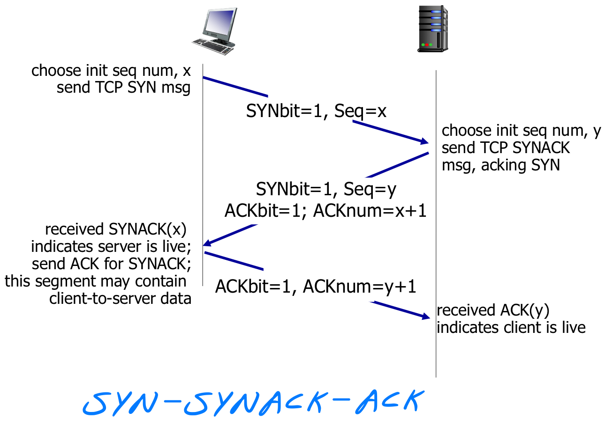
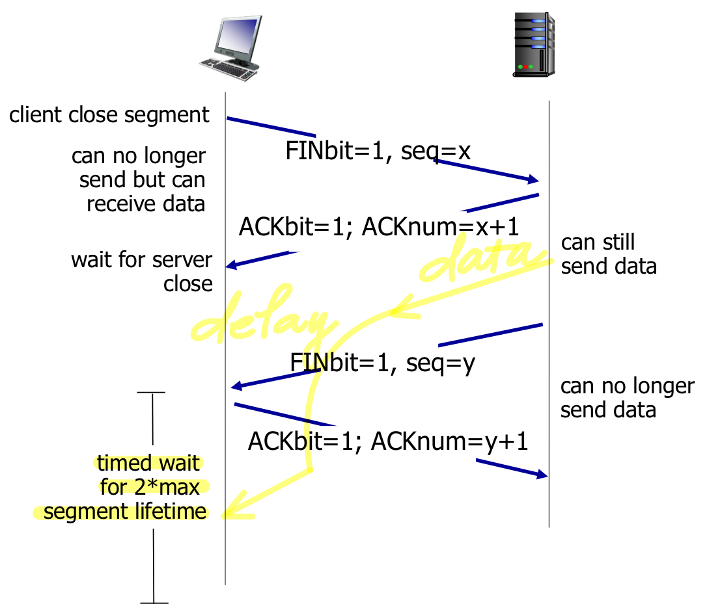

## TCP 和 UDP 的区别

1.  **连接性**：
    -   <u>TCP是面向连接的协议</u>，通信前需要建立连接，确保可靠的数据传输，然后再进行数据传输，最后释放连接。
    -   <u>UDP是无连接的协议</u>，通信时不需要建立连接，发送数据前不需要进行握手，因此传输速度更快，但不保证可靠传输。

2.   **可靠性**：

     -   <u>TCP提供可靠的数据传输</u>，通过序列号、确认应答、重传机制等来确保数据的可靠性和完整性，能够保证数据的顺序性和不丢失。

     -   <u>UDP不保证数据的可靠传输</u>，数据发送后不进行确认应答，也不进行重传，因此可能会丢失数据包或者无序接收数据包。

3.   **流量控制和拥塞控制**：

     -   <u>TCP具有流量控制和拥塞控制机制</u>，通过滑动窗口、拥塞避免算法等来控制数据传输速率，防止网络拥塞。

     -   <u>UDP不具备流量控制和拥塞控制功能</u>，发送端以恒定的速率发送数据，无法根据网络情况自动调整发送速率。

4.   **头部开销**：

     -   TCP的头部包含较多的控制信息，如序列号、确认号、窗口大小等，导致头部开销相对较大，通常为20个字节。

     -   UDP的头部相对较小，只包含基本的信息，如源端口、目标端口、数据长度等，通常为8个字节。

5.   **适用场景**：

     -   TCP适用于对数据可靠性要求较高的场景，如文件传输、网页访问、电子邮件等。

     -   UDP适用于对传输延迟要求较高、数据量较小、数据丢失影响不大的场景，如实时音视频传输、在线游戏、DNS查询等。

## TCP 三次握手和四次挥手的全过程

-   **三次握手 (TCP Three-Way Handshake)**

    1.  **客户端发送 SYN 报文**: 客户端发送 SYN 包 (SYN=x) 到服务器, 并进入 SYN_SEND 状态, 等待服务器确认
    2.  **服务器响应 SYN+ACK 报文**: 服务器收到 SYN 包, 必须确认客户的 SYN (ACK=x+1),同时自己也发送一个 SYN 包 (SYN=y), 即 SYN+ACK 包, 此时服务器进入 SYN_RECV 状态
    3.  **客户端发送 ACK 报文**: 客户端收到服务器的 SYN+ACK 包, 向服务器发送确认包 ACK (ACK=y+1), 此包发送完毕, 客户端和服务器进入 ESTABLISHED 状态, 完成三次握手

    握手过程中传送的包里不包含数据, 三次握手完毕后, 客户端与服务器才正式开始传送数据. 理想状态下, TCP 连接一旦建立, 在通信双方中的任何一方主动关闭连接之前, TCP 连接都将被一直保持下去

    

-   **四次挥手 (TCP Four-Way Handshake)**

    1.  **客户端发送FIN**: 主动关闭方发送一个 FIN, 用来关闭主动方到被动关闭方的数据传送, 也就是主动关闭方告诉被动关闭方: 我已经不会再给你发数据了 (当然, 在 FIN 包之前发送出去的数据, 如果没有收到对应的 ACK 确认报文, 主动关闭方依然会重发这些数据), 但是, 此时主动方还可以接受数据
    2.  **服务器回应ACK**: 被动关闭方收到 FIN 包后, 发送一个 ACK 给对方, 确认序号为收到序号+1 (与 SYN 相同, 一个 FIN 占用一个序号)
    3.  **服务器发送FIN**: 被动关闭方发送一个 FIN, 用来关闭被动关闭方到主动关闭方的数据传送, 也就是告诉主动关闭方, 我的数据也发送完了, 不会再给你发数据了
    4.  **客户端回应ACK**: 主动关闭方收到 FIN 后, 送一个 ACK 给被动关闭方, 确认序号为收到序号+1, 至此, 完成四次挥手

    

## TCP 如何保证可靠性

1.  **确认和重传（Acknowledgment and Retransmission）**：TCP 在数据传输过程中采用了确认和重传机制。发送方发送数据后，接收方会发送确认消息，告知发送方数据已经成功接收。如果发送方在一定时间内未收到确认消息，就会认为数据丢失，并重新发送数据。这样可以确保数据的可靠性。
2.  **序列号和重组（Sequence Number and Reordering）**：TCP 把每个数据包都分配一个序列号，接收方会按序接收数据，并根据序列号将数据包重组成完整的消息。这样即使数据包到达的顺序与发送的顺序不同，接收方仍然可以正确地重组数据。
3.  **流量控制（Flow Control）**：TCP 使用滑动窗口机制进行流量控制。接收方会告知发送方自己的接收窗口大小，发送方会根据这个大小控制发送数据的速率，以避免接收方缓冲区溢出。
4.  **拥塞控制（Congestion Control）**：TCP 通过拥塞窗口控制发送速率，以避免网络拥塞。它会根据网络的拥塞程度动态调整发送速率，以保证网络的稳定性和吞吐量。
5.  **超时重传（Timeout Retransmission）**：如果发送方在一定时间内未收到确认消息，就会认为数据丢失，触发超时重传机制，重新发送数据。