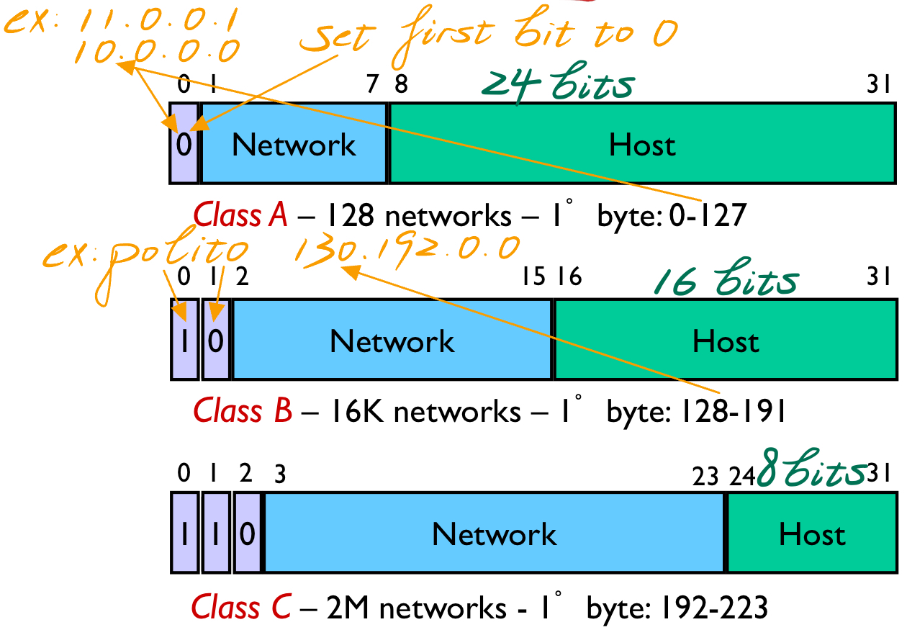
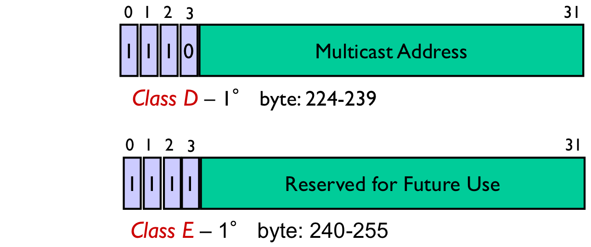
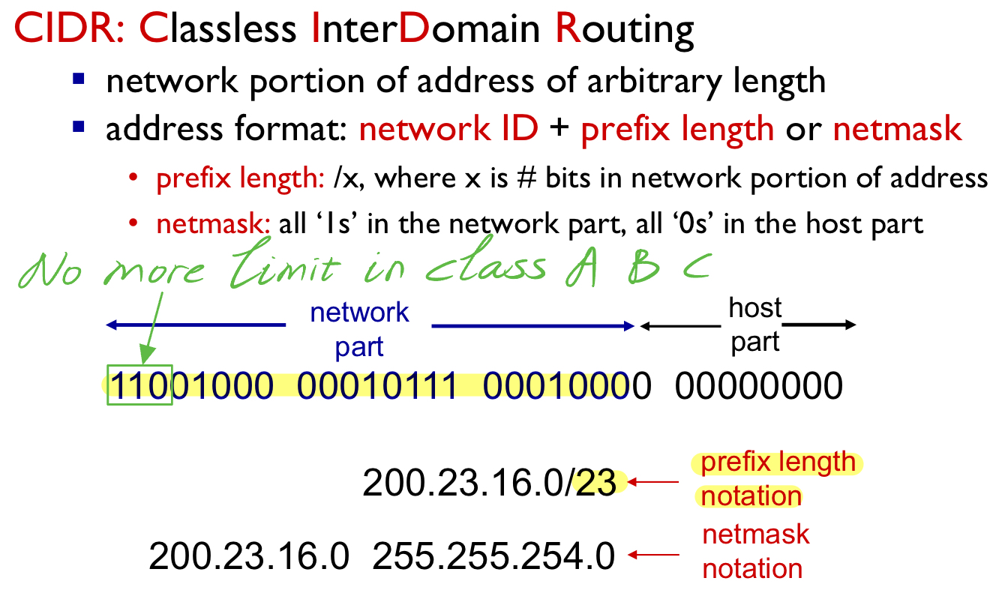

## IPV4 地址的分类

1.  A类地址：
    -   范围：0.0.0.0 到 127.255.255.255
    -   **第一个字节范围：0xxxxxxx**
    -   用途：A类地址用于大型网络，通常分配给全球性的大型组织和互联网服务提供商。
2.  B类地址：
    -   范围：128.0.0.0 到 191.255.255.255
    -   **第一个字节范围：10xxxxxx**
    -   用途：B类地址用于中等规模的网络，通常分配给中等规模的组织和企业。
3.  C类地址：
    -   范围：192.0.0.0 到 223.255.255.255
    -   **第一个字节范围：110xxxxx**
    -   用途：C类地址用于小型网络，通常分配给小型企业、家庭和私人网络。
4.  D类地址：
    -   范围：224.0.0.0 到 239.255.255.255
    -   **第一个字节范围：1110xxxx**
    -   用途：D类地址用于多播（Multicast），用于将数据包发送到一组主机，而不是单个主机。
5.  E类地址：
    -   范围：240.0.0.0 到 255.255.255.255
    -   **第一个字节范围：1111xxxx**
    -   用途：E类地址保留用于实验和特殊用途，不用于普通的网络通信。

​	

​	

## IPV4 地址的格式

IPv4 地址的格式是由四个十进制数（每个数取值范围是0到255）组成，用点号分隔开，例如：192.168.1.1。每个十进制数代表一个字节（8位），总共32位。IPv4 地址用于标识互联网上的设备和主机，是互联网通信的基础。

## IPV4 子网划分方法

1.  **固定长度子网划分**：

    -   在这种方法中，将IP地址块按照固定的子网掩码进行划分。例如，将一个大的IP地址块（如Class      A、Class B或Class C地址）按照固定的位数划分为多个子网，每个子网有固定数量的IP地址。
    -   这种方法简单直接，但可能会造成IP地址的浪费，因为有些子网可能不需要那么多的IP地址。

2.  **可变长度子网划分 (VLSM)** ：

    -   在这种方法中，根据网络的需求，灵活地选择子网掩码的长度来划分子网。不同的子网可以有不同长度的子网掩码，从而使得每个子网拥有不同数量的IP地址。

    -   这种方法可以更加灵活地满足不同网络的需求，但需要更复杂的网络规划和管理。

        

3.  **无类域间路由（CIDR）**：

    -   CIDR是一种灵活的IP地址分配方案，通过将IP地址块划分为不同的子网，并使用一个共同的前缀长度（称为CIDR前缀）来表示这些子网，从而简化了IP地址的管理和路由选择。

    -   CIDR可以更好地适应不同规模和需求的网络，提高了网络的灵活性和可扩展性。

        

## IP 地址和 Mac 地址的区别

1.  **作用层次**：
    -   <u>IP地址位于网络层（第三层</u>），用于在网络中唯一标识和定位设备。它们用于在网络中路由数据包，并确定数据包的目的地。
    -   <u>MAC地址位于数据链路层（第二层）</u>，用于在本地网络中唯一标识和定位设备。它们用于在局域网中传输数据帧，并直接与网络适配器相关联。
2.  **唯一性**：
    -   <u>IP地址在互联网范围内是唯一的</u>，但在同一个局域网中可以重复，因为IP地址是根据网络配置分配的 (DHCP Server)。
    -   <u>MAC地址在全球范围内是唯一的</u>，每个网络适配器（网卡）都有一个唯一的MAC地址，这由硬件制造商在生产过程中分配。
3.  **编码方式**：
    -   <u>IP地址是一个32位或128位的二进制数</u>，通常以点分十进制（IPv4）或冒号分隔的十六进制（IPv6）格式表示。
    -   <u>MAC地址是一个48位的二进制数</u>，通常以冒号分隔的十六进制格式表示。
4.  **作用范围**：
    -   <u>IP地址用于在不同网络之间进行通信</u>，用于在互联网上唯一标识和定位设备。
    -   <u>MAC地址用于在同一个局域网中进行通信</u>，用于在局域网上唯一标识和定位设备。

## ARP 地址解析协议并了解其工作原理

<u>ARP（Address Resolution Protocol）地址解析协议是一种用于将IP地址映射到MAC地址的协议，通常用于在局域网中进行通信时确定目标设备的MAC地址</u>。其工作原理如下：

1.  **发送ARP请求**：当一台设备需要与另一台设备进行通信时，它首先会检查自己的ARP缓存（ARP     Cache），如果目标设备的IP地址已经在ARP缓存中，则直接使用对应的MAC地址。如果目标IP地址不在ARP缓存中，则发送ARP请求。
2.  **ARP请求**：发送ARP请求的设备会向本地网络广播一个ARP请求报文，其中包含了它想要通信的目标设备的IP地址。该ARP请求报文的目的MAC地址是广播地址（FF:FF:FF:FF:FF:FF），以确保所有网络中的设备都可以收到。
3.  **接收ARP请求**：所有接收到ARP请求的设备都会检查请求中的目标IP地址是否与自己的IP地址匹配。如果匹配，则会发送ARP响应。否则，忽略该请求。
4.  **发送ARP响应**：匹配到目标IP地址的设备会向ARP请求的发送者单播一个ARP响应报文，其中包含了它自己的MAC地址。这样，ARP请求的发送者就知道了目标设备的MAC地址。
5.  **更新ARP缓存**：发送ARP响应的设备和接收ARP响应的设备都会更新自己的ARP缓存，将目标IP地址和对应的MAC地址进行关联，以便之后的通信。